# DTV Santa

This repository contains the open-source uptime monitor and status page for DELWP_DTV.

[**Visit our status website →**](https://delwp-dtv.github.io/santa/)

With [Upptime](https://upptime.js.org), you can get your own unlimited and free uptime monitor and status page, powered entirely by a GitHub repository. We use [Issues](https://github.com/alex-vic-geo/santa/issues) as incident reports, [Actions](https://github.com/alex-vic-geo/santa/actions) as uptime monitors, and [Pages](https://demo.upptime.js.org) for the status page.

<!--start: status pages-->
<!-- This summary is generated by Upptime (https://github.com/upptime/upptime) -->
<!-- Do not edit this manually, your changes will be overwritten -->
<!-- prettier-ignore -->
| URL | Status | History | Response Time | Uptime |
| --- | ------ | ------- | ------------- | ------ |
|  [Vicmap Property Easements and Road Casements](https://enterprise.mapshare.vic.gov.au/server/rest/services/Vicmap_Property_Easements_and_Road_Casements/MapServer) | 🟩 Up | [vicmap-property-easements-and-road-casements.yml](https://github.com/DELWP-DTV/santa/commits/HEAD/history/vicmap-property-easements-and-road-casements.yml) | 

 1102ms
     
 | 

<a href="https://DELWP-DTV.github.io/santa/history/vicmap-property-easements-and-road-casements">100.00%</a>
    

|  [Sunshine Activity Centre](https://services7.arcgis.com/fVJQ0uhT9L4zp35f/arcgis/rest/services/ActivityArea_gdb/FeatureServer/0) | 🟩 Up | [sunshine-activity-centre.yml](https://github.com/DELWP-DTV/santa/commits/HEAD/history/sunshine-activity-centre.yml) | 

 488ms
     
 | 

<a href="https://DELWP-DTV.github.io/santa/history/sunshine-activity-centre">100.00%</a>
    

|  [Geelong - Weather Station Sensors ](https://www.geelongdataexchange.com.au) | 🟩 Up | [geelong-weather-station-sensors.yml](https://github.com/DELWP-DTV/santa/commits/HEAD/history/geelong-weather-station-sensors.yml) | 

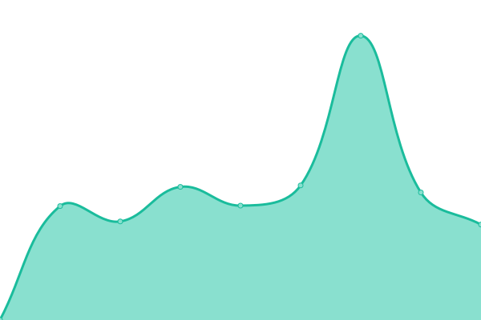 1396ms
     
 | 

<a href="https://DELWP-DTV.github.io/santa/history/geelong-weather-station-sensors">100.00%</a>
    

|  [Australian Private Hospitals August 2020](https://services5.arcgis.com/OvOcYIrJnM97ABBA/arcgis/rest/services/Australian_Private_Hospitals_August_2019_WFL1/FeatureServer/0) | 🟩 Up | [australian-private-hospitals-august-2020.yml](https://github.com/DELWP-DTV/santa/commits/HEAD/history/australian-private-hospitals-august-2020.yml) | 

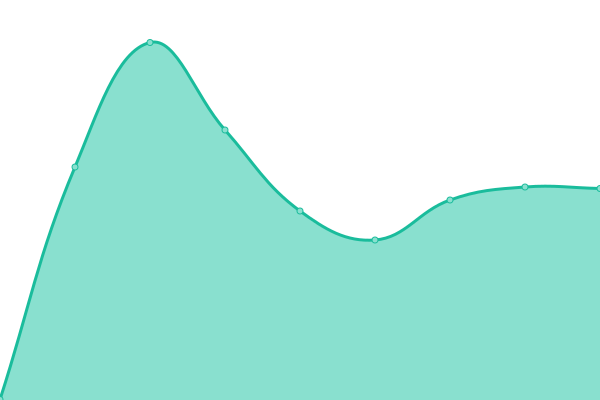 428ms
     
 | 

<a href="https://DELWP-DTV.github.io/santa/history/australian-private-hospitals-august-2020">100.00%</a>
    

|  [Vicmap Vegetation - Tree Extent](https://tiles.arcgis.com/tiles/GB33F62SbDxJjwEL/arcgis/rest/services/Vicmap_Vegetation_Tree_Extent/MapServer?view=wmtsview&cacheKey=95615180464c4085) | 🟩 Up | [vicmap-vegetation-tree-extent.yml](https://github.com/DELWP-DTV/santa/commits/HEAD/history/vicmap-vegetation-tree-extent.yml) | 

 324ms
     
 | 

<a href="https://DELWP-DTV.github.io/santa/history/vicmap-vegetation-tree-extent">100.00%</a>
    

|  [Watercourse Levels](http://www.bom.gov.au/waterdata/services) | 🟩 Up | [watercourse-levels.yml](https://github.com/DELWP-DTV/santa/commits/HEAD/history/watercourse-levels.yml) | 

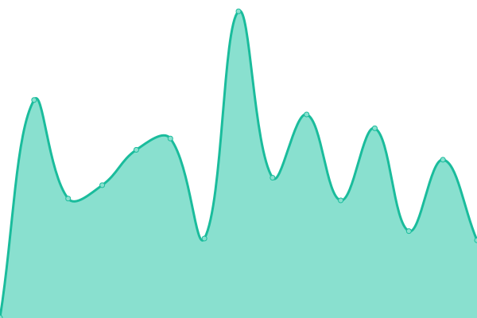 422ms
     
 | 

<a href="https://DELWP-DTV.github.io/santa/history/watercourse-levels">100.00%</a>
    

|  [Ballarat Council - Air quality ](https://data.ballarat.vic.gov.au) | 🟩 Up | [ballarat-council-air-quality.yml](https://github.com/DELWP-DTV/santa/commits/HEAD/history/ballarat-council-air-quality.yml) | 

 1212ms
     
 | 

<a href="https://DELWP-DTV.github.io/santa/history/ballarat-council-air-quality">100.00%</a>
    

|  [Vicmap Vegetation - Tree Density](https://tiles.arcgis.com/tiles/GB33F62SbDxJjwEL/arcgis/rest/services/Vicmap_Vegetation_Tree_Density_Tile/MapServer?view=wmtsview&cacheKey=9326ef767e6c9d9c) | 🟩 Up | [vicmap-vegetation-tree-density.yml](https://github.com/DELWP-DTV/santa/commits/HEAD/history/vicmap-vegetation-tree-density.yml) | 

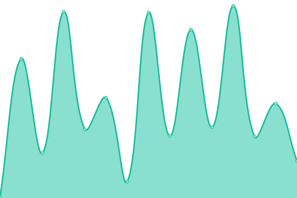 112ms
     
 | 

<a href="https://DELWP-DTV.github.io/santa/history/vicmap-vegetation-tree-density">100.00%</a>
    

|  [Ballarat Council - Temperature Level ](https://data.ballarat.vic.gov.au) | 🟩 Up | [ballarat-council-temperature-level.yml](https://github.com/DELWP-DTV/santa/commits/HEAD/history/ballarat-council-temperature-level.yml) | 

 650ms
     
 | 

<a href="https://DELWP-DTV.github.io/santa/history/ballarat-council-temperature-level">100.00%</a>
    

|  [Vicmap Crown Land Tenure](https://enterprise.mapshare.vic.gov.au/server/rest/services/Vicmap_Crown_Land_Tenure/MapServer) | 🟩 Up | [vicmap-crown-land-tenure.yml](https://github.com/DELWP-DTV/santa/commits/HEAD/history/vicmap-crown-land-tenure.yml) | 

 897ms
     
 | 

<a href="https://DELWP-DTV.github.io/santa/history/vicmap-crown-land-tenure">100.00%</a>
    

|  [Southern Grampians Council - Parking sensors ](https://www.connectgh.com.au) | 🟩 Up | [southern-grampians-council-parking-sensors.yml](https://github.com/DELWP-DTV/santa/commits/HEAD/history/southern-grampians-council-parking-sensors.yml) | 

 1118ms
     
 | 

<a href="https://DELWP-DTV.github.io/santa/history/southern-grampians-council-parking-sensors">100.00%</a>
    

|  [Vicmap Features of Interest](https://enterprise.mapshare.vic.gov.au/server/rest/services/Vicmap_Features_of_Interest/MapServer) | 🟩 Up | [vicmap-features-of-interest.yml](https://github.com/DELWP-DTV/santa/commits/HEAD/history/vicmap-features-of-interest.yml) | 

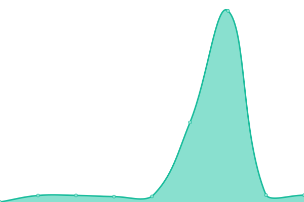 320ms
     
 | 

<a href="https://DELWP-DTV.github.io/santa/history/vicmap-features-of-interest">100.00%</a>
    

|  [ABS SEIFA IEO by SA1 2016](https://map.aurin.org.au/geoserver/ows) | 🟩 Up | [abs-seifa-ieo-by-sa-1-2016.yml](https://github.com/DELWP-DTV/santa/commits/HEAD/history/abs-seifa-ieo-by-sa-1-2016.yml) | 

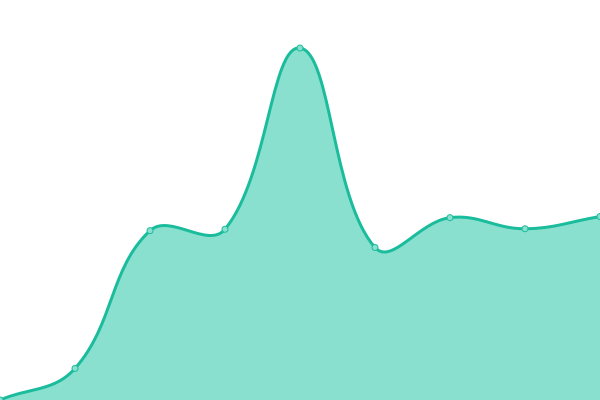 2544ms
     
 | 

<a href="https://DELWP-DTV.github.io/santa/history/abs-seifa-ieo-by-sa-1-2016">100.00%</a>
    

|  [Vicmap Position](https://enterprise.mapshare.vic.gov.au/server/rest/services/Vicmap_Position/MapServer) | 🟩 Up | [vicmap-position.yml](https://github.com/DELWP-DTV/santa/commits/HEAD/history/vicmap-position.yml) | 

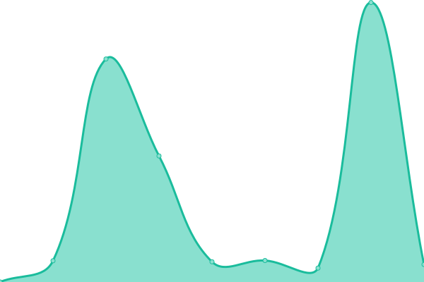 322ms
     
 | 

<a href="https://DELWP-DTV.github.io/santa/history/vicmap-position">100.00%</a>
    

|  [2020 NBN Connections by Technology Type](https://programs.communications.gov.au/geoserver/national-broadband-network/wms) | 🟩 Up | [2020-nbn-connections-by-technology-type.yml](https://github.com/DELWP-DTV/santa/commits/HEAD/history/2020-nbn-connections-by-technology-type.yml) | 

 1917ms
     
 | 

<a href="https://DELWP-DTV.github.io/santa/history/2020-nbn-connections-by-technology-type">100.00%</a>
    

|  [Victorian Land Use Information System 2016-2017](https://enterprise.mapshare.vic.gov.au/server/rest/services/DTV/DJPR_Unrestricted/MapServer) | 🟩 Up | [victorian-land-use-information-system-2016-2017.yml](https://github.com/DELWP-DTV/santa/commits/HEAD/history/victorian-land-use-information-system-2016-2017.yml) | 

 338ms
     
 | 

<a href="https://DELWP-DTV.github.io/santa/history/victorian-land-use-information-system-2016-2017">100.00%</a>
    

|  [ABS SEIFA IER by SA1 2016](https://map.aurin.org.au/geoserver/ows) | 🟩 Up | [abs-seifa-ier-by-sa-1-2016.yml](https://github.com/DELWP-DTV/santa/commits/HEAD/history/abs-seifa-ier-by-sa-1-2016.yml) | 

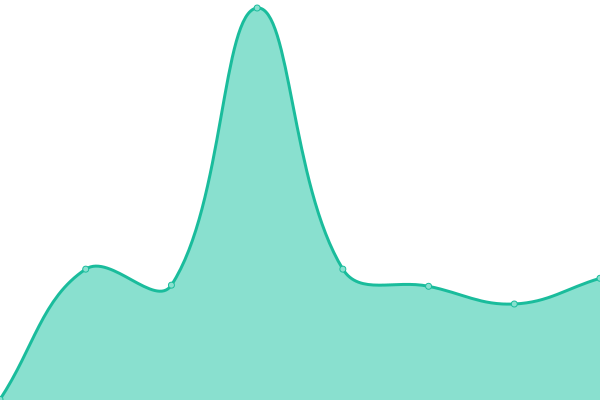 201ms
     
 | 

<a href="https://DELWP-DTV.github.io/santa/history/abs-seifa-ier-by-sa-1-2016">100.00%</a>
    

|  [Portals](https://terria-catalogs-public.storage.googleapis.com/common/aus-gov-open-data/vic/prod.json) | 🟩 Up | [portals.yml](https://github.com/DELWP-DTV/santa/commits/HEAD/history/portals.yml) | 

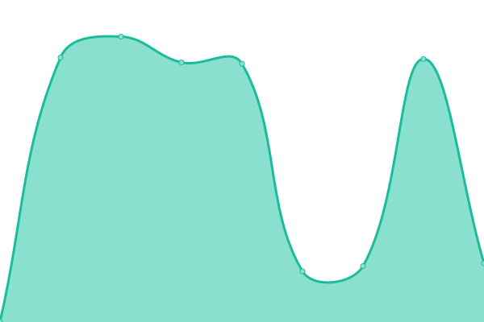 946ms
     
 | 

<a href="https://DELWP-DTV.github.io/santa/history/portals">100.00%</a>
    

|  [Education Facilities](https://services.ga.gov.au/gis/rest/services/Foundation_Facilities_Points/MapServer/0) | 🟩 Up | [education-facilities.yml](https://github.com/DELWP-DTV/santa/commits/HEAD/history/education-facilities.yml) | 

 1343ms
     
 | 

<a href="https://DELWP-DTV.github.io/santa/history/education-facilities">100.00%</a>
    

|  [Vicmap Planning](https://enterprise.mapshare.vic.gov.au/server/rest/services/Vicmap_Planning/MapServer) | 🟩 Up | [vicmap-planning.yml](https://github.com/DELWP-DTV/santa/commits/HEAD/history/vicmap-planning.yml) | 

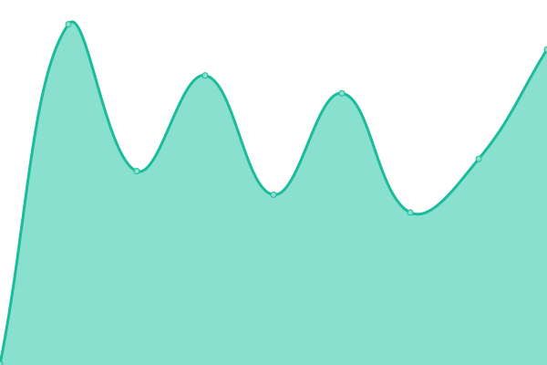 296ms
     
 | 

<a href="https://DELWP-DTV.github.io/santa/history/vicmap-planning">100.00%</a>
    

|  [Vicmap Admin](https://enterprise.mapshare.vic.gov.au/server/rest/services/Vicmap_Admin/MapServer) | 🟩 Up | [vicmap-admin.yml](https://github.com/DELWP-DTV/santa/commits/HEAD/history/vicmap-admin.yml) | 

 289ms
     
 | 

<a href="https://DELWP-DTV.github.io/santa/history/vicmap-admin">100.00%</a>
    

|  [Ballarat Council - Humidity Level ](https://data.ballarat.vic.gov.au) | 🟩 Up | [ballarat-council-humidity-level.yml](https://github.com/DELWP-DTV/santa/commits/HEAD/history/ballarat-council-humidity-level.yml) | 

 1091ms
     
 | 

<a href="https://DELWP-DTV.github.io/santa/history/ballarat-council-humidity-level">100.00%</a>
    

|  [Watercourse Discharge](http://www.bom.gov.au/waterdata/services) | 🟩 Up | [watercourse-discharge.yml](https://github.com/DELWP-DTV/santa/commits/HEAD/history/watercourse-discharge.yml) | 

 303ms
     
 | 

<a href="https://DELWP-DTV.github.io/santa/history/watercourse-discharge">100.00%</a>
    

|  [Geelong - Parking sensors](https://www.geelongdataexchange.com.au) | 🟩 Up | [geelong-parking-sensors.yml](https://github.com/DELWP-DTV/santa/commits/HEAD/history/geelong-parking-sensors.yml) | 

 1085ms
     
 | 

<a href="https://DELWP-DTV.github.io/santa/history/geelong-parking-sensors">100.00%</a>
    

|  [Vicmap Transport](https://enterprise.mapshare.vic.gov.au/server/rest/services/Vicmap_Transport/MapServer) | 🟩 Up | [vicmap-transport.yml](https://github.com/DELWP-DTV/santa/commits/HEAD/history/vicmap-transport.yml) | 

 219ms
     
 | 

<a href="https://DELWP-DTV.github.io/santa/history/vicmap-transport">100.00%</a>
    

|  [Electricity Transmission Lines](https://services.ga.gov.au/gis/rest/services/Foundation_Electricity_Infrastructure/MapServer) | 🟩 Up | [electricity-transmission-lines.yml](https://github.com/DELWP-DTV/santa/commits/HEAD/history/electricity-transmission-lines.yml) | 

 737ms
     
 | 

<a href="https://DELWP-DTV.github.io/santa/history/electricity-transmission-lines">100.00%</a>
    

|  [Planning scheme zones - Vicmap Planning (PLAN_ZONE)](https://enterprise.mapshare.vic.gov.au/server/rest/services/Vicmap_Planning/MapServer/3) | 🟩 Up | [planning-scheme-zones-vicmap-planning-plan-zone.yml](https://github.com/DELWP-DTV/santa/commits/HEAD/history/planning-scheme-zones-vicmap-planning-plan-zone.yml) | 

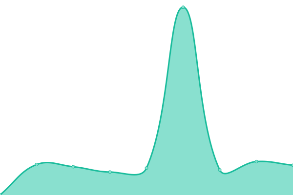 647ms
     
 | 

<a href="https://DELWP-DTV.github.io/santa/history/planning-scheme-zones-vicmap-planning-plan-zone">100.00%</a>
    

|  [Southern Grampians Council - weather-station-status  ](https://www.connectgh.com.au) | 🟩 Up | [southern-grampians-council-weather-station-status.yml](https://github.com/DELWP-DTV/santa/commits/HEAD/history/southern-grampians-council-weather-station-status.yml) | 

 923ms
     
 | 

<a href="https://DELWP-DTV.github.io/santa/history/southern-grampians-council-weather-station-status">100.00%</a>
    

|  [Moreland Tree Ledger](https://treeledger.com.au/load_polygon_current) | 🟩 Up | [moreland-tree-ledger.yml](https://github.com/DELWP-DTV/santa/commits/HEAD/history/moreland-tree-ledger.yml) | 

 641ms
     
 | 

<a href="https://DELWP-DTV.github.io/santa/history/moreland-tree-ledger">100.00%</a>
    

|  [City of Melbourne Pedestrian Traffic Counter](https://data.melbourne.vic.gov.au/api/records/1.0/search/?rows=2000&order=DESC&dataset=pedestrian-counting-system-past-hour-counts-per-minute&timezone=Australia%2FSydney&lang=en) | 🟩 Up | [city-of-melbourne-pedestrian-traffic-counter.yml](https://github.com/DELWP-DTV/santa/commits/HEAD/history/city-of-melbourne-pedestrian-traffic-counter.yml) | 

 2552ms
     
 | 

<a href="https://DELWP-DTV.github.io/santa/history/city-of-melbourne-pedestrian-traffic-counter">100.00%</a>
    

|  [Vicmap Parcel](https://enterprise.mapshare.vic.gov.au/server/rest/services/Vicmap_Parcel/MapServer) | 🟩 Up | [vicmap-parcel.yml](https://github.com/DELWP-DTV/santa/commits/HEAD/history/vicmap-parcel.yml) | 

 327ms
     
 | 

<a href="https://DELWP-DTV.github.io/santa/history/vicmap-parcel">100.00%</a>
    

|  [Watercourse Discharge](http://www.bom.gov.au/waterdata/services) | 🟩 Up | [watercourse-discharge.yml](https://github.com/DELWP-DTV/santa/commits/HEAD/history/watercourse-discharge.yml) | 

 303ms
     
 | 

<a href="https://DELWP-DTV.github.io/santa/history/watercourse-discharge">100.00%</a>
    

|  [Watercourse Levels](http://www.bom.gov.au/waterdata/services) | 🟩 Up | [watercourse-levels.yml](https://github.com/DELWP-DTV/santa/commits/HEAD/history/watercourse-levels.yml) | 

 422ms
     
 | 

<a href="https://DELWP-DTV.github.io/santa/history/watercourse-levels">100.00%</a>
    

|  [Vicmap Property](https://enterprise.mapshare.vic.gov.au/server/rest/services/Vicmap_Property/MapServer) | 🟩 Up | [vicmap-property.yml](https://github.com/DELWP-DTV/santa/commits/HEAD/history/vicmap-property.yml) | 

 246ms
     
 | 

<a href="https://DELWP-DTV.github.io/santa/history/vicmap-property">100.00%</a>
    

|  [AURIN](https://map.aurin.org.au/geoserver/ows) | 🟩 Up | [aurin.yml](https://github.com/DELWP-DTV/santa/commits/HEAD/history/aurin.yml) | 

 614ms
     
 | 

<a href="https://DELWP-DTV.github.io/santa/history/aurin">100.00%</a>
    

|  [SHWEP Activity Centre](https://services7.arcgis.com/fVJQ0uhT9L4zp35f/arcgis/rest/services/ActivityArea_gdb/FeatureServer/2) | 🟩 Up | [shwep-activity-centre.yml](https://github.com/DELWP-DTV/santa/commits/HEAD/history/shwep-activity-centre.yml) | 

 221ms
     
 | 

<a href="https://DELWP-DTV.github.io/santa/history/shwep-activity-centre">100.00%</a>
    

|  [ABS SEIFA IRSD by SA1 2016](https://map.aurin.org.au/geoserver/ows) | 🟩 Up | [abs-seifa-irsd-by-sa-1-2016.yml](https://github.com/DELWP-DTV/santa/commits/HEAD/history/abs-seifa-irsd-by-sa-1-2016.yml) | 

 204ms
     
 | 

<a href="https://DELWP-DTV.github.io/santa/history/abs-seifa-irsd-by-sa-1-2016">100.00%</a>
    

|  [Southern Grampians Council - Water Levels](https://www.connectgh.com.au) | 🟩 Up | [southern-grampians-council-water-levels.yml](https://github.com/DELWP-DTV/santa/commits/HEAD/history/southern-grampians-council-water-levels.yml) | 

 956ms
     
 | 

<a href="https://DELWP-DTV.github.io/santa/history/southern-grampians-council-water-levels">100.00%</a>
    

|  [Vicmap Address](https://enterprise.mapshare.vic.gov.au/server/rest/services/Vicmap_Address/MapServer) | 🟩 Up | [vicmap-address.yml](https://github.com/DELWP-DTV/santa/commits/HEAD/history/vicmap-address.yml) | 

 953ms
     
 | 

<a href="https://DELWP-DTV.github.io/santa/history/vicmap-address">100.00%</a>
    

|  [Ballarat Council - Noise Observations ](https://data.ballarat.vic.gov.au) | 🟩 Up | [ballarat-council-noise-observations.yml](https://github.com/DELWP-DTV/santa/commits/HEAD/history/ballarat-council-noise-observations.yml) | 

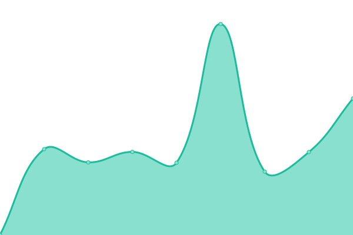 1105ms
     
 | 

<a href="https://DELWP-DTV.github.io/santa/history/ballarat-council-noise-observations">100.00%</a>
    

|  [Vicmap Vegetation - Tree Urban](https://enterprise.mapshare.vic.gov.au/server/rest/services/Vicmap_Vegetation_Tree_Urban/MapServer) | 🟩 Up | [vicmap-vegetation-tree-urban.yml](https://github.com/DELWP-DTV/santa/commits/HEAD/history/vicmap-vegetation-tree-urban.yml) | 

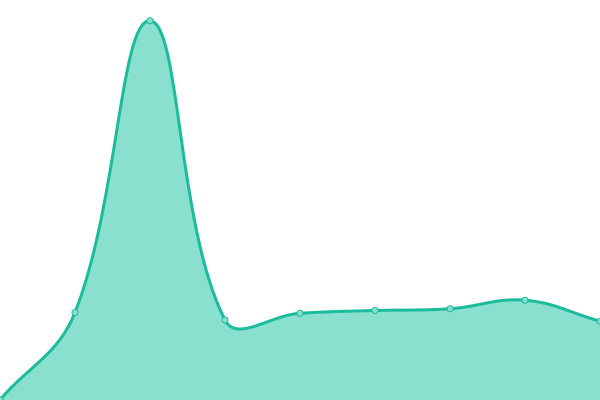 322ms
     
 | 

<a href="https://DELWP-DTV.github.io/santa/history/vicmap-vegetation-tree-urban">100.00%</a>
    

|  [Vicmap Geomark](https://enterprise.mapshare.vic.gov.au/server/rest/services/Vicmap_Geomark/MapServer) | 🟩 Up | [vicmap-geomark.yml](https://github.com/DELWP-DTV/santa/commits/HEAD/history/vicmap-geomark.yml) | 

 298ms
     
 | 

<a href="https://DELWP-DTV.github.io/santa/history/vicmap-geomark">100.00%</a>
    

|  [ABS SEIFA IRSAD by SA1 2016](https://map.aurin.org.au/geoserver/ows) | 🟩 Up | [abs-seifa-irsad-by-sa-1-2016.yml](https://github.com/DELWP-DTV/santa/commits/HEAD/history/abs-seifa-irsad-by-sa-1-2016.yml) | 

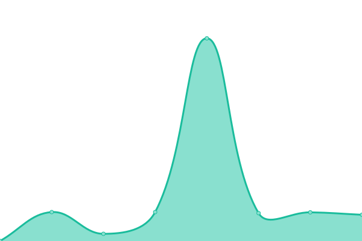 640ms
     
 | 

<a href="https://DELWP-DTV.github.io/santa/history/abs-seifa-irsad-by-sa-1-2016">100.00%</a>
    

|  [Ballarat Council - Noise Sensors](https://data.ballarat.vic.gov.au) | 🟩 Up | [ballarat-council-noise-sensors.yml](https://github.com/DELWP-DTV/santa/commits/HEAD/history/ballarat-council-noise-sensors.yml) | 

 759ms
     
 | 

<a href="https://DELWP-DTV.github.io/santa/history/ballarat-council-noise-sensors">100.00%</a>
    

|  [Vicmap Elevation - Statewide (10m to 20m)](https://enterprise.mapshare.vic.gov.au/server/rest/services/Vicmap_Elevation_STATEWIDE_10_to_20_metre/MapServer) | 🟩 Up | [vicmap-elevation-statewide-10m-to-20m.yml](https://github.com/DELWP-DTV/santa/commits/HEAD/history/vicmap-elevation-statewide-10m-to-20m.yml) | 

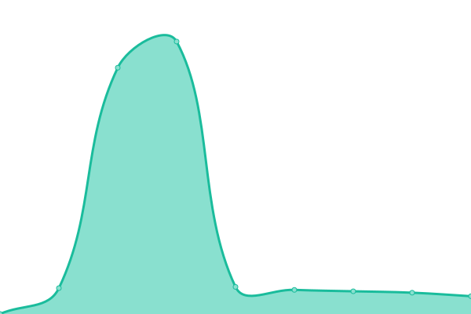 1564ms
     
 | 

<a href="https://DELWP-DTV.github.io/santa/history/vicmap-elevation-statewide-10m-to-20m">100.00%</a>
    

|  [Vicmap Lite](https://enterprise.mapshare.vic.gov.au/server/rest/services/Vicmap_Lite/MapServer) | 🟩 Up | [vicmap-lite.yml](https://github.com/DELWP-DTV/santa/commits/HEAD/history/vicmap-lite.yml) | 

 576ms
     
 | 

<a href="https://DELWP-DTV.github.io/santa/history/vicmap-lite">100.00%</a>
    

|  [Vicmap Elevation - Metro (1m to 5m)](https://enterprise.mapshare.vic.gov.au/server/rest/services/Vicmap_Elevation_METRO_1_to_5_metre/MapServer) | 🟩 Up | [vicmap-elevation-metro-1m-to-5m.yml](https://github.com/DELWP-DTV/santa/commits/HEAD/history/vicmap-elevation-metro-1m-to-5m.yml) | 

 693ms
     
 | 

<a href="https://DELWP-DTV.github.io/santa/history/vicmap-elevation-metro-1m-to-5m">100.00%</a>
    

|  [Significant Planning Register](https://services7.arcgis.com/fVJQ0uhT9L4zp35f/arcgis/rest/services/SunshineActivityPlanningRegister_250722_gdb/FeatureServer/3) | 🟩 Up | [significant-planning-register.yml](https://github.com/DELWP-DTV/santa/commits/HEAD/history/significant-planning-register.yml) | 

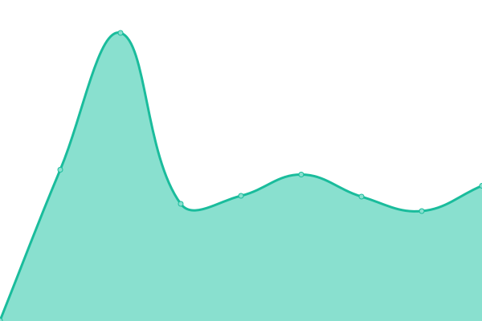 347ms
     
 | 

<a href="https://DELWP-DTV.github.io/santa/history/significant-planning-register">100.00%</a>
    

|  [Ballarat Council - Water Level ](https://data.ballarat.vic.gov.au) | 🟩 Up | [ballarat-council-water-level.yml](https://github.com/DELWP-DTV/santa/commits/HEAD/history/ballarat-council-water-level.yml) | 

 739ms
     
 | 

<a href="https://DELWP-DTV.github.io/santa/history/ballarat-council-water-level">100.00%</a>
    

|  [ACCC Mobile Infrastructure Report 2021](https://enterprise.mapshare.vic.gov.au/server/rest/services/DTV/ACCC_Mobile_Infrastructure_Report/MapServer) | 🟩 Up | [accc-mobile-infrastructure-report-2021.yml](https://github.com/DELWP-DTV/santa/commits/HEAD/history/accc-mobile-infrastructure-report-2021.yml) | 

 312ms
     
 | 

<a href="https://DELWP-DTV.github.io/santa/history/accc-mobile-infrastructure-report-2021">100.00%</a>
    

|  [Australian Public Hospitals 2018-2019](https://services5.arcgis.com/OvOcYIrJnM97ABBA/arcgis/rest/services/Australian_Public_Hospitals_WFL1/FeatureServer/0) | 🟩 Up | [australian-public-hospitals-2018-2019.yml](https://github.com/DELWP-DTV/santa/commits/HEAD/history/australian-public-hospitals-2018-2019.yml) | 

 278ms
     
 | 

<a href="https://DELWP-DTV.github.io/santa/history/australian-public-hospitals-2018-2019">100.00%</a>
    

|  [Moreland Tree Ledger - Losses](https://treeledger.com.au/load_polygon_loss) | 🟩 Up | [moreland-tree-ledger-losses.yml](https://github.com/DELWP-DTV/santa/commits/HEAD/history/moreland-tree-ledger-losses.yml) | 

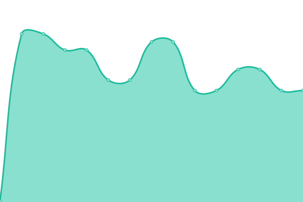 356ms
     
 | 

<a href="https://DELWP-DTV.github.io/santa/history/moreland-tree-ledger-losses">100.00%</a>
    

|  [Vicmap Index](https://enterprise.mapshare.vic.gov.au/server/rest/services/Vicmap_Index/MapServer) | 🟩 Up | [vicmap-index.yml](https://github.com/DELWP-DTV/santa/commits/HEAD/history/vicmap-index.yml) | 

 348ms
     
 | 

<a href="https://DELWP-DTV.github.io/santa/history/vicmap-index">100.00%</a>
    

|  [St Albans Activity Centre](https://services7.arcgis.com/fVJQ0uhT9L4zp35f/arcgis/rest/services/ActivityArea_gdb/FeatureServer/1) | 🟩 Up | [st-albans-activity-centre.yml](https://github.com/DELWP-DTV/santa/commits/HEAD/history/st-albans-activity-centre.yml) | 

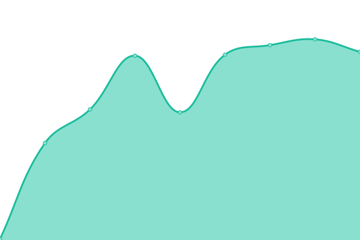 204ms
     
 | 

<a href="https://DELWP-DTV.github.io/santa/history/st-albans-activity-centre">100.00%</a>
    

|  [Vicmap Hydro](https://enterprise.mapshare.vic.gov.au/server/rest/services/Vicmap_Hydro/MapServer) | 🟩 Up | [vicmap-hydro.yml](https://github.com/DELWP-DTV/santa/commits/HEAD/history/vicmap-hydro.yml) | 

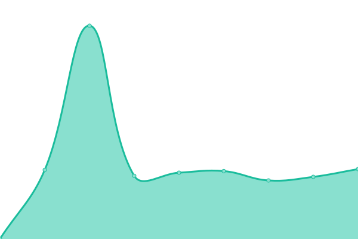 302ms
     
 | 

<a href="https://DELWP-DTV.github.io/santa/history/vicmap-hydro">100.00%</a>
    

|  [Planning scheme overlay - Vicmap Planning (PLAN_OVERLAY)](https://enterprise.mapshare.vic.gov.au/server/rest/services/Vicmap_Planning/MapServer/2) | 🟩 Up | [planning-scheme-overlay-vicmap-planning-plan-overlay.yml](https://github.com/DELWP-DTV/santa/commits/HEAD/history/planning-scheme-overlay-vicmap-planning-plan-overlay.yml) | 

 230ms
     
 | 

<a href="https://DELWP-DTV.github.io/santa/history/planning-scheme-overlay-vicmap-planning-plan-overlay">100.00%</a>
    

|  [local-government-datasets](https://terria-catalogs-public.storage.googleapis.com/common/aus-gov-open-data/vic/prod.json) | 🟩 Up | [local-government-datasets.yml](https://github.com/DELWP-DTV/santa/commits/HEAD/history/local-government-datasets.yml) | 

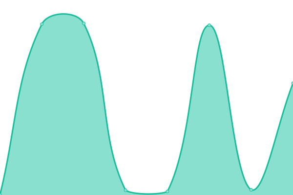 190ms
     
 | 

<a href="https://DELWP-DTV.github.io/santa/history/local-government-datasets">100.00%</a>
    

|  [Moreland Tree Ledger GeoJson](https://treeledger.com.au/open_leaf/current) | 🟩 Up | [moreland-tree-ledger-geo-json.yml](https://github.com/DELWP-DTV/santa/commits/HEAD/history/moreland-tree-ledger-geo-json.yml) | 

 176ms
     
 | 

<a href="https://DELWP-DTV.github.io/santa/history/moreland-tree-ledger-geo-json">100.00%</a>
    

|  [Moreland Tree Ledger - Losses](https://treeledger.com.au/open_leaf/current_loss) | 🟩 Up | [moreland-tree-ledger-losses.yml](https://github.com/DELWP-DTV/santa/commits/HEAD/history/moreland-tree-ledger-losses.yml) | 

 356ms
     
 | 

<a href="https://DELWP-DTV.github.io/santa/history/moreland-tree-ledger-losses">100.00%</a>
    

|  [national-datasets](https://terria-catalogs-public.storage.googleapis.com/nationalmap/prod.json) | 🟩 Up | [national-datasets.yml](https://github.com/DELWP-DTV/santa/commits/HEAD/history/national-datasets.yml) | 

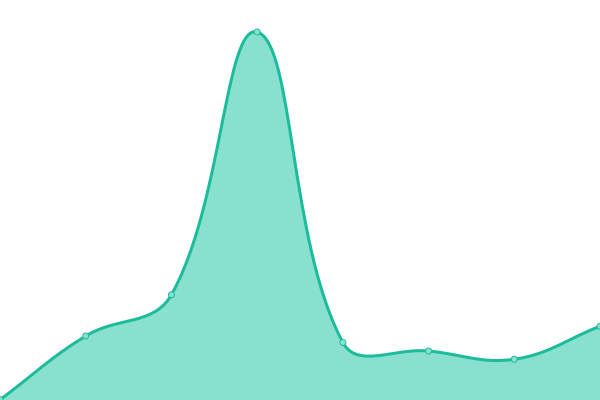 196ms
     
 | 

<a href="https://DELWP-DTV.github.io/santa/history/national-datasets">100.00%</a>
    

|  [Tree Density](https://tiles.arcgis.com/tiles/GB33F62SbDxJjwEL/arcgis/rest/services/Vicmap_Vegetation_Tree_Density/VectorTileServer/tile/{z}/{y}/{x}.pbf) | 🟩 Up | [tree-density.yml](https://github.com/DELWP-DTV/santa/commits/HEAD/history/tree-density.yml) | 

 77ms
     
 | 

<a href="https://DELWP-DTV.github.io/santa/history/tree-density">100.00%</a>
    

|  [Tree Extent](https://tiles.arcgis.com/tiles/GB33F62SbDxJjwEL/arcgis/rest/services/Vicmap_Vegetation_Tree_Extent/MapServer) | 🟩 Up | [tree-extent.yml](https://github.com/DELWP-DTV/santa/commits/HEAD/history/tree-extent.yml) | 

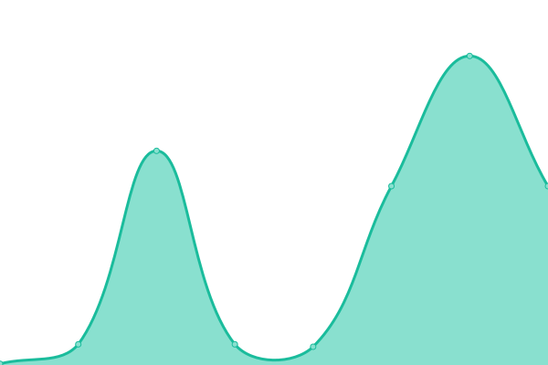 124ms
     
 | 

<a href="https://DELWP-DTV.github.io/santa/history/tree-extent">100.00%</a>
    

|  [vic-data_vicmap-admin-parish-polygon1](https://opendata.maps.vic.gov.au/geoserver/wms?service=wms&request=getmap&format=image%2Fpng8&transparent=true&layers=open-data-platform:parish_polygon&width=512&height=512&crs=epsg%3A3857&bbox=16114148.554967716%2C-4456584.4971389165%2C16119040.524777967%2C-4451692.527328665) | 🟩 Up | [vic-data-vicmap-admin-parish-polygon1.yml](https://github.com/DELWP-DTV/santa/commits/HEAD/history/vic-data-vicmap-admin-parish-polygon1.yml) | 

 977ms
     
 | 

<a href="https://DELWP-DTV.github.io/santa/history/vic-data-vicmap-admin-parish-polygon1">100.00%</a>
    

|  [vic-data_relinquished-mineral-exploration-licence-areas2](https://opendata.maps.vic.gov.au/geoserver/wms?service=wms&request=getmap&format=image%2Fpng8&transparent=true&layers=open-data-platform:elrelin&width=512&height=512&crs=epsg%3A3857&bbox=16114148.554967716%2C-4456584.4971389165%2C16119040.524777967%2C-4451692.527328665) | 🟩 Up | [vic-data-relinquished-mineral-exploration-licence-areas2.yml](https://github.com/DELWP-DTV/santa/commits/HEAD/history/vic-data-relinquished-mineral-exploration-licence-areas2.yml) | 

 213ms
     
 | 

<a href="https://DELWP-DTV.github.io/santa/history/vic-data-relinquished-mineral-exploration-licence-areas2">100.00%</a>
    

|  [vic-data_gas-and-fuel-pipelines-warning-75-complete2](https://opendata.maps.vic.gov.au/geoserver/wms?service=wms&request=getmap&format=image%2Fpng8&transparent=true&layers=open-data-platform:pipeline&width=512&height=512&crs=epsg%3A3857&bbox=16114148.554967716%2C-4456584.4971389165%2C16119040.524777967%2C-4451692.527328665) | 🟩 Up | [vic-data-gas-and-fuel-pipelines-warning-75-complete2.yml](https://github.com/DELWP-DTV/santa/commits/HEAD/history/vic-data-gas-and-fuel-pipelines-warning-75-complete2.yml) | 

 245ms
     
 | 

<a href="https://DELWP-DTV.github.io/santa/history/vic-data-gas-and-fuel-pipelines-warning-75-complete2">100.00%</a>
    

|  [vic-data_current-retention-licences2](https://opendata.maps.vic.gov.au/geoserver/wms?service=wms&request=getmap&format=image%2Fpng8&transparent=true&layers=open-data-platform:rl&width=512&height=512&crs=epsg%3A3857&bbox=16114148.554967716%2C-4456584.4971389165%2C16119040.524777967%2C-4451692.527328665) | 🟩 Up | [vic-data-current-retention-licences2.yml](https://github.com/DELWP-DTV/santa/commits/HEAD/history/vic-data-current-retention-licences2.yml) | 

 234ms
     
 | 

<a href="https://DELWP-DTV.github.io/santa/history/vic-data-current-retention-licences2">100.00%</a>
    

|  [vic-data_current-mining-licences-and-leases2](https://opendata.maps.vic.gov.au/geoserver/wms?service=wms&request=getmap&format=image%2Fpng8&transparent=true&layers=open-data-platform:min&width=512&height=512&crs=epsg%3A3857&bbox=16114148.554967716%2C-4456584.4971389165%2C16119040.524777967%2C-4451692.527328665) | 🟩 Up | [vic-data-current-mining-licences-and-leases2.yml](https://github.com/DELWP-DTV/santa/commits/HEAD/history/vic-data-current-mining-licences-and-leases2.yml) | 

 234ms
     
 | 

<a href="https://DELWP-DTV.github.io/santa/history/vic-data-current-mining-licences-and-leases2">100.00%</a>
    

|  [vic-data_current-prospecting-licences2](https://opendata.maps.vic.gov.au/geoserver/wms?service=wms&request=getmap&format=image%2Fpng8&transparent=true&layers=open-data-platform:pl&width=512&height=512&crs=epsg%3A3857&bbox=16114148.554967716%2C-4456584.4971389165%2C16119040.524777967%2C-4451692.527328665) | 🟩 Up | [vic-data-current-prospecting-licences2.yml](https://github.com/DELWP-DTV/santa/commits/HEAD/history/vic-data-current-prospecting-licences2.yml) | 

 238ms
     
 | 

<a href="https://DELWP-DTV.github.io/santa/history/vic-data-current-prospecting-licences2">100.00%</a>
    

|  [vic-data_current-extractive-industry-tenements2](https://opendata.maps.vic.gov.au/geoserver/wms?service=wms&request=getmap&format=image%2Fpng8&transparent=true&layers=open-data-platform:ewa&width=512&height=512&crs=epsg%3A3857&bbox=16114148.554967716%2C-4456584.4971389165%2C16119040.524777967%2C-4451692.527328665) | 🟥 Down | [vic-data-current-extractive-industry-tenements2.yml](https://github.com/DELWP-DTV/santa/commits/HEAD/history/vic-data-current-extractive-industry-tenements2.yml) | 

 218ms
     
 | 

<a href="https://DELWP-DTV.github.io/santa/history/vic-data-current-extractive-industry-tenements2">99.95%</a>
    

|  [vic-data_current-exploration-licence-moratorium-period-areas2](https://opendata.maps.vic.gov.au/geoserver/wms?service=wms&request=getmap&format=image%2Fpng8&transparent=true&layers=open-data-platform:mp&width=512&height=512&crs=epsg%3A3857&bbox=16114148.554967716%2C-4456584.4971389165%2C16119040.524777967%2C-4451692.527328665) | 🟩 Up | [vic-data-current-exploration-licence-moratorium-period-areas2.yml](https://github.com/DELWP-DTV/santa/commits/HEAD/history/vic-data-current-exploration-licence-moratorium-period-areas2.yml) | 

 236ms
     
 | 

<a href="https://DELWP-DTV.github.io/santa/history/vic-data-current-exploration-licence-moratorium-period-areas2">100.00%</a>
    

|  [vic-data_mineral-tenements2](https://opendata.maps.vic.gov.au/geoserver/wms?service=wms&request=getmap&format=image%2Fpng8&transparent=true&layers=open-data-platform:minten&width=512&height=512&crs=epsg%3A3857&bbox=16114148.554967716%2C-4456584.4971389165%2C16119040.524777967%2C-4451692.527328665) | 🟩 Up | [vic-data-mineral-tenements2.yml](https://github.com/DELWP-DTV/santa/commits/HEAD/history/vic-data-mineral-tenements2.yml) | 

 252ms
     
 | 

<a href="https://DELWP-DTV.github.io/santa/history/vic-data-mineral-tenements2">100.00%</a>
    

|  [vic-data_petroleum-acreage-releases2](https://opendata.maps.vic.gov.au/geoserver/wms?service=wms&request=getmap&format=image%2Fpng8&transparent=true&layers=open-data-platform:petrolpro&width=512&height=512&crs=epsg%3A3857&bbox=16114148.554967716%2C-4456584.4971389165%2C16119040.524777967%2C-4451692.527328665) | 🟩 Up | [vic-data-petroleum-acreage-releases2.yml](https://github.com/DELWP-DTV/santa/commits/HEAD/history/vic-data-petroleum-acreage-releases2.yml) | 

 230ms
     
 | 

<a href="https://DELWP-DTV.github.io/santa/history/vic-data-petroleum-acreage-releases2">100.00%</a>
    

|  [vic-data_petroleum-tenements-victoria1](https://opendata.maps.vic.gov.au/geoserver/wms?service=wms&request=getmap&format=image%2Fpng8&transparent=true&layers=open-data-platform:petrol&width=512&height=512&crs=epsg%3A3857&bbox=16114148.554967716%2C-4456584.4971389165%2C16119040.524777967%2C-4451692.527328665) | 🟩 Up | [vic-data-petroleum-tenements-victoria1.yml](https://github.com/DELWP-DTV/santa/commits/HEAD/history/vic-data-petroleum-tenements-victoria1.yml) | 

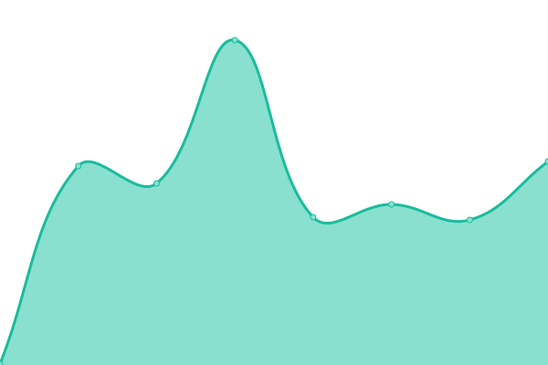 225ms
     
 | 

<a href="https://DELWP-DTV.github.io/santa/history/vic-data-petroleum-tenements-victoria1">100.00%</a>
    

|  [vic-data_expired-mining-licences-and-leases2](https://opendata.maps.vic.gov.au/geoserver/wms?service=wms&request=getmap&format=image%2Fpng8&transparent=true&layers=open-data-platform:minhst&width=512&height=512&crs=epsg%3A3857&bbox=16114148.554967716%2C-4456584.4971389165%2C16119040.524777967%2C-4451692.527328665) | 🟩 Up | [vic-data-expired-mining-licences-and-leases2.yml](https://github.com/DELWP-DTV/santa/commits/HEAD/history/vic-data-expired-mining-licences-and-leases2.yml) | 

 215ms
     
 | 

<a href="https://DELWP-DTV.github.io/santa/history/vic-data-expired-mining-licences-and-leases2">100.00%</a>
    

|  [vic-data_expired-extractive-industry-tenements1](https://opendata.maps.vic.gov.au/geoserver/wms?service=wms&request=getmap&format=image%2Fpng8&transparent=true&layers=open-data-platform:ewahst&width=512&height=512&crs=epsg%3A3857&bbox=16114148.554967716%2C-4456584.4971389165%2C16119040.524777967%2C-4451692.527328665) | 🟩 Up | [vic-data-expired-extractive-industry-tenements1.yml](https://github.com/DELWP-DTV/santa/commits/HEAD/history/vic-data-expired-extractive-industry-tenements1.yml) | 

 229ms
     
 | 

<a href="https://DELWP-DTV.github.io/santa/history/vic-data-expired-extractive-industry-tenements1">100.00%</a>
    

|  [vic-data_petroleum-wells-from-geological-survey-of-victorias-dbmap-database1](https://opendata.maps.vic.gov.au/geoserver/wms?service=wms&request=getmap&format=image%2Fpng8&transparent=true&layers=open-data-platform:pet_wells&width=512&height=512&crs=epsg%3A3857&bbox=16114148.554967716%2C-4456584.4971389165%2C16119040.524777967%2C-4451692.527328665) | 🟩 Up | [vic-data-petroleum-wells-from-geological-survey-of-victorias-dbmap-database1.yml](https://github.com/DELWP-DTV/santa/commits/HEAD/history/vic-data-petroleum-wells-from-geological-survey-of-victorias-dbmap-database1.yml) | 

 232ms
     
 | 

<a href="https://DELWP-DTV.github.io/santa/history/vic-data-petroleum-wells-from-geological-survey-of-victorias-dbmap-database1">100.00%</a>
    

|  [vic-data_geological-sites2](https://opendata.maps.vic.gov.au/geoserver/wms?service=wms&request=getmap&format=image%2Fpng8&transparent=true&layers=open-data-platform:sites&width=512&height=512&crs=epsg%3A3857&bbox=16114148.554967716%2C-4456584.4971389165%2C16119040.524777967%2C-4451692.527328665) | 🟩 Up | [vic-data-geological-sites2.yml](https://github.com/DELWP-DTV/santa/commits/HEAD/history/vic-data-geological-sites2.yml) | 

 232ms
     
 | 

<a href="https://DELWP-DTV.github.io/santa/history/vic-data-geological-sites2">100.00%</a>
    

|  [vic-data_vicmap-property-annotation-text](https://opendata.maps.vic.gov.au/geoserver/wms?service=wms&request=getmap&format=image%2Fpng8&transparent=true&layers=open-data-platform:annotation_text&width=512&height=512&crs=epsg%3A3857&bbox=16114148.554967716%2C-4456584.4971389165%2C16119040.524777967%2C-4451692.527328665) | 🟩 Up | [vic-data-vicmap-property-annotation-text.yml](https://github.com/DELWP-DTV/santa/commits/HEAD/history/vic-data-vicmap-property-annotation-text.yml) | 

 231ms
     
 | 

<a href="https://DELWP-DTV.github.io/santa/history/vic-data-vicmap-property-annotation-text">100.00%</a>
    

|  [vic-data_vicmap-property-parcel-polygon2](https://opendata.maps.vic.gov.au/geoserver/wms?service=wms&request=getmap&format=image%2Fpng8&transparent=true&layers=open-data-platform:parcel_view&width=512&height=512&crs=epsg%3A3857&bbox=16114148.554967716%2C-4456584.4971389165%2C16119040.524777967%2C-4451692.527328665) | 🟩 Up | [vic-data-vicmap-property-parcel-polygon2.yml](https://github.com/DELWP-DTV/santa/commits/HEAD/history/vic-data-vicmap-property-parcel-polygon2.yml) | 

 248ms
     
 | 

<a href="https://DELWP-DTV.github.io/santa/history/vic-data-vicmap-property-parcel-polygon2">100.00%</a>
    

|  [vic-data_rock-site-locations2](https://opendata.maps.vic.gov.au/geoserver/wms?service=wms&request=getmap&format=image%2Fpng8&transparent=true&layers=open-data-platform:rocks&width=512&height=512&crs=epsg%3A3857&bbox=16114148.554967716%2C-4456584.4971389165%2C16119040.524777967%2C-4451692.527328665) | 🟩 Up | [vic-data-rock-site-locations2.yml](https://github.com/DELWP-DTV/santa/commits/HEAD/history/vic-data-rock-site-locations2.yml) | 

 220ms
     
 | 

<a href="https://DELWP-DTV.github.io/santa/history/vic-data-rock-site-locations2">100.00%</a>
    

|  [vic-data_geologically-significant-features-as-determined-by-the-geological-society-of-australia-gsa2](https://opendata.maps.vic.gov.au/geoserver/wms?service=wms&request=getmap&format=image%2Fpng8&transparent=true&layers=open-data-platform:sigfeat&width=512&height=512&crs=epsg%3A3857&bbox=16114148.554967716%2C-4456584.4971389165%2C16119040.524777967%2C-4451692.527328665) | 🟩 Up | [vic-data-geologically-significant-features-as-determined-by-the-geological-society-of-australia-gsa2.yml](https://github.com/DELWP-DTV/santa/commits/HEAD/history/vic-data-geologically-significant-features-as-determined-by-the-geological-society-of-australia-gsa2.yml) | 

 232ms
     
 | 

<a href="https://DELWP-DTV.github.io/santa/history/vic-data-geologically-significant-features-as-determined-by-the-geological-society-of-australia-gsa2">100.00%</a>
    

|  [vic-data_geological-structure-measurements2](https://opendata.maps.vic.gov.au/geoserver/wms?service=wms&request=getmap&format=image%2Fpng8&transparent=true&layers=open-data-platform:struc&width=512&height=512&crs=epsg%3A3857&bbox=16114148.554967716%2C-4456584.4971389165%2C16119040.524777967%2C-4451692.527328665) | 🟩 Up | [vic-data-geological-structure-measurements2.yml](https://github.com/DELWP-DTV/santa/commits/HEAD/history/vic-data-geological-structure-measurements2.yml) | 

 240ms
     
 | 

<a href="https://DELWP-DTV.github.io/santa/history/vic-data-geological-structure-measurements2">100.00%</a>
    

|  [vic-data_geological-outcrops1](https://opendata.maps.vic.gov.au/geoserver/wms?service=wms&request=getmap&format=image%2Fpng8&transparent=true&layers=open-data-platform:outcrop&width=512&height=512&crs=epsg%3A3857&bbox=16114148.554967716%2C-4456584.4971389165%2C16119040.524777967%2C-4451692.527328665) | 🟩 Up | [vic-data-geological-outcrops1.yml](https://github.com/DELWP-DTV/santa/commits/HEAD/history/vic-data-geological-outcrops1.yml) | 

 235ms
     
 | 

<a href="https://DELWP-DTV.github.io/santa/history/vic-data-geological-outcrops1">100.00%</a>
    

|  [vic-data_geological-excursion-sites-visited-by-geological-survey-victoria1](https://opendata.maps.vic.gov.au/geoserver/wms?service=wms&request=getmap&format=image%2Fpng8&transparent=true&layers=open-data-platform:gexcurs&width=512&height=512&crs=epsg%3A3857&bbox=16114148.554967716%2C-4456584.4971389165%2C16119040.524777967%2C-4451692.527328665) | 🟩 Up | [vic-data-geological-excursion-sites-visited-by-geological-survey-victoria1.yml](https://github.com/DELWP-DTV/santa/commits/HEAD/history/vic-data-geological-excursion-sites-visited-by-geological-survey-victoria1.yml) | 

 251ms
     
 | 

<a href="https://DELWP-DTV.github.io/santa/history/vic-data-geological-excursion-sites-visited-by-geological-survey-victoria1">100.00%</a>
    

|  [vic-data_surface-geochemistry-samples-replacing-gchem-over-time2](https://opendata.maps.vic.gov.au/geoserver/wms?service=wms&request=getmap&format=image%2Fpng8&transparent=true&layers=open-data-platform:geochemistry&width=512&height=512&crs=epsg%3A3857&bbox=16114148.554967716%2C-4456584.4971389165%2C16119040.524777967%2C-4451692.527328665) | 🟩 Up | [vic-data-surface-geochemistry-samples-replacing-gchem-over-time2.yml](https://github.com/DELWP-DTV/santa/commits/HEAD/history/vic-data-surface-geochemistry-samples-replacing-gchem-over-time2.yml) | 

 219ms
     
 | 

<a href="https://DELWP-DTV.github.io/santa/history/vic-data-surface-geochemistry-samples-replacing-gchem-over-time2">100.00%</a>
    

|  [vic-data_vicmap-address-address-point](https://opendata.maps.vic.gov.au/geoserver/wms?service=wms&request=getmap&format=image%2Fpng8&transparent=true&layers=open-data-platform:address&width=512&height=512&crs=epsg%3A3857&bbox=16114148.554967716%2C-4456584.4971389165%2C16119040.524777967%2C-4451692.527328665) | 🟩 Up | [vic-data-vicmap-address-address-point.yml](https://github.com/DELWP-DTV/santa/commits/HEAD/history/vic-data-vicmap-address-address-point.yml) | 

 220ms
     
 | 

<a href="https://DELWP-DTV.github.io/santa/history/vic-data-vicmap-address-address-point">100.00%</a>
    

|  [vic-data_vicmap-property-cadastral-area-boundary-line2](https://opendata.maps.vic.gov.au/geoserver/wms?service=wms&request=getmap&format=image%2Fpng8&transparent=true&layers=open-data-platform:cad_area_bdy&width=512&height=512&crs=epsg%3A3857&bbox=16114148.554967716%2C-4456584.4971389165%2C16119040.524777967%2C-4451692.527328665) | 🟩 Up | [vic-data-vicmap-property-cadastral-area-boundary-line2.yml](https://github.com/DELWP-DTV/santa/commits/HEAD/history/vic-data-vicmap-property-cadastral-area-boundary-line2.yml) | 

 435ms
     
 | 

<a href="https://DELWP-DTV.github.io/santa/history/vic-data-vicmap-property-cadastral-area-boundary-line2">100.00%</a>
    

|  [vic-data_vicmap-position-survey-control-mark-point2](https://opendata.maps.vic.gov.au/geoserver/wms?service=wms&request=getmap&format=image%2Fpng8&transparent=true&layers=open-data-platform:smes_full&width=512&height=512&crs=epsg%3A3857&bbox=16114148.554967716%2C-4456584.4971389165%2C16119040.524777967%2C-4451692.527328665) | 🟩 Up | [vic-data-vicmap-position-survey-control-mark-point2.yml](https://github.com/DELWP-DTV/santa/commits/HEAD/history/vic-data-vicmap-position-survey-control-mark-point2.yml) | 

 214ms
     
 | 

<a href="https://DELWP-DTV.github.io/santa/history/vic-data-vicmap-position-survey-control-mark-point2">100.00%</a>
    

|  [vic-data_petrophysics-sample-locations1](https://opendata.maps.vic.gov.au/geoserver/wms?service=wms&request=getmap&format=image%2Fpng8&transparent=true&layers=open-data-platform:petphys&width=512&height=512&crs=epsg%3A3857&bbox=16114148.554967716%2C-4456584.4971389165%2C16119040.524777967%2C-4451692.527328665) | 🟩 Up | [vic-data-petrophysics-sample-locations1.yml](https://github.com/DELWP-DTV/santa/commits/HEAD/history/vic-data-petrophysics-sample-locations1.yml) | 

 224ms
     
 | 

<a href="https://DELWP-DTV.github.io/santa/history/vic-data-petrophysics-sample-locations1">94.00%</a>
    

|  [vic-data_mines-and-mineral-occurrence-sites1](https://opendata.maps.vic.gov.au/geoserver/wms?service=wms&request=getmap&format=image%2Fpng8&transparent=true&layers=open-data-platform:minsite&width=512&height=512&crs=epsg%3A3857&bbox=16114148.554967716%2C-4456584.4971389165%2C16119040.524777967%2C-4451692.527328665) | 🟩 Up | [vic-data-mines-and-mineral-occurrence-sites1.yml](https://github.com/DELWP-DTV/santa/commits/HEAD/history/vic-data-mines-and-mineral-occurrence-sites1.yml) | 

 216ms
     
 | 

<a href="https://DELWP-DTV.github.io/santa/history/vic-data-mines-and-mineral-occurrence-sites1">94.01%</a>
    

|  [vic-data_geological-fossil-locations2](https://opendata.maps.vic.gov.au/geoserver/wms?service=wms&request=getmap&format=image%2Fpng8&transparent=true&layers=open-data-platform:fossils&width=512&height=512&crs=epsg%3A3857&bbox=16114148.554967716%2C-4456584.4971389165%2C16119040.524777967%2C-4451692.527328665) | 🟩 Up | [vic-data-geological-fossil-locations2.yml](https://github.com/DELWP-DTV/santa/commits/HEAD/history/vic-data-geological-fossil-locations2.yml) | 

 651ms
     
 | 

<a href="https://DELWP-DTV.github.io/santa/history/vic-data-geological-fossil-locations2">100.00%</a>
    

|  [vic-data_borehole-geology-from-earth-resources-database8](https://opendata.maps.vic.gov.au/geoserver/wms?service=wms&request=getmap&format=image%2Fpng8&transparent=true&layers=open-data-platform:boresg&width=512&height=512&crs=epsg%3A3857&bbox=16114148.554967716%2C-4456584.4971389165%2C16119040.524777967%2C-4451692.527328665) | 🟩 Up | [vic-data-borehole-geology-from-earth-resources-database8.yml](https://github.com/DELWP-DTV/santa/commits/HEAD/history/vic-data-borehole-geology-from-earth-resources-database8.yml) | 

 241ms
     
 | 

<a href="https://DELWP-DTV.github.io/santa/history/vic-data-borehole-geology-from-earth-resources-database8">100.00%</a>
    

|  [vic-data_vicmap-property-property-polygon2](https://opendata.maps.vic.gov.au/geoserver/wms?service=wms&request=getmap&format=image%2Fpng8&transparent=true&layers=open-data-platform:property_view&width=512&height=512&crs=epsg%3A3857&bbox=16114148.554967716%2C-4456584.4971389165%2C16119040.524777967%2C-4451692.527328665) | 🟩 Up | [vic-data-vicmap-property-property-polygon2.yml](https://github.com/DELWP-DTV/santa/commits/HEAD/history/vic-data-vicmap-property-property-polygon2.yml) | 

 2666ms
     
 | 

<a href="https://DELWP-DTV.github.io/santa/history/vic-data-vicmap-property-property-polygon2">100.00%</a>
    

|  [vic-data_vicmap-crown-land-tenure-crown-land-management-tenure-polygon](https://opendata.maps.vic.gov.au/geoserver/wms?service=wms&request=getmap&format=image%2Fpng8&transparent=true&layers=open-data-platform:cl_tenure_view&width=512&height=512&crs=epsg%3A3857&bbox=16114148.554967716%2C-4456584.4971389165%2C16119040.524777967%2C-4451692.527328665) | 🟩 Up | [vic-data-vicmap-crown-land-tenure-crown-land-management-tenure-polygon.yml](https://github.com/DELWP-DTV/santa/commits/HEAD/history/vic-data-vicmap-crown-land-tenure-crown-land-management-tenure-polygon.yml) | 

 248ms
     
 | 

<a href="https://DELWP-DTV.github.io/santa/history/vic-data-vicmap-crown-land-tenure-crown-land-management-tenure-polygon">100.00%</a>
    

|  [vic-data_vicmap-crown-land-tenure-government-road-polygon](https://opendata.maps.vic.gov.au/geoserver/wms?service=wms&request=getmap&format=image%2Fpng8&transparent=true&layers=open-data-platform:gov_road_polygon&width=512&height=512&crs=epsg%3A3857&bbox=16114148.554967716%2C-4456584.4971389165%2C16119040.524777967%2C-4451692.527328665) | 🟩 Up | [vic-data-vicmap-crown-land-tenure-government-road-polygon.yml](https://github.com/DELWP-DTV/santa/commits/HEAD/history/vic-data-vicmap-crown-land-tenure-government-road-polygon.yml) | 

 378ms
     
 | 

<a href="https://DELWP-DTV.github.io/santa/history/vic-data-vicmap-crown-land-tenure-government-road-polygon">100.00%</a>
    

|  [vic-data_vicmap-admin-locality-polygon-aligned-to-property](https://opendata.maps.vic.gov.au/geoserver/wms?service=wms&request=getmap&format=image%2Fpng8&transparent=true&layers=open-data-platform:locality_polygon&width=512&height=512&crs=epsg%3A3857&bbox=16114148.554967716%2C-4456584.4971389165%2C16119040.524777967%2C-4451692.527328665) | 🟩 Up | [vic-data-vicmap-admin-locality-polygon-aligned-to-property.yml](https://github.com/DELWP-DTV/santa/commits/HEAD/history/vic-data-vicmap-admin-locality-polygon-aligned-to-property.yml) | 

 411ms
     
 | 

<a href="https://DELWP-DTV.github.io/santa/history/vic-data-vicmap-admin-locality-polygon-aligned-to-property">100.00%</a>
    

|  [vic-data_vicmap-admin-local-government-area-lga-polygon-aligned-to-topographic-features](https://opendata.maps.vic.gov.au/geoserver/wms?service=wms&request=getmap&format=image%2Fpng8&transparent=true&layers=open-data-platform:ad_lga_area_polygon&width=512&height=512&crs=epsg%3A3857&bbox=16114148.554967716%2C-4456584.4971389165%2C16119040.524777967%2C-4451692.527328665) | 🟩 Up | [vic-data-vicmap-admin-local-government-area-lga-polygon-aligned-to-topographic-features.yml](https://github.com/DELWP-DTV/santa/commits/HEAD/history/vic-data-vicmap-admin-local-government-area-lga-polygon-aligned-to-topographic-features.yml) | 

 300ms
     
 | 

<a href="https://DELWP-DTV.github.io/santa/history/vic-data-vicmap-admin-local-government-area-lga-polygon-aligned-to-topographic-features">100.00%</a>
    

|  [vic-data_vicmap-features-building-point1](https://opendata.maps.vic.gov.au/geoserver/wms?service=wms&request=getmap&format=image%2Fpng8&transparent=true&layers=open-data-platform:building_point&width=512&height=512&crs=epsg%3A3857&bbox=16114148.554967716%2C-4456584.4971389165%2C16119040.524777967%2C-4451692.527328665) | 🟩 Up | [vic-data-vicmap-features-building-point1.yml](https://github.com/DELWP-DTV/santa/commits/HEAD/history/vic-data-vicmap-features-building-point1.yml) | 

 268ms
     
 | 

<a href="https://DELWP-DTV.github.io/santa/history/vic-data-vicmap-features-building-point1">100.00%</a>
    

|  [vic-data_vicmap-transport-road-infrastructure-point](https://opendata.maps.vic.gov.au/geoserver/wms?service=wms&request=getmap&format=image%2Fpng8&transparent=true&layers=open-data-platform:tr_road_infrastructure&width=512&height=512&crs=epsg%3A3857&bbox=16114148.554967716%2C-4456584.4971389165%2C16119040.524777967%2C-4451692.527328665) | 🟩 Up | [vic-data-vicmap-transport-road-infrastructure-point.yml](https://github.com/DELWP-DTV/santa/commits/HEAD/history/vic-data-vicmap-transport-road-infrastructure-point.yml) | 

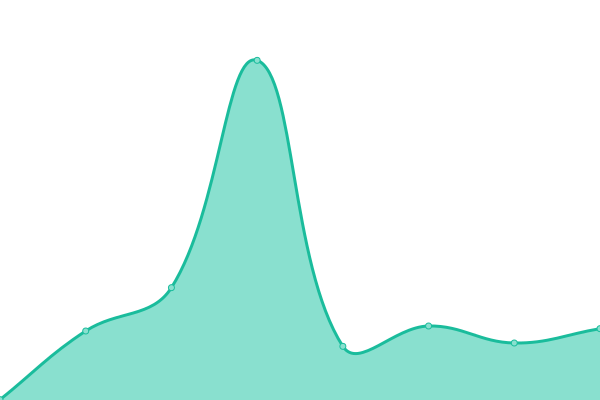 289ms
     
 | 

<a href="https://DELWP-DTV.github.io/santa/history/vic-data-vicmap-transport-road-infrastructure-point">100.00%</a>
    

|  [vic-data_vicmap-features-features-of-interest-index-foi-centroid1](https://opendata.maps.vic.gov.au/geoserver/wms?service=wms&request=getmap&format=image%2Fpng8&transparent=true&layers=open-data-platform:foi_index_centroid&width=512&height=512&crs=epsg%3A3857&bbox=16114148.554967716%2C-4456584.4971389165%2C16119040.524777967%2C-4451692.527328665) | 🟩 Up | [vic-data-vicmap-features-features-of-interest-index-foi-centroid1.yml](https://github.com/DELWP-DTV/santa/commits/HEAD/history/vic-data-vicmap-features-features-of-interest-index-foi-centroid1.yml) | 

 316ms
     
 | 

<a href="https://DELWP-DTV.github.io/santa/history/vic-data-vicmap-features-features-of-interest-index-foi-centroid1">100.00%</a>
    

|  [vic-data_vicmap-features-geomark-polygon1](https://opendata.maps.vic.gov.au/geoserver/wms?service=wms&request=getmap&format=image%2Fpng8&transparent=true&layers=open-data-platform:geomark_polygon&width=512&height=512&crs=epsg%3A3857&bbox=16114148.554967716%2C-4456584.4971389165%2C16119040.524777967%2C-4451692.527328665) | 🟩 Up | [vic-data-vicmap-features-geomark-polygon1.yml](https://github.com/DELWP-DTV/santa/commits/HEAD/history/vic-data-vicmap-features-geomark-polygon1.yml) | 

 282ms
     
 | 

<a href="https://DELWP-DTV.github.io/santa/history/vic-data-vicmap-features-geomark-polygon1">100.00%</a>
    

|  [vic-data_vicmap-transport-road-line](https://opendata.maps.vic.gov.au/geoserver/wms?service=wms&request=getmap&format=image%2Fpng8&transparent=true&layers=open-data-platform:tr_road&width=512&height=512&crs=epsg%3A3857&bbox=16114148.554967716%2C-4456584.4971389165%2C16119040.524777967%2C-4451692.527328665) | 🟩 Up | [vic-data-vicmap-transport-road-line.yml](https://github.com/DELWP-DTV/santa/commits/HEAD/history/vic-data-vicmap-transport-road-line.yml) | 

 261ms
     
 | 

<a href="https://DELWP-DTV.github.io/santa/history/vic-data-vicmap-transport-road-line">100.00%</a>
    

|  [vic-data_vicmap-features-geomark-line](https://opendata.maps.vic.gov.au/geoserver/wms?service=wms&request=getmap&format=image%2Fpng8&transparent=true&layers=open-data-platform:geomark_line&width=512&height=512&crs=epsg%3A3857&bbox=16114148.554967716%2C-4456584.4971389165%2C16119040.524777967%2C-4451692.527328665) | 🟩 Up | [vic-data-vicmap-features-geomark-line.yml](https://github.com/DELWP-DTV/santa/commits/HEAD/history/vic-data-vicmap-features-geomark-line.yml) | 

 290ms
     
 | 

<a href="https://DELWP-DTV.github.io/santa/history/vic-data-vicmap-features-geomark-line">100.00%</a>
    

|  [vic-data_vicmap-transport-airport-infrastructure-polygon1](https://opendata.maps.vic.gov.au/geoserver/wms?service=wms&request=getmap&format=image%2Fpng8&transparent=true&layers=open-data-platform:tr_air_infra_area_polygon&width=512&height=512&crs=epsg%3A3857&bbox=16114148.554967716%2C-4456584.4971389165%2C16119040.524777967%2C-4451692.527328665) | 🟩 Up | [vic-data-vicmap-transport-airport-infrastructure-polygon1.yml](https://github.com/DELWP-DTV/santa/commits/HEAD/history/vic-data-vicmap-transport-airport-infrastructure-polygon1.yml) | 

 227ms
     
 | 

<a href="https://DELWP-DTV.github.io/santa/history/vic-data-vicmap-transport-airport-infrastructure-polygon1">100.00%</a>
    

|  [vic-data_vicmap-admin-victorian-government-region-polygon-aligned-to-property](https://opendata.maps.vic.gov.au/geoserver/wms?service=wms&request=getmap&format=image%2Fpng8&transparent=true&layers=open-data-platform:vicgov_region&width=512&height=512&crs=epsg%3A3857&bbox=16114148.554967716%2C-4456584.4971389165%2C16119040.524777967%2C-4451692.527328665) | 🟩 Up | [vic-data-vicmap-admin-victorian-government-region-polygon-aligned-to-property.yml](https://github.com/DELWP-DTV/santa/commits/HEAD/history/vic-data-vicmap-admin-victorian-government-region-polygon-aligned-to-property.yml) | 

 390ms
     
 | 

<a href="https://DELWP-DTV.github.io/santa/history/vic-data-vicmap-admin-victorian-government-region-polygon-aligned-to-property">100.00%</a>
    

|  [vic-data_vicmap-admin-local-government-area-lga-polygon-aligned-to-property](https://opendata.maps.vic.gov.au/geoserver/wms?service=wms&request=getmap&format=image%2Fpng8&transparent=true&layers=open-data-platform:lga_polygon&width=512&height=512&crs=epsg%3A3857&bbox=16114148.554967716%2C-4456584.4971389165%2C16119040.524777967%2C-4451692.527328665) | 🟩 Up | [vic-data-vicmap-admin-local-government-area-lga-polygon-aligned-to-property.yml](https://github.com/DELWP-DTV/santa/commits/HEAD/history/vic-data-vicmap-admin-local-government-area-lga-polygon-aligned-to-property.yml) | 

 236ms
     
 | 

<a href="https://DELWP-DTV.github.io/santa/history/vic-data-vicmap-admin-local-government-area-lga-polygon-aligned-to-property">100.00%</a>
    

|  [vic-data_vicmap-admin-township-polygon1](https://opendata.maps.vic.gov.au/geoserver/wms?service=wms&request=getmap&format=image%2Fpng8&transparent=true&layers=open-data-platform:township_polygon&width=512&height=512&crs=epsg%3A3857&bbox=16114148.554967716%2C-4456584.4971389165%2C16119040.524777967%2C-4451692.527328665) | 🟩 Up | [vic-data-vicmap-admin-township-polygon1.yml](https://github.com/DELWP-DTV/santa/commits/HEAD/history/vic-data-vicmap-admin-township-polygon1.yml) | 

 257ms
     
 | 

<a href="https://DELWP-DTV.github.io/santa/history/vic-data-vicmap-admin-township-polygon1">100.00%</a>
    

|  [vic-data_vicmap-features-features-of-interest-foi-point1](https://opendata.maps.vic.gov.au/geoserver/wms?service=wms&request=getmap&format=image%2Fpng8&transparent=true&layers=open-data-platform:foi_point&width=512&height=512&crs=epsg%3A3857&bbox=16114148.554967716%2C-4456584.4971389165%2C16119040.524777967%2C-4451692.527328665) | 🟩 Up | [vic-data-vicmap-features-features-of-interest-foi-point1.yml](https://github.com/DELWP-DTV/santa/commits/HEAD/history/vic-data-vicmap-features-features-of-interest-foi-point1.yml) | 

 293ms
     
 | 

<a href="https://DELWP-DTV.github.io/santa/history/vic-data-vicmap-features-features-of-interest-foi-point1">100.00%</a>
    

|  [vic-data_vicmap-features-place-built-up-area-polygon1](https://opendata.maps.vic.gov.au/geoserver/wms?service=wms&request=getmap&format=image%2Fpng8&transparent=true&layers=open-data-platform:pl_place_area_polygon&width=512&height=512&crs=epsg%3A3857&bbox=16114148.554967716%2C-4456584.4971389165%2C16119040.524777967%2C-4451692.527328665) | 🟩 Up | [vic-data-vicmap-features-place-built-up-area-polygon1.yml](https://github.com/DELWP-DTV/santa/commits/HEAD/history/vic-data-vicmap-features-place-built-up-area-polygon1.yml) | 

 250ms
     
 | 

<a href="https://DELWP-DTV.github.io/santa/history/vic-data-vicmap-features-place-built-up-area-polygon1">100.00%</a>
    

|  [vic-data_vicmap-transport-road-register-line](https://opendata.maps.vic.gov.au/geoserver/wms?service=wms&request=getmap&format=image%2Fpng8&transparent=true&layers=open-data-platform:tr_road_register&width=512&height=512&crs=epsg%3A3857&bbox=16114148.554967716%2C-4456584.4971389165%2C16119040.524777967%2C-4451692.527328665) | 🟩 Up | [vic-data-vicmap-transport-road-register-line.yml](https://github.com/DELWP-DTV/santa/commits/HEAD/history/vic-data-vicmap-transport-road-register-line.yml) | 

 673ms
     
 | 

<a href="https://DELWP-DTV.github.io/santa/history/vic-data-vicmap-transport-road-register-line">100.00%</a>
    

|  [vic-data_vicmap-features-vicnames-place-name-register-point](https://opendata.maps.vic.gov.au/geoserver/wms?service=wms&request=getmap&format=image%2Fpng8&transparent=true&layers=open-data-platform:gnr&width=512&height=512&crs=epsg%3A3857&bbox=16114148.554967716%2C-4456584.4971389165%2C16119040.524777967%2C-4451692.527328665) | 🟩 Up | [vic-data-vicmap-features-vicnames-place-name-register-point.yml](https://github.com/DELWP-DTV/santa/commits/HEAD/history/vic-data-vicmap-features-vicnames-place-name-register-point.yml) | 

 474ms
     
 | 

<a href="https://DELWP-DTV.github.io/santa/history/vic-data-vicmap-features-vicnames-place-name-register-point">100.00%</a>
    

|  [vic-data_vicmap-features-features-of-interest-foi-index-extent-polygon1](https://opendata.maps.vic.gov.au/geoserver/wms?service=wms&request=getmap&format=image%2Fpng8&transparent=true&layers=open-data-platform:foi_index_extent&width=512&height=512&crs=epsg%3A3857&bbox=16114148.554967716%2C-4456584.4971389165%2C16119040.524777967%2C-4451692.527328665) | 🟩 Up | [vic-data-vicmap-features-features-of-interest-foi-index-extent-polygon1.yml](https://github.com/DELWP-DTV/santa/commits/HEAD/history/vic-data-vicmap-features-features-of-interest-foi-index-extent-polygon1.yml) | 

 264ms
     
 | 

<a href="https://DELWP-DTV.github.io/santa/history/vic-data-vicmap-features-features-of-interest-foi-index-extent-polygon1">100.00%</a>
    

|  [vic-data_vicmap-features-building-polygon1](https://opendata.maps.vic.gov.au/geoserver/wms?service=wms&request=getmap&format=image%2Fpng8&transparent=true&layers=open-data-platform:building_polygon&width=512&height=512&crs=epsg%3A3857&bbox=16114148.554967716%2C-4456584.4971389165%2C16119040.524777967%2C-4451692.527328665) | 🟩 Up | [vic-data-vicmap-features-building-polygon1.yml](https://github.com/DELWP-DTV/santa/commits/HEAD/history/vic-data-vicmap-features-building-polygon1.yml) | 

 246ms
     
 | 

<a href="https://DELWP-DTV.github.io/santa/history/vic-data-vicmap-features-building-polygon1">100.00%</a>
    

|  [vic-data_vicmap-transport-airport-polygon](https://opendata.maps.vic.gov.au/geoserver/wms?service=wms&request=getmap&format=image%2Fpng8&transparent=true&layers=open-data-platform:tr_airport_area_polygon&width=512&height=512&crs=epsg%3A3857&bbox=16114148.554967716%2C-4456584.4971389165%2C16119040.524777967%2C-4451692.527328665) | 🟩 Up | [vic-data-vicmap-transport-airport-polygon.yml](https://github.com/DELWP-DTV/santa/commits/HEAD/history/vic-data-vicmap-transport-airport-polygon.yml) | 

 276ms
     
 | 

<a href="https://DELWP-DTV.github.io/santa/history/vic-data-vicmap-transport-airport-polygon">100.00%</a>
    

|  [vic-data_vicmap-admin-department-of-environment-land-water-and-planning-delwp-region-polygon1](https://opendata.maps.vic.gov.au/geoserver/wms?service=wms&request=getmap&format=image%2Fpng8&transparent=true&layers=open-data-platform:delwp_region&width=512&height=512&crs=epsg%3A3857&bbox=16114148.554967716%2C-4456584.4971389165%2C16119040.524777967%2C-4451692.527328665) | 🟩 Up | [vic-data-vicmap-admin-department-of-environment-land-water-and-planning-delwp-region-polygon1.yml](https://github.com/DELWP-DTV/santa/commits/HEAD/history/vic-data-vicmap-admin-department-of-environment-land-water-and-planning-delwp-region-polygon1.yml) | 

 495ms
     
 | 

<a href="https://DELWP-DTV.github.io/santa/history/vic-data-vicmap-admin-department-of-environment-land-water-and-planning-delwp-region-polygon1">100.00%</a>
    

|  [vic-data_vicmap-property-easement-line1](https://opendata.maps.vic.gov.au/geoserver/wms?service=wms&request=getmap&format=image%2Fpng8&transparent=true&layers=open-data-platform:easement&width=512&height=512&crs=epsg%3A3857&bbox=16114148.554967716%2C-4456584.4971389165%2C16119040.524777967%2C-4451692.527328665) | 🟩 Up | [vic-data-vicmap-property-easement-line1.yml](https://github.com/DELWP-DTV/santa/commits/HEAD/history/vic-data-vicmap-property-easement-line1.yml) | 

 254ms
     
 | 

<a href="https://DELWP-DTV.github.io/santa/history/vic-data-vicmap-property-easement-line1">100.00%</a>
    

|  [vic-data_vicmap-property-road-casement-polygon](https://opendata.maps.vic.gov.au/geoserver/wms?service=wms&request=getmap&format=image%2Fpng8&transparent=true&layers=open-data-platform:road_casement_polygon&width=512&height=512&crs=epsg%3A3857&bbox=16114148.554967716%2C-4456584.4971389165%2C16119040.524777967%2C-4451692.527328665) | 🟩 Up | [vic-data-vicmap-property-road-casement-polygon.yml](https://github.com/DELWP-DTV/santa/commits/HEAD/history/vic-data-vicmap-property-road-casement-polygon.yml) | 

 325ms
     
 | 

<a href="https://DELWP-DTV.github.io/santa/history/vic-data-vicmap-property-road-casement-polygon">94.03%</a>
    

|  [vic-data_vicmap-admin-postcode-polygon](https://opendata.maps.vic.gov.au/geoserver/wms?service=wms&request=getmap&format=image%2Fpng8&transparent=true&layers=open-data-platform:postcode_polygon&width=512&height=512&crs=epsg%3A3857&bbox=16114148.554967716%2C-4456584.4971389165%2C16119040.524777967%2C-4451692.527328665) | 🟩 Up | [vic-data-vicmap-admin-postcode-polygon.yml](https://github.com/DELWP-DTV/santa/commits/HEAD/history/vic-data-vicmap-admin-postcode-polygon.yml) | 

 254ms
     
 | 

<a href="https://DELWP-DTV.github.io/santa/history/vic-data-vicmap-admin-postcode-polygon">100.00%</a>
    

|  [vic-data_vicmap-features-geomark-index-centroid1](https://opendata.maps.vic.gov.au/geoserver/wms?service=wms&request=getmap&format=image%2Fpng8&transparent=true&layers=open-data-platform:geomark_index_centroid&width=512&height=512&crs=epsg%3A3857&bbox=16114148.554967716%2C-4456584.4971389165%2C16119040.524777967%2C-4451692.527328665) | 🟩 Up | [vic-data-vicmap-features-geomark-index-centroid1.yml](https://github.com/DELWP-DTV/santa/commits/HEAD/history/vic-data-vicmap-features-geomark-index-centroid1.yml) | 

 259ms
     
 | 

<a href="https://DELWP-DTV.github.io/santa/history/vic-data-vicmap-features-geomark-index-centroid1">100.00%</a>
    

|  [vic-data_vicmap-features-features-of-interest-foi-line1](https://opendata.maps.vic.gov.au/geoserver/wms?service=wms&request=getmap&format=image%2Fpng8&transparent=true&layers=open-data-platform:foi_line&width=512&height=512&crs=epsg%3A3857&bbox=16114148.554967716%2C-4456584.4971389165%2C16119040.524777967%2C-4451692.527328665) | 🟩 Up | [vic-data-vicmap-features-features-of-interest-foi-line1.yml](https://github.com/DELWP-DTV/santa/commits/HEAD/history/vic-data-vicmap-features-features-of-interest-foi-line1.yml) | 

 256ms
     
 | 

<a href="https://DELWP-DTV.github.io/santa/history/vic-data-vicmap-features-features-of-interest-foi-line1">100.00%</a>
    

|  [vic-data_vicmap-features-geomark-point1](https://opendata.maps.vic.gov.au/geoserver/wms?service=wms&request=getmap&format=image%2Fpng8&transparent=true&layers=open-data-platform:geomark_point&width=512&height=512&crs=epsg%3A3857&bbox=16114148.554967716%2C-4456584.4971389165%2C16119040.524777967%2C-4451692.527328665) | 🟩 Up | [vic-data-vicmap-features-geomark-point1.yml](https://github.com/DELWP-DTV/santa/commits/HEAD/history/vic-data-vicmap-features-geomark-point1.yml) | 

 257ms
     
 | 

<a href="https://DELWP-DTV.github.io/santa/history/vic-data-vicmap-features-geomark-point1">100.00%</a>
    

|  [vic-data_vicmap-features-features-of-interest-foi-polygon](https://opendata.maps.vic.gov.au/geoserver/wms?service=wms&request=getmap&format=image%2Fpng8&transparent=true&layers=open-data-platform:foi_polygon&width=512&height=512&crs=epsg%3A3857&bbox=16114148.554967716%2C-4456584.4971389165%2C16119040.524777967%2C-4451692.527328665) | 🟩 Up | [vic-data-vicmap-features-features-of-interest-foi-polygon.yml](https://github.com/DELWP-DTV/santa/commits/HEAD/history/vic-data-vicmap-features-features-of-interest-foi-polygon.yml) | 

 235ms
     
 | 

<a href="https://DELWP-DTV.github.io/santa/history/vic-data-vicmap-features-features-of-interest-foi-polygon">100.00%</a>
    

|  [vic-data_vicmap-admin-locality-polygon-aligned-to-topographic-features1](https://opendata.maps.vic.gov.au/geoserver/wms?service=wms&request=getmap&format=image%2Fpng8&transparent=true&layers=open-data-platform:ad_locality_area_polygon&width=512&height=512&crs=epsg%3A3857&bbox=16114148.554967716%2C-4456584.4971389165%2C16119040.524777967%2C-4451692.527328665) | 🟩 Up | [vic-data-vicmap-admin-locality-polygon-aligned-to-topographic-features1.yml](https://github.com/DELWP-DTV/santa/commits/HEAD/history/vic-data-vicmap-admin-locality-polygon-aligned-to-topographic-features1.yml) | 

 248ms
     
 | 

<a href="https://DELWP-DTV.github.io/santa/history/vic-data-vicmap-admin-locality-polygon-aligned-to-topographic-features1">100.00%</a>
    

|  [vic-data_vicmap-admin-victorian-government-region-polygon-aligned-to-topograhic-features](https://opendata.maps.vic.gov.au/geoserver/wms?service=wms&request=getmap&format=image%2Fpng8&transparent=true&layers=open-data-platform:ad_vicgov_region&width=512&height=512&crs=epsg%3A3857&bbox=16114148.554967716%2C-4456584.4971389165%2C16119040.524777967%2C-4451692.527328665) | 🟩 Up | [vic-data-vicmap-admin-victorian-government-region-polygon-aligned-to-topograhic-features.yml](https://github.com/DELWP-DTV/santa/commits/HEAD/history/vic-data-vicmap-admin-victorian-government-region-polygon-aligned-to-topograhic-features.yml) | 

 367ms
     
 | 

<a href="https://DELWP-DTV.github.io/santa/history/vic-data-vicmap-admin-victorian-government-region-polygon-aligned-to-topograhic-features">100.00%</a>
    

|  [vic-data_vicmap-planning-planning-scheme-urban-growth-line1](https://opendata.maps.vic.gov.au/geoserver/wms?service=wms&request=getmap&format=image%2Fpng8&transparent=true&layers=open-data-platform:plan_ugb&width=512&height=512&crs=epsg%3A3857&bbox=16114148.554967716%2C-4456584.4971389165%2C16119040.524777967%2C-4451692.527328665) | 🟩 Up | [vic-data-vicmap-planning-planning-scheme-urban-growth-line1.yml](https://github.com/DELWP-DTV/santa/commits/HEAD/history/vic-data-vicmap-planning-planning-scheme-urban-growth-line1.yml) | 

 246ms
     
 | 

<a href="https://DELWP-DTV.github.io/santa/history/vic-data-vicmap-planning-planning-scheme-urban-growth-line1">100.00%</a>
    

|  [vic-data_vicmap-planning-planning-scheme-overlay-polygon1](https://opendata.maps.vic.gov.au/geoserver/wms?service=wms&request=getmap&format=image%2Fpng8&transparent=true&layers=open-data-platform:plan_overlay&width=512&height=512&crs=epsg%3A3857&bbox=16114148.554967716%2C-4456584.4971389165%2C16119040.524777967%2C-4451692.527328665) | 🟩 Up | [vic-data-vicmap-planning-planning-scheme-overlay-polygon1.yml](https://github.com/DELWP-DTV/santa/commits/HEAD/history/vic-data-vicmap-planning-planning-scheme-overlay-polygon1.yml) | 

 253ms
     
 | 

<a href="https://DELWP-DTV.github.io/santa/history/vic-data-vicmap-planning-planning-scheme-overlay-polygon1">100.00%</a>
    

|  [vic-data_vicmap-planning-planning-scheme-zone-polygon](https://opendata.maps.vic.gov.au/geoserver/wms?service=wms&request=getmap&format=image%2Fpng8&transparent=true&layers=open-data-platform:plan_zone&width=512&height=512&crs=epsg%3A3857&bbox=16114148.554967716%2C-4456584.4971389165%2C16119040.524777967%2C-4451692.527328665) | 🟩 Up | [vic-data-vicmap-planning-planning-scheme-zone-polygon.yml](https://github.com/DELWP-DTV/santa/commits/HEAD/history/vic-data-vicmap-planning-planning-scheme-zone-polygon.yml) | 

 248ms
     
 | 

<a href="https://DELWP-DTV.github.io/santa/history/vic-data-vicmap-planning-planning-scheme-zone-polygon">100.00%</a>
    

|  [vic-data_vicmap-planning-planning-scheme-urban-growth-areas](https://opendata.maps.vic.gov.au/geoserver/wms?service=wms&request=getmap&format=image%2Fpng8&transparent=true&layers=open-data-platform:plan_uga&width=512&height=512&crs=epsg%3A3857&bbox=16114148.554967716%2C-4456584.4971389165%2C16119040.524777967%2C-4451692.527328665) | 🟩 Up | [vic-data-vicmap-planning-planning-scheme-urban-growth-areas.yml](https://github.com/DELWP-DTV/santa/commits/HEAD/history/vic-data-vicmap-planning-planning-scheme-urban-growth-areas.yml) | 

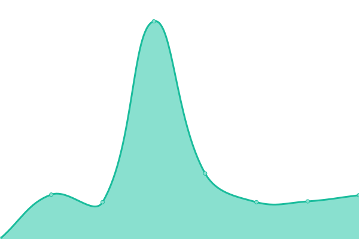 261ms
     
 | 

<a href="https://DELWP-DTV.github.io/santa/history/vic-data-vicmap-planning-planning-scheme-urban-growth-areas">100.00%</a>
    

|  [vic-data_gsv-published-maps-indexes2](https://opendata.maps.vic.gov.au/geoserver/wms?service=wms&request=getmap&format=image%2Fpng8&transparent=true&layers=open-data-platform:gsvmi&width=512&height=512&crs=epsg%3A3857&bbox=16114148.554967716%2C-4456584.4971389165%2C16119040.524777967%2C-4451692.527328665) | 🟩 Up | [vic-data-gsv-published-maps-indexes2.yml](https://github.com/DELWP-DTV/santa/commits/HEAD/history/vic-data-gsv-published-maps-indexes2.yml) | 

 344ms
     
 | 

<a href="https://DELWP-DTV.github.io/santa/history/vic-data-gsv-published-maps-indexes2">100.00%</a>
    

|  [vic-data_original-exploration-licence-area-at-the-time-it-was-first-granted1](https://opendata.maps.vic.gov.au/geoserver/wms?service=wms&request=getmap&format=image%2Fpng8&transparent=true&layers=open-data-platform:elpend&width=512&height=512&crs=epsg%3A3857&bbox=16114148.554967716%2C-4456584.4971389165%2C16119040.524777967%2C-4451692.527328665) | 🟩 Up | [vic-data-original-exploration-licence-area-at-the-time-it-was-first-granted1.yml](https://github.com/DELWP-DTV/santa/commits/HEAD/history/vic-data-original-exploration-licence-area-at-the-time-it-was-first-granted1.yml) | 

 261ms
     
 | 

<a href="https://DELWP-DTV.github.io/santa/history/vic-data-original-exploration-licence-area-at-the-time-it-was-first-granted1">100.00%</a>
    

|  [vic-data_vicmap-hydro-water-structure-line1](https://opendata.maps.vic.gov.au/geoserver/wms?service=wms&request=getmap&format=image%2Fpng8&transparent=true&layers=open-data-platform:hy_water_struct_line&width=512&height=512&crs=epsg%3A3857&bbox=16114148.554967716%2C-4456584.4971389165%2C16119040.524777967%2C-4451692.527328665) | 🟩 Up | [vic-data-vicmap-hydro-water-structure-line1.yml](https://github.com/DELWP-DTV/santa/commits/HEAD/history/vic-data-vicmap-hydro-water-structure-line1.yml) | 

 291ms
     
 | 

<a href="https://DELWP-DTV.github.io/santa/history/vic-data-vicmap-hydro-water-structure-line1">100.00%</a>
    

|  [vic-data_vicmap-transport-railway-infrastructure-point10](https://opendata.maps.vic.gov.au/geoserver/wms?service=wms&request=getmap&format=image%2Fpng8&transparent=true&layers=open-data-platform:tr_rail_infrastructure&width=512&height=512&crs=epsg%3A3857&bbox=16114148.554967716%2C-4456584.4971389165%2C16119040.524777967%2C-4451692.527328665) | 🟩 Up | [vic-data-vicmap-transport-railway-infrastructure-point10.yml](https://github.com/DELWP-DTV/santa/commits/HEAD/history/vic-data-vicmap-transport-railway-infrastructure-point10.yml) | 

 249ms
     
 | 

<a href="https://DELWP-DTV.github.io/santa/history/vic-data-vicmap-transport-railway-infrastructure-point10">100.00%</a>
    

|  [vic-data_vicmap-elevation-relief-polygon1](https://opendata.maps.vic.gov.au/geoserver/wms?service=wms&request=getmap&format=image%2Fpng8&transparent=true&layers=open-data-platform:el_relief_area&width=512&height=512&crs=epsg%3A3857&bbox=16114148.554967716%2C-4456584.4971389165%2C16119040.524777967%2C-4451692.527328665) | 🟩 Up | [vic-data-vicmap-elevation-relief-polygon1.yml](https://github.com/DELWP-DTV/santa/commits/HEAD/history/vic-data-vicmap-elevation-relief-polygon1.yml) | 

 224ms
     
 | 

<a href="https://DELWP-DTV.github.io/santa/history/vic-data-vicmap-elevation-relief-polygon1">100.00%</a>
    

|  [vic-data_vicmap-hydro-water-structure-point1](https://opendata.maps.vic.gov.au/geoserver/wms?service=wms&request=getmap&format=image%2Fpng8&transparent=true&layers=open-data-platform:hy_water_struct_point&width=512&height=512&crs=epsg%3A3857&bbox=16114148.554967716%2C-4456584.4971389165%2C16119040.524777967%2C-4451692.527328665) | 🟩 Up | [vic-data-vicmap-hydro-water-structure-point1.yml](https://github.com/DELWP-DTV/santa/commits/HEAD/history/vic-data-vicmap-hydro-water-structure-point1.yml) | 

 255ms
     
 | 

<a href="https://DELWP-DTV.github.io/santa/history/vic-data-vicmap-hydro-water-structure-point1">100.00%</a>
    

|  [vic-data_vicmap-elevation-morphology-line1](https://opendata.maps.vic.gov.au/geoserver/wms?service=wms&request=getmap&format=image%2Fpng8&transparent=true&layers=open-data-platform:el_morphology_line&width=512&height=512&crs=epsg%3A3857&bbox=16114148.554967716%2C-4456584.4971389165%2C16119040.524777967%2C-4451692.527328665) | 🟩 Up | [vic-data-vicmap-elevation-morphology-line1.yml](https://github.com/DELWP-DTV/santa/commits/HEAD/history/vic-data-vicmap-elevation-morphology-line1.yml) | 

 263ms
     
 | 

<a href="https://DELWP-DTV.github.io/santa/history/vic-data-vicmap-elevation-morphology-line1">100.00%</a>
    

|  [vic-data_vicmap-hydro-water-point1](https://opendata.maps.vic.gov.au/geoserver/wms?service=wms&request=getmap&format=image%2Fpng8&transparent=true&layers=open-data-platform:hy_water_point&width=512&height=512&crs=epsg%3A3857&bbox=16114148.554967716%2C-4456584.4971389165%2C16119040.524777967%2C-4451692.527328665) | 🟩 Up | [vic-data-vicmap-hydro-water-point1.yml](https://github.com/DELWP-DTV/santa/commits/HEAD/history/vic-data-vicmap-hydro-water-point1.yml) | 

 294ms
     
 | 

<a href="https://DELWP-DTV.github.io/santa/history/vic-data-vicmap-hydro-water-point1">100.00%</a>
    

|  [vic-data_vicmap-hydro-water-polygon1](https://opendata.maps.vic.gov.au/geoserver/wms?service=wms&request=getmap&format=image%2Fpng8&transparent=true&layers=open-data-platform:hy_water_area_polygon&width=512&height=512&crs=epsg%3A3857&bbox=16114148.554967716%2C-4456584.4971389165%2C16119040.524777967%2C-4451692.527328665) | 🟩 Up | [vic-data-vicmap-hydro-water-polygon1.yml](https://github.com/DELWP-DTV/santa/commits/HEAD/history/vic-data-vicmap-hydro-water-polygon1.yml) | 

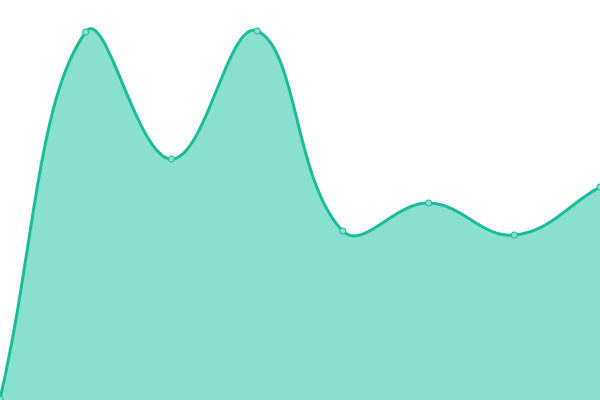 252ms
     
 | 

<a href="https://DELWP-DTV.github.io/santa/history/vic-data-vicmap-hydro-water-polygon1">100.00%</a>
    

|  [vic-data_vicmap-elevation-relief-polygon-fuzzy1](https://opendata.maps.vic.gov.au/geoserver/wms?service=wms&request=getmap&format=image%2Fpng8&transparent=true&layers=open-data-platform:el_relief_area_fuzzy&width=512&height=512&crs=epsg%3A3857&bbox=16114148.554967716%2C-4456584.4971389165%2C16119040.524777967%2C-4451692.527328665) | 🟩 Up | [vic-data-vicmap-elevation-relief-polygon-fuzzy1.yml](https://github.com/DELWP-DTV/santa/commits/HEAD/history/vic-data-vicmap-elevation-relief-polygon-fuzzy1.yml) | 

 249ms
     
 | 

<a href="https://DELWP-DTV.github.io/santa/history/vic-data-vicmap-elevation-relief-polygon-fuzzy1">100.00%</a>
    

|  [vic-data_vicmap-elevation-ground-type-point1](https://opendata.maps.vic.gov.au/geoserver/wms?service=wms&request=getmap&format=image%2Fpng8&transparent=true&layers=open-data-platform:el_grnd_type_point&width=512&height=512&crs=epsg%3A3857&bbox=16114148.554967716%2C-4456584.4971389165%2C16119040.524777967%2C-4451692.527328665) | 🟩 Up | [vic-data-vicmap-elevation-ground-type-point1.yml](https://github.com/DELWP-DTV/santa/commits/HEAD/history/vic-data-vicmap-elevation-ground-type-point1.yml) | 

 224ms
     
 | 

<a href="https://DELWP-DTV.github.io/santa/history/vic-data-vicmap-elevation-ground-type-point1">100.00%</a>
    

|  [vic-data_vicmap-transport-railway-line1](https://opendata.maps.vic.gov.au/geoserver/wms?service=wms&request=getmap&format=image%2Fpng8&transparent=true&layers=open-data-platform:tr_rail&width=512&height=512&crs=epsg%3A3857&bbox=16114148.554967716%2C-4456584.4971389165%2C16119040.524777967%2C-4451692.527328665) | 🟩 Up | [vic-data-vicmap-transport-railway-line1.yml](https://github.com/DELWP-DTV/santa/commits/HEAD/history/vic-data-vicmap-transport-railway-line1.yml) | 

 228ms
     
 | 

<a href="https://DELWP-DTV.github.io/santa/history/vic-data-vicmap-transport-railway-line1">100.00%</a>
    

|  [vic-data_ptv-metro-train-stations1](https://opendata.maps.vic.gov.au/geoserver/wms?service=wms&request=getmap&format=image%2Fpng8&transparent=true&layers=open-data-platform:ptv_metro_train_station&width=512&height=512&crs=epsg%3A3857&bbox=16114148.554967716%2C-4456584.4971389165%2C16119040.524777967%2C-4451692.527328665) | 🟩 Up | [vic-data-ptv-metro-train-stations1.yml](https://github.com/DELWP-DTV/santa/commits/HEAD/history/vic-data-ptv-metro-train-stations1.yml) | 

 226ms
     
 | 

<a href="https://DELWP-DTV.github.io/santa/history/vic-data-ptv-metro-train-stations1">100.00%</a>
    

|  [vic-data_geological-gold-fields-1-1000003](https://opendata.maps.vic.gov.au/geoserver/wms?service=wms&request=getmap&format=image%2Fpng8&transparent=true&layers=open-data-platform:goldfld100_polygon&width=512&height=512&crs=epsg%3A3857&bbox=16114148.554967716%2C-4456584.4971389165%2C16119040.524777967%2C-4451692.527328665) | 🟩 Up | [vic-data-geological-gold-fields-1-1000003.yml](https://github.com/DELWP-DTV/santa/commits/HEAD/history/vic-data-geological-gold-fields-1-1000003.yml) | 

 212ms
     
 | 

<a href="https://DELWP-DTV.github.io/santa/history/vic-data-geological-gold-fields-1-1000003">100.00%</a>
    

|  [vic-data_vicmap-admin-ward-polygon-20172](https://opendata.maps.vic.gov.au/geoserver/wms?service=wms&request=getmap&format=image%2Fpng8&transparent=true&layers=open-data-platform:ward_2017&width=512&height=512&crs=epsg%3A3857&bbox=16114148.554967716%2C-4456584.4971389165%2C16119040.524777967%2C-4451692.527328665) | 🟩 Up | [vic-data-vicmap-admin-ward-polygon-20172.yml](https://github.com/DELWP-DTV/santa/commits/HEAD/history/vic-data-vicmap-admin-ward-polygon-20172.yml) | 

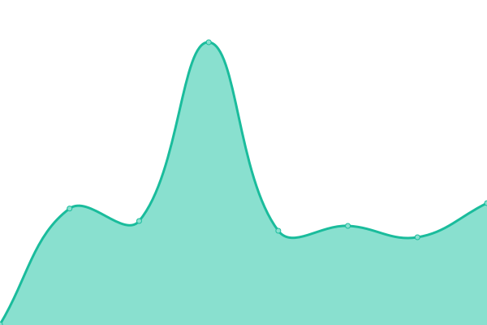 260ms
     
 | 

<a href="https://DELWP-DTV.github.io/santa/history/vic-data-vicmap-admin-ward-polygon-20172">100.00%</a>
    

|  [vic-data_vicmap-hydro-water-poygon-fuzzy1](https://opendata.maps.vic.gov.au/geoserver/wms?service=wms&request=getmap&format=image%2Fpng8&transparent=true&layers=open-data-platform:hy_water_area_fuzzy&width=512&height=512&crs=epsg%3A3857&bbox=16114148.554967716%2C-4456584.4971389165%2C16119040.524777967%2C-4451692.527328665) | 🟩 Up | [vic-data-vicmap-hydro-water-poygon-fuzzy1.yml](https://github.com/DELWP-DTV/santa/commits/HEAD/history/vic-data-vicmap-hydro-water-poygon-fuzzy1.yml) | 

 245ms
     
 | 

<a href="https://DELWP-DTV.github.io/santa/history/vic-data-vicmap-hydro-water-poygon-fuzzy1">100.00%</a>
    

|  [vic-data_water-supply-protection-areas-groundwater-surface-water-zone-within-victoria6](https://opendata.maps.vic.gov.au/geoserver/wms?service=wms&request=getmap&format=image%2Fpng8&transparent=true&layers=open-data-platform:wspa_zone&width=512&height=512&crs=epsg%3A3857&bbox=16114148.554967716%2C-4456584.4971389165%2C16119040.524777967%2C-4451692.527328665) | 🟩 Up | [vic-data-water-supply-protection-areas-groundwater-surface-water-zone-within-victoria6.yml](https://github.com/DELWP-DTV/santa/commits/HEAD/history/vic-data-water-supply-protection-areas-groundwater-surface-water-zone-within-victoria6.yml) | 

 221ms
     
 | 

<a href="https://DELWP-DTV.github.io/santa/history/vic-data-water-supply-protection-areas-groundwater-surface-water-zone-within-victoria6">100.00%</a>
    

|  [vic-data_potential-groundwater-dependent-ecosystem-gde-mapping-for-the-north-east-cma](https://opendata.maps.vic.gov.au/geoserver/wms?service=wms&request=getmap&format=image%2Fpng8&transparent=true&layers=open-data-platform:gde_terr_necma&width=512&height=512&crs=epsg%3A3857&bbox=16114148.554967716%2C-4456584.4971389165%2C16119040.524777967%2C-4451692.527328665) | 🟩 Up | [vic-data-potential-groundwater-dependent-ecosystem-gde-mapping-for-the-north-east-cma.yml](https://github.com/DELWP-DTV/santa/commits/HEAD/history/vic-data-potential-groundwater-dependent-ecosystem-gde-mapping-for-the-north-east-cma.yml) | 

 247ms
     
 | 

<a href="https://DELWP-DTV.github.io/santa/history/vic-data-potential-groundwater-dependent-ecosystem-gde-mapping-for-the-north-east-cma">100.00%</a>
    

|  [vic-data_sediment-bores-free-air-fa-gravity2](https://opendata.maps.vic.gov.au/geoserver/wms?service=wms&request=getmap&format=image%2Fpng8&transparent=true&layers=open-data-platform:bores_sed_fa&width=512&height=512&crs=epsg%3A3857&bbox=16114148.554967716%2C-4456584.4971389165%2C16119040.524777967%2C-4451692.527328665) | 🟩 Up | [vic-data-sediment-bores-free-air-fa-gravity2.yml](https://github.com/DELWP-DTV/santa/commits/HEAD/history/vic-data-sediment-bores-free-air-fa-gravity2.yml) | 

 221ms
     
 | 

<a href="https://DELWP-DTV.github.io/santa/history/vic-data-sediment-bores-free-air-fa-gravity2">100.00%</a>
    

|  [vic-data_volcanic-bore-free-air-fa-gravity2](https://opendata.maps.vic.gov.au/geoserver/wms?service=wms&request=getmap&format=image%2Fpng8&transparent=true&layers=open-data-platform:bores_volc_fa&width=512&height=512&crs=epsg%3A3857&bbox=16114148.554967716%2C-4456584.4971389165%2C16119040.524777967%2C-4451692.527328665) | 🟩 Up | [vic-data-volcanic-bore-free-air-fa-gravity2.yml](https://github.com/DELWP-DTV/santa/commits/HEAD/history/vic-data-volcanic-bore-free-air-fa-gravity2.yml) | 

 223ms
     
 | 

<a href="https://DELWP-DTV.github.io/santa/history/vic-data-volcanic-bore-free-air-fa-gravity2">100.00%</a>
    

|  [vic-data_recreation-track1](https://opendata.maps.vic.gov.au/geoserver/wms?service=wms&request=getmap&format=image%2Fpng8&transparent=true&layers=open-data-platform:recweb_track&width=512&height=512&crs=epsg%3A3857&bbox=16114148.554967716%2C-4456584.4971389165%2C16119040.524777967%2C-4451692.527328665) | 🟩 Up | [vic-data-recreation-track1.yml](https://github.com/DELWP-DTV/santa/commits/HEAD/history/vic-data-recreation-track1.yml) | 

 230ms
     
 | 

<a href="https://DELWP-DTV.github.io/santa/history/vic-data-recreation-track1">100.00%</a>
    

|  [vic-data_recreation-sites1](https://opendata.maps.vic.gov.au/geoserver/wms?service=wms&request=getmap&format=image%2Fpng8&transparent=true&layers=open-data-platform:recweb_site&width=512&height=512&crs=epsg%3A3857&bbox=16114148.554967716%2C-4456584.4971389165%2C16119040.524777967%2C-4451692.527328665) | 🟩 Up | [vic-data-recreation-sites1.yml](https://github.com/DELWP-DTV/santa/commits/HEAD/history/vic-data-recreation-sites1.yml) | 

 238ms
     
 | 

<a href="https://DELWP-DTV.github.io/santa/history/vic-data-recreation-sites1">100.00%</a>
    

|  [vic-data_victorian-bioregions-mapped-at-1-100000-version-3-0-may20041](https://opendata.maps.vic.gov.au/geoserver/wms?service=wms&request=getmap&format=image%2Fpng8&transparent=true&layers=open-data-platform:vbioreg100&width=512&height=512&crs=epsg%3A3857&bbox=16114148.554967716%2C-4456584.4971389165%2C16119040.524777967%2C-4451692.527328665) | 🟩 Up | [vic-data-victorian-bioregions-mapped-at-1-100000-version-3-0-may20041.yml](https://github.com/DELWP-DTV/santa/commits/HEAD/history/vic-data-victorian-bioregions-mapped-at-1-100000-version-3-0-may20041.yml) | 

 290ms
     
 | 

<a href="https://DELWP-DTV.github.io/santa/history/vic-data-victorian-bioregions-mapped-at-1-100000-version-3-0-may20041">100.00%</a>
    

|  [vic-data_victorian-biodiversity-atlas-restricted-records-1-minute-grid1](https://opendata.maps.vic.gov.au/geoserver/wms?service=wms&request=getmap&format=image%2Fpng8&transparent=true&layers=open-data-platform:vba_restricted_1m&width=512&height=512&crs=epsg%3A3857&bbox=16114148.554967716%2C-4456584.4971389165%2C16119040.524777967%2C-4451692.527328665) | 🟩 Up | [vic-data-victorian-biodiversity-atlas-restricted-records-1-minute-grid1.yml](https://github.com/DELWP-DTV/santa/commits/HEAD/history/vic-data-victorian-biodiversity-atlas-restricted-records-1-minute-grid1.yml) | 

 241ms
     
 | 

<a href="https://DELWP-DTV.github.io/santa/history/vic-data-victorian-biodiversity-atlas-restricted-records-1-minute-grid1">100.00%</a>
    

|  [vic-data_historical-mining-activity1](https://opendata.maps.vic.gov.au/geoserver/wms?service=wms&request=getmap&format=image%2Fpng8&transparent=true&layers=open-data-platform:shaft&width=512&height=512&crs=epsg%3A3857&bbox=16114148.554967716%2C-4456584.4971389165%2C16119040.524777967%2C-4451692.527328665) | 🟩 Up | [vic-data-historical-mining-activity1.yml](https://github.com/DELWP-DTV/santa/commits/HEAD/history/vic-data-historical-mining-activity1.yml) | 

 232ms
     
 | 

<a href="https://DELWP-DTV.github.io/santa/history/vic-data-historical-mining-activity1">100.00%</a>
    

|  [vic-data_solar-irradiance-for-victoria](https://opendata.maps.vic.gov.au/geoserver/wms?service=wms&request=getmap&format=image%2Fpng8&transparent=true&layers=open-data-platform:solar_irradiance&width=512&height=512&crs=epsg%3A3857&bbox=16114148.554967716%2C-4456584.4971389165%2C16119040.524777967%2C-4451692.527328665) | 🟩 Up | [vic-data-solar-irradiance-for-victoria.yml](https://github.com/DELWP-DTV/santa/commits/HEAD/history/vic-data-solar-irradiance-for-victoria.yml) | 

 223ms
     
 | 

<a href="https://DELWP-DTV.github.io/santa/history/vic-data-solar-irradiance-for-victoria">100.00%</a>
    

|  [vic-data_geological-zones-of-contact-metamorphism-lines-1-100000](https://opendata.maps.vic.gov.au/geoserver/wms?service=wms&request=getmap&format=image%2Fpng8&transparent=true&layers=open-data-platform:conmeta100_arc&width=512&height=512&crs=epsg%3A3857&bbox=16114148.554967716%2C-4456584.4971389165%2C16119040.524777967%2C-4451692.527328665) | 🟩 Up | [vic-data-geological-zones-of-contact-metamorphism-lines-1-100000.yml](https://github.com/DELWP-DTV/santa/commits/HEAD/history/vic-data-geological-zones-of-contact-metamorphism-lines-1-100000.yml) | 

 225ms
     
 | 

<a href="https://DELWP-DTV.github.io/santa/history/vic-data-geological-zones-of-contact-metamorphism-lines-1-100000">100.00%</a>
    

|  [vic-data_ccs-tenements](https://opendata.maps.vic.gov.au/geoserver/wms?service=wms&request=getmap&format=image%2Fpng8&transparent=true&layers=open-data-platform:ccsten&width=512&height=512&crs=epsg%3A3857&bbox=16114148.554967716%2C-4456584.4971389165%2C16119040.524777967%2C-4451692.527328665) | 🟩 Up | [vic-data-ccs-tenements.yml](https://github.com/DELWP-DTV/santa/commits/HEAD/history/vic-data-ccs-tenements.yml) | 

 234ms
     
 | 

<a href="https://DELWP-DTV.github.io/santa/history/vic-data-ccs-tenements">100.00%</a>
    

|  [vic-data_mineral-areas-1-10000002](https://opendata.maps.vic.gov.au/geoserver/wms?service=wms&request=getmap&format=image%2Fpng8&transparent=true&layers=open-data-platform:mineral&width=512&height=512&crs=epsg%3A3857&bbox=16114148.554967716%2C-4456584.4971389165%2C16119040.524777967%2C-4451692.527328665) | 🟩 Up | [vic-data-mineral-areas-1-10000002.yml](https://github.com/DELWP-DTV/santa/commits/HEAD/history/vic-data-mineral-areas-1-10000002.yml) | 

 228ms
     
 | 

<a href="https://DELWP-DTV.github.io/santa/history/vic-data-mineral-areas-1-10000002">100.00%</a>
    

|  [vic-data_interpreted-basin-edge-1-500000-geological-interpretation-of-geophysical-features2](https://opendata.maps.vic.gov.au/geoserver/wms?service=wms&request=getmap&format=image%2Fpng8&transparent=true&layers=open-data-platform:gpbasin500_arc&width=512&height=512&crs=epsg%3A3857&bbox=16114148.554967716%2C-4456584.4971389165%2C16119040.524777967%2C-4451692.527328665) | 🟩 Up | [vic-data-interpreted-basin-edge-1-500000-geological-interpretation-of-geophysical-features2.yml](https://github.com/DELWP-DTV/santa/commits/HEAD/history/vic-data-interpreted-basin-edge-1-500000-geological-interpretation-of-geophysical-features2.yml) | 

 210ms
     
 | 

<a href="https://DELWP-DTV.github.io/santa/history/vic-data-interpreted-basin-edge-1-500000-geological-interpretation-of-geophysical-features2">100.00%</a>
    

|  [vic-data_average-coal-seam-quality1](https://opendata.maps.vic.gov.au/geoserver/wms?service=wms&request=getmap&format=image%2Fpng8&transparent=true&layers=open-data-platform:coal_quality&width=512&height=512&crs=epsg%3A3857&bbox=16114148.554967716%2C-4456584.4971389165%2C16119040.524777967%2C-4451692.527328665) | 🟩 Up | [vic-data-average-coal-seam-quality1.yml](https://github.com/DELWP-DTV/santa/commits/HEAD/history/vic-data-average-coal-seam-quality1.yml) | 

 226ms
     
 | 

<a href="https://DELWP-DTV.github.io/santa/history/vic-data-average-coal-seam-quality1">100.00%</a>
    

|  [vic-data_geological-basin-extents1](https://opendata.maps.vic.gov.au/geoserver/wms?service=wms&request=getmap&format=image%2Fpng8&transparent=true&layers=open-data-platform:basins_arc&width=512&height=512&crs=epsg%3A3857&bbox=16114148.554967716%2C-4456584.4971389165%2C16119040.524777967%2C-4451692.527328665) | 🟩 Up | [vic-data-geological-basin-extents1.yml](https://github.com/DELWP-DTV/santa/commits/HEAD/history/vic-data-geological-basin-extents1.yml) | 

 229ms
     
 | 

<a href="https://DELWP-DTV.github.io/santa/history/vic-data-geological-basin-extents1">100.00%</a>
    

|  [vic-data_geological-basin-faults2](https://opendata.maps.vic.gov.au/geoserver/wms?service=wms&request=getmap&format=image%2Fpng8&transparent=true&layers=open-data-platform:geol_basin_faults&width=512&height=512&crs=epsg%3A3857&bbox=16114148.554967716%2C-4456584.4971389165%2C16119040.524777967%2C-4451692.527328665) | 🟩 Up | [vic-data-geological-basin-faults2.yml](https://github.com/DELWP-DTV/santa/commits/HEAD/history/vic-data-geological-basin-faults2.yml) | 

 216ms
     
 | 

<a href="https://DELWP-DTV.github.io/santa/history/vic-data-geological-basin-faults2">100.00%</a>
    

|  [vic-data_coal-polygons-1-250000-warning-extremely-limited-area-close-to-echuca2](https://opendata.maps.vic.gov.au/geoserver/wms?service=wms&request=getmap&format=image%2Fpng8&transparent=true&layers=open-data-platform:coal250_polygon&width=512&height=512&crs=epsg%3A3857&bbox=16114148.554967716%2C-4456584.4971389165%2C16119040.524777967%2C-4451692.527328665) | 🟩 Up | [vic-data-coal-polygons-1-250000-warning-extremely-limited-area-close-to-echuca2.yml](https://github.com/DELWP-DTV/santa/commits/HEAD/history/vic-data-coal-polygons-1-250000-warning-extremely-limited-area-close-to-echuca2.yml) | 

 229ms
     
 | 

<a href="https://DELWP-DTV.github.io/santa/history/vic-data-coal-polygons-1-250000-warning-extremely-limited-area-close-to-echuca2">100.00%</a>
    

|  [vic-data_exploration-licences-that-are-no-longer-active-that-expired-since-19653](https://opendata.maps.vic.gov.au/geoserver/wms?service=wms&request=getmap&format=image%2Fpng8&transparent=true&layers=open-data-platform:elhist&width=512&height=512&crs=epsg%3A3857&bbox=16114148.554967716%2C-4456584.4971389165%2C16119040.524777967%2C-4451692.527328665) | 🟩 Up | [vic-data-exploration-licences-that-are-no-longer-active-that-expired-since-19653.yml](https://github.com/DELWP-DTV/santa/commits/HEAD/history/vic-data-exploration-licences-that-are-no-longer-active-that-expired-since-19653.yml) | 

 253ms
     
 | 

<a href="https://DELWP-DTV.github.io/santa/history/vic-data-exploration-licences-that-are-no-longer-active-that-expired-since-19653">100.00%</a>
    

|  [vic-data_recreation-point-of-interest](https://opendata.maps.vic.gov.au/geoserver/wms?service=wms&request=getmap&format=image%2Fpng8&transparent=true&layers=open-data-platform:recweb_poi&width=512&height=512&crs=epsg%3A3857&bbox=16114148.554967716%2C-4456584.4971389165%2C16119040.524777967%2C-4451692.527328665) | 🟩 Up | [vic-data-recreation-point-of-interest.yml](https://github.com/DELWP-DTV/santa/commits/HEAD/history/vic-data-recreation-point-of-interest.yml) | 

 218ms
     
 | 

<a href="https://DELWP-DTV.github.io/santa/history/vic-data-recreation-point-of-interest">100.00%</a>
    

|  [vic-data_contact-metamorphism-zone-lines-1-2500002](https://opendata.maps.vic.gov.au/geoserver/wms?service=wms&request=getmap&format=image%2Fpng8&transparent=true&layers=open-data-platform:conmeta250_arc&width=512&height=512&crs=epsg%3A3857&bbox=16114148.554967716%2C-4456584.4971389165%2C16119040.524777967%2C-4451692.527328665) | 🟩 Up | [vic-data-contact-metamorphism-zone-lines-1-2500002.yml](https://github.com/DELWP-DTV/santa/commits/HEAD/history/vic-data-contact-metamorphism-zone-lines-1-2500002.yml) | 

 227ms
     
 | 

<a href="https://DELWP-DTV.github.io/santa/history/vic-data-contact-metamorphism-zone-lines-1-2500002">100.00%</a>
    

|  [vic-data_geological-chert-horizon-1-1000001](https://opendata.maps.vic.gov.au/geoserver/wms?service=wms&request=getmap&format=image%2Fpng8&transparent=true&layers=open-data-platform:cherth100_arc&width=512&height=512&crs=epsg%3A3857&bbox=16114148.554967716%2C-4456584.4971389165%2C16119040.524777967%2C-4451692.527328665) | 🟩 Up | [vic-data-geological-chert-horizon-1-1000001.yml](https://github.com/DELWP-DTV/santa/commits/HEAD/history/vic-data-geological-chert-horizon-1-1000001.yml) | 

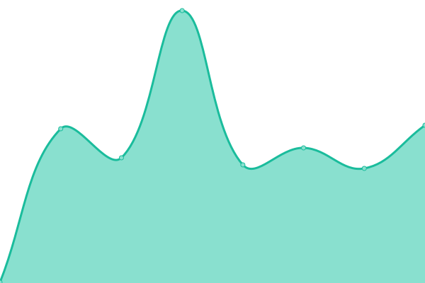 233ms
     
 | 

<a href="https://DELWP-DTV.github.io/santa/history/vic-data-geological-chert-horizon-1-1000001">100.00%</a>
    

|  [vic-data_victorian-coal-bearing-sub-basin-domains1](https://opendata.maps.vic.gov.au/geoserver/wms?service=wms&request=getmap&format=image%2Fpng8&transparent=true&layers=open-data-platform:coalinvsbd&width=512&height=512&crs=epsg%3A3857&bbox=16114148.554967716%2C-4456584.4971389165%2C16119040.524777967%2C-4451692.527328665) | 🟩 Up | [vic-data-victorian-coal-bearing-sub-basin-domains1.yml](https://github.com/DELWP-DTV/santa/commits/HEAD/history/vic-data-victorian-coal-bearing-sub-basin-domains1.yml) | 

 216ms
     
 | 

<a href="https://DELWP-DTV.github.io/santa/history/vic-data-victorian-coal-bearing-sub-basin-domains1">100.00%</a>
    

|  [vic-data_coal-polygons-1-100000-warning-extremely-limited-area-close-to-zumsteins-in-the-grampians1](https://opendata.maps.vic.gov.au/geoserver/wms?service=wms&request=getmap&format=image%2Fpng8&transparent=true&layers=open-data-platform:coal100_polygon&width=512&height=512&crs=epsg%3A3857&bbox=16114148.554967716%2C-4456584.4971389165%2C16119040.524777967%2C-4451692.527328665) | 🟩 Up | [vic-data-coal-polygons-1-100000-warning-extremely-limited-area-close-to-zumsteins-in-the-grampians1.yml](https://github.com/DELWP-DTV/santa/commits/HEAD/history/vic-data-coal-polygons-1-100000-warning-extremely-limited-area-close-to-zumsteins-in-the-grampians1.yml) | 

 235ms
     
 | 

<a href="https://DELWP-DTV.github.io/santa/history/vic-data-coal-polygons-1-100000-warning-extremely-limited-area-close-to-zumsteins-in-the-grampians1">100.00%</a>
    

|  [vic-data_geological-basin-structural-elements2](https://opendata.maps.vic.gov.au/geoserver/wms?service=wms&request=getmap&format=image%2Fpng8&transparent=true&layers=open-data-platform:geol_basin_struct_ele&width=512&height=512&crs=epsg%3A3857&bbox=16114148.554967716%2C-4456584.4971389165%2C16119040.524777967%2C-4451692.527328665) | 🟩 Up | [vic-data-geological-basin-structural-elements2.yml](https://github.com/DELWP-DTV/santa/commits/HEAD/history/vic-data-geological-basin-structural-elements2.yml) | 

 229ms
     
 | 

<a href="https://DELWP-DTV.github.io/santa/history/vic-data-geological-basin-structural-elements2">100.00%</a>
    

|  [vic-data_vicmap-crown-land-tenure-crown-land-management-tenure-line1](https://opendata.maps.vic.gov.au/geoserver/wms?service=wms&request=getmap&format=image%2Fpng8&transparent=true&layers=open-data-platform:cl_cad_line&width=512&height=512&crs=epsg%3A3857&bbox=16114148.554967716%2C-4456584.4971389165%2C16119040.524777967%2C-4451692.527328665) | 🟩 Up | [vic-data-vicmap-crown-land-tenure-crown-land-management-tenure-line1.yml](https://github.com/DELWP-DTV/santa/commits/HEAD/history/vic-data-vicmap-crown-land-tenure-crown-land-management-tenure-line1.yml) | 

 214ms
     
 | 

<a href="https://DELWP-DTV.github.io/santa/history/vic-data-vicmap-crown-land-tenure-crown-land-management-tenure-line1">100.00%</a>
    

|  [vic-data_coal-strip-ratio-maps](https://opendata.maps.vic.gov.au/geoserver/wms?service=wms&request=getmap&format=image%2Fpng8&transparent=true&layers=open-data-platform:coal_resource&width=512&height=512&crs=epsg%3A3857&bbox=16114148.554967716%2C-4456584.4971389165%2C16119040.524777967%2C-4451692.527328665) | 🟩 Up | [vic-data-coal-strip-ratio-maps.yml](https://github.com/DELWP-DTV/santa/commits/HEAD/history/vic-data-coal-strip-ratio-maps.yml) | 

 232ms
     
 | 

<a href="https://DELWP-DTV.github.io/santa/history/vic-data-coal-strip-ratio-maps">100.00%</a>
    

|  [vic-data_catchment-management-authority-boundaries1](https://opendata.maps.vic.gov.au/geoserver/wms?service=wms&request=getmap&format=image%2Fpng8&transparent=true&layers=open-data-platform:cma100&width=512&height=512&crs=epsg%3A3857&bbox=16114148.554967716%2C-4456584.4971389165%2C16119040.524777967%2C-4451692.527328665) | 🟩 Up | [vic-data-catchment-management-authority-boundaries1.yml](https://github.com/DELWP-DTV/santa/commits/HEAD/history/vic-data-catchment-management-authority-boundaries1.yml) | 

 269ms
     
 | 

<a href="https://DELWP-DTV.github.io/santa/history/vic-data-catchment-management-authority-boundaries1">100.00%</a>
    

|  [vic-data_victorian-coal-fields2](https://opendata.maps.vic.gov.au/geoserver/wms?service=wms&request=getmap&format=image%2Fpng8&transparent=true&layers=open-data-platform:coalinvflds&width=512&height=512&crs=epsg%3A3857&bbox=16114148.554967716%2C-4456584.4971389165%2C16119040.524777967%2C-4451692.527328665) | 🟩 Up | [vic-data-victorian-coal-fields2.yml](https://github.com/DELWP-DTV/santa/commits/HEAD/history/vic-data-victorian-coal-fields2.yml) | 

 213ms
     
 | 

<a href="https://DELWP-DTV.github.io/santa/history/vic-data-victorian-coal-fields2">100.00%</a>
    

|  [vic-data_geological-zones-of-contact-metamorphism-1-100000](https://opendata.maps.vic.gov.au/geoserver/wms?service=wms&request=getmap&format=image%2Fpng8&transparent=true&layers=open-data-platform:conmeta100_polygon&width=512&height=512&crs=epsg%3A3857&bbox=16114148.554967716%2C-4456584.4971389165%2C16119040.524777967%2C-4451692.527328665) | 🟩 Up | [vic-data-geological-zones-of-contact-metamorphism-1-100000.yml](https://github.com/DELWP-DTV/santa/commits/HEAD/history/vic-data-geological-zones-of-contact-metamorphism-1-100000.yml) | 

 228ms
     
 | 

<a href="https://DELWP-DTV.github.io/santa/history/vic-data-geological-zones-of-contact-metamorphism-1-100000">100.00%</a>
    

|  [vic-data_victorian-coal-sub-crop-regions](https://opendata.maps.vic.gov.au/geoserver/wms?service=wms&request=getmap&format=image%2Fpng8&transparent=true&layers=open-data-platform:coalinvscrop&width=512&height=512&crs=epsg%3A3857&bbox=16114148.554967716%2C-4456584.4971389165%2C16119040.524777967%2C-4451692.527328665) | 🟩 Up | [vic-data-victorian-coal-sub-crop-regions.yml](https://github.com/DELWP-DTV/santa/commits/HEAD/history/vic-data-victorian-coal-sub-crop-regions.yml) | 

 237ms
     
 | 

<a href="https://DELWP-DTV.github.io/santa/history/vic-data-victorian-coal-sub-crop-regions">100.00%</a>
    

|  [vic-data_flows-assessed-river-reaches1](https://opendata.maps.vic.gov.au/geoserver/wms?service=wms&request=getmap&format=image%2Fpng8&transparent=true&layers=open-data-platform:flows_river_reaches&width=512&height=512&crs=epsg%3A3857&bbox=16114148.554967716%2C-4456584.4971389165%2C16119040.524777967%2C-4451692.527328665) | 🟩 Up | [vic-data-flows-assessed-river-reaches1.yml](https://github.com/DELWP-DTV/santa/commits/HEAD/history/vic-data-flows-assessed-river-reaches1.yml) | 

 218ms
     
 | 

<a href="https://DELWP-DTV.github.io/santa/history/vic-data-flows-assessed-river-reaches1">100.00%</a>
    

|  [vic-data_duricrust-1-1000001](https://opendata.maps.vic.gov.au/geoserver/wms?service=wms&request=getmap&format=image%2Fpng8&transparent=true&layers=open-data-platform:duri100_polygon&width=512&height=512&crs=epsg%3A3857&bbox=16114148.554967716%2C-4456584.4971389165%2C16119040.524777967%2C-4451692.527328665) | 🟩 Up | [vic-data-duricrust-1-1000001.yml](https://github.com/DELWP-DTV/santa/commits/HEAD/history/vic-data-duricrust-1-1000001.yml) | 

 226ms
     
 | 

<a href="https://DELWP-DTV.github.io/santa/history/vic-data-duricrust-1-1000001">100.00%</a>
    

|  [vic-data_forest-cover-of-victoria-in-18691](https://opendata.maps.vic.gov.au/geoserver/wms?service=wms&request=getmap&format=image%2Fpng8&transparent=true&layers=open-data-platform:fcov1000_1869&width=512&height=512&crs=epsg%3A3857&bbox=16114148.554967716%2C-4456584.4971389165%2C16119040.524777967%2C-4451692.527328665) | 🟩 Up | [vic-data-forest-cover-of-victoria-in-18691.yml](https://github.com/DELWP-DTV/santa/commits/HEAD/history/vic-data-forest-cover-of-victoria-in-18691.yml) | 

 255ms
     
 | 

<a href="https://DELWP-DTV.github.io/santa/history/vic-data-forest-cover-of-victoria-in-18691">100.00%</a>
    

|  [vic-data_fluvially-drained-portions-of-victorian-coastal-catchments2](https://opendata.maps.vic.gov.au/geoserver/wms?service=wms&request=getmap&format=image%2Fpng8&transparent=true&layers=open-data-platform:est_fluv&width=512&height=512&crs=epsg%3A3857&bbox=16114148.554967716%2C-4456584.4971389165%2C16119040.524777967%2C-4451692.527328665) | 🟩 Up | [vic-data-fluvially-drained-portions-of-victorian-coastal-catchments2.yml](https://github.com/DELWP-DTV/santa/commits/HEAD/history/vic-data-fluvially-drained-portions-of-victorian-coastal-catchments2.yml) | 

 206ms
     
 | 

<a href="https://DELWP-DTV.github.io/santa/history/vic-data-fluvially-drained-portions-of-victorian-coastal-catchments2">100.00%</a>
    

|  [vic-data_vicmap-index-vicmap-topographic-1-25000-mga-double-format-map-index](https://opendata.maps.vic.gov.au/geoserver/wms?service=wms&request=getmap&format=image%2Fpng8&transparent=true&layers=open-data-platform:vicmap_mapindex_25d&width=512&height=512&crs=epsg%3A3857&bbox=16114148.554967716%2C-4456584.4971389165%2C16119040.524777967%2C-4451692.527328665) | 🟩 Up | [vic-data-vicmap-index-vicmap-topographic-1-25000-mga-double-format-map-index.yml](https://github.com/DELWP-DTV/santa/commits/HEAD/history/vic-data-vicmap-index-vicmap-topographic-1-25000-mga-double-format-map-index.yml) | 

 248ms
     
 | 

<a href="https://DELWP-DTV.github.io/santa/history/vic-data-vicmap-index-vicmap-topographic-1-25000-mga-double-format-map-index">100.00%</a>
    

|  [vic-data_shear-displacement-structures-1-500001](https://opendata.maps.vic.gov.au/geoserver/wms?service=wms&request=getmap&format=image%2Fpng8&transparent=true&layers=open-data-platform:sg_shear_displace_struc_50k&width=512&height=512&crs=epsg%3A3857&bbox=16114148.554967716%2C-4456584.4971389165%2C16119040.524777967%2C-4451692.527328665) | 🟩 Up | [vic-data-shear-displacement-structures-1-500001.yml](https://github.com/DELWP-DTV/santa/commits/HEAD/history/vic-data-shear-displacement-structures-1-500001.yml) | 

 234ms
     
 | 

<a href="https://DELWP-DTV.github.io/santa/history/vic-data-shear-displacement-structures-1-500001">100.00%</a>
    

|  [vic-data_bedrock-bore-free-air-fa-gravity1](https://opendata.maps.vic.gov.au/geoserver/wms?service=wms&request=getmap&format=image%2Fpng8&transparent=true&layers=open-data-platform:bores_bed_fa&width=512&height=512&crs=epsg%3A3857&bbox=16114148.554967716%2C-4456584.4971389165%2C16119040.524777967%2C-4451692.527328665) | 🟩 Up | [vic-data-bedrock-bore-free-air-fa-gravity1.yml](https://github.com/DELWP-DTV/santa/commits/HEAD/history/vic-data-bedrock-bore-free-air-fa-gravity1.yml) | 

 216ms
     
 | 

<a href="https://DELWP-DTV.github.io/santa/history/vic-data-bedrock-bore-free-air-fa-gravity1">100.00%</a>
    

|  [vic-data_ptv-regional-coach-stops2](https://opendata.maps.vic.gov.au/geoserver/wms?service=wms&request=getmap&format=image%2Fpng8&transparent=true&layers=open-data-platform:ptv_regional_coach_stop&width=512&height=512&crs=epsg%3A3857&bbox=16114148.554967716%2C-4456584.4971389165%2C16119040.524777967%2C-4451692.527328665) | 🟩 Up | [vic-data-ptv-regional-coach-stops2.yml](https://github.com/DELWP-DTV/santa/commits/HEAD/history/vic-data-ptv-regional-coach-stops2.yml) | 

 227ms
     
 | 

<a href="https://DELWP-DTV.github.io/santa/history/vic-data-ptv-regional-coach-stops2">100.00%</a>
    

|  [vic-data_ptv-regional-bus-routes](https://opendata.maps.vic.gov.au/geoserver/wms?service=wms&request=getmap&format=image%2Fpng8&transparent=true&layers=open-data-platform:ptv_regional_bus_route&width=512&height=512&crs=epsg%3A3857&bbox=16114148.554967716%2C-4456584.4971389165%2C16119040.524777967%2C-4451692.527328665) | 🟩 Up | [vic-data-ptv-regional-bus-routes.yml](https://github.com/DELWP-DTV/santa/commits/HEAD/history/vic-data-ptv-regional-bus-routes.yml) | 

 237ms
     
 | 

<a href="https://DELWP-DTV.github.io/santa/history/vic-data-ptv-regional-bus-routes">100.00%</a>
    

|  [vic-data_plm25-overlays-including-reference-areas-heritage-rivers-wilderness-zones-remote-natural-areas-1](https://opendata.maps.vic.gov.au/geoserver/wms?service=wms&request=getmap&format=image%2Fpng8&transparent=true&layers=open-data-platform:plm25_overlays&width=512&height=512&crs=epsg%3A3857&bbox=16114148.554967716%2C-4456584.4971389165%2C16119040.524777967%2C-4451692.527328665) | 🟩 Up | [vic-data-plm25-overlays-including-reference-areas-heritage-rivers-wilderness-zones-remote-natural-areas-1.yml](https://github.com/DELWP-DTV/santa/commits/HEAD/history/vic-data-plm25-overlays-including-reference-areas-heritage-rivers-wilderness-zones-remote-natural-areas-1.yml) | 

 210ms
     
 | 

<a href="https://DELWP-DTV.github.io/santa/history/vic-data-plm25-overlays-including-reference-areas-heritage-rivers-wilderness-zones-remote-natural-areas-1">100.00%</a>
    

|  [vic-data_vicmap-property-property-polygon-with-property-and-address-detail](https://opendata.maps.vic.gov.au/geoserver/wms?service=wms&request=getmap&format=image%2Fpng8&transparent=true&layers=open-data-platform:v_property_mp_address&width=512&height=512&crs=epsg%3A3857&bbox=16114148.554967716%2C-4456584.4971389165%2C16119040.524777967%2C-4451692.527328665) | 🟩 Up | [vic-data-vicmap-property-property-polygon-with-property-and-address-detail.yml](https://github.com/DELWP-DTV/santa/commits/HEAD/history/vic-data-vicmap-property-property-polygon-with-property-and-address-detail.yml) | 

 771ms
     
 | 

<a href="https://DELWP-DTV.github.io/santa/history/vic-data-vicmap-property-property-polygon-with-property-and-address-detail">100.00%</a>
    

|  [vic-data_victorian-soil-type-mapping1](https://opendata.maps.vic.gov.au/geoserver/wms?service=wms&request=getmap&format=image%2Fpng8&transparent=true&layers=open-data-platform:soil_type&width=512&height=512&crs=epsg%3A3857&bbox=16114148.554967716%2C-4456584.4971389165%2C16119040.524777967%2C-4451692.527328665) | 🟩 Up | [vic-data-victorian-soil-type-mapping1.yml](https://github.com/DELWP-DTV/santa/commits/HEAD/history/vic-data-victorian-soil-type-mapping1.yml) | 

 290ms
     
 | 

<a href="https://DELWP-DTV.github.io/santa/history/vic-data-victorian-soil-type-mapping1">100.00%</a>
    

|  [vic-data_epa-victoria-environmental-audit-reports-location-polygons2](https://opendata.maps.vic.gov.au/geoserver/wms?service=wms&request=getmap&format=image%2Fpng8&transparent=true&layers=open-data-platform:enviro_audit_polygon&width=512&height=512&crs=epsg%3A3857&bbox=16114148.554967716%2C-4456584.4971389165%2C16119040.524777967%2C-4451692.527328665) | 🟩 Up | [vic-data-epa-victoria-environmental-audit-reports-location-polygons2.yml](https://github.com/DELWP-DTV/santa/commits/HEAD/history/vic-data-epa-victoria-environmental-audit-reports-location-polygons2.yml) | 

 210ms
     
 | 

<a href="https://DELWP-DTV.github.io/santa/history/vic-data-epa-victoria-environmental-audit-reports-location-polygons2">100.00%</a>
    

|  [vic-data_water-storage3](https://opendata.maps.vic.gov.au/geoserver/wms?service=wms&request=getmap&format=image%2Fpng8&transparent=true&layers=open-data-platform:water_storage&width=512&height=512&crs=epsg%3A3857&bbox=16114148.554967716%2C-4456584.4971389165%2C16119040.524777967%2C-4451692.527328665) | 🟩 Up | [vic-data-water-storage3.yml](https://github.com/DELWP-DTV/santa/commits/HEAD/history/vic-data-water-storage3.yml) | 

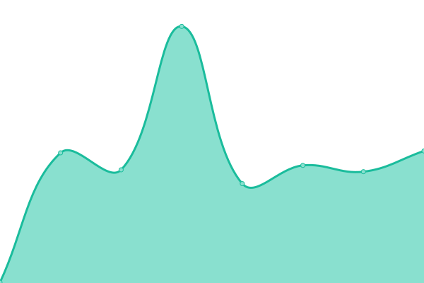 229ms
     
 | 

<a href="https://DELWP-DTV.github.io/santa/history/vic-data-water-storage3">100.00%</a>
    

|  [vic-data_geological-units-represented-as-two-dimensional-polygons-1-2500001](https://opendata.maps.vic.gov.au/geoserver/wms?service=wms&request=getmap&format=image%2Fpng8&transparent=true&layers=open-data-platform:sg_geological_unit_250k&width=512&height=512&crs=epsg%3A3857&bbox=16114148.554967716%2C-4456584.4971389165%2C16119040.524777967%2C-4451692.527328665) | 🟩 Up | [vic-data-geological-units-represented-as-two-dimensional-polygons-1-2500001.yml](https://github.com/DELWP-DTV/santa/commits/HEAD/history/vic-data-geological-units-represented-as-two-dimensional-polygons-1-2500001.yml) | 

 241ms
     
 | 

<a href="https://DELWP-DTV.github.io/santa/history/vic-data-geological-units-represented-as-two-dimensional-polygons-1-2500001">100.00%</a>
    

|  [vic-data_water-supply-protection-areas-groundwater-surface-water-within-victoria2](https://opendata.maps.vic.gov.au/geoserver/wms?service=wms&request=getmap&format=image%2Fpng8&transparent=true&layers=open-data-platform:wspa&width=512&height=512&crs=epsg%3A3857&bbox=16114148.554967716%2C-4456584.4971389165%2C16119040.524777967%2C-4451692.527328665) | 🟩 Up | [vic-data-water-supply-protection-areas-groundwater-surface-water-within-victoria2.yml](https://github.com/DELWP-DTV/santa/commits/HEAD/history/vic-data-water-supply-protection-areas-groundwater-surface-water-within-victoria2.yml) | 

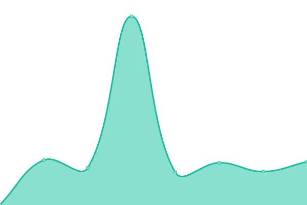 215ms
     
 | 

<a href="https://DELWP-DTV.github.io/santa/history/vic-data-water-supply-protection-areas-groundwater-surface-water-within-victoria2">100.00%</a>
    

|  [vic-data_ptv-metro-tram-routes1](https://opendata.maps.vic.gov.au/geoserver/wms?service=wms&request=getmap&format=image%2Fpng8&transparent=true&layers=open-data-platform:ptv_metro_tram_route&width=512&height=512&crs=epsg%3A3857&bbox=16114148.554967716%2C-4456584.4971389165%2C16119040.524777967%2C-4451692.527328665) | 🟩 Up | [vic-data-ptv-metro-tram-routes1.yml](https://github.com/DELWP-DTV/santa/commits/HEAD/history/vic-data-ptv-metro-tram-routes1.yml) | 

 220ms
     
 | 

<a href="https://DELWP-DTV.github.io/santa/history/vic-data-ptv-metro-tram-routes1">100.00%</a>
    

|  [vic-data_irrigation-district1](https://opendata.maps.vic.gov.au/geoserver/wms?service=wms&request=getmap&format=image%2Fpng8&transparent=true&layers=open-data-platform:irrigation_district&width=512&height=512&crs=epsg%3A3857&bbox=16114148.554967716%2C-4456584.4971389165%2C16119040.524777967%2C-4451692.527328665) | 🟩 Up | [vic-data-irrigation-district1.yml](https://github.com/DELWP-DTV/santa/commits/HEAD/history/vic-data-irrigation-district1.yml) | 

 223ms
     
 | 

<a href="https://DELWP-DTV.github.io/santa/history/vic-data-irrigation-district1">100.00%</a>
    

|  [vic-data_native-vegetation-flora-and-fauna-guarantee-act-listed-communities](https://opendata.maps.vic.gov.au/geoserver/wms?service=wms&request=getmap&format=image%2Fpng8&transparent=true&layers=open-data-platform:nv2005_ffg_comm&width=512&height=512&crs=epsg%3A3857&bbox=16114148.554967716%2C-4456584.4971389165%2C16119040.524777967%2C-4451692.527328665) | 🟩 Up | [vic-data-native-vegetation-flora-and-fauna-guarantee-act-listed-communities.yml](https://github.com/DELWP-DTV/santa/commits/HEAD/history/vic-data-native-vegetation-flora-and-fauna-guarantee-act-listed-communities.yml) | 

 225ms
     
 | 

<a href="https://DELWP-DTV.github.io/santa/history/vic-data-native-vegetation-flora-and-fauna-guarantee-act-listed-communities">100.00%</a>
    

|  [vic-data_planned-burns-2022-23-2024-25-now-called-joint-fuel-management-program-jfmp-includes-burns-and-](https://opendata.maps.vic.gov.au/geoserver/wms?service=wms&request=getmap&format=image%2Fpng8&transparent=true&layers=open-data-platform:burnplan23&width=512&height=512&crs=epsg%3A3857&bbox=16114148.554967716%2C-4456584.4971389165%2C16119040.524777967%2C-4451692.527328665) | 🟩 Up | [vic-data-planned-burns-2022-23-2024-25-now-called-joint-fuel-management-program-jfmp-includes-burns-and.yml](https://github.com/DELWP-DTV/santa/commits/HEAD/history/vic-data-planned-burns-2022-23-2024-25-now-called-joint-fuel-management-program-jfmp-includes-burns-and.yml) | 

 260ms
     
 | 

<a href="https://DELWP-DTV.github.io/santa/history/vic-data-planned-burns-2022-23-2024-25-now-called-joint-fuel-management-program-jfmp-includes-burns-and">100.00%</a>
    

|  [vic-data_fire-history-showing-the-number-of-times-areas-have-been-burnt-based-on-mapped-fire-history-sca2](https://opendata.maps.vic.gov.au/geoserver/wms?service=wms&request=getmap&format=image%2Fpng8&transparent=true&layers=open-data-platform:fire_history_frequency&width=512&height=512&crs=epsg%3A3857&bbox=16114148.554967716%2C-4456584.4971389165%2C16119040.524777967%2C-4451692.527328665) | 🟩 Up | [vic-data-fire-history-showing-the-number-of-times-areas-have-been-burnt-based-on-mapped-fire-history-sca2.yml](https://github.com/DELWP-DTV/santa/commits/HEAD/history/vic-data-fire-history-showing-the-number-of-times-areas-have-been-burnt-based-on-mapped-fire-history-sca2.yml) | 

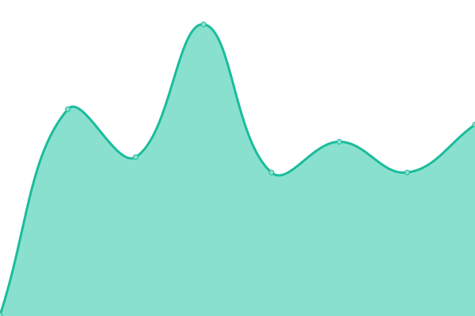 239ms
     
 | 

<a href="https://DELWP-DTV.github.io/santa/history/vic-data-fire-history-showing-the-number-of-times-areas-have-been-burnt-based-on-mapped-fire-history-sca2">100.00%</a>
    

|  [vic-data_vicmap-property-parcel-polygon-with-approved-parcel-detail2](https://opendata.maps.vic.gov.au/geoserver/wms?service=wms&request=getmap&format=image%2Fpng8&transparent=true&layers=open-data-platform:v_s_parcel_approved&width=512&height=512&crs=epsg%3A3857&bbox=16114148.554967716%2C-4456584.4971389165%2C16119040.524777967%2C-4451692.527328665) | 🟩 Up | [vic-data-vicmap-property-parcel-polygon-with-approved-parcel-detail2.yml](https://github.com/DELWP-DTV/santa/commits/HEAD/history/vic-data-vicmap-property-parcel-polygon-with-approved-parcel-detail2.yml) | 

 4543ms
     
 | 

<a href="https://DELWP-DTV.github.io/santa/history/vic-data-vicmap-property-parcel-polygon-with-approved-parcel-detail2">100.00%</a>
    

|  [vic-data_steer-clear-areas-in-port-phillip](https://opendata.maps.vic.gov.au/geoserver/wms?service=wms&request=getmap&format=image%2Fpng8&transparent=true&layers=open-data-platform:steer_clear_area&width=512&height=512&crs=epsg%3A3857&bbox=16114148.554967716%2C-4456584.4971389165%2C16119040.524777967%2C-4451692.527328665) | 🟩 Up | [vic-data-steer-clear-areas-in-port-phillip.yml](https://github.com/DELWP-DTV/santa/commits/HEAD/history/vic-data-steer-clear-areas-in-port-phillip.yml) | 

 219ms
     
 | 

<a href="https://DELWP-DTV.github.io/santa/history/vic-data-steer-clear-areas-in-port-phillip">100.00%</a>
    

|  [vic-data_wetland-landscape-profiles2](https://opendata.maps.vic.gov.au/geoserver/wms?service=wms&request=getmap&format=image%2Fpng8&transparent=true&layers=open-data-platform:wetland_landscape&width=512&height=512&crs=epsg%3A3857&bbox=16114148.554967716%2C-4456584.4971389165%2C16119040.524777967%2C-4451692.527328665) | 🟩 Up | [vic-data-wetland-landscape-profiles2.yml](https://github.com/DELWP-DTV/santa/commits/HEAD/history/vic-data-wetland-landscape-profiles2.yml) | 

 241ms
     
 | 

<a href="https://DELWP-DTV.github.io/santa/history/vic-data-wetland-landscape-profiles2">100.00%</a>
    

|  [vic-data_vicmap-admin-state-council-polygon-1991](https://opendata.maps.vic.gov.au/geoserver/wms?service=wms&request=getmap&format=image%2Fpng8&transparent=true&layers=open-data-platform:state_council_1991&width=512&height=512&crs=epsg%3A3857&bbox=16114148.554967716%2C-4456584.4971389165%2C16119040.524777967%2C-4451692.527328665) | 🟩 Up | [vic-data-vicmap-admin-state-council-polygon-1991.yml](https://github.com/DELWP-DTV/santa/commits/HEAD/history/vic-data-vicmap-admin-state-council-polygon-1991.yml) | 

 251ms
     
 | 

<a href="https://DELWP-DTV.github.io/santa/history/vic-data-vicmap-admin-state-council-polygon-1991">100.00%</a>
    

|  [vic-data_areas-closed-to-hunting-for-a-period-of-time](https://opendata.maps.vic.gov.au/geoserver/wms?service=wms&request=getmap&format=image%2Fpng8&transparent=true&layers=open-data-platform:hunt25_closed&width=512&height=512&crs=epsg%3A3857&bbox=16114148.554967716%2C-4456584.4971389165%2C16119040.524777967%2C-4451692.527328665) | 🟩 Up | [vic-data-areas-closed-to-hunting-for-a-period-of-time.yml](https://github.com/DELWP-DTV/santa/commits/HEAD/history/vic-data-areas-closed-to-hunting-for-a-period-of-time.yml) | 

 240ms
     
 | 

<a href="https://DELWP-DTV.github.io/santa/history/vic-data-areas-closed-to-hunting-for-a-period-of-time">100.00%</a>
    

|  [vic-data_vicmap-admin-state-council-polygon-2001](https://opendata.maps.vic.gov.au/geoserver/wms?service=wms&request=getmap&format=image%2Fpng8&transparent=true&layers=open-data-platform:state_council_2001&width=512&height=512&crs=epsg%3A3857&bbox=16114148.554967716%2C-4456584.4971389165%2C16119040.524777967%2C-4451692.527328665) | 🟩 Up | [vic-data-vicmap-admin-state-council-polygon-2001.yml](https://github.com/DELWP-DTV/santa/commits/HEAD/history/vic-data-vicmap-admin-state-council-polygon-2001.yml) | 

 239ms
     
 | 

<a href="https://DELWP-DTV.github.io/santa/history/vic-data-vicmap-admin-state-council-polygon-2001">100.00%</a>
    

|  [vic-data_vicmap-admin-ward-polygon-2008](https://opendata.maps.vic.gov.au/geoserver/wms?service=wms&request=getmap&format=image%2Fpng8&transparent=true&layers=open-data-platform:ward_2008&width=512&height=512&crs=epsg%3A3857&bbox=16114148.554967716%2C-4456584.4971389165%2C16119040.524777967%2C-4451692.527328665) | 🟩 Up | [vic-data-vicmap-admin-ward-polygon-2008.yml](https://github.com/DELWP-DTV/santa/commits/HEAD/history/vic-data-vicmap-admin-ward-polygon-2008.yml) | 

 314ms
     
 | 

<a href="https://DELWP-DTV.github.io/santa/history/vic-data-vicmap-admin-ward-polygon-2008">100.00%</a>
    

|  [vic-data_vicmap-admin-state-council-polygon-2005](https://opendata.maps.vic.gov.au/geoserver/wms?service=wms&request=getmap&format=image%2Fpng8&transparent=true&layers=open-data-platform:state_council_2005&width=512&height=512&crs=epsg%3A3857&bbox=16114148.554967716%2C-4456584.4971389165%2C16119040.524777967%2C-4451692.527328665) | 🟩 Up | [vic-data-vicmap-admin-state-council-polygon-2005.yml](https://github.com/DELWP-DTV/santa/commits/HEAD/history/vic-data-vicmap-admin-state-council-polygon-2005.yml) | 

 338ms
     
 | 

<a href="https://DELWP-DTV.github.io/santa/history/vic-data-vicmap-admin-state-council-polygon-2005">100.00%</a>
    

|  [vic-data_vicmap-admin-state-assembly-polygon-19911](https://opendata.maps.vic.gov.au/geoserver/wms?service=wms&request=getmap&format=image%2Fpng8&transparent=true&layers=open-data-platform:state_assembly_1991&width=512&height=512&crs=epsg%3A3857&bbox=16114148.554967716%2C-4456584.4971389165%2C16119040.524777967%2C-4451692.527328665) | 🟩 Up | [vic-data-vicmap-admin-state-assembly-polygon-19911.yml](https://github.com/DELWP-DTV/santa/commits/HEAD/history/vic-data-vicmap-admin-state-assembly-polygon-19911.yml) | 

 219ms
     
 | 

<a href="https://DELWP-DTV.github.io/santa/history/vic-data-vicmap-admin-state-assembly-polygon-19911">100.00%</a>
    

|  [vic-data_vicmap-index-vicmap-topographic-1-30000-mga-a3-map-index](https://opendata.maps.vic.gov.au/geoserver/wms?service=wms&request=getmap&format=image%2Fpng8&transparent=true&layers=open-data-platform:vicmap_mapindex_30da3&width=512&height=512&crs=epsg%3A3857&bbox=16114148.554967716%2C-4456584.4971389165%2C16119040.524777967%2C-4451692.527328665) | 🟩 Up | [vic-data-vicmap-index-vicmap-topographic-1-30000-mga-a3-map-index.yml](https://github.com/DELWP-DTV/santa/commits/HEAD/history/vic-data-vicmap-index-vicmap-topographic-1-30000-mga-a3-map-index.yml) | 

 231ms
     
 | 

<a href="https://DELWP-DTV.github.io/santa/history/vic-data-vicmap-index-vicmap-topographic-1-30000-mga-a3-map-index">100.00%</a>
    

|  [vic-data_vicmap-transport-airport-infrastucture-point](https://opendata.maps.vic.gov.au/geoserver/wms?service=wms&request=getmap&format=image%2Fpng8&transparent=true&layers=open-data-platform:tr_air_infra_point&width=512&height=512&crs=epsg%3A3857&bbox=16114148.554967716%2C-4456584.4971389165%2C16119040.524777967%2C-4451692.527328665) | 🟩 Up | [vic-data-vicmap-transport-airport-infrastucture-point.yml](https://github.com/DELWP-DTV/santa/commits/HEAD/history/vic-data-vicmap-transport-airport-infrastucture-point.yml) | 

 221ms
     
 | 

<a href="https://DELWP-DTV.github.io/santa/history/vic-data-vicmap-transport-airport-infrastucture-point">100.00%</a>
    

|  [vic-data_vicmap-lite-public-land-classification-polygon-1-1000000-to-1-5000000](https://opendata.maps.vic.gov.au/geoserver/wms?service=wms&request=getmap&format=image%2Fpng8&transparent=true&layers=open-data-platform:vmlite_public_land_su3&width=512&height=512&crs=epsg%3A3857&bbox=16114148.554967716%2C-4456584.4971389165%2C16119040.524777967%2C-4451692.527328665) | 🟩 Up | [vic-data-vicmap-lite-public-land-classification-polygon-1-1000000-to-1-5000000.yml](https://github.com/DELWP-DTV/santa/commits/HEAD/history/vic-data-vicmap-lite-public-land-classification-polygon-1-1000000-to-1-5000000.yml) | 

 213ms
     
 | 

<a href="https://DELWP-DTV.github.io/santa/history/vic-data-vicmap-lite-public-land-classification-polygon-1-1000000-to-1-5000000">100.00%</a>
    

|  [vic-data_vicmap-lite-state-polygon-1-2000000-to-1-50000001](https://opendata.maps.vic.gov.au/geoserver/wms?service=wms&request=getmap&format=image%2Fpng8&transparent=true&layers=open-data-platform:vmlite_victoria_polygon_su2&width=512&height=512&crs=epsg%3A3857&bbox=16114148.554967716%2C-4456584.4971389165%2C16119040.524777967%2C-4451692.527328665) | 🟩 Up | [vic-data-vicmap-lite-state-polygon-1-2000000-to-1-50000001.yml](https://github.com/DELWP-DTV/santa/commits/HEAD/history/vic-data-vicmap-lite-state-polygon-1-2000000-to-1-50000001.yml) | 

 250ms
     
 | 

<a href="https://DELWP-DTV.github.io/santa/history/vic-data-vicmap-lite-state-polygon-1-2000000-to-1-50000001">100.00%</a>
    

|  [vic-data_vicmap-index-vicmap-topographic-1-50000-mga-single-format-map-index1](https://opendata.maps.vic.gov.au/geoserver/wms?service=wms&request=getmap&format=image%2Fpng8&transparent=true&layers=open-data-platform:vicmap_mapindex_50s&width=512&height=512&crs=epsg%3A3857&bbox=16114148.554967716%2C-4456584.4971389165%2C16119040.524777967%2C-4451692.527328665) | 🟩 Up | [vic-data-vicmap-index-vicmap-topographic-1-50000-mga-single-format-map-index1.yml](https://github.com/DELWP-DTV/santa/commits/HEAD/history/vic-data-vicmap-index-vicmap-topographic-1-50000-mga-single-format-map-index1.yml) | 

 237ms
     
 | 

<a href="https://DELWP-DTV.github.io/santa/history/vic-data-vicmap-index-vicmap-topographic-1-50000-mga-single-format-map-index1">100.00%</a>
    

|  [vic-data_vicmap-admin-state-council-polygon-2022](https://opendata.maps.vic.gov.au/geoserver/wms?service=wms&request=getmap&format=image%2Fpng8&transparent=true&layers=open-data-platform:state_council_2022&width=512&height=512&crs=epsg%3A3857&bbox=16114148.554967716%2C-4456584.4971389165%2C16119040.524777967%2C-4451692.527328665) | 🟩 Up | [vic-data-vicmap-admin-state-council-polygon-2022.yml](https://github.com/DELWP-DTV/santa/commits/HEAD/history/vic-data-vicmap-admin-state-council-polygon-2022.yml) | 

 418ms
     
 | 

<a href="https://DELWP-DTV.github.io/santa/history/vic-data-vicmap-admin-state-council-polygon-2022">100.00%</a>
    

|  [vic-data_energy-facilities1](https://opendata.maps.vic.gov.au/geoserver/wms?service=wms&request=getmap&format=image%2Fpng8&transparent=true&layers=open-data-platform:energy_facilities&width=512&height=512&crs=epsg%3A3857&bbox=16114148.554967716%2C-4456584.4971389165%2C16119040.524777967%2C-4451692.527328665) | 🟩 Up | [vic-data-energy-facilities1.yml](https://github.com/DELWP-DTV/santa/commits/HEAD/history/vic-data-energy-facilities1.yml) | 

 235ms
     
 | 

<a href="https://DELWP-DTV.github.io/santa/history/vic-data-energy-facilities1">100.00%</a>
    

|  [vic-data_designated-water-supply-catchments](https://opendata.maps.vic.gov.au/geoserver/wms?service=wms&request=getmap&format=image%2Fpng8&transparent=true&layers=open-data-platform:pwsc100&width=512&height=512&crs=epsg%3A3857&bbox=16114148.554967716%2C-4456584.4971389165%2C16119040.524777967%2C-4451692.527328665) | 🟩 Up | [vic-data-designated-water-supply-catchments.yml](https://github.com/DELWP-DTV/santa/commits/HEAD/history/vic-data-designated-water-supply-catchments.yml) | 

 184ms
     
 | 

<a href="https://DELWP-DTV.github.io/santa/history/vic-data-designated-water-supply-catchments">100.00%</a>
    

|  [vic-data_water-corporations1](https://opendata.maps.vic.gov.au/geoserver/wms?service=wms&request=getmap&format=image%2Fpng8&transparent=true&layers=open-data-platform:water_corp&width=512&height=512&crs=epsg%3A3857&bbox=16114148.554967716%2C-4456584.4971389165%2C16119040.524777967%2C-4451692.527328665) | 🟩 Up | [vic-data-water-corporations1.yml](https://github.com/DELWP-DTV/santa/commits/HEAD/history/vic-data-water-corporations1.yml) | 

 280ms
     
 | 

<a href="https://DELWP-DTV.github.io/santa/history/vic-data-water-corporations1">100.00%</a>
    

|  [vic-data_2010-index-of-stream-condition-water-body-polygon-features1](https://opendata.maps.vic.gov.au/geoserver/wms?service=wms&request=getmap&format=image%2Fpng8&transparent=true&layers=open-data-platform:isc2010_water_bodies&width=512&height=512&crs=epsg%3A3857&bbox=16114148.554967716%2C-4456584.4971389165%2C16119040.524777967%2C-4451692.527328665) | 🟩 Up | [vic-data-2010-index-of-stream-condition-water-body-polygon-features1.yml](https://github.com/DELWP-DTV/santa/commits/HEAD/history/vic-data-2010-index-of-stream-condition-water-body-polygon-features1.yml) | 

 219ms
     
 | 

<a href="https://DELWP-DTV.github.io/santa/history/vic-data-2010-index-of-stream-condition-water-body-polygon-features1">100.00%</a>
    

|  [vic-data_vicmap-admin-state-assembly-polygon-2001](https://opendata.maps.vic.gov.au/geoserver/wms?service=wms&request=getmap&format=image%2Fpng8&transparent=true&layers=open-data-platform:state_assembly_2001&width=512&height=512&crs=epsg%3A3857&bbox=16114148.554967716%2C-4456584.4971389165%2C16119040.524777967%2C-4451692.527328665) | 🟩 Up | [vic-data-vicmap-admin-state-assembly-polygon-2001.yml](https://github.com/DELWP-DTV/santa/commits/HEAD/history/vic-data-vicmap-admin-state-assembly-polygon-2001.yml) | 

 260ms
     
 | 

<a href="https://DELWP-DTV.github.io/santa/history/vic-data-vicmap-admin-state-assembly-polygon-2001">100.00%</a>
    

|  [vic-data_vicmap-admin-country-fire-authority-cfa-region-polygon](https://opendata.maps.vic.gov.au/geoserver/wms?service=wms&request=getmap&format=image%2Fpng8&transparent=true&layers=open-data-platform:cfa_region&width=512&height=512&crs=epsg%3A3857&bbox=16114148.554967716%2C-4456584.4971389165%2C16119040.524777967%2C-4451692.527328665) | 🟩 Up | [vic-data-vicmap-admin-country-fire-authority-cfa-region-polygon.yml](https://github.com/DELWP-DTV/santa/commits/HEAD/history/vic-data-vicmap-admin-country-fire-authority-cfa-region-polygon.yml) | 

 339ms
     
 | 

<a href="https://DELWP-DTV.github.io/santa/history/vic-data-vicmap-admin-country-fire-authority-cfa-region-polygon">100.00%</a>
    

|  [vic-data_vicmap-features-locality-point](https://opendata.maps.vic.gov.au/geoserver/wms?service=wms&request=getmap&format=image%2Fpng8&transparent=true&layers=open-data-platform:locality_point&width=512&height=512&crs=epsg%3A3857&bbox=16114148.554967716%2C-4456584.4971389165%2C16119040.524777967%2C-4451692.527328665) | 🟩 Up | [vic-data-vicmap-features-locality-point.yml](https://github.com/DELWP-DTV/santa/commits/HEAD/history/vic-data-vicmap-features-locality-point.yml) | 

 227ms
     
 | 

<a href="https://DELWP-DTV.github.io/santa/history/vic-data-vicmap-features-locality-point">100.00%</a>
    

|  [vic-data_expired-gold-mining-leases-1860s-to-19581](https://opendata.maps.vic.gov.au/geoserver/wms?service=wms&request=getmap&format=image%2Fpng8&transparent=true&layers=open-data-platform:gmlhst&width=512&height=512&crs=epsg%3A3857&bbox=16114148.554967716%2C-4456584.4971389165%2C16119040.524777967%2C-4451692.527328665) | 🟩 Up | [vic-data-expired-gold-mining-leases-1860s-to-19581.yml](https://github.com/DELWP-DTV/santa/commits/HEAD/history/vic-data-expired-gold-mining-leases-1860s-to-19581.yml) | 

 217ms
     
 | 

<a href="https://DELWP-DTV.github.io/santa/history/vic-data-expired-gold-mining-leases-1860s-to-19581">100.00%</a>
    

|  [vic-data_ptv-metro-tram-stops](https://opendata.maps.vic.gov.au/geoserver/wms?service=wms&request=getmap&format=image%2Fpng8&transparent=true&layers=open-data-platform:ptv_metro_tram_stop&width=512&height=512&crs=epsg%3A3857&bbox=16114148.554967716%2C-4456584.4971389165%2C16119040.524777967%2C-4451692.527328665) | 🟩 Up | [vic-data-ptv-metro-tram-stops.yml](https://github.com/DELWP-DTV/santa/commits/HEAD/history/vic-data-ptv-metro-tram-stops.yml) | 

 228ms
     
 | 

<a href="https://DELWP-DTV.github.io/santa/history/vic-data-ptv-metro-tram-stops">100.00%</a>
    

|  [vic-data_vicmap-elevation-ground-type-polygon1](https://opendata.maps.vic.gov.au/geoserver/wms?service=wms&request=getmap&format=image%2Fpng8&transparent=true&layers=open-data-platform:el_grnd_type_area_polygon&width=512&height=512&crs=epsg%3A3857&bbox=16114148.554967716%2C-4456584.4971389165%2C16119040.524777967%2C-4451692.527328665) | 🟩 Up | [vic-data-vicmap-elevation-ground-type-polygon1.yml](https://github.com/DELWP-DTV/santa/commits/HEAD/history/vic-data-vicmap-elevation-ground-type-polygon1.yml) | 

 226ms
     
 | 

<a href="https://DELWP-DTV.github.io/santa/history/vic-data-vicmap-elevation-ground-type-polygon1">100.00%</a>
    

|  [vic-data_index-of-stream-condition1](https://opendata.maps.vic.gov.au/geoserver/wms?service=wms&request=getmap&format=image%2Fpng8&transparent=true&layers=open-data-platform:isc_reach&width=512&height=512&crs=epsg%3A3857&bbox=16114148.554967716%2C-4456584.4971389165%2C16119040.524777967%2C-4451692.527328665) | 🟩 Up | [vic-data-index-of-stream-condition1.yml](https://github.com/DELWP-DTV/santa/commits/HEAD/history/vic-data-index-of-stream-condition1.yml) | 

 246ms
     
 | 

<a href="https://DELWP-DTV.github.io/santa/history/vic-data-index-of-stream-condition1">100.00%</a>
    

|  [vic-data_oil-and-gas-fields1](https://opendata.maps.vic.gov.au/geoserver/wms?service=wms&request=getmap&format=image%2Fpng8&transparent=true&layers=open-data-platform:oilgas&width=512&height=512&crs=epsg%3A3857&bbox=16114148.554967716%2C-4456584.4971389165%2C16119040.524777967%2C-4451692.527328665) | 🟩 Up | [vic-data-oil-and-gas-fields1.yml](https://github.com/DELWP-DTV/santa/commits/HEAD/history/vic-data-oil-and-gas-fields1.yml) | 

 205ms
     
 | 

<a href="https://DELWP-DTV.github.io/santa/history/vic-data-oil-and-gas-fields1">100.00%</a>
    

|  [vic-data_vicmap-admin-country-fire-authority-cfa-total-fire-ban-district-polygon1](https://opendata.maps.vic.gov.au/geoserver/wms?service=wms&request=getmap&format=image%2Fpng8&transparent=true&layers=open-data-platform:cfa_tfb_district&width=512&height=512&crs=epsg%3A3857&bbox=16114148.554967716%2C-4456584.4971389165%2C16119040.524777967%2C-4451692.527328665) | 🟩 Up | [vic-data-vicmap-admin-country-fire-authority-cfa-total-fire-ban-district-polygon1.yml](https://github.com/DELWP-DTV/santa/commits/HEAD/history/vic-data-vicmap-admin-country-fire-authority-cfa-total-fire-ban-district-polygon1.yml) | 

 280ms
     
 | 

<a href="https://DELWP-DTV.github.io/santa/history/vic-data-vicmap-admin-country-fire-authority-cfa-total-fire-ban-district-polygon1">100.00%</a>
    

|  [vic-data_vicmap-admin-country-fire-authority-cfa-district-polygon1](https://opendata.maps.vic.gov.au/geoserver/wms?service=wms&request=getmap&format=image%2Fpng8&transparent=true&layers=open-data-platform:cfa_district&width=512&height=512&crs=epsg%3A3857&bbox=16114148.554967716%2C-4456584.4971389165%2C16119040.524777967%2C-4451692.527328665) | 🟩 Up | [vic-data-vicmap-admin-country-fire-authority-cfa-district-polygon1.yml](https://github.com/DELWP-DTV/santa/commits/HEAD/history/vic-data-vicmap-admin-country-fire-authority-cfa-district-polygon1.yml) | 

 251ms
     
 | 

<a href="https://DELWP-DTV.github.io/santa/history/vic-data-vicmap-admin-country-fire-authority-cfa-district-polygon1">100.00%</a>
    

|  [vic-data_geological-boundaries-represented-as-two-dimensional-lines-1-2500002](https://opendata.maps.vic.gov.au/geoserver/wms?service=wms&request=getmap&format=image%2Fpng8&transparent=true&layers=open-data-platform:sg_geol_unit_contact_250k&width=512&height=512&crs=epsg%3A3857&bbox=16114148.554967716%2C-4456584.4971389165%2C16119040.524777967%2C-4451692.527328665) | 🟩 Up | [vic-data-geological-boundaries-represented-as-two-dimensional-lines-1-2500002.yml](https://github.com/DELWP-DTV/santa/commits/HEAD/history/vic-data-geological-boundaries-represented-as-two-dimensional-lines-1-2500002.yml) | 

 213ms
     
 | 

<a href="https://DELWP-DTV.github.io/santa/history/vic-data-geological-boundaries-represented-as-two-dimensional-lines-1-2500002">100.00%</a>
    

|  [vic-data_vicmap-lite-geographic-feature-polygon-for-labelling-1-250000-to-1-50000001](https://opendata.maps.vic.gov.au/geoserver/wms?service=wms&request=getmap&format=image%2Fpng8&transparent=true&layers=open-data-platform:vmlite_geo_area_label&width=512&height=512&crs=epsg%3A3857&bbox=16114148.554967716%2C-4456584.4971389165%2C16119040.524777967%2C-4451692.527328665) | 🟩 Up | [vic-data-vicmap-lite-geographic-feature-polygon-for-labelling-1-250000-to-1-50000001.yml](https://github.com/DELWP-DTV/santa/commits/HEAD/history/vic-data-vicmap-lite-geographic-feature-polygon-for-labelling-1-250000-to-1-50000001.yml) | 

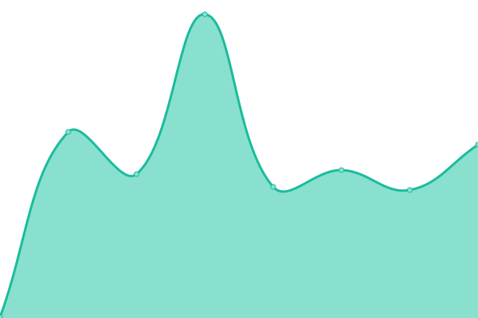 230ms
     
 | 

<a href="https://DELWP-DTV.github.io/santa/history/vic-data-vicmap-lite-geographic-feature-polygon-for-labelling-1-250000-to-1-50000001">100.00%</a>
    

|  [vic-data_seismic-survey-points-for-petroleum-industry-exploration2](https://opendata.maps.vic.gov.au/geoserver/wms?service=wms&request=getmap&format=image%2Fpng8&transparent=true&layers=open-data-platform:seismic_point&width=512&height=512&crs=epsg%3A3857&bbox=16114148.554967716%2C-4456584.4971389165%2C16119040.524777967%2C-4451692.527328665) | 🟩 Up | [vic-data-seismic-survey-points-for-petroleum-industry-exploration2.yml](https://github.com/DELWP-DTV/santa/commits/HEAD/history/vic-data-seismic-survey-points-for-petroleum-industry-exploration2.yml) | 

 227ms
     
 | 

<a href="https://DELWP-DTV.github.io/santa/history/vic-data-seismic-survey-points-for-petroleum-industry-exploration2">100.00%</a>
    

|  [vic-data_potential-groundwater-dependent-ecosystem-gde-mapping-for-the-wimmera-cma1](https://opendata.maps.vic.gov.au/geoserver/wms?service=wms&request=getmap&format=image%2Fpng8&transparent=true&layers=open-data-platform:gde_terr_wcma&width=512&height=512&crs=epsg%3A3857&bbox=16114148.554967716%2C-4456584.4971389165%2C16119040.524777967%2C-4451692.527328665) | 🟩 Up | [vic-data-potential-groundwater-dependent-ecosystem-gde-mapping-for-the-wimmera-cma1.yml](https://github.com/DELWP-DTV/santa/commits/HEAD/history/vic-data-potential-groundwater-dependent-ecosystem-gde-mapping-for-the-wimmera-cma1.yml) | 

 212ms
     
 | 

<a href="https://DELWP-DTV.github.io/santa/history/vic-data-potential-groundwater-dependent-ecosystem-gde-mapping-for-the-wimmera-cma1">100.00%</a>
    

|  [vic-data_potential-groundwater-dependent-ecosystem-gde-mapping-for-the-glenelg-hopkins-cma1](https://opendata.maps.vic.gov.au/geoserver/wms?service=wms&request=getmap&format=image%2Fpng8&transparent=true&layers=open-data-platform:gde_terr_ghcma&width=512&height=512&crs=epsg%3A3857&bbox=16114148.554967716%2C-4456584.4971389165%2C16119040.524777967%2C-4451692.527328665) | 🟩 Up | [vic-data-potential-groundwater-dependent-ecosystem-gde-mapping-for-the-glenelg-hopkins-cma1.yml](https://github.com/DELWP-DTV/santa/commits/HEAD/history/vic-data-potential-groundwater-dependent-ecosystem-gde-mapping-for-the-glenelg-hopkins-cma1.yml) | 

 222ms
     
 | 

<a href="https://DELWP-DTV.github.io/santa/history/vic-data-potential-groundwater-dependent-ecosystem-gde-mapping-for-the-glenelg-hopkins-cma1">100.00%</a>
    

|  [vic-data_seismic-survey-lines-for-petroleum-industry-exploration2](https://opendata.maps.vic.gov.au/geoserver/wms?service=wms&request=getmap&format=image%2Fpng8&transparent=true&layers=open-data-platform:seismic_arc&width=512&height=512&crs=epsg%3A3857&bbox=16114148.554967716%2C-4456584.4971389165%2C16119040.524777967%2C-4451692.527328665) | 🟩 Up | [vic-data-seismic-survey-lines-for-petroleum-industry-exploration2.yml](https://github.com/DELWP-DTV/santa/commits/HEAD/history/vic-data-seismic-survey-lines-for-petroleum-industry-exploration2.yml) | 

 229ms
     
 | 

<a href="https://DELWP-DTV.github.io/santa/history/vic-data-seismic-survey-lines-for-petroleum-industry-exploration2">100.00%</a>
    

|  [vic-data_potential-groundwater-dependent-ecosystem-gde-mapping-for-the-west-gippsland-cma1](https://opendata.maps.vic.gov.au/geoserver/wms?service=wms&request=getmap&format=image%2Fpng8&transparent=true&layers=open-data-platform:gde_terr_wgcma&width=512&height=512&crs=epsg%3A3857&bbox=16114148.554967716%2C-4456584.4971389165%2C16119040.524777967%2C-4451692.527328665) | 🟩 Up | [vic-data-potential-groundwater-dependent-ecosystem-gde-mapping-for-the-west-gippsland-cma1.yml](https://github.com/DELWP-DTV/santa/commits/HEAD/history/vic-data-potential-groundwater-dependent-ecosystem-gde-mapping-for-the-west-gippsland-cma1.yml) | 

 208ms
     
 | 

<a href="https://DELWP-DTV.github.io/santa/history/vic-data-potential-groundwater-dependent-ecosystem-gde-mapping-for-the-west-gippsland-cma1">100.00%</a>
    

|  [vic-data_recreation-historic-relics1](https://opendata.maps.vic.gov.au/geoserver/wms?service=wms&request=getmap&format=image%2Fpng8&transparent=true&layers=open-data-platform:recweb_historic_relic&width=512&height=512&crs=epsg%3A3857&bbox=16114148.554967716%2C-4456584.4971389165%2C16119040.524777967%2C-4451692.527328665) | 🟩 Up | [vic-data-recreation-historic-relics1.yml](https://github.com/DELWP-DTV/santa/commits/HEAD/history/vic-data-recreation-historic-relics1.yml) | 

 216ms
     
 | 

<a href="https://DELWP-DTV.github.io/santa/history/vic-data-recreation-historic-relics1">100.00%</a>
    

|  [vic-data_chloride-sampled-gms-bore-locations1](https://opendata.maps.vic.gov.au/geoserver/wms?service=wms&request=getmap&format=image%2Fpng8&transparent=true&layers=open-data-platform:gw_bores_cl&width=512&height=512&crs=epsg%3A3857&bbox=16114148.554967716%2C-4456584.4971389165%2C16119040.524777967%2C-4451692.527328665) | 🟩 Up | [vic-data-chloride-sampled-gms-bore-locations1.yml](https://github.com/DELWP-DTV/santa/commits/HEAD/history/vic-data-chloride-sampled-gms-bore-locations1.yml) | 

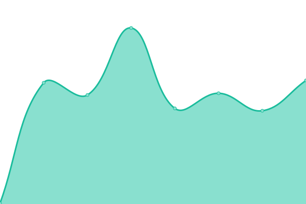 229ms
     
 | 

<a href="https://DELWP-DTV.github.io/santa/history/vic-data-chloride-sampled-gms-bore-locations1">100.00%</a>
    

|  [vic-data_geological-lines-1-10000002](https://opendata.maps.vic.gov.au/geoserver/wms?service=wms&request=getmap&format=image%2Fpng8&transparent=true&layers=open-data-platform:geol1m_arc&width=512&height=512&crs=epsg%3A3857&bbox=16114148.554967716%2C-4456584.4971389165%2C16119040.524777967%2C-4451692.527328665) | 🟩 Up | [vic-data-geological-lines-1-10000002.yml](https://github.com/DELWP-DTV/santa/commits/HEAD/history/vic-data-geological-lines-1-10000002.yml) | 

 215ms
     
 | 

<a href="https://DELWP-DTV.github.io/santa/history/vic-data-geological-lines-1-10000002">100.00%</a>
    

|  [vic-data_mining-inspectorates-for-minerals-regulation-branch-within-minerals-and-petroleum-victoria1](https://opendata.maps.vic.gov.au/geoserver/wms?service=wms&request=getmap&format=image%2Fpng8&transparent=true&layers=open-data-platform:inspect&width=512&height=512&crs=epsg%3A3857&bbox=16114148.554967716%2C-4456584.4971389165%2C16119040.524777967%2C-4451692.527328665) | 🟩 Up | [vic-data-mining-inspectorates-for-minerals-regulation-branch-within-minerals-and-petroleum-victoria1.yml](https://github.com/DELWP-DTV/santa/commits/HEAD/history/vic-data-mining-inspectorates-for-minerals-regulation-branch-within-minerals-and-petroleum-victoria1.yml) | 

 439ms
     
 | 

<a href="https://DELWP-DTV.github.io/santa/history/vic-data-mining-inspectorates-for-minerals-regulation-branch-within-minerals-and-petroleum-victoria1">100.00%</a>
    

|  [vic-data_estuaries](https://opendata.maps.vic.gov.au/geoserver/wms?service=wms&request=getmap&format=image%2Fpng8&transparent=true&layers=open-data-platform:estuaries&width=512&height=512&crs=epsg%3A3857&bbox=16114148.554967716%2C-4456584.4971389165%2C16119040.524777967%2C-4451692.527328665) | 🟩 Up | [vic-data-estuaries.yml](https://github.com/DELWP-DTV/santa/commits/HEAD/history/vic-data-estuaries.yml) | 

 227ms
     
 | 

<a href="https://DELWP-DTV.github.io/santa/history/vic-data-estuaries">100.00%</a>
    

|  [vic-data_vicmap-property-property-polygon-with-proposed-primary-detail1](https://opendata.maps.vic.gov.au/geoserver/wms?service=wms&request=getmap&format=image%2Fpng8&transparent=true&layers=open-data-platform:v_s_property_primary_proposed&width=512&height=512&crs=epsg%3A3857&bbox=16114148.554967716%2C-4456584.4971389165%2C16119040.524777967%2C-4451692.527328665) | 🟩 Up | [vic-data-vicmap-property-property-polygon-with-proposed-primary-detail1.yml](https://github.com/DELWP-DTV/santa/commits/HEAD/history/vic-data-vicmap-property-property-polygon-with-proposed-primary-detail1.yml) | 

 250ms
     
 | 

<a href="https://DELWP-DTV.github.io/santa/history/vic-data-vicmap-property-property-polygon-with-proposed-primary-detail1">100.00%</a>
    

|  [vic-data_murray-basin-depth-to-basement-1-10000001](https://opendata.maps.vic.gov.au/geoserver/wms?service=wms&request=getmap&format=image%2Fpng8&transparent=true&layers=open-data-platform:depth_to_basement_murray_basin&width=512&height=512&crs=epsg%3A3857&bbox=16114148.554967716%2C-4456584.4971389165%2C16119040.524777967%2C-4451692.527328665) | 🟩 Up | [vic-data-murray-basin-depth-to-basement-1-10000001.yml](https://github.com/DELWP-DTV/santa/commits/HEAD/history/vic-data-murray-basin-depth-to-basement-1-10000001.yml) | 

 249ms
     
 | 

<a href="https://DELWP-DTV.github.io/santa/history/vic-data-murray-basin-depth-to-basement-1-10000001">100.00%</a>
    

|  [vic-data_geological-polygons-1-10000002](https://opendata.maps.vic.gov.au/geoserver/wms?service=wms&request=getmap&format=image%2Fpng8&transparent=true&layers=open-data-platform:geol1m_polygon&width=512&height=512&crs=epsg%3A3857&bbox=16114148.554967716%2C-4456584.4971389165%2C16119040.524777967%2C-4451692.527328665) | 🟩 Up | [vic-data-geological-polygons-1-10000002.yml](https://github.com/DELWP-DTV/santa/commits/HEAD/history/vic-data-geological-polygons-1-10000002.yml) | 

 278ms
     
 | 

<a href="https://DELWP-DTV.github.io/santa/history/vic-data-geological-polygons-1-10000002">100.00%</a>
    

|  [vic-data_victorian-wetlands-listed-in-a-directory-of-important-wetlands-in-australia2](https://opendata.maps.vic.gov.au/geoserver/wms?service=wms&request=getmap&format=image%2Fpng8&transparent=true&layers=open-data-platform:wetlanddir&width=512&height=512&crs=epsg%3A3857&bbox=16114148.554967716%2C-4456584.4971389165%2C16119040.524777967%2C-4451692.527328665) | 🟩 Up | [vic-data-victorian-wetlands-listed-in-a-directory-of-important-wetlands-in-australia2.yml](https://github.com/DELWP-DTV/santa/commits/HEAD/history/vic-data-victorian-wetlands-listed-in-a-directory-of-important-wetlands-in-australia2.yml) | 

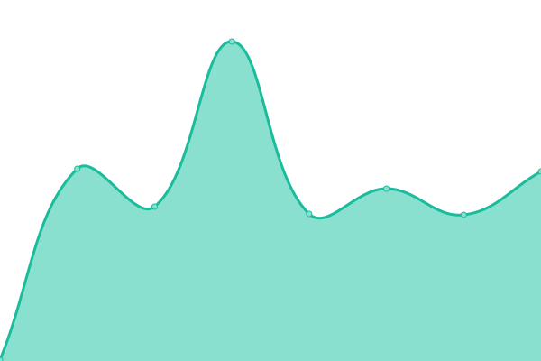 214ms
     
 | 

<a href="https://DELWP-DTV.github.io/santa/history/vic-data-victorian-wetlands-listed-in-a-directory-of-important-wetlands-in-australia2">100.00%</a>
    

|  [vic-data_geophysical-miscellaneous-lines-1-100000-geophysical-interpretation-of-other-linear-geological-](https://opendata.maps.vic.gov.au/geoserver/wms?service=wms&request=getmap&format=image%2Fpng8&transparent=true&layers=open-data-platform:gpmiscl100&width=512&height=512&crs=epsg%3A3857&bbox=16114148.554967716%2C-4456584.4971389165%2C16119040.524777967%2C-4451692.527328665) | 🟩 Up | [vic-data-geophysical-miscellaneous-lines-1-100000-geophysical-interpretation-of-other-linear-geological.yml](https://github.com/DELWP-DTV/santa/commits/HEAD/history/vic-data-geophysical-miscellaneous-lines-1-100000-geophysical-interpretation-of-other-linear-geological.yml) | 

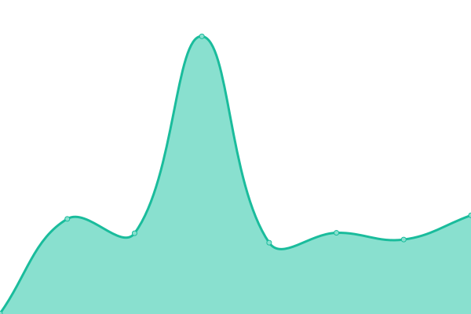 244ms
     
 | 

<a href="https://DELWP-DTV.github.io/santa/history/vic-data-geophysical-miscellaneous-lines-1-100000-geophysical-interpretation-of-other-linear-geological">100.00%</a>
    

|  [vic-data_vicmap-admin-fire-rescue-victoria-frv-response-area-polygon1](https://opendata.maps.vic.gov.au/geoserver/wms?service=wms&request=getmap&format=image%2Fpng8&transparent=true&layers=open-data-platform:frv_response_area&width=512&height=512&crs=epsg%3A3857&bbox=16114148.554967716%2C-4456584.4971389165%2C16119040.524777967%2C-4451692.527328665) | 🟩 Up | [vic-data-vicmap-admin-fire-rescue-victoria-frv-response-area-polygon1.yml](https://github.com/DELWP-DTV/santa/commits/HEAD/history/vic-data-vicmap-admin-fire-rescue-victoria-frv-response-area-polygon1.yml) | 

 270ms
     
 | 

<a href="https://DELWP-DTV.github.io/santa/history/vic-data-vicmap-admin-fire-rescue-victoria-frv-response-area-polygon1">100.00%</a>
    

|  [vic-data_spring-locations1](https://opendata.maps.vic.gov.au/geoserver/wms?service=wms&request=getmap&format=image%2Fpng8&transparent=true&layers=open-data-platform:spring_locations&width=512&height=512&crs=epsg%3A3857&bbox=16114148.554967716%2C-4456584.4971389165%2C16119040.524777967%2C-4451692.527328665) | 🟩 Up | [vic-data-spring-locations1.yml](https://github.com/DELWP-DTV/santa/commits/HEAD/history/vic-data-spring-locations1.yml) | 

 207ms
     
 | 

<a href="https://DELWP-DTV.github.io/santa/history/vic-data-spring-locations1">100.00%</a>
    

|  [vic-data_dams-of-victoria2](https://opendata.maps.vic.gov.au/geoserver/wms?service=wms&request=getmap&format=image%2Fpng8&transparent=true&layers=open-data-platform:dam&width=512&height=512&crs=epsg%3A3857&bbox=16114148.554967716%2C-4456584.4971389165%2C16119040.524777967%2C-4451692.527328665) | 🟩 Up | [vic-data-dams-of-victoria2.yml](https://github.com/DELWP-DTV/santa/commits/HEAD/history/vic-data-dams-of-victoria2.yml) | 

 226ms
     
 | 

<a href="https://DELWP-DTV.github.io/santa/history/vic-data-dams-of-victoria2">100.00%</a>
    

|  [vic-data_geological-deep-leads-1-2500002](https://opendata.maps.vic.gov.au/geoserver/wms?service=wms&request=getmap&format=image%2Fpng8&transparent=true&layers=open-data-platform:deepld250_polygon&width=512&height=512&crs=epsg%3A3857&bbox=16114148.554967716%2C-4456584.4971389165%2C16119040.524777967%2C-4451692.527328665) | 🟩 Up | [vic-data-geological-deep-leads-1-2500002.yml](https://github.com/DELWP-DTV/santa/commits/HEAD/history/vic-data-geological-deep-leads-1-2500002.yml) | 

 224ms
     
 | 

<a href="https://DELWP-DTV.github.io/santa/history/vic-data-geological-deep-leads-1-2500002">100.00%</a>
    

|  [vic-data_regolith-regional-type-polygons-1-1000001](https://opendata.maps.vic.gov.au/geoserver/wms?service=wms&request=getmap&format=image%2Fpng8&transparent=true&layers=open-data-platform:rrrego100_polygon&width=512&height=512&crs=epsg%3A3857&bbox=16114148.554967716%2C-4456584.4971389165%2C16119040.524777967%2C-4451692.527328665) | 🟩 Up | [vic-data-regolith-regional-type-polygons-1-1000001.yml](https://github.com/DELWP-DTV/santa/commits/HEAD/history/vic-data-regolith-regional-type-polygons-1-1000001.yml) | 

 205ms
     
 | 

<a href="https://DELWP-DTV.github.io/santa/history/vic-data-regolith-regional-type-polygons-1-1000001">100.00%</a>
    

|  [vic-data_geological-deep-leads-polygons-1-1000001](https://opendata.maps.vic.gov.au/geoserver/wms?service=wms&request=getmap&format=image%2Fpng8&transparent=true&layers=open-data-platform:deepld100_polygon&width=512&height=512&crs=epsg%3A3857&bbox=16114148.554967716%2C-4456584.4971389165%2C16119040.524777967%2C-4451692.527328665) | 🟩 Up | [vic-data-geological-deep-leads-polygons-1-1000001.yml](https://github.com/DELWP-DTV/santa/commits/HEAD/history/vic-data-geological-deep-leads-polygons-1-1000001.yml) | 

 207ms
     
 | 

<a href="https://DELWP-DTV.github.io/santa/history/vic-data-geological-deep-leads-polygons-1-1000001">100.00%</a>
    

|  [vic-data_geological-facies-1-1000002](https://opendata.maps.vic.gov.au/geoserver/wms?service=wms&request=getmap&format=image%2Fpng8&transparent=true&layers=open-data-platform:facies100_polygon&width=512&height=512&crs=epsg%3A3857&bbox=16114148.554967716%2C-4456584.4971389165%2C16119040.524777967%2C-4451692.527328665) | 🟩 Up | [vic-data-geological-facies-1-1000002.yml](https://github.com/DELWP-DTV/santa/commits/HEAD/history/vic-data-geological-facies-1-1000002.yml) | 

 224ms
     
 | 

<a href="https://DELWP-DTV.github.io/santa/history/vic-data-geological-facies-1-1000002">100.00%</a>
    

|  [vic-data_regolith-regional-radiometric-signature-area-lines-1-1000001](https://opendata.maps.vic.gov.au/geoserver/wms?service=wms&request=getmap&format=image%2Fpng8&transparent=true&layers=open-data-platform:rrradsig100_arc&width=512&height=512&crs=epsg%3A3857&bbox=16114148.554967716%2C-4456584.4971389165%2C16119040.524777967%2C-4451692.527328665) | 🟩 Up | [vic-data-regolith-regional-radiometric-signature-area-lines-1-1000001.yml](https://github.com/DELWP-DTV/santa/commits/HEAD/history/vic-data-regolith-regional-radiometric-signature-area-lines-1-1000001.yml) | 

 227ms
     
 | 

<a href="https://DELWP-DTV.github.io/santa/history/vic-data-regolith-regional-radiometric-signature-area-lines-1-1000001">100.00%</a>
    

|  [vic-data_shear-displacement-structures-1-250000](https://opendata.maps.vic.gov.au/geoserver/wms?service=wms&request=getmap&format=image%2Fpng8&transparent=true&layers=open-data-platform:sg_shear_displace_struc_250k&width=512&height=512&crs=epsg%3A3857&bbox=16114148.554967716%2C-4456584.4971389165%2C16119040.524777967%2C-4451692.527328665) | 🟩 Up | [vic-data-shear-displacement-structures-1-250000.yml](https://github.com/DELWP-DTV/santa/commits/HEAD/history/vic-data-shear-displacement-structures-1-250000.yml) | 

 208ms
     
 | 

<a href="https://DELWP-DTV.github.io/santa/history/vic-data-shear-displacement-structures-1-250000">100.00%</a>
    

|  [vic-data_miscellaneous-geological-lines-and-points-1-1000001](https://opendata.maps.vic.gov.au/geoserver/wms?service=wms&request=getmap&format=image%2Fpng8&transparent=true&layers=open-data-platform:miscl100&width=512&height=512&crs=epsg%3A3857&bbox=16114148.554967716%2C-4456584.4971389165%2C16119040.524777967%2C-4451692.527328665) | 🟩 Up | [vic-data-miscellaneous-geological-lines-and-points-1-1000001.yml](https://github.com/DELWP-DTV/santa/commits/HEAD/history/vic-data-miscellaneous-geological-lines-and-points-1-1000001.yml) | 

 232ms
     
 | 

<a href="https://DELWP-DTV.github.io/santa/history/vic-data-miscellaneous-geological-lines-and-points-1-1000001">100.00%</a>
    

|  [vic-data_miscellaneous-geological-lines-and-points-1-2500002](https://opendata.maps.vic.gov.au/geoserver/wms?service=wms&request=getmap&format=image%2Fpng8&transparent=true&layers=open-data-platform:miscl250&width=512&height=512&crs=epsg%3A3857&bbox=16114148.554967716%2C-4456584.4971389165%2C16119040.524777967%2C-4451692.527328665) | 🟩 Up | [vic-data-miscellaneous-geological-lines-and-points-1-2500002.yml](https://github.com/DELWP-DTV/santa/commits/HEAD/history/vic-data-miscellaneous-geological-lines-and-points-1-2500002.yml) | 

 226ms
     
 | 

<a href="https://DELWP-DTV.github.io/santa/history/vic-data-miscellaneous-geological-lines-and-points-1-2500002">100.00%</a>
    

|  [vic-data_gold-nuggets-discovered-in-victoria2](https://opendata.maps.vic.gov.au/geoserver/wms?service=wms&request=getmap&format=image%2Fpng8&transparent=true&layers=open-data-platform:nugget&width=512&height=512&crs=epsg%3A3857&bbox=16114148.554967716%2C-4456584.4971389165%2C16119040.524777967%2C-4451692.527328665) | 🟩 Up | [vic-data-gold-nuggets-discovered-in-victoria2.yml](https://github.com/DELWP-DTV/santa/commits/HEAD/history/vic-data-gold-nuggets-discovered-in-victoria2.yml) | 

 217ms
     
 | 

<a href="https://DELWP-DTV.github.io/santa/history/vic-data-gold-nuggets-discovered-in-victoria2">100.00%</a>
    

|  [vic-data_vicmap-elevation-morphology-point1](https://opendata.maps.vic.gov.au/geoserver/wms?service=wms&request=getmap&format=image%2Fpng8&transparent=true&layers=open-data-platform:el_morphology_point&width=512&height=512&crs=epsg%3A3857&bbox=16114148.554967716%2C-4456584.4971389165%2C16119040.524777967%2C-4451692.527328665) | 🟩 Up | [vic-data-vicmap-elevation-morphology-point1.yml](https://github.com/DELWP-DTV/santa/commits/HEAD/history/vic-data-vicmap-elevation-morphology-point1.yml) | 

 220ms
     
 | 

<a href="https://DELWP-DTV.github.io/santa/history/vic-data-vicmap-elevation-morphology-point1">100.00%</a>
    

|  [vic-data_permian-geological-basement-goulburn-murray-area2](https://opendata.maps.vic.gov.au/geoserver/wms?service=wms&request=getmap&format=image%2Fpng8&transparent=true&layers=open-data-platform:geol_bse_permian&width=512&height=512&crs=epsg%3A3857&bbox=16114148.554967716%2C-4456584.4971389165%2C16119040.524777967%2C-4451692.527328665) | 🟩 Up | [vic-data-permian-geological-basement-goulburn-murray-area2.yml](https://github.com/DELWP-DTV/santa/commits/HEAD/history/vic-data-permian-geological-basement-goulburn-murray-area2.yml) | 

 225ms
     
 | 

<a href="https://DELWP-DTV.github.io/santa/history/vic-data-permian-geological-basement-goulburn-murray-area2">100.00%</a>
    

|  [vic-data_exploration-graticules-with-1-km-intervals-agd66-expires-30th-june-20052](https://opendata.maps.vic.gov.au/geoserver/wms?service=wms&request=getmap&format=image%2Fpng8&transparent=true&layers=open-data-platform:grat1km&width=512&height=512&crs=epsg%3A3857&bbox=16114148.554967716%2C-4456584.4971389165%2C16119040.524777967%2C-4451692.527328665) | 🟩 Up | [vic-data-exploration-graticules-with-1-km-intervals-agd66-expires-30th-june-20052.yml](https://github.com/DELWP-DTV/santa/commits/HEAD/history/vic-data-exploration-graticules-with-1-km-intervals-agd66-expires-30th-june-20052.yml) | 

 207ms
     
 | 

<a href="https://DELWP-DTV.github.io/santa/history/vic-data-exploration-graticules-with-1-km-intervals-agd66-expires-30th-june-20052">100.00%</a>
    

|  [vic-data_exploration-graticules-with-10-km-intervals-agd66-expires-30th-june-20051](https://opendata.maps.vic.gov.au/geoserver/wms?service=wms&request=getmap&format=image%2Fpng8&transparent=true&layers=open-data-platform:grat10km&width=512&height=512&crs=epsg%3A3857&bbox=16114148.554967716%2C-4456584.4971389165%2C16119040.524777967%2C-4451692.527328665) | 🟩 Up | [vic-data-exploration-graticules-with-10-km-intervals-agd66-expires-30th-june-20051.yml](https://github.com/DELWP-DTV/santa/commits/HEAD/history/vic-data-exploration-graticules-with-10-km-intervals-agd66-expires-30th-june-20051.yml) | 

 247ms
     
 | 

<a href="https://DELWP-DTV.github.io/santa/history/vic-data-exploration-graticules-with-10-km-intervals-agd66-expires-30th-june-20051">100.00%</a>
    

|  [vic-data_vicmap-admin-metropolitan-fire-brigade-mfb-region-polygon1](https://opendata.maps.vic.gov.au/geoserver/wms?service=wms&request=getmap&format=image%2Fpng8&transparent=true&layers=open-data-platform:mfb_region&width=512&height=512&crs=epsg%3A3857&bbox=16114148.554967716%2C-4456584.4971389165%2C16119040.524777967%2C-4451692.527328665) | 🟩 Up | [vic-data-vicmap-admin-metropolitan-fire-brigade-mfb-region-polygon1.yml](https://github.com/DELWP-DTV/santa/commits/HEAD/history/vic-data-vicmap-admin-metropolitan-fire-brigade-mfb-region-polygon1.yml) | 

 219ms
     
 | 

<a href="https://DELWP-DTV.github.io/santa/history/vic-data-vicmap-admin-metropolitan-fire-brigade-mfb-region-polygon1">100.00%</a>
    

|  [vic-data_aquifer-salinity-shallow2](https://opendata.maps.vic.gov.au/geoserver/wms?service=wms&request=getmap&format=image%2Fpng8&transparent=true&layers=open-data-platform:aquifer_sal_shallow&width=512&height=512&crs=epsg%3A3857&bbox=16114148.554967716%2C-4456584.4971389165%2C16119040.524777967%2C-4451692.527328665) | 🟩 Up | [vic-data-aquifer-salinity-shallow2.yml](https://github.com/DELWP-DTV/santa/commits/HEAD/history/vic-data-aquifer-salinity-shallow2.yml) | 

 202ms
     
 | 

<a href="https://DELWP-DTV.github.io/santa/history/vic-data-aquifer-salinity-shallow2">100.00%</a>
    

|  [vic-data_vicmap-lite-watercourse-line-1-250000-to-1-50000001](https://opendata.maps.vic.gov.au/geoserver/wms?service=wms&request=getmap&format=image%2Fpng8&transparent=true&layers=open-data-platform:vmlite_hy_watercourse&width=512&height=512&crs=epsg%3A3857&bbox=16114148.554967716%2C-4456584.4971389165%2C16119040.524777967%2C-4451692.527328665) | 🟩 Up | [vic-data-vicmap-lite-watercourse-line-1-250000-to-1-50000001.yml](https://github.com/DELWP-DTV/santa/commits/HEAD/history/vic-data-vicmap-lite-watercourse-line-1-250000-to-1-50000001.yml) | 

 235ms
     
 | 

<a href="https://DELWP-DTV.github.io/santa/history/vic-data-vicmap-lite-watercourse-line-1-250000-to-1-50000001">100.00%</a>
    

|  [vic-data_vicmap-admin-fire-rescue-victoria-frv-region-polygon1](https://opendata.maps.vic.gov.au/geoserver/wms?service=wms&request=getmap&format=image%2Fpng8&transparent=true&layers=open-data-platform:frv_region&width=512&height=512&crs=epsg%3A3857&bbox=16114148.554967716%2C-4456584.4971389165%2C16119040.524777967%2C-4451692.527328665) | 🟩 Up | [vic-data-vicmap-admin-fire-rescue-victoria-frv-region-polygon1.yml](https://github.com/DELWP-DTV/santa/commits/HEAD/history/vic-data-vicmap-admin-fire-rescue-victoria-frv-region-polygon1.yml) | 

 237ms
     
 | 

<a href="https://DELWP-DTV.github.io/santa/history/vic-data-vicmap-admin-fire-rescue-victoria-frv-region-polygon1">100.00%</a>
    

|  [vic-data_vicmap-hydro-navigation-line](https://opendata.maps.vic.gov.au/geoserver/wms?service=wms&request=getmap&format=image%2Fpng8&transparent=true&layers=open-data-platform:hy_navigation_line&width=512&height=512&crs=epsg%3A3857&bbox=16114148.554967716%2C-4456584.4971389165%2C16119040.524777967%2C-4451692.527328665) | 🟩 Up | [vic-data-vicmap-hydro-navigation-line.yml](https://github.com/DELWP-DTV/santa/commits/HEAD/history/vic-data-vicmap-hydro-navigation-line.yml) | 

 208ms
     
 | 

<a href="https://DELWP-DTV.github.io/santa/history/vic-data-vicmap-hydro-navigation-line">100.00%</a>
    

|  [vic-data_structural-vegetation-19952](https://opendata.maps.vic.gov.au/geoserver/wms?service=wms&request=getmap&format=image%2Fpng8&transparent=true&layers=open-data-platform:sveg100&width=512&height=512&crs=epsg%3A3857&bbox=16114148.554967716%2C-4456584.4971389165%2C16119040.524777967%2C-4451692.527328665) | 🟩 Up | [vic-data-structural-vegetation-19952.yml](https://github.com/DELWP-DTV/santa/commits/HEAD/history/vic-data-structural-vegetation-19952.yml) | 

 242ms
     
 | 

<a href="https://DELWP-DTV.github.io/santa/history/vic-data-structural-vegetation-19952">100.00%</a>
    

|  [vic-data_vicmap-admin-state-council-polygon-20131](https://opendata.maps.vic.gov.au/geoserver/wms?service=wms&request=getmap&format=image%2Fpng8&transparent=true&layers=open-data-platform:state_council_2013&width=512&height=512&crs=epsg%3A3857&bbox=16114148.554967716%2C-4456584.4971389165%2C16119040.524777967%2C-4451692.527328665) | 🟩 Up | [vic-data-vicmap-admin-state-council-polygon-20131.yml](https://github.com/DELWP-DTV/santa/commits/HEAD/history/vic-data-vicmap-admin-state-council-polygon-20131.yml) | 

 430ms
     
 | 

<a href="https://DELWP-DTV.github.io/santa/history/vic-data-vicmap-admin-state-council-polygon-20131">100.00%</a>
    

|  [vic-data_2010-index-of-stream-condition-toe-of-bank-line-features](https://opendata.maps.vic.gov.au/geoserver/wms?service=wms&request=getmap&format=image%2Fpng8&transparent=true&layers=open-data-platform:isc2010_toe_of_bank&width=512&height=512&crs=epsg%3A3857&bbox=16114148.554967716%2C-4456584.4971389165%2C16119040.524777967%2C-4451692.527328665) | 🟩 Up | [vic-data-2010-index-of-stream-condition-toe-of-bank-line-features.yml](https://github.com/DELWP-DTV/santa/commits/HEAD/history/vic-data-2010-index-of-stream-condition-toe-of-bank-line-features.yml) | 

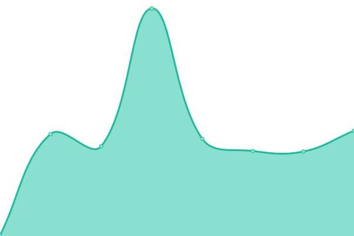 203ms
     
 | 

<a href="https://DELWP-DTV.github.io/santa/history/vic-data-2010-index-of-stream-condition-toe-of-bank-line-features">100.00%</a>
    

|  [vic-data_surface-geochemistry-samples-being-superceded-by-geochemistry](https://opendata.maps.vic.gov.au/geoserver/wms?service=wms&request=getmap&format=image%2Fpng8&transparent=true&layers=open-data-platform:gchem&width=512&height=512&crs=epsg%3A3857&bbox=16114148.554967716%2C-4456584.4971389165%2C16119040.524777967%2C-4451692.527328665) | 🟩 Up | [vic-data-surface-geochemistry-samples-being-superceded-by-geochemistry.yml](https://github.com/DELWP-DTV/santa/commits/HEAD/history/vic-data-surface-geochemistry-samples-being-superceded-by-geochemistry.yml) | 

 236ms
     
 | 

<a href="https://DELWP-DTV.github.io/santa/history/vic-data-surface-geochemistry-samples-being-superceded-by-geochemistry">100.00%</a>
    

|  [vic-data_vicmap-lite-airport-point-1-250000-to-1-50000001](https://opendata.maps.vic.gov.au/geoserver/wms?service=wms&request=getmap&format=image%2Fpng8&transparent=true&layers=open-data-platform:vmlite_tr_airport&width=512&height=512&crs=epsg%3A3857&bbox=16114148.554967716%2C-4456584.4971389165%2C16119040.524777967%2C-4451692.527328665) | 🟩 Up | [vic-data-vicmap-lite-airport-point-1-250000-to-1-50000001.yml](https://github.com/DELWP-DTV/santa/commits/HEAD/history/vic-data-vicmap-lite-airport-point-1-250000-to-1-50000001.yml) | 

 225ms
     
 | 

<a href="https://DELWP-DTV.github.io/santa/history/vic-data-vicmap-lite-airport-point-1-250000-to-1-50000001">100.00%</a>
    

|  [vic-data_geological-structures-ovens-valley2](https://opendata.maps.vic.gov.au/geoserver/wms?service=wms&request=getmap&format=image%2Fpng8&transparent=true&layers=open-data-platform:geol_struct_ovens_valley&width=512&height=512&crs=epsg%3A3857&bbox=16114148.554967716%2C-4456584.4971389165%2C16119040.524777967%2C-4451692.527328665) | 🟩 Up | [vic-data-geological-structures-ovens-valley2.yml](https://github.com/DELWP-DTV/santa/commits/HEAD/history/vic-data-geological-structures-ovens-valley2.yml) | 

 208ms
     
 | 

<a href="https://DELWP-DTV.github.io/santa/history/vic-data-geological-structures-ovens-valley2">100.00%</a>
    

|  [vic-data_beneficial-use-upper-tertiary1](https://opendata.maps.vic.gov.au/geoserver/wms?service=wms&request=getmap&format=image%2Fpng8&transparent=true&layers=open-data-platform:bu_uter&width=512&height=512&crs=epsg%3A3857&bbox=16114148.554967716%2C-4456584.4971389165%2C16119040.524777967%2C-4451692.527328665) | 🟩 Up | [vic-data-beneficial-use-upper-tertiary1.yml](https://github.com/DELWP-DTV/santa/commits/HEAD/history/vic-data-beneficial-use-upper-tertiary1.yml) | 

 240ms
     
 | 

<a href="https://DELWP-DTV.github.io/santa/history/vic-data-beneficial-use-upper-tertiary1">100.00%</a>
    

|  [vic-data_estuary-drained-portions-of-victorian-coastal-catchments1](https://opendata.maps.vic.gov.au/geoserver/wms?service=wms&request=getmap&format=image%2Fpng8&transparent=true&layers=open-data-platform:est_catch&width=512&height=512&crs=epsg%3A3857&bbox=16114148.554967716%2C-4456584.4971389165%2C16119040.524777967%2C-4451692.527328665) | 🟩 Up | [vic-data-estuary-drained-portions-of-victorian-coastal-catchments1.yml](https://github.com/DELWP-DTV/santa/commits/HEAD/history/vic-data-estuary-drained-portions-of-victorian-coastal-catchments1.yml) | 

 229ms
     
 | 

<a href="https://DELWP-DTV.github.io/santa/history/vic-data-estuary-drained-portions-of-victorian-coastal-catchments1">100.00%</a>
    

|  [vic-data_vicmap-lite-place-built-up-area-polygon-1-250000-to-1-50000001](https://opendata.maps.vic.gov.au/geoserver/wms?service=wms&request=getmap&format=image%2Fpng8&transparent=true&layers=open-data-platform:vmlite_built_up_area&width=512&height=512&crs=epsg%3A3857&bbox=16114148.554967716%2C-4456584.4971389165%2C16119040.524777967%2C-4451692.527328665) | 🟩 Up | [vic-data-vicmap-lite-place-built-up-area-polygon-1-250000-to-1-50000001.yml](https://github.com/DELWP-DTV/santa/commits/HEAD/history/vic-data-vicmap-lite-place-built-up-area-polygon-1-250000-to-1-50000001.yml) | 

 208ms
     
 | 

<a href="https://DELWP-DTV.github.io/santa/history/vic-data-vicmap-lite-place-built-up-area-polygon-1-250000-to-1-50000001">100.00%</a>
    

|  [vic-data_vicmap-lite-geographic-feature-point-for-labelling-1-250000-to-1-50000001](https://opendata.maps.vic.gov.au/geoserver/wms?service=wms&request=getmap&format=image%2Fpng8&transparent=true&layers=open-data-platform:vmlite_geo_point_label&width=512&height=512&crs=epsg%3A3857&bbox=16114148.554967716%2C-4456584.4971389165%2C16119040.524777967%2C-4451692.527328665) | 🟩 Up | [vic-data-vicmap-lite-geographic-feature-point-for-labelling-1-250000-to-1-50000001.yml](https://github.com/DELWP-DTV/santa/commits/HEAD/history/vic-data-vicmap-lite-geographic-feature-point-for-labelling-1-250000-to-1-50000001.yml) | 

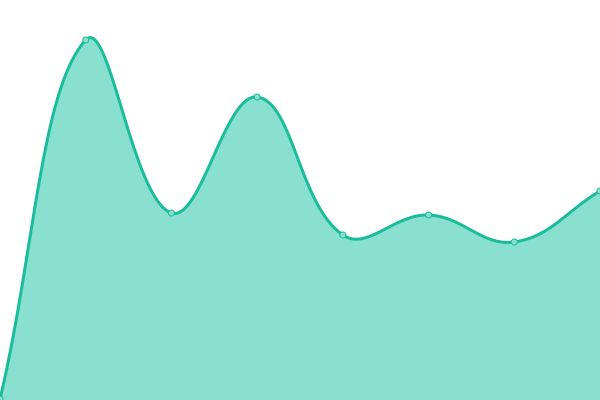 226ms
     
 | 

<a href="https://DELWP-DTV.github.io/santa/history/vic-data-vicmap-lite-geographic-feature-point-for-labelling-1-250000-to-1-50000001">100.00%</a>
    

|  [vic-data_mineral-points-1-10000001](https://opendata.maps.vic.gov.au/geoserver/wms?service=wms&request=getmap&format=image%2Fpng8&transparent=true&layers=open-data-platform:mineralp&width=512&height=512&crs=epsg%3A3857&bbox=16114148.554967716%2C-4456584.4971389165%2C16119040.524777967%2C-4451692.527328665) | 🟩 Up | [vic-data-mineral-points-1-10000001.yml](https://github.com/DELWP-DTV/santa/commits/HEAD/history/vic-data-mineral-points-1-10000001.yml) | 

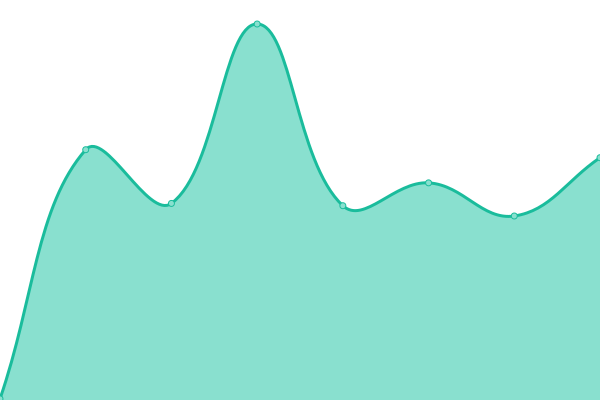 223ms
     
 | 

<a href="https://DELWP-DTV.github.io/santa/history/vic-data-mineral-points-1-10000001">100.00%</a>
    

|  [vic-data_melbourne-metro-tunnel-project-underground-stations1](https://opendata.maps.vic.gov.au/geoserver/wms?service=wms&request=getmap&format=image%2Fpng8&transparent=true&layers=open-data-platform:mtp_ees_underground_stations&width=512&height=512&crs=epsg%3A3857&bbox=16114148.554967716%2C-4456584.4971389165%2C16119040.524777967%2C-4451692.527328665) | 🟩 Up | [vic-data-melbourne-metro-tunnel-project-underground-stations1.yml](https://github.com/DELWP-DTV/santa/commits/HEAD/history/vic-data-melbourne-metro-tunnel-project-underground-stations1.yml) | 

 210ms
     
 | 

<a href="https://DELWP-DTV.github.io/santa/history/vic-data-melbourne-metro-tunnel-project-underground-stations1">100.00%</a>
    

|  [vic-data_land-systems-of-victoria-at-1-250-0001](https://opendata.maps.vic.gov.au/geoserver/wms?service=wms&request=getmap&format=image%2Fpng8&transparent=true&layers=open-data-platform:lsys250&width=512&height=512&crs=epsg%3A3857&bbox=16114148.554967716%2C-4456584.4971389165%2C16119040.524777967%2C-4451692.527328665) | 🟩 Up | [vic-data-land-systems-of-victoria-at-1-250-0001.yml](https://github.com/DELWP-DTV/santa/commits/HEAD/history/vic-data-land-systems-of-victoria-at-1-250-0001.yml) | 

 239ms
     
 | 

<a href="https://DELWP-DTV.github.io/santa/history/vic-data-land-systems-of-victoria-at-1-250-0001">100.00%</a>
    

|  [vic-data_ptv-skybus-routes-airport-service1](https://opendata.maps.vic.gov.au/geoserver/wms?service=wms&request=getmap&format=image%2Fpng8&transparent=true&layers=open-data-platform:ptv_skybus_route&width=512&height=512&crs=epsg%3A3857&bbox=16114148.554967716%2C-4456584.4971389165%2C16119040.524777967%2C-4451692.527328665) | 🟩 Up | [vic-data-ptv-skybus-routes-airport-service1.yml](https://github.com/DELWP-DTV/santa/commits/HEAD/history/vic-data-ptv-skybus-routes-airport-service1.yml) | 

 222ms
     
 | 

<a href="https://DELWP-DTV.github.io/santa/history/vic-data-ptv-skybus-routes-airport-service1">100.00%</a>
    

|  [vic-data_recreation-hut1](https://opendata.maps.vic.gov.au/geoserver/wms?service=wms&request=getmap&format=image%2Fpng8&transparent=true&layers=open-data-platform:recweb_hut&width=512&height=512&crs=epsg%3A3857&bbox=16114148.554967716%2C-4456584.4971389165%2C16119040.524777967%2C-4451692.527328665) | 🟩 Up | [vic-data-recreation-hut1.yml](https://github.com/DELWP-DTV/santa/commits/HEAD/history/vic-data-recreation-hut1.yml) | 

 205ms
     
 | 

<a href="https://DELWP-DTV.github.io/santa/history/vic-data-recreation-hut1">100.00%</a>
    

|  [vic-data_groundwater-management-area-zones1](https://opendata.maps.vic.gov.au/geoserver/wms?service=wms&request=getmap&format=image%2Fpng8&transparent=true&layers=open-data-platform:gma_zone&width=512&height=512&crs=epsg%3A3857&bbox=16114148.554967716%2C-4456584.4971389165%2C16119040.524777967%2C-4451692.527328665) | 🟩 Up | [vic-data-groundwater-management-area-zones1.yml](https://github.com/DELWP-DTV/santa/commits/HEAD/history/vic-data-groundwater-management-area-zones1.yml) | 

 238ms
     
 | 

<a href="https://DELWP-DTV.github.io/santa/history/vic-data-groundwater-management-area-zones1">100.00%</a>
    

|  [vic-data_2010-index-of-stream-condition-bare-ground-polygon-features2](https://opendata.maps.vic.gov.au/geoserver/wms?service=wms&request=getmap&format=image%2Fpng8&transparent=true&layers=open-data-platform:isc2010_bare_ground&width=512&height=512&crs=epsg%3A3857&bbox=16114148.554967716%2C-4456584.4971389165%2C16119040.524777967%2C-4451692.527328665) | 🟩 Up | [vic-data-2010-index-of-stream-condition-bare-ground-polygon-features2.yml](https://github.com/DELWP-DTV/santa/commits/HEAD/history/vic-data-2010-index-of-stream-condition-bare-ground-polygon-features2.yml) | 

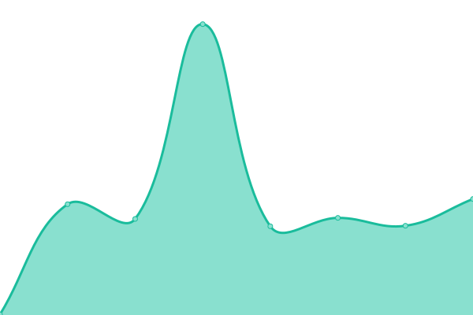 215ms
     
 | 

<a href="https://DELWP-DTV.github.io/santa/history/vic-data-2010-index-of-stream-condition-bare-ground-polygon-features2">100.00%</a>
    

|  [vic-data_interpreted-faults-north-west-murray-basin2](https://opendata.maps.vic.gov.au/geoserver/wms?service=wms&request=getmap&format=image%2Fpng8&transparent=true&layers=open-data-platform:faults_nwmurray_basin&width=512&height=512&crs=epsg%3A3857&bbox=16114148.554967716%2C-4456584.4971389165%2C16119040.524777967%2C-4451692.527328665) | 🟩 Up | [vic-data-interpreted-faults-north-west-murray-basin2.yml](https://github.com/DELWP-DTV/santa/commits/HEAD/history/vic-data-interpreted-faults-north-west-murray-basin2.yml) | 

 211ms
     
 | 

<a href="https://DELWP-DTV.github.io/santa/history/vic-data-interpreted-faults-north-west-murray-basin2">100.00%</a>
    

|  [vic-data_aquifer-salinity-basal1](https://opendata.maps.vic.gov.au/geoserver/wms?service=wms&request=getmap&format=image%2Fpng8&transparent=true&layers=open-data-platform:aquifer_sal_basal&width=512&height=512&crs=epsg%3A3857&bbox=16114148.554967716%2C-4456584.4971389165%2C16119040.524777967%2C-4451692.527328665) | 🟩 Up | [vic-data-aquifer-salinity-basal1.yml](https://github.com/DELWP-DTV/santa/commits/HEAD/history/vic-data-aquifer-salinity-basal1.yml) | 

 222ms
     
 | 

<a href="https://DELWP-DTV.github.io/santa/history/vic-data-aquifer-salinity-basal1">100.00%</a>
    

|  [vic-data_coal-cross-section-lines1](https://opendata.maps.vic.gov.au/geoserver/wms?service=wms&request=getmap&format=image%2Fpng8&transparent=true&layers=open-data-platform:xsec_coal&width=512&height=512&crs=epsg%3A3857&bbox=16114148.554967716%2C-4456584.4971389165%2C16119040.524777967%2C-4451692.527328665) | 🟩 Up | [vic-data-coal-cross-section-lines1.yml](https://github.com/DELWP-DTV/santa/commits/HEAD/history/vic-data-coal-cross-section-lines1.yml) | 

 227ms
     
 | 

<a href="https://DELWP-DTV.github.io/santa/history/vic-data-coal-cross-section-lines1">100.00%</a>
    

|  [vic-data_ptv-metro-bus-routes1](https://opendata.maps.vic.gov.au/geoserver/wms?service=wms&request=getmap&format=image%2Fpng8&transparent=true&layers=open-data-platform:ptv_metro_bus_route&width=512&height=512&crs=epsg%3A3857&bbox=16114148.554967716%2C-4456584.4971389165%2C16119040.524777967%2C-4451692.527328665) | 🟩 Up | [vic-data-ptv-metro-bus-routes1.yml](https://github.com/DELWP-DTV/santa/commits/HEAD/history/vic-data-ptv-metro-bus-routes1.yml) | 

 205ms
     
 | 

<a href="https://DELWP-DTV.github.io/santa/history/vic-data-ptv-metro-bus-routes1">100.00%</a>
    

|  [vic-data_ptv-regional-coach-routes-v-line2](https://opendata.maps.vic.gov.au/geoserver/wms?service=wms&request=getmap&format=image%2Fpng8&transparent=true&layers=open-data-platform:ptv_regional_coach_route&width=512&height=512&crs=epsg%3A3857&bbox=16114148.554967716%2C-4456584.4971389165%2C16119040.524777967%2C-4451692.527328665) | 🟩 Up | [vic-data-ptv-regional-coach-routes-v-line2.yml](https://github.com/DELWP-DTV/santa/commits/HEAD/history/vic-data-ptv-regional-coach-routes-v-line2.yml) | 

 216ms
     
 | 

<a href="https://DELWP-DTV.github.io/santa/history/vic-data-ptv-regional-coach-routes-v-line2">100.00%</a>
    

|  [vic-data_linear-geological-structures-1-10000001](https://opendata.maps.vic.gov.au/geoserver/wms?service=wms&request=getmap&format=image%2Fpng8&transparent=true&layers=open-data-platform:strline1m&width=512&height=512&crs=epsg%3A3857&bbox=16114148.554967716%2C-4456584.4971389165%2C16119040.524777967%2C-4451692.527328665) | 🟩 Up | [vic-data-linear-geological-structures-1-10000001.yml](https://github.com/DELWP-DTV/santa/commits/HEAD/history/vic-data-linear-geological-structures-1-10000001.yml) | 

 226ms
     
 | 

<a href="https://DELWP-DTV.github.io/santa/history/vic-data-linear-geological-structures-1-10000001">100.00%</a>
    

|  [vic-data_vicmap-elevation-contour-line-10-and-20-metres](https://opendata.maps.vic.gov.au/geoserver/wms?service=wms&request=getmap&format=image%2Fpng8&transparent=true&layers=open-data-platform:el_contour&width=512&height=512&crs=epsg%3A3857&bbox=16114148.554967716%2C-4456584.4971389165%2C16119040.524777967%2C-4451692.527328665) | 🟩 Up | [vic-data-vicmap-elevation-contour-line-10-and-20-metres.yml](https://github.com/DELWP-DTV/santa/commits/HEAD/history/vic-data-vicmap-elevation-contour-line-10-and-20-metres.yml) | 

 190ms
     
 | 

<a href="https://DELWP-DTV.github.io/santa/history/vic-data-vicmap-elevation-contour-line-10-and-20-metres">100.00%</a>
    

|  [vic-data_areas-of-cultural-heritage-sensitivity1](https://opendata.maps.vic.gov.au/geoserver/wms?service=wms&request=getmap&format=image%2Fpng8&transparent=true&layers=open-data-platform:sensitivity_public&width=512&height=512&crs=epsg%3A3857&bbox=16114148.554967716%2C-4456584.4971389165%2C16119040.524777967%2C-4451692.527328665) | 🟩 Up | [vic-data-areas-of-cultural-heritage-sensitivity1.yml](https://github.com/DELWP-DTV/santa/commits/HEAD/history/vic-data-areas-of-cultural-heritage-sensitivity1.yml) | 

 242ms
     
 | 

<a href="https://DELWP-DTV.github.io/santa/history/vic-data-areas-of-cultural-heritage-sensitivity1">100.00%</a>
    

|  [vic-data_vicmap-admin-state-assembly-polygon-20221](https://opendata.maps.vic.gov.au/geoserver/wms?service=wms&request=getmap&format=image%2Fpng8&transparent=true&layers=open-data-platform:state_assembly_2022&width=512&height=512&crs=epsg%3A3857&bbox=16114148.554967716%2C-4456584.4971389165%2C16119040.524777967%2C-4451692.527328665) | 🟩 Up | [vic-data-vicmap-admin-state-assembly-polygon-20221.yml](https://github.com/DELWP-DTV/santa/commits/HEAD/history/vic-data-vicmap-admin-state-assembly-polygon-20221.yml) | 

 275ms
     
 | 

<a href="https://DELWP-DTV.github.io/santa/history/vic-data-vicmap-admin-state-assembly-polygon-20221">100.00%</a>
    

|  [vic-data_vicmap-property-parcel-polygon-with-parcel-detail2](https://opendata.maps.vic.gov.au/geoserver/wms?service=wms&request=getmap&format=image%2Fpng8&transparent=true&layers=open-data-platform:v_parcel_mp&width=512&height=512&crs=epsg%3A3857&bbox=16114148.554967716%2C-4456584.4971389165%2C16119040.524777967%2C-4451692.527328665) | 🟩 Up | [vic-data-vicmap-property-parcel-polygon-with-parcel-detail2.yml](https://github.com/DELWP-DTV/santa/commits/HEAD/history/vic-data-vicmap-property-parcel-polygon-with-parcel-detail2.yml) | 

 825ms
     
 | 

<a href="https://DELWP-DTV.github.io/santa/history/vic-data-vicmap-property-parcel-polygon-with-parcel-detail2">100.00%</a>
    

|  [vic-data_geological-fault-rock-polygons-1-1000002](https://opendata.maps.vic.gov.au/geoserver/wms?service=wms&request=getmap&format=image%2Fpng8&transparent=true&layers=open-data-platform:fltrock100_polygon&width=512&height=512&crs=epsg%3A3857&bbox=16114148.554967716%2C-4456584.4971389165%2C16119040.524777967%2C-4451692.527328665) | 🟩 Up | [vic-data-geological-fault-rock-polygons-1-1000002.yml](https://github.com/DELWP-DTV/santa/commits/HEAD/history/vic-data-geological-fault-rock-polygons-1-1000002.yml) | 

 224ms
     
 | 

<a href="https://DELWP-DTV.github.io/santa/history/vic-data-geological-fault-rock-polygons-1-1000002">100.00%</a>
    

|  [vic-data_groundwater-management-basins-gmb](https://opendata.maps.vic.gov.au/geoserver/wms?service=wms&request=getmap&format=image%2Fpng8&transparent=true&layers=open-data-platform:gmb&width=512&height=512&crs=epsg%3A3857&bbox=16114148.554967716%2C-4456584.4971389165%2C16119040.524777967%2C-4451692.527328665) | 🟩 Up | [vic-data-groundwater-management-basins-gmb.yml](https://github.com/DELWP-DTV/santa/commits/HEAD/history/vic-data-groundwater-management-basins-gmb.yml) | 

 263ms
     
 | 

<a href="https://DELWP-DTV.github.io/santa/history/vic-data-groundwater-management-basins-gmb">100.00%</a>
    

|  [vic-data_fire-history-records-of-fires-across-victoria-showing-the-fire-scars2](https://opendata.maps.vic.gov.au/geoserver/wms?service=wms&request=getmap&format=image%2Fpng8&transparent=true&layers=open-data-platform:fire_history_scar&width=512&height=512&crs=epsg%3A3857&bbox=16114148.554967716%2C-4456584.4971389165%2C16119040.524777967%2C-4451692.527328665) | 🟩 Up | [vic-data-fire-history-records-of-fires-across-victoria-showing-the-fire-scars2.yml](https://github.com/DELWP-DTV/santa/commits/HEAD/history/vic-data-fire-history-records-of-fires-across-victoria-showing-the-fire-scars2.yml) | 

 228ms
     
 | 

<a href="https://DELWP-DTV.github.io/santa/history/vic-data-fire-history-records-of-fires-across-victoria-showing-the-fire-scars2">100.00%</a>
    

|  [vic-data_awrc-major-river-basins-of-victoria1](https://opendata.maps.vic.gov.au/geoserver/wms?service=wms&request=getmap&format=image%2Fpng8&transparent=true&layers=open-data-platform:basin100&width=512&height=512&crs=epsg%3A3857&bbox=16114148.554967716%2C-4456584.4971389165%2C16119040.524777967%2C-4451692.527328665) | 🟩 Up | [vic-data-awrc-major-river-basins-of-victoria1.yml](https://github.com/DELWP-DTV/santa/commits/HEAD/history/vic-data-awrc-major-river-basins-of-victoria1.yml) | 

 220ms
     
 | 

<a href="https://DELWP-DTV.github.io/santa/history/vic-data-awrc-major-river-basins-of-victoria1">100.00%</a>
    

|  [vic-data_geological-basins](https://opendata.maps.vic.gov.au/geoserver/wms?service=wms&request=getmap&format=image%2Fpng8&transparent=true&layers=open-data-platform:basins&width=512&height=512&crs=epsg%3A3857&bbox=16114148.554967716%2C-4456584.4971389165%2C16119040.524777967%2C-4451692.527328665) | 🟩 Up | [vic-data-geological-basins.yml](https://github.com/DELWP-DTV/santa/commits/HEAD/history/vic-data-geological-basins.yml) | 

 219ms
     
 | 

<a href="https://DELWP-DTV.github.io/santa/history/vic-data-geological-basins">100.00%</a>
    

|  [vic-data_ptv-train-station-platform2](https://opendata.maps.vic.gov.au/geoserver/wms?service=wms&request=getmap&format=image%2Fpng8&transparent=true&layers=open-data-platform:ptv_train_station_platform&width=512&height=512&crs=epsg%3A3857&bbox=16114148.554967716%2C-4456584.4971389165%2C16119040.524777967%2C-4451692.527328665) | 🟩 Up | [vic-data-ptv-train-station-platform2.yml](https://github.com/DELWP-DTV/santa/commits/HEAD/history/vic-data-ptv-train-station-platform2.yml) | 

 217ms
     
 | 

<a href="https://DELWP-DTV.github.io/santa/history/vic-data-ptv-train-station-platform2">100.00%</a>
    

|  [vic-data_vicmap-property-easement-proposed-polygon2](https://opendata.maps.vic.gov.au/geoserver/wms?service=wms&request=getmap&format=image%2Fpng8&transparent=true&layers=open-data-platform:v_s_easement_proposed&width=512&height=512&crs=epsg%3A3857&bbox=16114148.554967716%2C-4456584.4971389165%2C16119040.524777967%2C-4451692.527328665) | 🟩 Up | [vic-data-vicmap-property-easement-proposed-polygon2.yml](https://github.com/DELWP-DTV/santa/commits/HEAD/history/vic-data-vicmap-property-easement-proposed-polygon2.yml) | 

 217ms
     
 | 

<a href="https://DELWP-DTV.github.io/santa/history/vic-data-vicmap-property-easement-proposed-polygon2">100.00%</a>
    

|  [vic-data_potential-groundwater-dependent-ecosystem-gde-mapping-for-the-corangamite-cma2](https://opendata.maps.vic.gov.au/geoserver/wms?service=wms&request=getmap&format=image%2Fpng8&transparent=true&layers=open-data-platform:gde_terr_corcma&width=512&height=512&crs=epsg%3A3857&bbox=16114148.554967716%2C-4456584.4971389165%2C16119040.524777967%2C-4451692.527328665) | 🟩 Up | [vic-data-potential-groundwater-dependent-ecosystem-gde-mapping-for-the-corangamite-cma2.yml](https://github.com/DELWP-DTV/santa/commits/HEAD/history/vic-data-potential-groundwater-dependent-ecosystem-gde-mapping-for-the-corangamite-cma2.yml) | 

 222ms
     
 | 

<a href="https://DELWP-DTV.github.io/santa/history/vic-data-potential-groundwater-dependent-ecosystem-gde-mapping-for-the-corangamite-cma2">100.00%</a>
    

|  [vic-data_alluvial-mineralisation-and-mined-alluvial-workings-polygons-1-100-0002](https://opendata.maps.vic.gov.au/geoserver/wms?service=wms&request=getmap&format=image%2Fpng8&transparent=true&layers=open-data-platform:shalld100_polygon&width=512&height=512&crs=epsg%3A3857&bbox=16114148.554967716%2C-4456584.4971389165%2C16119040.524777967%2C-4451692.527328665) | 🟩 Up | [vic-data-alluvial-mineralisation-and-mined-alluvial-workings-polygons-1-100-0002.yml](https://github.com/DELWP-DTV/santa/commits/HEAD/history/vic-data-alluvial-mineralisation-and-mined-alluvial-workings-polygons-1-100-0002.yml) | 

 211ms
     
 | 

<a href="https://DELWP-DTV.github.io/santa/history/vic-data-alluvial-mineralisation-and-mined-alluvial-workings-polygons-1-100-0002">100.00%</a>
    

|  [vic-data_fire-history-records-of-fires-across-victoria1](https://opendata.maps.vic.gov.au/geoserver/wms?service=wms&request=getmap&format=image%2Fpng8&transparent=true&layers=open-data-platform:fire_history&width=512&height=512&crs=epsg%3A3857&bbox=16114148.554967716%2C-4456584.4971389165%2C16119040.524777967%2C-4451692.527328665) | 🟩 Up | [vic-data-fire-history-records-of-fires-across-victoria1.yml](https://github.com/DELWP-DTV/santa/commits/HEAD/history/vic-data-fire-history-records-of-fires-across-victoria1.yml) | 

 207ms
     
 | 

<a href="https://DELWP-DTV.github.io/santa/history/vic-data-fire-history-records-of-fires-across-victoria1">100.00%</a>
    

|  [vic-data_fire-history-overlay-of-most-recent-fires](https://opendata.maps.vic.gov.au/geoserver/wms?service=wms&request=getmap&format=image%2Fpng8&transparent=true&layers=open-data-platform:fire_history_lastburnt&width=512&height=512&crs=epsg%3A3857&bbox=16114148.554967716%2C-4456584.4971389165%2C16119040.524777967%2C-4451692.527328665) | 🟩 Up | [vic-data-fire-history-overlay-of-most-recent-fires.yml](https://github.com/DELWP-DTV/santa/commits/HEAD/history/vic-data-fire-history-overlay-of-most-recent-fires.yml) | 

 222ms
     
 | 

<a href="https://DELWP-DTV.github.io/santa/history/vic-data-fire-history-overlay-of-most-recent-fires">100.00%</a>
    

|  [vic-data_extractive-industry-interest-areas2](https://opendata.maps.vic.gov.au/geoserver/wms?service=wms&request=getmap&format=image%2Fpng8&transparent=true&layers=open-data-platform:eiia&width=512&height=512&crs=epsg%3A3857&bbox=16114148.554967716%2C-4456584.4971389165%2C16119040.524777967%2C-4451692.527328665) | 🟩 Up | [vic-data-extractive-industry-interest-areas2.yml](https://github.com/DELWP-DTV/santa/commits/HEAD/history/vic-data-extractive-industry-interest-areas2.yml) | 

 218ms
     
 | 

<a href="https://DELWP-DTV.github.io/santa/history/vic-data-extractive-industry-interest-areas2">100.00%</a>
    

|  [vic-data_designated-bushfire-prone-area-bpa2](https://opendata.maps.vic.gov.au/geoserver/wms?service=wms&request=getmap&format=image%2Fpng8&transparent=true&layers=open-data-platform:bushfire_prone_area&width=512&height=512&crs=epsg%3A3857&bbox=16114148.554967716%2C-4456584.4971389165%2C16119040.524777967%2C-4451692.527328665) | 🟩 Up | [vic-data-designated-bushfire-prone-area-bpa2.yml](https://github.com/DELWP-DTV/santa/commits/HEAD/history/vic-data-designated-bushfire-prone-area-bpa2.yml) | 

 215ms
     
 | 

<a href="https://DELWP-DTV.github.io/santa/history/vic-data-designated-bushfire-prone-area-bpa2">100.00%</a>
    

|  [vic-data_regolith-regional-radiometric-signature-areas-1-1000005](https://opendata.maps.vic.gov.au/geoserver/wms?service=wms&request=getmap&format=image%2Fpng8&transparent=true&layers=open-data-platform:rrradsig100_polygon&width=512&height=512&crs=epsg%3A3857&bbox=16114148.554967716%2C-4456584.4971389165%2C16119040.524777967%2C-4451692.527328665) | 🟩 Up | [vic-data-regolith-regional-radiometric-signature-areas-1-1000005.yml](https://github.com/DELWP-DTV/santa/commits/HEAD/history/vic-data-regolith-regional-radiometric-signature-areas-1-1000005.yml) | 

 218ms
     
 | 

<a href="https://DELWP-DTV.github.io/santa/history/vic-data-regolith-regional-radiometric-signature-areas-1-1000005">100.00%</a>
    

|  [vic-data_ramsar-wetland-areas-in-victoria-at-1-25-0002](https://opendata.maps.vic.gov.au/geoserver/wms?service=wms&request=getmap&format=image%2Fpng8&transparent=true&layers=open-data-platform:ramsar25&width=512&height=512&crs=epsg%3A3857&bbox=16114148.554967716%2C-4456584.4971389165%2C16119040.524777967%2C-4451692.527328665) | 🟩 Up | [vic-data-ramsar-wetland-areas-in-victoria-at-1-25-0002.yml](https://github.com/DELWP-DTV/santa/commits/HEAD/history/vic-data-ramsar-wetland-areas-in-victoria-at-1-25-0002.yml) | 

 214ms
     
 | 

<a href="https://DELWP-DTV.github.io/santa/history/vic-data-ramsar-wetland-areas-in-victoria-at-1-25-0002">100.00%</a>
    

|  [vic-data_victorian-wetland-environments-and-extent-up-to-19941](https://opendata.maps.vic.gov.au/geoserver/wms?service=wms&request=getmap&format=image%2Fpng8&transparent=true&layers=open-data-platform:wetland_1994&width=512&height=512&crs=epsg%3A3857&bbox=16114148.554967716%2C-4456584.4971389165%2C16119040.524777967%2C-4451692.527328665) | 🟩 Up | [vic-data-victorian-wetland-environments-and-extent-up-to-19941.yml](https://github.com/DELWP-DTV/santa/commits/HEAD/history/vic-data-victorian-wetland-environments-and-extent-up-to-19941.yml) | 

 206ms
     
 | 

<a href="https://DELWP-DTV.github.io/santa/history/vic-data-victorian-wetland-environments-and-extent-up-to-19941">100.00%</a>
    

|  [vic-data_wetland-centroids1](https://opendata.maps.vic.gov.au/geoserver/wms?service=wms&request=getmap&format=image%2Fpng8&transparent=true&layers=open-data-platform:wetland500&width=512&height=512&crs=epsg%3A3857&bbox=16114148.554967716%2C-4456584.4971389165%2C16119040.524777967%2C-4451692.527328665) | 🟩 Up | [vic-data-wetland-centroids1.yml](https://github.com/DELWP-DTV/santa/commits/HEAD/history/vic-data-wetland-centroids1.yml) | 

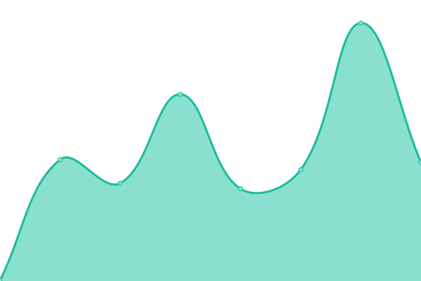 221ms
     
 | 

<a href="https://DELWP-DTV.github.io/santa/history/vic-data-wetland-centroids1">100.00%</a>
    

|  [vic-data_hunting-area-dataset-for-more-to-explore-app2](https://opendata.maps.vic.gov.au/geoserver/wms?service=wms&request=getmap&format=image%2Fpng8&transparent=true&layers=open-data-platform:hunt25_mte_app&width=512&height=512&crs=epsg%3A3857&bbox=16114148.554967716%2C-4456584.4971389165%2C16119040.524777967%2C-4451692.527328665) | 🟩 Up | [vic-data-hunting-area-dataset-for-more-to-explore-app2.yml](https://github.com/DELWP-DTV/santa/commits/HEAD/history/vic-data-hunting-area-dataset-for-more-to-explore-app2.yml) | 

 227ms
     
 | 

<a href="https://DELWP-DTV.github.io/santa/history/vic-data-hunting-area-dataset-for-more-to-explore-app2">100.00%</a>
    

|  [vic-data_wetlands-extent-for-victoria-prior-to-european-settlement-deduced1](https://opendata.maps.vic.gov.au/geoserver/wms?service=wms&request=getmap&format=image%2Fpng8&transparent=true&layers=open-data-platform:wetland_1788&width=512&height=512&crs=epsg%3A3857&bbox=16114148.554967716%2C-4456584.4971389165%2C16119040.524777967%2C-4451692.527328665) | 🟩 Up | [vic-data-wetlands-extent-for-victoria-prior-to-european-settlement-deduced1.yml](https://github.com/DELWP-DTV/santa/commits/HEAD/history/vic-data-wetlands-extent-for-victoria-prior-to-european-settlement-deduced1.yml) | 

 201ms
     
 | 

<a href="https://DELWP-DTV.github.io/santa/history/vic-data-wetlands-extent-for-victoria-prior-to-european-settlement-deduced1">100.00%</a>
    

|  [vic-data_vicmap-crown-land-tenure-crown-land-tenure-line-joined-to-crown-land-tenure-table-with-decoded-1](https://opendata.maps.vic.gov.au/geoserver/wms?service=wms&request=getmap&format=image%2Fpng8&transparent=true&layers=open-data-platform:v_cl_tenure_line_dc&width=512&height=512&crs=epsg%3A3857&bbox=16114148.554967716%2C-4456584.4971389165%2C16119040.524777967%2C-4451692.527328665) | 🟩 Up | [vic-data-vicmap-crown-land-tenure-crown-land-tenure-line-joined-to-crown-land-tenure-table-with-decoded-1.yml](https://github.com/DELWP-DTV/santa/commits/HEAD/history/vic-data-vicmap-crown-land-tenure-crown-land-tenure-line-joined-to-crown-land-tenure-table-with-decoded-1.yml) | 

 223ms
     
 | 

<a href="https://DELWP-DTV.github.io/santa/history/vic-data-vicmap-crown-land-tenure-crown-land-tenure-line-joined-to-crown-land-tenure-table-with-decoded-1">100.00%</a>
    

|  [vic-data_vicmap-crown-land-tenure-crown-land-tenure-polygon-joined-to-crown-land-tenure-table-with-decod2](https://opendata.maps.vic.gov.au/geoserver/wms?service=wms&request=getmap&format=image%2Fpng8&transparent=true&layers=open-data-platform:v_cl_tenure_polygon_dc&width=512&height=512&crs=epsg%3A3857&bbox=16114148.554967716%2C-4456584.4971389165%2C16119040.524777967%2C-4451692.527328665) | 🟩 Up | [vic-data-vicmap-crown-land-tenure-crown-land-tenure-polygon-joined-to-crown-land-tenure-table-with-decod2.yml](https://github.com/DELWP-DTV/santa/commits/HEAD/history/vic-data-vicmap-crown-land-tenure-crown-land-tenure-polygon-joined-to-crown-land-tenure-table-with-decod2.yml) | 

 227ms
     
 | 

<a href="https://DELWP-DTV.github.io/santa/history/vic-data-vicmap-crown-land-tenure-crown-land-tenure-polygon-joined-to-crown-land-tenure-table-with-decod2">100.00%</a>
    

|  [vic-data_public-land-management-plm25-generalised6](https://opendata.maps.vic.gov.au/geoserver/wms?service=wms&request=getmap&format=image%2Fpng8&transparent=true&layers=open-data-platform:plmgen&width=512&height=512&crs=epsg%3A3857&bbox=16114148.554967716%2C-4456584.4971389165%2C16119040.524777967%2C-4451692.527328665) | 🟩 Up | [vic-data-public-land-management-plm25-generalised6.yml](https://github.com/DELWP-DTV/santa/commits/HEAD/history/vic-data-public-land-management-plm25-generalised6.yml) | 

 217ms
     
 | 

<a href="https://DELWP-DTV.github.io/santa/history/vic-data-public-land-management-plm25-generalised6">100.00%</a>
    

|  [vic-data_vicmap-index-vicmap-topographic-1-25000-amg-printed-map-index-pre-2000](https://opendata.maps.vic.gov.au/geoserver/wms?service=wms&request=getmap&format=image%2Fpng8&transparent=true&layers=open-data-platform:vicmap_mapindex_special&width=512&height=512&crs=epsg%3A3857&bbox=16114148.554967716%2C-4456584.4971389165%2C16119040.524777967%2C-4451692.527328665) | 🟩 Up | [vic-data-vicmap-index-vicmap-topographic-1-25000-amg-printed-map-index-pre-2000.yml](https://github.com/DELWP-DTV/santa/commits/HEAD/history/vic-data-vicmap-index-vicmap-topographic-1-25000-amg-printed-map-index-pre-2000.yml) | 

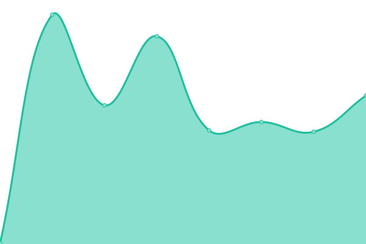 200ms
     
 | 

<a href="https://DELWP-DTV.github.io/santa/history/vic-data-vicmap-index-vicmap-topographic-1-25000-amg-printed-map-index-pre-2000">100.00%</a>
    

|  [vic-data_vicmap-property-display-view-polygon1](https://opendata.maps.vic.gov.au/geoserver/wms?service=wms&request=getmap&format=image%2Fpng8&transparent=true&layers=open-data-platform:display_view_polygon&width=512&height=512&crs=epsg%3A3857&bbox=16114148.554967716%2C-4456584.4971389165%2C16119040.524777967%2C-4451692.527328665) | 🟩 Up | [vic-data-vicmap-property-display-view-polygon1.yml](https://github.com/DELWP-DTV/santa/commits/HEAD/history/vic-data-vicmap-property-display-view-polygon1.yml) | 

 217ms
     
 | 

<a href="https://DELWP-DTV.github.io/santa/history/vic-data-vicmap-property-display-view-polygon1">100.00%</a>
    

|  [vic-data_vicmap-lite-forest-polygon-1-2000000-to-1-5000000](https://opendata.maps.vic.gov.au/geoserver/wms?service=wms&request=getmap&format=image%2Fpng8&transparent=true&layers=open-data-platform:vmlite_forest_su2&width=512&height=512&crs=epsg%3A3857&bbox=16114148.554967716%2C-4456584.4971389165%2C16119040.524777967%2C-4451692.527328665) | 🟩 Up | [vic-data-vicmap-lite-forest-polygon-1-2000000-to-1-5000000.yml](https://github.com/DELWP-DTV/santa/commits/HEAD/history/vic-data-vicmap-lite-forest-polygon-1-2000000-to-1-5000000.yml) | 

 218ms
     
 | 

<a href="https://DELWP-DTV.github.io/santa/history/vic-data-vicmap-lite-forest-polygon-1-2000000-to-1-5000000">100.00%</a>
    

|  [vic-data_planned-burns-2020-21-2022-23-now-called-joint-fuel-management-program-jfmp-includes-burns-and-7](https://opendata.maps.vic.gov.au/geoserver/wms?service=wms&request=getmap&format=image%2Fpng8&transparent=true&layers=open-data-platform:burnplan21&width=512&height=512&crs=epsg%3A3857&bbox=16114148.554967716%2C-4456584.4971389165%2C16119040.524777967%2C-4451692.527328665) | 🟩 Up | [vic-data-planned-burns-2020-21-2022-23-now-called-joint-fuel-management-program-jfmp-includes-burns-and-7.yml](https://github.com/DELWP-DTV/santa/commits/HEAD/history/vic-data-planned-burns-2020-21-2022-23-now-called-joint-fuel-management-program-jfmp-includes-burns-and-7.yml) | 

 224ms
     
 | 

<a href="https://DELWP-DTV.github.io/santa/history/vic-data-planned-burns-2020-21-2022-23-now-called-joint-fuel-management-program-jfmp-includes-burns-and-7">100.00%</a>
    

|  [vic-data_groundwater-surface-water-interaction-flux5](https://opendata.maps.vic.gov.au/geoserver/wms?service=wms&request=getmap&format=image%2Fpng8&transparent=true&layers=open-data-platform:gw_sw_interaction_flux&width=512&height=512&crs=epsg%3A3857&bbox=16114148.554967716%2C-4456584.4971389165%2C16119040.524777967%2C-4451692.527328665) | 🟩 Up | [vic-data-groundwater-surface-water-interaction-flux5.yml](https://github.com/DELWP-DTV/santa/commits/HEAD/history/vic-data-groundwater-surface-water-interaction-flux5.yml) | 

 200ms
     
 | 

<a href="https://DELWP-DTV.github.io/santa/history/vic-data-groundwater-surface-water-interaction-flux5">100.00%</a>
    

|  [vic-data_open-file-digital-airborne-geophysical-survey-index-for-victoria2](https://opendata.maps.vic.gov.au/geoserver/wms?service=wms&request=getmap&format=image%2Fpng8&transparent=true&layers=open-data-platform:digsurv&width=512&height=512&crs=epsg%3A3857&bbox=16114148.554967716%2C-4456584.4971389165%2C16119040.524777967%2C-4451692.527328665) | 🟩 Up | [vic-data-open-file-digital-airborne-geophysical-survey-index-for-victoria2.yml](https://github.com/DELWP-DTV/santa/commits/HEAD/history/vic-data-open-file-digital-airborne-geophysical-survey-index-for-victoria2.yml) | 

 225ms
     
 | 

<a href="https://DELWP-DTV.github.io/santa/history/vic-data-open-file-digital-airborne-geophysical-survey-index-for-victoria2">100.00%</a>
    

|  [vic-data_open-file-analog-airborne-geophysical-survey-for-victoria](https://opendata.maps.vic.gov.au/geoserver/wms?service=wms&request=getmap&format=image%2Fpng8&transparent=true&layers=open-data-platform:anasurv&width=512&height=512&crs=epsg%3A3857&bbox=16114148.554967716%2C-4456584.4971389165%2C16119040.524777967%2C-4451692.527328665) | 🟩 Up | [vic-data-open-file-analog-airborne-geophysical-survey-for-victoria.yml](https://github.com/DELWP-DTV/santa/commits/HEAD/history/vic-data-open-file-analog-airborne-geophysical-survey-for-victoria.yml) | 

 206ms
     
 | 

<a href="https://DELWP-DTV.github.io/santa/history/vic-data-open-file-analog-airborne-geophysical-survey-for-victoria">100.00%</a>
    

|  [vic-data_vicmap-index-framework-line1](https://opendata.maps.vic.gov.au/geoserver/wms?service=wms&request=getmap&format=image%2Fpng8&transparent=true&layers=open-data-platform:fr_framework_area_line&width=512&height=512&crs=epsg%3A3857&bbox=16114148.554967716%2C-4456584.4971389165%2C16119040.524777967%2C-4451692.527328665) | 🟩 Up | [vic-data-vicmap-index-framework-line1.yml](https://github.com/DELWP-DTV/santa/commits/HEAD/history/vic-data-vicmap-index-framework-line1.yml) | 

 240ms
     
 | 

<a href="https://DELWP-DTV.github.io/santa/history/vic-data-vicmap-index-framework-line1">100.00%</a>
    

|  [vic-data_vicmap-elevation-ground-surface-photogrammetric-control-point-1-to-5-metres-covering-metropolit](https://opendata.maps.vic.gov.au/geoserver/wms?service=wms&request=getmap&format=image%2Fpng8&transparent=true&layers=open-data-platform:el_grnd_surface_point_1to5m&width=512&height=512&crs=epsg%3A3857&bbox=16114148.554967716%2C-4456584.4971389165%2C16119040.524777967%2C-4451692.527328665) | 🟩 Up | [vic-data-vicmap-elevation-ground-surface-photogrammetric-control-point-1-to-5-metres-covering-metropolit.yml](https://github.com/DELWP-DTV/santa/commits/HEAD/history/vic-data-vicmap-elevation-ground-surface-photogrammetric-control-point-1-to-5-metres-covering-metropolit.yml) | 

 222ms
     
 | 

<a href="https://DELWP-DTV.github.io/santa/history/vic-data-vicmap-elevation-ground-surface-photogrammetric-control-point-1-to-5-metres-covering-metropolit">100.00%</a>
    

|  [vic-data_vicmap-admin-local-government-area-lga-polygon-prior-to-19941](https://opendata.maps.vic.gov.au/geoserver/wms?service=wms&request=getmap&format=image%2Fpng8&transparent=true&layers=open-data-platform:shire500_1994&width=512&height=512&crs=epsg%3A3857&bbox=16114148.554967716%2C-4456584.4971389165%2C16119040.524777967%2C-4451692.527328665) | 🟩 Up | [vic-data-vicmap-admin-local-government-area-lga-polygon-prior-to-19941.yml](https://github.com/DELWP-DTV/santa/commits/HEAD/history/vic-data-vicmap-admin-local-government-area-lga-polygon-prior-to-19941.yml) | 

 222ms
     
 | 

<a href="https://DELWP-DTV.github.io/santa/history/vic-data-vicmap-admin-local-government-area-lga-polygon-prior-to-19941">100.00%</a>
    

|  [vic-data_vicmap-admin-fire-rescue-victoria-frv-district-polygon7](https://opendata.maps.vic.gov.au/geoserver/wms?service=wms&request=getmap&format=image%2Fpng8&transparent=true&layers=open-data-platform:frv_district&width=512&height=512&crs=epsg%3A3857&bbox=16114148.554967716%2C-4456584.4971389165%2C16119040.524777967%2C-4451692.527328665) | 🟩 Up | [vic-data-vicmap-admin-fire-rescue-victoria-frv-district-polygon7.yml](https://github.com/DELWP-DTV/santa/commits/HEAD/history/vic-data-vicmap-admin-fire-rescue-victoria-frv-district-polygon7.yml) | 

 219ms
     
 | 

<a href="https://DELWP-DTV.github.io/santa/history/vic-data-vicmap-admin-fire-rescue-victoria-frv-district-polygon7">100.00%</a>
    

|  [vic-data_groundwater-sites-of-the-water-measurement-information-system-wmis](https://opendata.maps.vic.gov.au/geoserver/wms?service=wms&request=getmap&format=image%2Fpng8&transparent=true&layers=open-data-platform:gw_sites&width=512&height=512&crs=epsg%3A3857&bbox=16114148.554967716%2C-4456584.4971389165%2C16119040.524777967%2C-4451692.527328665) | 🟩 Up | [vic-data-groundwater-sites-of-the-water-measurement-information-system-wmis.yml](https://github.com/DELWP-DTV/santa/commits/HEAD/history/vic-data-groundwater-sites-of-the-water-measurement-information-system-wmis.yml) | 

 213ms
     
 | 

<a href="https://DELWP-DTV.github.io/santa/history/vic-data-groundwater-sites-of-the-water-measurement-information-system-wmis">100.00%</a>
    

|  [vic-data_vicmap-lite-locality-polygon-1-250000-to-1-50000001](https://opendata.maps.vic.gov.au/geoserver/wms?service=wms&request=getmap&format=image%2Fpng8&transparent=true&layers=open-data-platform:vmlite_locality_polygon&width=512&height=512&crs=epsg%3A3857&bbox=16114148.554967716%2C-4456584.4971389165%2C16119040.524777967%2C-4451692.527328665) | 🟩 Up | [vic-data-vicmap-lite-locality-polygon-1-250000-to-1-50000001.yml](https://github.com/DELWP-DTV/santa/commits/HEAD/history/vic-data-vicmap-lite-locality-polygon-1-250000-to-1-50000001.yml) | 

 223ms
     
 | 

<a href="https://DELWP-DTV.github.io/santa/history/vic-data-vicmap-lite-locality-polygon-1-250000-to-1-50000001">100.00%</a>
    

|  [vic-data_vicmap-lite-state-polygon-1-250000-to-1-20000002](https://opendata.maps.vic.gov.au/geoserver/wms?service=wms&request=getmap&format=image%2Fpng8&transparent=true&layers=open-data-platform:vmlite_victoria_polygon_su5&width=512&height=512&crs=epsg%3A3857&bbox=16114148.554967716%2C-4456584.4971389165%2C16119040.524777967%2C-4451692.527328665) | 🟩 Up | [vic-data-vicmap-lite-state-polygon-1-250000-to-1-20000002.yml](https://github.com/DELWP-DTV/santa/commits/HEAD/history/vic-data-vicmap-lite-state-polygon-1-250000-to-1-20000002.yml) | 

 249ms
     
 | 

<a href="https://DELWP-DTV.github.io/santa/history/vic-data-vicmap-lite-state-polygon-1-250000-to-1-20000002">100.00%</a>
    

|  [vic-data_vicmap-lite-railway-station-point-1-250000-to-1-50000001](https://opendata.maps.vic.gov.au/geoserver/wms?service=wms&request=getmap&format=image%2Fpng8&transparent=true&layers=open-data-platform:vmlite_tr_rail_station&width=512&height=512&crs=epsg%3A3857&bbox=16114148.554967716%2C-4456584.4971389165%2C16119040.524777967%2C-4451692.527328665) | 🟩 Up | [vic-data-vicmap-lite-railway-station-point-1-250000-to-1-50000001.yml](https://github.com/DELWP-DTV/santa/commits/HEAD/history/vic-data-vicmap-lite-railway-station-point-1-250000-to-1-50000001.yml) | 

 214ms
     
 | 

<a href="https://DELWP-DTV.github.io/santa/history/vic-data-vicmap-lite-railway-station-point-1-250000-to-1-50000001">100.00%</a>
    

|  [vic-data_sustainable-diversion-limits1](https://opendata.maps.vic.gov.au/geoserver/wms?service=wms&request=getmap&format=image%2Fpng8&transparent=true&layers=open-data-platform:sdl_catch&width=512&height=512&crs=epsg%3A3857&bbox=16114148.554967716%2C-4456584.4971389165%2C16119040.524777967%2C-4451692.527328665) | 🟩 Up | [vic-data-sustainable-diversion-limits1.yml](https://github.com/DELWP-DTV/santa/commits/HEAD/history/vic-data-sustainable-diversion-limits1.yml) | 

 251ms
     
 | 

<a href="https://DELWP-DTV.github.io/santa/history/vic-data-sustainable-diversion-limits1">100.00%</a>
    

|  [vic-data_subsurface-geophysics-1-250000-at-level-11](https://opendata.maps.vic.gov.au/geoserver/wms?service=wms&request=getmap&format=image%2Fpng8&transparent=true&layers=open-data-platform:gpsgeol1100_polygon&width=512&height=512&crs=epsg%3A3857&bbox=16114148.554967716%2C-4456584.4971389165%2C16119040.524777967%2C-4451692.527328665) | 🟩 Up | [vic-data-subsurface-geophysics-1-250000-at-level-11.yml](https://github.com/DELWP-DTV/santa/commits/HEAD/history/vic-data-subsurface-geophysics-1-250000-at-level-11.yml) | 

 219ms
     
 | 

<a href="https://DELWP-DTV.github.io/santa/history/vic-data-subsurface-geophysics-1-250000-at-level-11">100.00%</a>
    

|  [vic-data_principal-public-transport-network-pptn-line-elements2](https://opendata.maps.vic.gov.au/geoserver/wms?service=wms&request=getmap&format=image%2Fpng8&transparent=true&layers=open-data-platform:pptn_lines&width=512&height=512&crs=epsg%3A3857&bbox=16114148.554967716%2C-4456584.4971389165%2C16119040.524777967%2C-4451692.527328665) | 🟩 Up | [vic-data-principal-public-transport-network-pptn-line-elements2.yml](https://github.com/DELWP-DTV/santa/commits/HEAD/history/vic-data-principal-public-transport-network-pptn-line-elements2.yml) | 

 205ms
     
 | 

<a href="https://DELWP-DTV.github.io/santa/history/vic-data-principal-public-transport-network-pptn-line-elements2">100.00%</a>
    

|  [vic-data_vicmap-transport-airport-infrastructure-line1](https://opendata.maps.vic.gov.au/geoserver/wms?service=wms&request=getmap&format=image%2Fpng8&transparent=true&layers=open-data-platform:tr_airport_infrastructure&width=512&height=512&crs=epsg%3A3857&bbox=16114148.554967716%2C-4456584.4971389165%2C16119040.524777967%2C-4451692.527328665) | 🟩 Up | [vic-data-vicmap-transport-airport-infrastructure-line1.yml](https://github.com/DELWP-DTV/santa/commits/HEAD/history/vic-data-vicmap-transport-airport-infrastructure-line1.yml) | 

 221ms
     
 | 

<a href="https://DELWP-DTV.github.io/santa/history/vic-data-vicmap-transport-airport-infrastructure-line1">100.00%</a>
    

|  [vic-data_vicmap-hydro-water-structure-polygon1](https://opendata.maps.vic.gov.au/geoserver/wms?service=wms&request=getmap&format=image%2Fpng8&transparent=true&layers=open-data-platform:hy_water_struct_area_polygon&width=512&height=512&crs=epsg%3A3857&bbox=16114148.554967716%2C-4456584.4971389165%2C16119040.524777967%2C-4451692.527328665) | 🟩 Up | [vic-data-vicmap-hydro-water-structure-polygon1.yml](https://github.com/DELWP-DTV/santa/commits/HEAD/history/vic-data-vicmap-hydro-water-structure-polygon1.yml) | 

 220ms
     
 | 

<a href="https://DELWP-DTV.github.io/santa/history/vic-data-vicmap-hydro-water-structure-polygon1">100.00%</a>
    

|  [vic-data_principal-public-transport-network-pptn-point-elements1](https://opendata.maps.vic.gov.au/geoserver/wms?service=wms&request=getmap&format=image%2Fpng8&transparent=true&layers=open-data-platform:pptn_points&width=512&height=512&crs=epsg%3A3857&bbox=16114148.554967716%2C-4456584.4971389165%2C16119040.524777967%2C-4451692.527328665) | 🟩 Up | [vic-data-principal-public-transport-network-pptn-point-elements1.yml](https://github.com/DELWP-DTV/santa/commits/HEAD/history/vic-data-principal-public-transport-network-pptn-point-elements1.yml) | 

 204ms
     
 | 

<a href="https://DELWP-DTV.github.io/santa/history/vic-data-principal-public-transport-network-pptn-point-elements1">100.00%</a>
    

|  [vic-data_farm-dam-points](https://opendata.maps.vic.gov.au/geoserver/wms?service=wms&request=getmap&format=image%2Fpng8&transparent=true&layers=open-data-platform:farm_dams_point&width=512&height=512&crs=epsg%3A3857&bbox=16114148.554967716%2C-4456584.4971389165%2C16119040.524777967%2C-4451692.527328665) | 🟩 Up | [vic-data-farm-dam-points.yml](https://github.com/DELWP-DTV/santa/commits/HEAD/history/vic-data-farm-dam-points.yml) | 

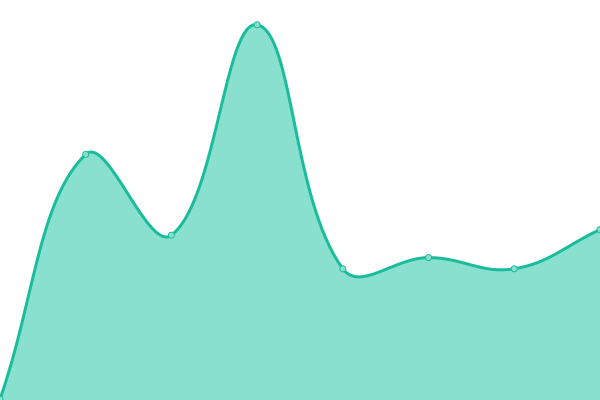 229ms
     
 | 

<a href="https://DELWP-DTV.github.io/santa/history/vic-data-farm-dam-points">100.00%</a>
    

|  [vic-data_planned-burns-2012-13-2014-152](https://opendata.maps.vic.gov.au/geoserver/wms?service=wms&request=getmap&format=image%2Fpng8&transparent=true&layers=open-data-platform:burnplan13&width=512&height=512&crs=epsg%3A3857&bbox=16114148.554967716%2C-4456584.4971389165%2C16119040.524777967%2C-4451692.527328665) | 🟩 Up | [vic-data-planned-burns-2012-13-2014-152.yml](https://github.com/DELWP-DTV/santa/commits/HEAD/history/vic-data-planned-burns-2012-13-2014-152.yml) | 

 182ms
     
 | 

<a href="https://DELWP-DTV.github.io/santa/history/vic-data-planned-burns-2012-13-2014-152">100.00%</a>
    

|  [vic-data_vicmap-index-vicmap-topographic-1-100000-map-index-polygon](https://opendata.maps.vic.gov.au/geoserver/wms?service=wms&request=getmap&format=image%2Fpng8&transparent=true&layers=open-data-platform:vicmap_mapindex_100d&width=512&height=512&crs=epsg%3A3857&bbox=16114148.554967716%2C-4456584.4971389165%2C16119040.524777967%2C-4451692.527328665) | 🟩 Up | [vic-data-vicmap-index-vicmap-topographic-1-100000-map-index-polygon.yml](https://github.com/DELWP-DTV/santa/commits/HEAD/history/vic-data-vicmap-index-vicmap-topographic-1-100000-map-index-polygon.yml) | 

 201ms
     
 | 

<a href="https://DELWP-DTV.github.io/santa/history/vic-data-vicmap-index-vicmap-topographic-1-100000-map-index-polygon">100.00%</a>
    

|  [vic-data_port-phillip-aids-to-navigation1](https://opendata.maps.vic.gov.au/geoserver/wms?service=wms&request=getmap&format=image%2Fpng8&transparent=true&layers=open-data-platform:port_phillip_aids_to_nav&width=512&height=512&crs=epsg%3A3857&bbox=16114148.554967716%2C-4456584.4971389165%2C16119040.524777967%2C-4451692.527328665) | 🟩 Up | [vic-data-port-phillip-aids-to-navigation1.yml](https://github.com/DELWP-DTV/santa/commits/HEAD/history/vic-data-port-phillip-aids-to-navigation1.yml) | 

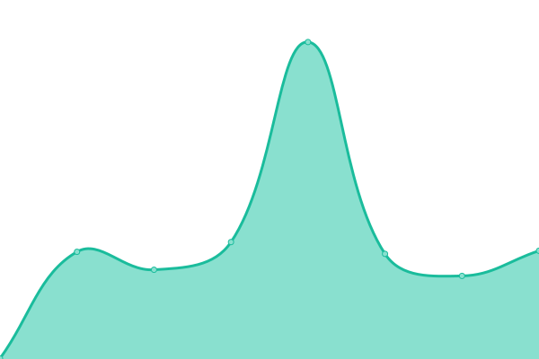 223ms
     
 | 

<a href="https://DELWP-DTV.github.io/santa/history/vic-data-port-phillip-aids-to-navigation1">100.00%</a>
    

|  [vic-data_coal-seam-and-overburden-thickness1](https://opendata.maps.vic.gov.au/geoserver/wms?service=wms&request=getmap&format=image%2Fpng8&transparent=true&layers=open-data-platform:coal_isopach&width=512&height=512&crs=epsg%3A3857&bbox=16114148.554967716%2C-4456584.4971389165%2C16119040.524777967%2C-4451692.527328665) | 🟩 Up | [vic-data-coal-seam-and-overburden-thickness1.yml](https://github.com/DELWP-DTV/santa/commits/HEAD/history/vic-data-coal-seam-and-overburden-thickness1.yml) | 

 216ms
     
 | 

<a href="https://DELWP-DTV.github.io/santa/history/vic-data-coal-seam-and-overburden-thickness1">100.00%</a>
    

|  [vic-data_vicmap-property-easement-approved-annotation-text-point3](https://opendata.maps.vic.gov.au/geoserver/wms?service=wms&request=getmap&format=image%2Fpng8&transparent=true&layers=open-data-platform:v_s_easement_approved_anno&width=512&height=512&crs=epsg%3A3857&bbox=16114148.554967716%2C-4456584.4971389165%2C16119040.524777967%2C-4451692.527328665) | 🟩 Up | [vic-data-vicmap-property-easement-approved-annotation-text-point3.yml](https://github.com/DELWP-DTV/santa/commits/HEAD/history/vic-data-vicmap-property-easement-approved-annotation-text-point3.yml) | 

 201ms
     
 | 

<a href="https://DELWP-DTV.github.io/santa/history/vic-data-vicmap-property-easement-approved-annotation-text-point3">100.00%</a>
    

|  [vic-data_melbourne-metro-tunnel-project-underground-rail-track2](https://opendata.maps.vic.gov.au/geoserver/wms?service=wms&request=getmap&format=image%2Fpng8&transparent=true&layers=open-data-platform:mtp_ees_underground_rail_track&width=512&height=512&crs=epsg%3A3857&bbox=16114148.554967716%2C-4456584.4971389165%2C16119040.524777967%2C-4451692.527328665) | 🟩 Up | [vic-data-melbourne-metro-tunnel-project-underground-rail-track2.yml](https://github.com/DELWP-DTV/santa/commits/HEAD/history/vic-data-melbourne-metro-tunnel-project-underground-rail-track2.yml) | 

 220ms
     
 | 

<a href="https://DELWP-DTV.github.io/santa/history/vic-data-melbourne-metro-tunnel-project-underground-rail-track2">100.00%</a>
    

|  [vic-data_vicmap-property-property-polygon-with-proposed-base-detail2](https://opendata.maps.vic.gov.au/geoserver/wms?service=wms&request=getmap&format=image%2Fpng8&transparent=true&layers=open-data-platform:v_s_property_base_proposed&width=512&height=512&crs=epsg%3A3857&bbox=16114148.554967716%2C-4456584.4971389165%2C16119040.524777967%2C-4451692.527328665) | 🟩 Up | [vic-data-vicmap-property-property-polygon-with-proposed-base-detail2.yml](https://github.com/DELWP-DTV/santa/commits/HEAD/history/vic-data-vicmap-property-property-polygon-with-proposed-base-detail2.yml) | 

 226ms
     
 | 

<a href="https://DELWP-DTV.github.io/santa/history/vic-data-vicmap-property-property-polygon-with-proposed-base-detail2">100.00%</a>
    

|  [vic-data_lineaments-interpreted-from-total-magnetic-intensity-tmi-data1](https://opendata.maps.vic.gov.au/geoserver/wms?service=wms&request=getmap&format=image%2Fpng8&transparent=true&layers=open-data-platform:lineaments_tmi&width=512&height=512&crs=epsg%3A3857&bbox=16114148.554967716%2C-4456584.4971389165%2C16119040.524777967%2C-4451692.527328665) | 🟩 Up | [vic-data-lineaments-interpreted-from-total-magnetic-intensity-tmi-data1.yml](https://github.com/DELWP-DTV/santa/commits/HEAD/history/vic-data-lineaments-interpreted-from-total-magnetic-intensity-tmi-data1.yml) | 

 203ms
     
 | 

<a href="https://DELWP-DTV.github.io/santa/history/vic-data-lineaments-interpreted-from-total-magnetic-intensity-tmi-data1">100.00%</a>
    

|  [vic-data_geological-rock-types-polygons-1-1000002](https://opendata.maps.vic.gov.au/geoserver/wms?service=wms&request=getmap&format=image%2Fpng8&transparent=true&layers=open-data-platform:geol100_polygon&width=512&height=512&crs=epsg%3A3857&bbox=16114148.554967716%2C-4456584.4971389165%2C16119040.524777967%2C-4451692.527328665) | 🟩 Up | [vic-data-geological-rock-types-polygons-1-1000002.yml](https://github.com/DELWP-DTV/santa/commits/HEAD/history/vic-data-geological-rock-types-polygons-1-1000002.yml) | 

 224ms
     
 | 

<a href="https://DELWP-DTV.github.io/santa/history/vic-data-geological-rock-types-polygons-1-1000002">100.00%</a>
    

|  [vic-data_coal-to-waste-ratio](https://opendata.maps.vic.gov.au/geoserver/wms?service=wms&request=getmap&format=image%2Fpng8&transparent=true&layers=open-data-platform:coal_res&width=512&height=512&crs=epsg%3A3857&bbox=16114148.554967716%2C-4456584.4971389165%2C16119040.524777967%2C-4451692.527328665) | 🟩 Up | [vic-data-coal-to-waste-ratio.yml](https://github.com/DELWP-DTV/santa/commits/HEAD/history/vic-data-coal-to-waste-ratio.yml) | 

 220ms
     
 | 

<a href="https://DELWP-DTV.github.io/santa/history/vic-data-coal-to-waste-ratio">100.00%</a>
    

|  [vic-data_victorian-rail-trails-recreation-trails2](https://opendata.maps.vic.gov.au/geoserver/wms?service=wms&request=getmap&format=image%2Fpng8&transparent=true&layers=open-data-platform:vic_rail_trails&width=512&height=512&crs=epsg%3A3857&bbox=16114148.554967716%2C-4456584.4971389165%2C16119040.524777967%2C-4451692.527328665) | 🟩 Up | [vic-data-victorian-rail-trails-recreation-trails2.yml](https://github.com/DELWP-DTV/santa/commits/HEAD/history/vic-data-victorian-rail-trails-recreation-trails2.yml) | 

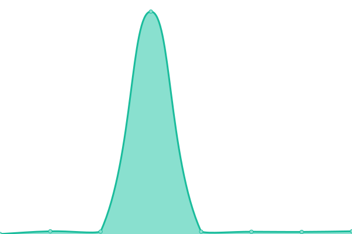 203ms
     
 | 

<a href="https://DELWP-DTV.github.io/santa/history/vic-data-victorian-rail-trails-recreation-trails2">100.00%</a>
    

|  [vic-data_potential-groundwater-dependent-ecosystem-gde-mapping-for-the-mallee-cma1](https://opendata.maps.vic.gov.au/geoserver/wms?service=wms&request=getmap&format=image%2Fpng8&transparent=true&layers=open-data-platform:gde_terr_mcma&width=512&height=512&crs=epsg%3A3857&bbox=16114148.554967716%2C-4456584.4971389165%2C16119040.524777967%2C-4451692.527328665) | 🟩 Up | [vic-data-potential-groundwater-dependent-ecosystem-gde-mapping-for-the-mallee-cma1.yml](https://github.com/DELWP-DTV/santa/commits/HEAD/history/vic-data-potential-groundwater-dependent-ecosystem-gde-mapping-for-the-mallee-cma1.yml) | 

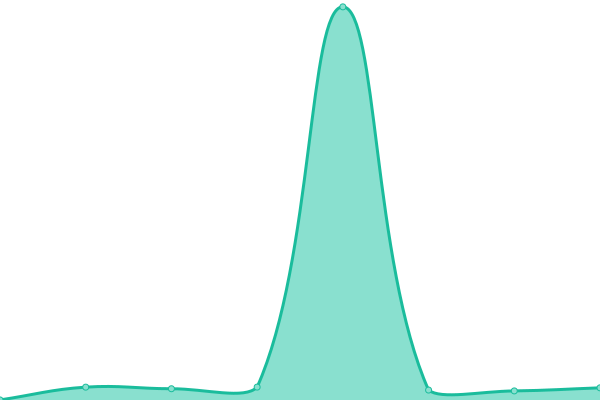 219ms
     
 | 

<a href="https://DELWP-DTV.github.io/santa/history/vic-data-potential-groundwater-dependent-ecosystem-gde-mapping-for-the-mallee-cma1">100.00%</a>
    

|  [vic-data_recreation-carpark4](https://opendata.maps.vic.gov.au/geoserver/wms?service=wms&request=getmap&format=image%2Fpng8&transparent=true&layers=open-data-platform:recweb_carpark&width=512&height=512&crs=epsg%3A3857&bbox=16114148.554967716%2C-4456584.4971389165%2C16119040.524777967%2C-4451692.527328665) | 🟩 Up | [vic-data-recreation-carpark4.yml](https://github.com/DELWP-DTV/santa/commits/HEAD/history/vic-data-recreation-carpark4.yml) | 

 215ms
     
 | 

<a href="https://DELWP-DTV.github.io/santa/history/vic-data-recreation-carpark4">100.00%</a>
    

|  [vic-data_geological-units-represented-as-two-dimensional-polygons-1-500001](https://opendata.maps.vic.gov.au/geoserver/wms?service=wms&request=getmap&format=image%2Fpng8&transparent=true&layers=open-data-platform:sg_geological_unit_50k&width=512&height=512&crs=epsg%3A3857&bbox=16114148.554967716%2C-4456584.4971389165%2C16119040.524777967%2C-4451692.527328665) | 🟩 Up | [vic-data-geological-units-represented-as-two-dimensional-polygons-1-500001.yml](https://github.com/DELWP-DTV/santa/commits/HEAD/history/vic-data-geological-units-represented-as-two-dimensional-polygons-1-500001.yml) | 

 242ms
     
 | 

<a href="https://DELWP-DTV.github.io/santa/history/vic-data-geological-units-represented-as-two-dimensional-polygons-1-500001">100.00%</a>
    

|  [vic-data_monitoring-points-from-the-victorian-water-resources-data-warehouse-obsolete-please-use-gw_site](https://opendata.maps.vic.gov.au/geoserver/wms?service=wms&request=getmap&format=image%2Fpng8&transparent=true&layers=open-data-platform:dw_points&width=512&height=512&crs=epsg%3A3857&bbox=16114148.554967716%2C-4456584.4971389165%2C16119040.524777967%2C-4451692.527328665) | 🟩 Up | [vic-data-monitoring-points-from-the-victorian-water-resources-data-warehouse-obsolete-please-use-gw-site.yml](https://github.com/DELWP-DTV/santa/commits/HEAD/history/vic-data-monitoring-points-from-the-victorian-water-resources-data-warehouse-obsolete-please-use-gw-site.yml) | 

 220ms
     
 | 

<a href="https://DELWP-DTV.github.io/santa/history/vic-data-monitoring-points-from-the-victorian-water-resources-data-warehouse-obsolete-please-use-gw-site">100.00%</a>
    

|  [vic-data_lineaments-interpreted-from-radiometric-data1](https://opendata.maps.vic.gov.au/geoserver/wms?service=wms&request=getmap&format=image%2Fpng8&transparent=true&layers=open-data-platform:lineaments_radio&width=512&height=512&crs=epsg%3A3857&bbox=16114148.554967716%2C-4456584.4971389165%2C16119040.524777967%2C-4451692.527328665) | 🟩 Up | [vic-data-lineaments-interpreted-from-radiometric-data1.yml](https://github.com/DELWP-DTV/santa/commits/HEAD/history/vic-data-lineaments-interpreted-from-radiometric-data1.yml) | 

 210ms
     
 | 

<a href="https://DELWP-DTV.github.io/santa/history/vic-data-lineaments-interpreted-from-radiometric-data1">100.00%</a>
    

|  [vic-data_mullock-polygons-1-100-000](https://opendata.maps.vic.gov.au/geoserver/wms?service=wms&request=getmap&format=image%2Fpng8&transparent=true&layers=open-data-platform:mullock100_polygon&width=512&height=512&crs=epsg%3A3857&bbox=16114148.554967716%2C-4456584.4971389165%2C16119040.524777967%2C-4451692.527328665) | 🟩 Up | [vic-data-mullock-polygons-1-100-000.yml](https://github.com/DELWP-DTV/santa/commits/HEAD/history/vic-data-mullock-polygons-1-100-000.yml) | 

 218ms
     
 | 

<a href="https://DELWP-DTV.github.io/santa/history/vic-data-mullock-polygons-1-100-000">100.00%</a>
    

|  [vic-data_deep-lead-lines1](https://opendata.maps.vic.gov.au/geoserver/wms?service=wms&request=getmap&format=image%2Fpng8&transparent=true&layers=open-data-platform:dll&width=512&height=512&crs=epsg%3A3857&bbox=16114148.554967716%2C-4456584.4971389165%2C16119040.524777967%2C-4451692.527328665) | 🟩 Up | [vic-data-deep-lead-lines1.yml](https://github.com/DELWP-DTV/santa/commits/HEAD/history/vic-data-deep-lead-lines1.yml) | 

 213ms
     
 | 

<a href="https://DELWP-DTV.github.io/santa/history/vic-data-deep-lead-lines1">100.00%</a>
    

|  [vic-data_victorian-railway-stations2](https://opendata.maps.vic.gov.au/geoserver/wms?service=wms&request=getmap&format=image%2Fpng8&transparent=true&layers=open-data-platform:vic_railway_stations&width=512&height=512&crs=epsg%3A3857&bbox=16114148.554967716%2C-4456584.4971389165%2C16119040.524777967%2C-4451692.527328665) | 🟩 Up | [vic-data-victorian-railway-stations2.yml](https://github.com/DELWP-DTV/santa/commits/HEAD/history/vic-data-victorian-railway-stations2.yml) | 

 200ms
     
 | 

<a href="https://DELWP-DTV.github.io/santa/history/vic-data-victorian-railway-stations2">100.00%</a>
    

|  [vic-data_ptv-train-corridor-centreline1](https://opendata.maps.vic.gov.au/geoserver/wms?service=wms&request=getmap&format=image%2Fpng8&transparent=true&layers=open-data-platform:ptv_train_corridor_centreline&width=512&height=512&crs=epsg%3A3857&bbox=16114148.554967716%2C-4456584.4971389165%2C16119040.524777967%2C-4451692.527328665) | 🟩 Up | [vic-data-ptv-train-corridor-centreline1.yml](https://github.com/DELWP-DTV/santa/commits/HEAD/history/vic-data-ptv-train-corridor-centreline1.yml) | 

 218ms
     
 | 

<a href="https://DELWP-DTV.github.io/santa/history/vic-data-ptv-train-corridor-centreline1">100.00%</a>
    

|  [vic-data_vicmap-admin-ward-polygon-20208](https://opendata.maps.vic.gov.au/geoserver/wms?service=wms&request=getmap&format=image%2Fpng8&transparent=true&layers=open-data-platform:ward_2020&width=512&height=512&crs=epsg%3A3857&bbox=16114148.554967716%2C-4456584.4971389165%2C16119040.524777967%2C-4451692.527328665) | 🟩 Up | [vic-data-vicmap-admin-ward-polygon-20208.yml](https://github.com/DELWP-DTV/santa/commits/HEAD/history/vic-data-vicmap-admin-ward-polygon-20208.yml) | 

 237ms
     
 | 

<a href="https://DELWP-DTV.github.io/santa/history/vic-data-vicmap-admin-ward-polygon-20208">100.00%</a>
    

|  [vic-data_regolith-regional-duricrust-lines-1-1000002](https://opendata.maps.vic.gov.au/geoserver/wms?service=wms&request=getmap&format=image%2Fpng8&transparent=true&layers=open-data-platform:rrduri100_arc&width=512&height=512&crs=epsg%3A3857&bbox=16114148.554967716%2C-4456584.4971389165%2C16119040.524777967%2C-4451692.527328665) | 🟩 Up | [vic-data-regolith-regional-duricrust-lines-1-1000002.yml](https://github.com/DELWP-DTV/santa/commits/HEAD/history/vic-data-regolith-regional-duricrust-lines-1-1000002.yml) | 

 204ms
     
 | 

<a href="https://DELWP-DTV.github.io/santa/history/vic-data-regolith-regional-duricrust-lines-1-1000002">100.00%</a>
    

|  [vic-data_recreation-assets1](https://opendata.maps.vic.gov.au/geoserver/wms?service=wms&request=getmap&format=image%2Fpng8&transparent=true&layers=open-data-platform:recweb_asset&width=512&height=512&crs=epsg%3A3857&bbox=16114148.554967716%2C-4456584.4971389165%2C16119040.524777967%2C-4451692.527328665) | 🟩 Up | [vic-data-recreation-assets1.yml](https://github.com/DELWP-DTV/santa/commits/HEAD/history/vic-data-recreation-assets1.yml) | 

 220ms
     
 | 

<a href="https://DELWP-DTV.github.io/santa/history/vic-data-recreation-assets1">100.00%</a>
    

|  [vic-data_coal-seam-and-basement-roof1](https://opendata.maps.vic.gov.au/geoserver/wms?service=wms&request=getmap&format=image%2Fpng8&transparent=true&layers=open-data-platform:coal_roof&width=512&height=512&crs=epsg%3A3857&bbox=16114148.554967716%2C-4456584.4971389165%2C16119040.524777967%2C-4451692.527328665) | 🟩 Up | [vic-data-coal-seam-and-basement-roof1.yml](https://github.com/DELWP-DTV/santa/commits/HEAD/history/vic-data-coal-seam-and-basement-roof1.yml) | 

 298ms
     
 | 

<a href="https://DELWP-DTV.github.io/santa/history/vic-data-coal-seam-and-basement-roof1">100.00%</a>
    

|  [vic-data_geophysical-structure-lines-1-100000-geophysical-interpretation-of-linear-structural-features2](https://opendata.maps.vic.gov.au/geoserver/wms?service=wms&request=getmap&format=image%2Fpng8&transparent=true&layers=open-data-platform:gpstrline100&width=512&height=512&crs=epsg%3A3857&bbox=16114148.554967716%2C-4456584.4971389165%2C16119040.524777967%2C-4451692.527328665) | 🟩 Up | [vic-data-geophysical-structure-lines-1-100000-geophysical-interpretation-of-linear-structural-features2.yml](https://github.com/DELWP-DTV/santa/commits/HEAD/history/vic-data-geophysical-structure-lines-1-100000-geophysical-interpretation-of-linear-structural-features2.yml) | 

 201ms
     
 | 

<a href="https://DELWP-DTV.github.io/santa/history/vic-data-geophysical-structure-lines-1-100000-geophysical-interpretation-of-linear-structural-features2">100.00%</a>
    

|  [vic-data_gravity-reading-locations-and-measurement2](https://opendata.maps.vic.gov.au/geoserver/wms?service=wms&request=getmap&format=image%2Fpng8&transparent=true&layers=open-data-platform:gravity&width=512&height=512&crs=epsg%3A3857&bbox=16114148.554967716%2C-4456584.4971389165%2C16119040.524777967%2C-4451692.527328665) | 🟩 Up | [vic-data-gravity-reading-locations-and-measurement2.yml](https://github.com/DELWP-DTV/santa/commits/HEAD/history/vic-data-gravity-reading-locations-and-measurement2.yml) | 

 215ms
     
 | 

<a href="https://DELWP-DTV.github.io/santa/history/vic-data-gravity-reading-locations-and-measurement2">100.00%</a>
    

|  [vic-data_vicmap-lite-postcode-polygon-1-250000-to-1-5000000](https://opendata.maps.vic.gov.au/geoserver/wms?service=wms&request=getmap&format=image%2Fpng8&transparent=true&layers=open-data-platform:vmlite_postcode_polygon&width=512&height=512&crs=epsg%3A3857&bbox=16114148.554967716%2C-4456584.4971389165%2C16119040.524777967%2C-4451692.527328665) | 🟩 Up | [vic-data-vicmap-lite-postcode-polygon-1-250000-to-1-5000000.yml](https://github.com/DELWP-DTV/santa/commits/HEAD/history/vic-data-vicmap-lite-postcode-polygon-1-250000-to-1-5000000.yml) | 

 252ms
     
 | 

<a href="https://DELWP-DTV.github.io/santa/history/vic-data-vicmap-lite-postcode-polygon-1-250000-to-1-5000000">100.00%</a>
    

|  [vic-data_geological-rock-types-lines-1-100000](https://opendata.maps.vic.gov.au/geoserver/wms?service=wms&request=getmap&format=image%2Fpng8&transparent=true&layers=open-data-platform:geol100_arc&width=512&height=512&crs=epsg%3A3857&bbox=16114148.554967716%2C-4456584.4971389165%2C16119040.524777967%2C-4451692.527328665) | 🟩 Up | [vic-data-geological-rock-types-lines-1-100000.yml](https://github.com/DELWP-DTV/santa/commits/HEAD/history/vic-data-geological-rock-types-lines-1-100000.yml) | 

 198ms
     
 | 

<a href="https://DELWP-DTV.github.io/santa/history/vic-data-geological-rock-types-lines-1-100000">100.00%</a>
    

|  [vic-data_vicmap-admin-emergency-management-region-polygon1](https://opendata.maps.vic.gov.au/geoserver/wms?service=wms&request=getmap&format=image%2Fpng8&transparent=true&layers=open-data-platform:emergency_management_region&width=512&height=512&crs=epsg%3A3857&bbox=16114148.554967716%2C-4456584.4971389165%2C16119040.524777967%2C-4451692.527328665) | 🟩 Up | [vic-data-vicmap-admin-emergency-management-region-polygon1.yml](https://github.com/DELWP-DTV/santa/commits/HEAD/history/vic-data-vicmap-admin-emergency-management-region-polygon1.yml) | 

 349ms
     
 | 

<a href="https://DELWP-DTV.github.io/santa/history/vic-data-vicmap-admin-emergency-management-region-polygon1">100.00%</a>
    

|  [vic-data_vicmap-lite-public-land-classification-polygon-1-250000-to-1-20000001](https://opendata.maps.vic.gov.au/geoserver/wms?service=wms&request=getmap&format=image%2Fpng8&transparent=true&layers=open-data-platform:vmlite_public_land_su5&width=512&height=512&crs=epsg%3A3857&bbox=16114148.554967716%2C-4456584.4971389165%2C16119040.524777967%2C-4451692.527328665) | 🟩 Up | [vic-data-vicmap-lite-public-land-classification-polygon-1-250000-to-1-20000001.yml](https://github.com/DELWP-DTV/santa/commits/HEAD/history/vic-data-vicmap-lite-public-land-classification-polygon-1-250000-to-1-20000001.yml) | 

 215ms
     
 | 

<a href="https://DELWP-DTV.github.io/santa/history/vic-data-vicmap-lite-public-land-classification-polygon-1-250000-to-1-20000001">100.00%</a>
    

|  [vic-data_geological-boundaries-represented-as-two-dimensional-lines-1-500001](https://opendata.maps.vic.gov.au/geoserver/wms?service=wms&request=getmap&format=image%2Fpng8&transparent=true&layers=open-data-platform:sg_geol_unit_contact_50k&width=512&height=512&crs=epsg%3A3857&bbox=16114148.554967716%2C-4456584.4971389165%2C16119040.524777967%2C-4451692.527328665) | 🟩 Up | [vic-data-geological-boundaries-represented-as-two-dimensional-lines-1-500001.yml](https://github.com/DELWP-DTV/santa/commits/HEAD/history/vic-data-geological-boundaries-represented-as-two-dimensional-lines-1-500001.yml) | 

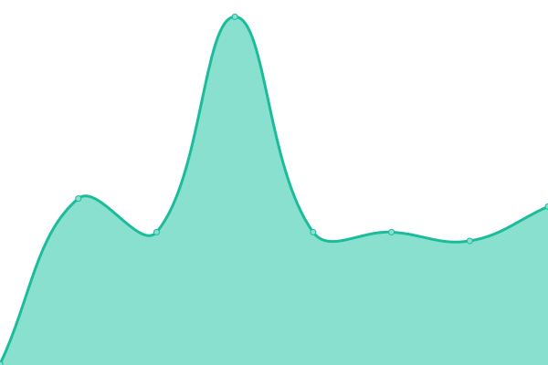 208ms
     
 | 

<a href="https://DELWP-DTV.github.io/santa/history/vic-data-geological-boundaries-represented-as-two-dimensional-lines-1-500001">100.00%</a>
    

|  [vic-data_ptv-skybus-stops1](https://opendata.maps.vic.gov.au/geoserver/wms?service=wms&request=getmap&format=image%2Fpng8&transparent=true&layers=open-data-platform:ptv_skybus_stop&width=512&height=512&crs=epsg%3A3857&bbox=16114148.554967716%2C-4456584.4971389165%2C16119040.524777967%2C-4451692.527328665) | 🟩 Up | [vic-data-ptv-skybus-stops1.yml](https://github.com/DELWP-DTV/santa/commits/HEAD/history/vic-data-ptv-skybus-stops1.yml) | 

 219ms
     
 | 

<a href="https://DELWP-DTV.github.io/santa/history/vic-data-ptv-skybus-stops1">100.00%</a>
    

|  [vic-data_potential-groundwater-dependent-ecosystem-gde-mapping-for-the-goulburn-broken-cma4](https://opendata.maps.vic.gov.au/geoserver/wms?service=wms&request=getmap&format=image%2Fpng8&transparent=true&layers=open-data-platform:gde_terr_gbcma&width=512&height=512&crs=epsg%3A3857&bbox=16114148.554967716%2C-4456584.4971389165%2C16119040.524777967%2C-4451692.527328665) | 🟩 Up | [vic-data-potential-groundwater-dependent-ecosystem-gde-mapping-for-the-goulburn-broken-cma4.yml](https://github.com/DELWP-DTV/santa/commits/HEAD/history/vic-data-potential-groundwater-dependent-ecosystem-gde-mapping-for-the-goulburn-broken-cma4.yml) | 

 218ms
     
 | 

<a href="https://DELWP-DTV.github.io/santa/history/vic-data-potential-groundwater-dependent-ecosystem-gde-mapping-for-the-goulburn-broken-cma4">100.00%</a>
    

|  [vic-data_groundwater-surface-water-interaction2](https://opendata.maps.vic.gov.au/geoserver/wms?service=wms&request=getmap&format=image%2Fpng8&transparent=true&layers=open-data-platform:gw_sw_interaction&width=512&height=512&crs=epsg%3A3857&bbox=16114148.554967716%2C-4456584.4971389165%2C16119040.524777967%2C-4451692.527328665) | 🟩 Up | [vic-data-groundwater-surface-water-interaction2.yml](https://github.com/DELWP-DTV/santa/commits/HEAD/history/vic-data-groundwater-surface-water-interaction2.yml) | 

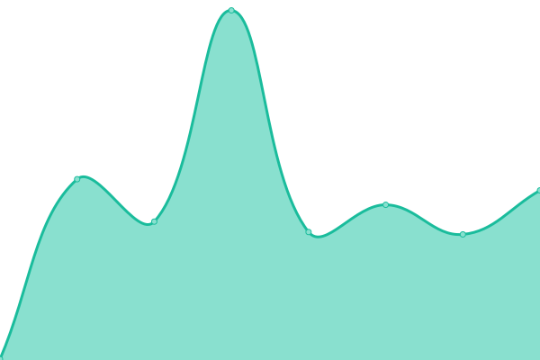 199ms
     
 | 

<a href="https://DELWP-DTV.github.io/santa/history/vic-data-groundwater-surface-water-interaction2">100.00%</a>
    

|  [vic-data_volcanic-eruption-points2](https://opendata.maps.vic.gov.au/geoserver/wms?service=wms&request=getmap&format=image%2Fpng8&transparent=true&layers=open-data-platform:eruption_pts&width=512&height=512&crs=epsg%3A3857&bbox=16114148.554967716%2C-4456584.4971389165%2C16119040.524777967%2C-4451692.527328665) | 🟩 Up | [vic-data-volcanic-eruption-points2.yml](https://github.com/DELWP-DTV/santa/commits/HEAD/history/vic-data-volcanic-eruption-points2.yml) | 

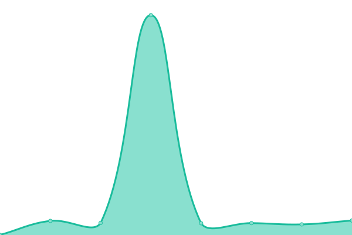 221ms
     
 | 

<a href="https://DELWP-DTV.github.io/santa/history/vic-data-volcanic-eruption-points2">100.00%</a>
    

|  [vic-data_ptv-train-track-centreline1](https://opendata.maps.vic.gov.au/geoserver/wms?service=wms&request=getmap&format=image%2Fpng8&transparent=true&layers=open-data-platform:ptv_train_track_centreline&width=512&height=512&crs=epsg%3A3857&bbox=16114148.554967716%2C-4456584.4971389165%2C16119040.524777967%2C-4451692.527328665) | 🟩 Up | [vic-data-ptv-train-track-centreline1.yml](https://github.com/DELWP-DTV/santa/commits/HEAD/history/vic-data-ptv-train-track-centreline1.yml) | 

 214ms
     
 | 

<a href="https://DELWP-DTV.github.io/santa/history/vic-data-ptv-train-track-centreline1">100.00%</a>
    

|  [vic-data_biologically-important-areas](https://opendata.maps.vic.gov.au/geoserver/wms?service=wms&request=getmap&format=image%2Fpng8&transparent=true&layers=open-data-platform:biologically_important_areas&width=512&height=512&crs=epsg%3A3857&bbox=16114148.554967716%2C-4456584.4971389165%2C16119040.524777967%2C-4451692.527328665) | 🟩 Up | [vic-data-biologically-important-areas.yml](https://github.com/DELWP-DTV/santa/commits/HEAD/history/vic-data-biologically-important-areas.yml) | 

 342ms
     
 | 

<a href="https://DELWP-DTV.github.io/santa/history/vic-data-biologically-important-areas">100.00%</a>
    

|  [vic-data_geophysical-structure-lines-1-250000-geophysical-interpretation-of-linear-structural-features1](https://opendata.maps.vic.gov.au/geoserver/wms?service=wms&request=getmap&format=image%2Fpng8&transparent=true&layers=open-data-platform:gpstrline250&width=512&height=512&crs=epsg%3A3857&bbox=16114148.554967716%2C-4456584.4971389165%2C16119040.524777967%2C-4451692.527328665) | 🟩 Up | [vic-data-geophysical-structure-lines-1-250000-geophysical-interpretation-of-linear-structural-features1.yml](https://github.com/DELWP-DTV/santa/commits/HEAD/history/vic-data-geophysical-structure-lines-1-250000-geophysical-interpretation-of-linear-structural-features1.yml) | 

 219ms
     
 | 

<a href="https://DELWP-DTV.github.io/santa/history/vic-data-geophysical-structure-lines-1-250000-geophysical-interpretation-of-linear-structural-features1">100.00%</a>
    

|  [vic-data_vicmap-lite-victorian-government-region-polygon-1-250000-to-1-50000001](https://opendata.maps.vic.gov.au/geoserver/wms?service=wms&request=getmap&format=image%2Fpng8&transparent=true&layers=open-data-platform:vmlite_vicgov_region&width=512&height=512&crs=epsg%3A3857&bbox=16114148.554967716%2C-4456584.4971389165%2C16119040.524777967%2C-4451692.527328665) | 🟩 Up | [vic-data-vicmap-lite-victorian-government-region-polygon-1-250000-to-1-50000001.yml](https://github.com/DELWP-DTV/santa/commits/HEAD/history/vic-data-vicmap-lite-victorian-government-region-polygon-1-250000-to-1-50000001.yml) | 

 233ms
     
 | 

<a href="https://DELWP-DTV.github.io/santa/history/vic-data-vicmap-lite-victorian-government-region-polygon-1-250000-to-1-50000001">100.00%</a>
    

|  [vic-data_aquifer-salinity-bedrock2](https://opendata.maps.vic.gov.au/geoserver/wms?service=wms&request=getmap&format=image%2Fpng8&transparent=true&layers=open-data-platform:aquifer_sal_bed&width=512&height=512&crs=epsg%3A3857&bbox=16114148.554967716%2C-4456584.4971389165%2C16119040.524777967%2C-4451692.527328665) | 🟩 Up | [vic-data-aquifer-salinity-bedrock2.yml](https://github.com/DELWP-DTV/santa/commits/HEAD/history/vic-data-aquifer-salinity-bedrock2.yml) | 

 204ms
     
 | 

<a href="https://DELWP-DTV.github.io/santa/history/vic-data-aquifer-salinity-bedrock2">100.00%</a>
    

|  [vic-data_alluvial-mineralisation-and-mined-alluvial-workings-line-1-100-0001](https://opendata.maps.vic.gov.au/geoserver/wms?service=wms&request=getmap&format=image%2Fpng8&transparent=true&layers=open-data-platform:shalld100_arc&width=512&height=512&crs=epsg%3A3857&bbox=16114148.554967716%2C-4456584.4971389165%2C16119040.524777967%2C-4451692.527328665) | 🟩 Up | [vic-data-alluvial-mineralisation-and-mined-alluvial-workings-line-1-100-0001.yml](https://github.com/DELWP-DTV/santa/commits/HEAD/history/vic-data-alluvial-mineralisation-and-mined-alluvial-workings-line-1-100-0001.yml) | 

 221ms
     
 | 

<a href="https://DELWP-DTV.github.io/santa/history/vic-data-alluvial-mineralisation-and-mined-alluvial-workings-line-1-100-0001">100.00%</a>
    

|  [vic-data_linear-geological-structures-1-1000001](https://opendata.maps.vic.gov.au/geoserver/wms?service=wms&request=getmap&format=image%2Fpng8&transparent=true&layers=open-data-platform:strline100&width=512&height=512&crs=epsg%3A3857&bbox=16114148.554967716%2C-4456584.4971389165%2C16119040.524777967%2C-4451692.527328665) | 🟩 Up | [vic-data-linear-geological-structures-1-1000001.yml](https://github.com/DELWP-DTV/santa/commits/HEAD/history/vic-data-linear-geological-structures-1-1000001.yml) | 

 219ms
     
 | 

<a href="https://DELWP-DTV.github.io/santa/history/vic-data-linear-geological-structures-1-1000001">100.00%</a>
    

|  [vic-data_recreation-photo-extra](https://opendata.maps.vic.gov.au/geoserver/wms?service=wms&request=getmap&format=image%2Fpng8&transparent=true&layers=open-data-platform:recweb_photo_extra&width=512&height=512&crs=epsg%3A3857&bbox=16114148.554967716%2C-4456584.4971389165%2C16119040.524777967%2C-4451692.527328665) | 🟩 Up | [vic-data-recreation-photo-extra.yml](https://github.com/DELWP-DTV/santa/commits/HEAD/history/vic-data-recreation-photo-extra.yml) | 

 217ms
     
 | 

<a href="https://DELWP-DTV.github.io/santa/history/vic-data-recreation-photo-extra">100.00%</a>
    

|  [vic-data_interpreted-faults-top-golden-beach-formation-gippsland-basin1](https://opendata.maps.vic.gov.au/geoserver/wms?service=wms&request=getmap&format=image%2Fpng8&transparent=true&layers=open-data-platform:faults_golden_beach_fm&width=512&height=512&crs=epsg%3A3857&bbox=16114148.554967716%2C-4456584.4971389165%2C16119040.524777967%2C-4451692.527328665) | 🟩 Up | [vic-data-interpreted-faults-top-golden-beach-formation-gippsland-basin1.yml](https://github.com/DELWP-DTV/santa/commits/HEAD/history/vic-data-interpreted-faults-top-golden-beach-formation-gippsland-basin1.yml) | 

 222ms
     
 | 

<a href="https://DELWP-DTV.github.io/santa/history/vic-data-interpreted-faults-top-golden-beach-formation-gippsland-basin1">100.00%</a>
    

|  [vic-data_mineral-springs2](https://opendata.maps.vic.gov.au/geoserver/wms?service=wms&request=getmap&format=image%2Fpng8&transparent=true&layers=open-data-platform:springs&width=512&height=512&crs=epsg%3A3857&bbox=16114148.554967716%2C-4456584.4971389165%2C16119040.524777967%2C-4451692.527328665) | 🟩 Up | [vic-data-mineral-springs2.yml](https://github.com/DELWP-DTV/santa/commits/HEAD/history/vic-data-mineral-springs2.yml) | 

 225ms
     
 | 

<a href="https://DELWP-DTV.github.io/santa/history/vic-data-mineral-springs2">100.00%</a>
    

|  [vic-data_vicmap-lite-road-line-1-250000-to-1-50000001](https://opendata.maps.vic.gov.au/geoserver/wms?service=wms&request=getmap&format=image%2Fpng8&transparent=true&layers=open-data-platform:vmlite_tr_road&width=512&height=512&crs=epsg%3A3857&bbox=16114148.554967716%2C-4456584.4971389165%2C16119040.524777967%2C-4451692.527328665) | 🟩 Up | [vic-data-vicmap-lite-road-line-1-250000-to-1-50000001.yml](https://github.com/DELWP-DTV/santa/commits/HEAD/history/vic-data-vicmap-lite-road-line-1-250000-to-1-50000001.yml) | 

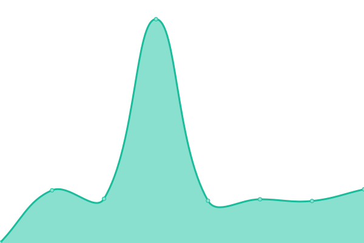 212ms
     
 | 

<a href="https://DELWP-DTV.github.io/santa/history/vic-data-vicmap-lite-road-line-1-250000-to-1-50000001">100.00%</a>
    

|  [vic-data_regolith-regional-duricrust-polygons-1-1000001](https://opendata.maps.vic.gov.au/geoserver/wms?service=wms&request=getmap&format=image%2Fpng8&transparent=true&layers=open-data-platform:rrduri100_polygon&width=512&height=512&crs=epsg%3A3857&bbox=16114148.554967716%2C-4456584.4971389165%2C16119040.524777967%2C-4451692.527328665) | 🟩 Up | [vic-data-regolith-regional-duricrust-polygons-1-1000001.yml](https://github.com/DELWP-DTV/santa/commits/HEAD/history/vic-data-regolith-regional-duricrust-polygons-1-1000001.yml) | 

 220ms
     
 | 

<a href="https://DELWP-DTV.github.io/santa/history/vic-data-regolith-regional-duricrust-polygons-1-1000001">100.00%</a>
    

|  [vic-data_vicmap-admin-ward-polygon-20121](https://opendata.maps.vic.gov.au/geoserver/wms?service=wms&request=getmap&format=image%2Fpng8&transparent=true&layers=open-data-platform:ward_2012&width=512&height=512&crs=epsg%3A3857&bbox=16114148.554967716%2C-4456584.4971389165%2C16119040.524777967%2C-4451692.527328665) | 🟩 Up | [vic-data-vicmap-admin-ward-polygon-20121.yml](https://github.com/DELWP-DTV/santa/commits/HEAD/history/vic-data-vicmap-admin-ward-polygon-20121.yml) | 

 226ms
     
 | 

<a href="https://DELWP-DTV.github.io/santa/history/vic-data-vicmap-admin-ward-polygon-20121">100.00%</a>
    

|  [vic-data_vicmap-lite-forest-polygon-1-250000-to-1-1000000](https://opendata.maps.vic.gov.au/geoserver/wms?service=wms&request=getmap&format=image%2Fpng8&transparent=true&layers=open-data-platform:vmlite_forest_su5&width=512&height=512&crs=epsg%3A3857&bbox=16114148.554967716%2C-4456584.4971389165%2C16119040.524777967%2C-4451692.527328665) | 🟩 Up | [vic-data-vicmap-lite-forest-polygon-1-250000-to-1-1000000.yml](https://github.com/DELWP-DTV/santa/commits/HEAD/history/vic-data-vicmap-lite-forest-polygon-1-250000-to-1-1000000.yml) | 

 201ms
     
 | 

<a href="https://DELWP-DTV.github.io/santa/history/vic-data-vicmap-lite-forest-polygon-1-250000-to-1-1000000">100.00%</a>
    

|  [vic-data_urban-development-program-proposed-industrial-areas-2016](https://opendata.maps.vic.gov.au/geoserver/wms?service=wms&request=getmap&format=image%2Fpng8&transparent=true&layers=open-data-platform:ind2016_proposed_areas&width=512&height=512&crs=epsg%3A3857&bbox=16114148.554967716%2C-4456584.4971389165%2C16119040.524777967%2C-4451692.527328665) | 🟩 Up | [vic-data-urban-development-program-proposed-industrial-areas-2016.yml](https://github.com/DELWP-DTV/santa/commits/HEAD/history/vic-data-urban-development-program-proposed-industrial-areas-2016.yml) | 

 227ms
     
 | 

<a href="https://DELWP-DTV.github.io/santa/history/vic-data-urban-development-program-proposed-industrial-areas-2016">100.00%</a>
    

|  [vic-data_vicforests-allocation-april-20191](https://opendata.maps.vic.gov.au/geoserver/wms?service=wms&request=getmap&format=image%2Fpng8&transparent=true&layers=open-data-platform:vicforests_allocation_apr2019&width=512&height=512&crs=epsg%3A3857&bbox=16114148.554967716%2C-4456584.4971389165%2C16119040.524777967%2C-4451692.527328665) | 🟩 Up | [vic-data-vicforests-allocation-april-20191.yml](https://github.com/DELWP-DTV/santa/commits/HEAD/history/vic-data-vicforests-allocation-april-20191.yml) | 

 182ms
     
 | 

<a href="https://DELWP-DTV.github.io/santa/history/vic-data-vicforests-allocation-april-20191">100.00%</a>
    

|  [vic-data_baseflow-separation-analysis-for-unregulated-rivers-1889-to-20121](https://opendata.maps.vic.gov.au/geoserver/wms?service=wms&request=getmap&format=image%2Fpng8&transparent=true&layers=open-data-platform:bfi_unreg_rivers_1889_2012&width=512&height=512&crs=epsg%3A3857&bbox=16114148.554967716%2C-4456584.4971389165%2C16119040.524777967%2C-4451692.527328665) | 🟩 Up | [vic-data-baseflow-separation-analysis-for-unregulated-rivers-1889-to-20121.yml](https://github.com/DELWP-DTV/santa/commits/HEAD/history/vic-data-baseflow-separation-analysis-for-unregulated-rivers-1889-to-20121.yml) | 

 206ms
     
 | 

<a href="https://DELWP-DTV.github.io/santa/history/vic-data-baseflow-separation-analysis-for-unregulated-rivers-1889-to-20121">100.00%</a>
    

|  [vic-data_urban-development-program-industrial-land-201611](https://opendata.maps.vic.gov.au/geoserver/wms?service=wms&request=getmap&format=image%2Fpng8&transparent=true&layers=open-data-platform:ind2016&width=512&height=512&crs=epsg%3A3857&bbox=16114148.554967716%2C-4456584.4971389165%2C16119040.524777967%2C-4451692.527328665) | 🟩 Up | [vic-data-urban-development-program-industrial-land-201611.yml](https://github.com/DELWP-DTV/santa/commits/HEAD/history/vic-data-urban-development-program-industrial-land-201611.yml) | 

 328ms
     
 | 

<a href="https://DELWP-DTV.github.io/santa/history/vic-data-urban-development-program-industrial-land-201611">100.00%</a>
    

|  [vic-data_beneficial-use-lower-tertiary1](https://opendata.maps.vic.gov.au/geoserver/wms?service=wms&request=getmap&format=image%2Fpng8&transparent=true&layers=open-data-platform:bu_lter&width=512&height=512&crs=epsg%3A3857&bbox=16114148.554967716%2C-4456584.4971389165%2C16119040.524777967%2C-4451692.527328665) | 🟩 Up | [vic-data-beneficial-use-lower-tertiary1.yml](https://github.com/DELWP-DTV/santa/commits/HEAD/history/vic-data-beneficial-use-lower-tertiary1.yml) | 

 218ms
     
 | 

<a href="https://DELWP-DTV.github.io/santa/history/vic-data-beneficial-use-lower-tertiary1">100.00%</a>
    

|  [vic-data_geological-polygons-1-4000000](https://opendata.maps.vic.gov.au/geoserver/wms?service=wms&request=getmap&format=image%2Fpng8&transparent=true&layers=open-data-platform:geol4m_polygon&width=512&height=512&crs=epsg%3A3857&bbox=16114148.554967716%2C-4456584.4971389165%2C16119040.524777967%2C-4451692.527328665) | 🟩 Up | [vic-data-geological-polygons-1-4000000.yml](https://github.com/DELWP-DTV/santa/commits/HEAD/history/vic-data-geological-polygons-1-4000000.yml) | 

 214ms
     
 | 

<a href="https://DELWP-DTV.github.io/santa/history/vic-data-geological-polygons-1-4000000">100.00%</a>
    

|  [vic-data_linear-geological-structures-1-2500001](https://opendata.maps.vic.gov.au/geoserver/wms?service=wms&request=getmap&format=image%2Fpng8&transparent=true&layers=open-data-platform:strline250&width=512&height=512&crs=epsg%3A3857&bbox=16114148.554967716%2C-4456584.4971389165%2C16119040.524777967%2C-4451692.527328665) | 🟩 Up | [vic-data-linear-geological-structures-1-2500001.yml](https://github.com/DELWP-DTV/santa/commits/HEAD/history/vic-data-linear-geological-structures-1-2500001.yml) | 

 217ms
     
 | 

<a href="https://DELWP-DTV.github.io/santa/history/vic-data-linear-geological-structures-1-2500001">100.00%</a>
    

|  [vic-data_interpreted-faults-wangerrip-group-otway-basin6](https://opendata.maps.vic.gov.au/geoserver/wms?service=wms&request=getmap&format=image%2Fpng8&transparent=true&layers=open-data-platform:faults_wangerrip_gp&width=512&height=512&crs=epsg%3A3857&bbox=16114148.554967716%2C-4456584.4971389165%2C16119040.524777967%2C-4451692.527328665) | 🟩 Up | [vic-data-interpreted-faults-wangerrip-group-otway-basin6.yml](https://github.com/DELWP-DTV/santa/commits/HEAD/history/vic-data-interpreted-faults-wangerrip-group-otway-basin6.yml) | 

 216ms
     
 | 

<a href="https://DELWP-DTV.github.io/santa/history/vic-data-interpreted-faults-wangerrip-group-otway-basin6">100.00%</a>
    

|  [vic-data_ptv-metro-bus-stops2](https://opendata.maps.vic.gov.au/geoserver/wms?service=wms&request=getmap&format=image%2Fpng8&transparent=true&layers=open-data-platform:ptv_metro_bus_stop&width=512&height=512&crs=epsg%3A3857&bbox=16114148.554967716%2C-4456584.4971389165%2C16119040.524777967%2C-4451692.527328665) | 🟩 Up | [vic-data-ptv-metro-bus-stops2.yml](https://github.com/DELWP-DTV/santa/commits/HEAD/history/vic-data-ptv-metro-bus-stops2.yml) | 

 203ms
     
 | 

<a href="https://DELWP-DTV.github.io/santa/history/vic-data-ptv-metro-bus-stops2">100.00%</a>
    

|  [vic-data_native-vegetation-modelled-2005-ecological-vegetation-classes-with-bioregional-conservation-sta18](https://opendata.maps.vic.gov.au/geoserver/wms?service=wms&request=getmap&format=image%2Fpng8&transparent=true&layers=open-data-platform:nv2005_evcbcs&width=512&height=512&crs=epsg%3A3857&bbox=16114148.554967716%2C-4456584.4971389165%2C16119040.524777967%2C-4451692.527328665) | 🟩 Up | [vic-data-native-vegetation-modelled-2005-ecological-vegetation-classes-with-bioregional-conservation-sta18.yml](https://github.com/DELWP-DTV/santa/commits/HEAD/history/vic-data-native-vegetation-modelled-2005-ecological-vegetation-classes-with-bioregional-conservation-sta18.yml) | 

 717ms
     
 | 

<a href="https://DELWP-DTV.github.io/santa/history/vic-data-native-vegetation-modelled-2005-ecological-vegetation-classes-with-bioregional-conservation-sta18">100.00%</a>
    

|  [vic-data_vicmap-property-easement-approved-line5](https://opendata.maps.vic.gov.au/geoserver/wms?service=wms&request=getmap&format=image%2Fpng8&transparent=true&layers=open-data-platform:v_s_easement_approved&width=512&height=512&crs=epsg%3A3857&bbox=16114148.554967716%2C-4456584.4971389165%2C16119040.524777967%2C-4451692.527328665) | 🟩 Up | [vic-data-vicmap-property-easement-approved-line5.yml](https://github.com/DELWP-DTV/santa/commits/HEAD/history/vic-data-vicmap-property-easement-approved-line5.yml) | 

 222ms
     
 | 

<a href="https://DELWP-DTV.github.io/santa/history/vic-data-vicmap-property-easement-approved-line5">100.00%</a>
    

|  [vic-data_vicmap-property-property-polygon-with-property-detail1](https://opendata.maps.vic.gov.au/geoserver/wms?service=wms&request=getmap&format=image%2Fpng8&transparent=true&layers=open-data-platform:v_property_mp&width=512&height=512&crs=epsg%3A3857&bbox=16114148.554967716%2C-4456584.4971389165%2C16119040.524777967%2C-4451692.527328665) | 🟩 Up | [vic-data-vicmap-property-property-polygon-with-property-detail1.yml](https://github.com/DELWP-DTV/santa/commits/HEAD/history/vic-data-vicmap-property-property-polygon-with-property-detail1.yml) | 

 206ms
     
 | 

<a href="https://DELWP-DTV.github.io/santa/history/vic-data-vicmap-property-property-polygon-with-property-detail1">100.00%</a>
    

|  [vic-data_veac-metropolitan-melbourne-open-space-inventory1](https://opendata.maps.vic.gov.au/geoserver/wms?service=wms&request=getmap&format=image%2Fpng8&transparent=true&layers=open-data-platform:veac_metro_open_space&width=512&height=512&crs=epsg%3A3857&bbox=16114148.554967716%2C-4456584.4971389165%2C16119040.524777967%2C-4451692.527328665) | 🟩 Up | [vic-data-veac-metropolitan-melbourne-open-space-inventory1.yml](https://github.com/DELWP-DTV/santa/commits/HEAD/history/vic-data-veac-metropolitan-melbourne-open-space-inventory1.yml) | 

 216ms
     
 | 

<a href="https://DELWP-DTV.github.io/santa/history/vic-data-veac-metropolitan-melbourne-open-space-inventory1">100.00%</a>
    

|  [vic-data_parks-and-conservation-reserves-parkres2](https://opendata.maps.vic.gov.au/geoserver/wms?service=wms&request=getmap&format=image%2Fpng8&transparent=true&layers=open-data-platform:parkres&width=512&height=512&crs=epsg%3A3857&bbox=16114148.554967716%2C-4456584.4971389165%2C16119040.524777967%2C-4451692.527328665) | 🟩 Up | [vic-data-parks-and-conservation-reserves-parkres2.yml](https://github.com/DELWP-DTV/santa/commits/HEAD/history/vic-data-parks-and-conservation-reserves-parkres2.yml) | 

 222ms
     
 | 

<a href="https://DELWP-DTV.github.io/santa/history/vic-data-parks-and-conservation-reserves-parkres2">100.00%</a>
    

|  [vic-data_vicmap-lite-local-government-area-lga-polygon-1-250000-to-1-50000002](https://opendata.maps.vic.gov.au/geoserver/wms?service=wms&request=getmap&format=image%2Fpng8&transparent=true&layers=open-data-platform:vmlite_lga&width=512&height=512&crs=epsg%3A3857&bbox=16114148.554967716%2C-4456584.4971389165%2C16119040.524777967%2C-4451692.527328665) | 🟩 Up | [vic-data-vicmap-lite-local-government-area-lga-polygon-1-250000-to-1-50000002.yml](https://github.com/DELWP-DTV/santa/commits/HEAD/history/vic-data-vicmap-lite-local-government-area-lga-polygon-1-250000-to-1-50000002.yml) | 

 218ms
     
 | 

<a href="https://DELWP-DTV.github.io/santa/history/vic-data-vicmap-lite-local-government-area-lga-polygon-1-250000-to-1-50000002">100.00%</a>
    

|  [vic-data_groundwater-catchments-gc1](https://opendata.maps.vic.gov.au/geoserver/wms?service=wms&request=getmap&format=image%2Fpng8&transparent=true&layers=open-data-platform:gc&width=512&height=512&crs=epsg%3A3857&bbox=16114148.554967716%2C-4456584.4971389165%2C16119040.524777967%2C-4451692.527328665) | 🟩 Up | [vic-data-groundwater-catchments-gc1.yml](https://github.com/DELWP-DTV/santa/commits/HEAD/history/vic-data-groundwater-catchments-gc1.yml) | 

 228ms
     
 | 

<a href="https://DELWP-DTV.github.io/santa/history/vic-data-groundwater-catchments-gc1">100.00%</a>
    

|  [vic-data_apiary-rights-and-bee-farm-and-range-licences2](https://opendata.maps.vic.gov.au/geoserver/wms?service=wms&request=getmap&format=image%2Fpng8&transparent=true&layers=open-data-platform:apiary&width=512&height=512&crs=epsg%3A3857&bbox=16114148.554967716%2C-4456584.4971389165%2C16119040.524777967%2C-4451692.527328665) | 🟩 Up | [vic-data-apiary-rights-and-bee-farm-and-range-licences2.yml](https://github.com/DELWP-DTV/santa/commits/HEAD/history/vic-data-apiary-rights-and-bee-farm-and-range-licences2.yml) | 

 234ms
     
 | 

<a href="https://DELWP-DTV.github.io/santa/history/vic-data-apiary-rights-and-bee-farm-and-range-licences2">100.00%</a>
    

|  [vic-data_native-vegetation-modelled-1750-ecological-vegetation-classes-with-bioregional-conservation-sta2](https://opendata.maps.vic.gov.au/geoserver/wms?service=wms&request=getmap&format=image%2Fpng8&transparent=true&layers=open-data-platform:nv1750_evcbcs&width=512&height=512&crs=epsg%3A3857&bbox=16114148.554967716%2C-4456584.4971389165%2C16119040.524777967%2C-4451692.527328665) | 🟩 Up | [vic-data-native-vegetation-modelled-1750-ecological-vegetation-classes-with-bioregional-conservation-sta2.yml](https://github.com/DELWP-DTV/santa/commits/HEAD/history/vic-data-native-vegetation-modelled-1750-ecological-vegetation-classes-with-bioregional-conservation-sta2.yml) | 

 300ms
     
 | 

<a href="https://DELWP-DTV.github.io/santa/history/vic-data-native-vegetation-modelled-1750-ecological-vegetation-classes-with-bioregional-conservation-sta2">100.00%</a>
    

|  [vic-data_public-land-management-plm252](https://opendata.maps.vic.gov.au/geoserver/wms?service=wms&request=getmap&format=image%2Fpng8&transparent=true&layers=open-data-platform:plm25&width=512&height=512&crs=epsg%3A3857&bbox=16114148.554967716%2C-4456584.4971389165%2C16119040.524777967%2C-4451692.527328665) | 🟩 Up | [vic-data-public-land-management-plm252.yml](https://github.com/DELWP-DTV/santa/commits/HEAD/history/vic-data-public-land-management-plm252.yml) | 

 198ms
     
 | 

<a href="https://DELWP-DTV.github.io/santa/history/vic-data-public-land-management-plm252">100.00%</a>
    

|  [vic-data_vicmap-lite-forest-polygon-1-1000000-to-1-2000000](https://opendata.maps.vic.gov.au/geoserver/wms?service=wms&request=getmap&format=image%2Fpng8&transparent=true&layers=open-data-platform:vmlite_forest_su3&width=512&height=512&crs=epsg%3A3857&bbox=16114148.554967716%2C-4456584.4971389165%2C16119040.524777967%2C-4451692.527328665) | 🟩 Up | [vic-data-vicmap-lite-forest-polygon-1-1000000-to-1-2000000.yml](https://github.com/DELWP-DTV/santa/commits/HEAD/history/vic-data-vicmap-lite-forest-polygon-1-1000000-to-1-2000000.yml) | 

 205ms
     
 | 

<a href="https://DELWP-DTV.github.io/santa/history/vic-data-vicmap-lite-forest-polygon-1-1000000-to-1-2000000">100.00%</a>
    

|  [vic-data_vicmap-elevation-contour-line-1-to-5-metres-covering-metropolitan-melbourne1](https://opendata.maps.vic.gov.au/geoserver/wms?service=wms&request=getmap&format=image%2Fpng8&transparent=true&layers=open-data-platform:el_contour_1to5m&width=512&height=512&crs=epsg%3A3857&bbox=16114148.554967716%2C-4456584.4971389165%2C16119040.524777967%2C-4451692.527328665) | 🟩 Up | [vic-data-vicmap-elevation-contour-line-1-to-5-metres-covering-metropolitan-melbourne1.yml](https://github.com/DELWP-DTV/santa/commits/HEAD/history/vic-data-vicmap-elevation-contour-line-1-to-5-metres-covering-metropolitan-melbourne1.yml) | 

 224ms
     
 | 

<a href="https://DELWP-DTV.github.io/santa/history/vic-data-vicmap-elevation-contour-line-1-to-5-metres-covering-metropolitan-melbourne1">100.00%</a>
    

|  [vic-data_vicmap-admin-ward-polygon-20051](https://opendata.maps.vic.gov.au/geoserver/wms?service=wms&request=getmap&format=image%2Fpng8&transparent=true&layers=open-data-platform:ward_2005&width=512&height=512&crs=epsg%3A3857&bbox=16114148.554967716%2C-4456584.4971389165%2C16119040.524777967%2C-4451692.527328665) | 🟩 Up | [vic-data-vicmap-admin-ward-polygon-20051.yml](https://github.com/DELWP-DTV/santa/commits/HEAD/history/vic-data-vicmap-admin-ward-polygon-20051.yml) | 

 224ms
     
 | 

<a href="https://DELWP-DTV.github.io/santa/history/vic-data-vicmap-admin-ward-polygon-20051">100.00%</a>
    

|  [vic-data_ptv-train-car-park6](https://opendata.maps.vic.gov.au/geoserver/wms?service=wms&request=getmap&format=image%2Fpng8&transparent=true&layers=open-data-platform:ptv_train_carpark&width=512&height=512&crs=epsg%3A3857&bbox=16114148.554967716%2C-4456584.4971389165%2C16119040.524777967%2C-4451692.527328665) | 🟩 Up | [vic-data-ptv-train-car-park6.yml](https://github.com/DELWP-DTV/santa/commits/HEAD/history/vic-data-ptv-train-car-park6.yml) | 

 221ms
     
 | 

<a href="https://DELWP-DTV.github.io/santa/history/vic-data-ptv-train-car-park6">100.00%</a>
    

|  [vic-data_victorian-railway-corridors2](https://opendata.maps.vic.gov.au/geoserver/wms?service=wms&request=getmap&format=image%2Fpng8&transparent=true&layers=open-data-platform:vic_railway_corridor&width=512&height=512&crs=epsg%3A3857&bbox=16114148.554967716%2C-4456584.4971389165%2C16119040.524777967%2C-4451692.527328665) | 🟩 Up | [vic-data-victorian-railway-corridors2.yml](https://github.com/DELWP-DTV/santa/commits/HEAD/history/vic-data-victorian-railway-corridors2.yml) | 

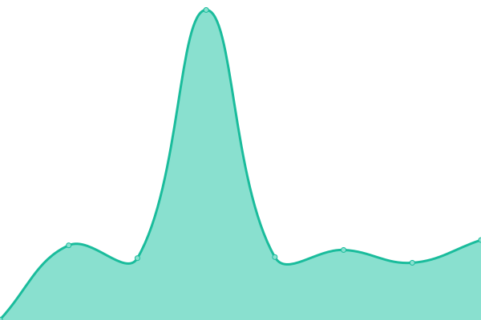 217ms
     
 | 

<a href="https://DELWP-DTV.github.io/santa/history/vic-data-victorian-railway-corridors2">100.00%</a>
    

|  [vic-data_geological-deep-leads-lines-1-1000002](https://opendata.maps.vic.gov.au/geoserver/wms?service=wms&request=getmap&format=image%2Fpng8&transparent=true&layers=open-data-platform:deepld100_arc&width=512&height=512&crs=epsg%3A3857&bbox=16114148.554967716%2C-4456584.4971389165%2C16119040.524777967%2C-4451692.527328665) | 🟩 Up | [vic-data-geological-deep-leads-lines-1-1000002.yml](https://github.com/DELWP-DTV/santa/commits/HEAD/history/vic-data-geological-deep-leads-lines-1-1000002.yml) | 

 201ms
     
 | 

<a href="https://DELWP-DTV.github.io/santa/history/vic-data-geological-deep-leads-lines-1-1000002">100.00%</a>
    

|  [vic-data_priority-rivers-based-on-the-index-of-stream-condition1](https://opendata.maps.vic.gov.au/geoserver/wms?service=wms&request=getmap&format=image%2Fpng8&transparent=true&layers=open-data-platform:priority_rivers&width=512&height=512&crs=epsg%3A3857&bbox=16114148.554967716%2C-4456584.4971389165%2C16119040.524777967%2C-4451692.527328665) | 🟩 Up | [vic-data-priority-rivers-based-on-the-index-of-stream-condition1.yml](https://github.com/DELWP-DTV/santa/commits/HEAD/history/vic-data-priority-rivers-based-on-the-index-of-stream-condition1.yml) | 

 230ms
     
 | 

<a href="https://DELWP-DTV.github.io/santa/history/vic-data-priority-rivers-based-on-the-index-of-stream-condition1">100.00%</a>
    

|  [vic-data_boreholes-that-are-available-to-the-public-from-earth-resources-database1](https://opendata.maps.vic.gov.au/geoserver/wms?service=wms&request=getmap&format=image%2Fpng8&transparent=true&layers=open-data-platform:bores_v_public&width=512&height=512&crs=epsg%3A3857&bbox=16114148.554967716%2C-4456584.4971389165%2C16119040.524777967%2C-4451692.527328665) | 🟩 Up | [vic-data-boreholes-that-are-available-to-the-public-from-earth-resources-database1.yml](https://github.com/DELWP-DTV/santa/commits/HEAD/history/vic-data-boreholes-that-are-available-to-the-public-from-earth-resources-database1.yml) | 

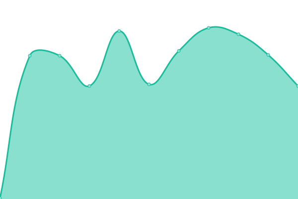 180ms
     
 | 

<a href="https://DELWP-DTV.github.io/santa/history/vic-data-boreholes-that-are-available-to-the-public-from-earth-resources-database1">100.00%</a>
    

|  [vic-data_vicmap-lite-state-line-1-2000000-to-1-50000001](https://opendata.maps.vic.gov.au/geoserver/wms?service=wms&request=getmap&format=image%2Fpng8&transparent=true&layers=open-data-platform:vmlite_victoria_line_su2&width=512&height=512&crs=epsg%3A3857&bbox=16114148.554967716%2C-4456584.4971389165%2C16119040.524777967%2C-4451692.527328665) | 🟩 Up | [vic-data-vicmap-lite-state-line-1-2000000-to-1-50000001.yml](https://github.com/DELWP-DTV/santa/commits/HEAD/history/vic-data-vicmap-lite-state-line-1-2000000-to-1-50000001.yml) | 

 203ms
     
 | 

<a href="https://DELWP-DTV.github.io/santa/history/vic-data-vicmap-lite-state-line-1-2000000-to-1-50000001">100.00%</a>
    

|  [vic-data_vicmap-index-vicmap-topographic-1-30000-mga-a4-map-index](https://opendata.maps.vic.gov.au/geoserver/wms?service=wms&request=getmap&format=image%2Fpng8&transparent=true&layers=open-data-platform:vicmap_mapindex_30sa4&width=512&height=512&crs=epsg%3A3857&bbox=16114148.554967716%2C-4456584.4971389165%2C16119040.524777967%2C-4451692.527328665) | 🟩 Up | [vic-data-vicmap-index-vicmap-topographic-1-30000-mga-a4-map-index.yml](https://github.com/DELWP-DTV/santa/commits/HEAD/history/vic-data-vicmap-index-vicmap-topographic-1-30000-mga-a4-map-index.yml) | 

 213ms
     
 | 

<a href="https://DELWP-DTV.github.io/santa/history/vic-data-vicmap-index-vicmap-topographic-1-30000-mga-a4-map-index">100.00%</a>
    

|  [vic-data_vicmap-index-vicmap-topographic-1-50000-mga-double-format-map-index1](https://opendata.maps.vic.gov.au/geoserver/wms?service=wms&request=getmap&format=image%2Fpng8&transparent=true&layers=open-data-platform:vicmap_mapindex_50d&width=512&height=512&crs=epsg%3A3857&bbox=16114148.554967716%2C-4456584.4971389165%2C16119040.524777967%2C-4451692.527328665) | 🟩 Up | [vic-data-vicmap-index-vicmap-topographic-1-50000-mga-double-format-map-index1.yml](https://github.com/DELWP-DTV/santa/commits/HEAD/history/vic-data-vicmap-index-vicmap-topographic-1-50000-mga-double-format-map-index1.yml) | 

 216ms
     
 | 

<a href="https://DELWP-DTV.github.io/santa/history/vic-data-vicmap-index-vicmap-topographic-1-50000-mga-double-format-map-index1">100.00%</a>
    

|  [vic-data_vicmap-property-parcel-polygon-with-proposed-parcel-detail2](https://opendata.maps.vic.gov.au/geoserver/wms?service=wms&request=getmap&format=image%2Fpng8&transparent=true&layers=open-data-platform:v_s_parcel_proposed&width=512&height=512&crs=epsg%3A3857&bbox=16114148.554967716%2C-4456584.4971389165%2C16119040.524777967%2C-4451692.527328665) | 🟩 Up | [vic-data-vicmap-property-parcel-polygon-with-proposed-parcel-detail2.yml](https://github.com/DELWP-DTV/santa/commits/HEAD/history/vic-data-vicmap-property-parcel-polygon-with-proposed-parcel-detail2.yml) | 

 248ms
     
 | 

<a href="https://DELWP-DTV.github.io/santa/history/vic-data-vicmap-property-parcel-polygon-with-proposed-parcel-detail2">100.00%</a>
    

|  [vic-data_shallow-workings-polygons-1-1000002](https://opendata.maps.vic.gov.au/geoserver/wms?service=wms&request=getmap&format=image%2Fpng8&transparent=true&layers=open-data-platform:shalwk100_polygon&width=512&height=512&crs=epsg%3A3857&bbox=16114148.554967716%2C-4456584.4971389165%2C16119040.524777967%2C-4451692.527328665) | 🟩 Up | [vic-data-shallow-workings-polygons-1-1000002.yml](https://github.com/DELWP-DTV/santa/commits/HEAD/history/vic-data-shallow-workings-polygons-1-1000002.yml) | 

 216ms
     
 | 

<a href="https://DELWP-DTV.github.io/santa/history/vic-data-shallow-workings-polygons-1-1000002">100.00%</a>
    

|  [vic-data_geomorphology-of-victoria1](https://opendata.maps.vic.gov.au/geoserver/wms?service=wms&request=getmap&format=image%2Fpng8&transparent=true&layers=open-data-platform:gmu250&width=512&height=512&crs=epsg%3A3857&bbox=16114148.554967716%2C-4456584.4971389165%2C16119040.524777967%2C-4451692.527328665) | 🟩 Up | [vic-data-geomorphology-of-victoria1.yml](https://github.com/DELWP-DTV/santa/commits/HEAD/history/vic-data-geomorphology-of-victoria1.yml) | 

 247ms
     
 | 

<a href="https://DELWP-DTV.github.io/santa/history/vic-data-geomorphology-of-victoria1">100.00%</a>
    

|  [vic-data_epa-victoria-environmental-audit-reports-location-points1](https://opendata.maps.vic.gov.au/geoserver/wms?service=wms&request=getmap&format=image%2Fpng8&transparent=true&layers=open-data-platform:enviro_audit_point&width=512&height=512&crs=epsg%3A3857&bbox=16114148.554967716%2C-4456584.4971389165%2C16119040.524777967%2C-4451692.527328665) | 🟩 Up | [vic-data-epa-victoria-environmental-audit-reports-location-points1.yml](https://github.com/DELWP-DTV/santa/commits/HEAD/history/vic-data-epa-victoria-environmental-audit-reports-location-points1.yml) | 

 201ms
     
 | 

<a href="https://DELWP-DTV.github.io/santa/history/vic-data-epa-victoria-environmental-audit-reports-location-points1">100.00%</a>
    

|  [vic-data_ptv-regional-bus-stops1](https://opendata.maps.vic.gov.au/geoserver/wms?service=wms&request=getmap&format=image%2Fpng8&transparent=true&layers=open-data-platform:ptv_regional_bus_stop&width=512&height=512&crs=epsg%3A3857&bbox=16114148.554967716%2C-4456584.4971389165%2C16119040.524777967%2C-4451692.527328665) | 🟩 Up | [vic-data-ptv-regional-bus-stops1.yml](https://github.com/DELWP-DTV/santa/commits/HEAD/history/vic-data-ptv-regional-bus-stops1.yml) | 

 216ms
     
 | 

<a href="https://DELWP-DTV.github.io/santa/history/vic-data-ptv-regional-bus-stops1">100.00%</a>
    

|  [vic-data_vicmap-admin-metropolitan-fire-brigade-mfb-district-polygon1](https://opendata.maps.vic.gov.au/geoserver/wms?service=wms&request=getmap&format=image%2Fpng8&transparent=true&layers=open-data-platform:mfb_district&width=512&height=512&crs=epsg%3A3857&bbox=16114148.554967716%2C-4456584.4971389165%2C16119040.524777967%2C-4451692.527328665) | 🟩 Up | [vic-data-vicmap-admin-metropolitan-fire-brigade-mfb-district-polygon1.yml](https://github.com/DELWP-DTV/santa/commits/HEAD/history/vic-data-vicmap-admin-metropolitan-fire-brigade-mfb-district-polygon1.yml) | 

 223ms
     
 | 

<a href="https://DELWP-DTV.github.io/santa/history/vic-data-vicmap-admin-metropolitan-fire-brigade-mfb-district-polygon1">100.00%</a>
    

|  [vic-data_vicmap-admin-state-assembly-polygon-2013](https://opendata.maps.vic.gov.au/geoserver/wms?service=wms&request=getmap&format=image%2Fpng8&transparent=true&layers=open-data-platform:state_assembly_2013&width=512&height=512&crs=epsg%3A3857&bbox=16114148.554967716%2C-4456584.4971389165%2C16119040.524777967%2C-4451692.527328665) | 🟩 Up | [vic-data-vicmap-admin-state-assembly-polygon-2013.yml](https://github.com/DELWP-DTV/santa/commits/HEAD/history/vic-data-vicmap-admin-state-assembly-polygon-2013.yml) | 

 226ms
     
 | 

<a href="https://DELWP-DTV.github.io/santa/history/vic-data-vicmap-admin-state-assembly-polygon-2013">100.00%</a>
    

|  [vic-data_vicmap-admin-department-of-environment-and-primary-industries-depi-region-polygon1](https://opendata.maps.vic.gov.au/geoserver/wms?service=wms&request=getmap&format=image%2Fpng8&transparent=true&layers=open-data-platform:depi_region&width=512&height=512&crs=epsg%3A3857&bbox=16114148.554967716%2C-4456584.4971389165%2C16119040.524777967%2C-4451692.527328665) | 🟩 Up | [vic-data-vicmap-admin-department-of-environment-and-primary-industries-depi-region-polygon1.yml](https://github.com/DELWP-DTV/santa/commits/HEAD/history/vic-data-vicmap-admin-department-of-environment-and-primary-industries-depi-region-polygon1.yml) | 

 285ms
     
 | 

<a href="https://DELWP-DTV.github.io/santa/history/vic-data-vicmap-admin-department-of-environment-and-primary-industries-depi-region-polygon1">100.00%</a>
    

|  [vic-data_groundwater-resources1](https://opendata.maps.vic.gov.au/geoserver/wms?service=wms&request=getmap&format=image%2Fpng8&transparent=true&layers=open-data-platform:gwr&width=512&height=512&crs=epsg%3A3857&bbox=16114148.554967716%2C-4456584.4971389165%2C16119040.524777967%2C-4451692.527328665) | 🟩 Up | [vic-data-groundwater-resources1.yml](https://github.com/DELWP-DTV/santa/commits/HEAD/history/vic-data-groundwater-resources1.yml) | 

 231ms
     
 | 

<a href="https://DELWP-DTV.github.io/santa/history/vic-data-groundwater-resources1">100.00%</a>
    

|  [vic-data_potential-groundwater-dependent-ecosystem-gde-mapping-for-the-port-phillip-and-westernport-cma1](https://opendata.maps.vic.gov.au/geoserver/wms?service=wms&request=getmap&format=image%2Fpng8&transparent=true&layers=open-data-platform:gde_terr_ppcma&width=512&height=512&crs=epsg%3A3857&bbox=16114148.554967716%2C-4456584.4971389165%2C16119040.524777967%2C-4451692.527328665) | 🟩 Up | [vic-data-potential-groundwater-dependent-ecosystem-gde-mapping-for-the-port-phillip-and-westernport-cma1.yml](https://github.com/DELWP-DTV/santa/commits/HEAD/history/vic-data-potential-groundwater-dependent-ecosystem-gde-mapping-for-the-port-phillip-and-westernport-cma1.yml) | 

 203ms
     
 | 

<a href="https://DELWP-DTV.github.io/santa/history/vic-data-potential-groundwater-dependent-ecosystem-gde-mapping-for-the-port-phillip-and-westernport-cma1">100.00%</a>
    

|  [vic-data_potential-impact-of-geological-structures-on-groundwater-flow-systems2](https://opendata.maps.vic.gov.au/geoserver/wms?service=wms&request=getmap&format=image%2Fpng8&transparent=true&layers=open-data-platform:gw_flow_impact_struct&width=512&height=512&crs=epsg%3A3857&bbox=16114148.554967716%2C-4456584.4971389165%2C16119040.524777967%2C-4451692.527328665) | 🟩 Up | [vic-data-potential-impact-of-geological-structures-on-groundwater-flow-systems2.yml](https://github.com/DELWP-DTV/santa/commits/HEAD/history/vic-data-potential-impact-of-geological-structures-on-groundwater-flow-systems2.yml) | 

 221ms
     
 | 

<a href="https://DELWP-DTV.github.io/santa/history/vic-data-potential-impact-of-geological-structures-on-groundwater-flow-systems2">100.00%</a>
    

|  [vic-data_registered-aboriginal-parties-rap-appointed-boundaries1](https://opendata.maps.vic.gov.au/geoserver/wms?service=wms&request=getmap&format=image%2Fpng8&transparent=true&layers=open-data-platform:rap&width=512&height=512&crs=epsg%3A3857&bbox=16114148.554967716%2C-4456584.4971389165%2C16119040.524777967%2C-4451692.527328665) | 🟩 Up | [vic-data-registered-aboriginal-parties-rap-appointed-boundaries1.yml](https://github.com/DELWP-DTV/santa/commits/HEAD/history/vic-data-registered-aboriginal-parties-rap-appointed-boundaries1.yml) | 

 243ms
     
 | 

<a href="https://DELWP-DTV.github.io/santa/history/vic-data-registered-aboriginal-parties-rap-appointed-boundaries1">100.00%</a>
    

|  [vic-data_key-biodiversity-areas](https://opendata.maps.vic.gov.au/geoserver/wms?service=wms&request=getmap&format=image%2Fpng8&transparent=true&layers=open-data-platform:key_biodiversity_areas&width=512&height=512&crs=epsg%3A3857&bbox=16114148.554967716%2C-4456584.4971389165%2C16119040.524777967%2C-4451692.527328665) | 🟩 Up | [vic-data-key-biodiversity-areas.yml](https://github.com/DELWP-DTV/santa/commits/HEAD/history/vic-data-key-biodiversity-areas.yml) | 

 229ms
     
 | 

<a href="https://DELWP-DTV.github.io/santa/history/vic-data-key-biodiversity-areas">100.00%</a>
    

|  [vic-data_beneficial-use-watertable1](https://opendata.maps.vic.gov.au/geoserver/wms?service=wms&request=getmap&format=image%2Fpng8&transparent=true&layers=open-data-platform:bu_wtable&width=512&height=512&crs=epsg%3A3857&bbox=16114148.554967716%2C-4456584.4971389165%2C16119040.524777967%2C-4451692.527328665) | 🟩 Up | [vic-data-beneficial-use-watertable1.yml](https://github.com/DELWP-DTV/santa/commits/HEAD/history/vic-data-beneficial-use-watertable1.yml) | 

 278ms
     
 | 

<a href="https://DELWP-DTV.github.io/santa/history/vic-data-beneficial-use-watertable1">100.00%</a>
    

|  [vic-data_landsystems1](https://opendata.maps.vic.gov.au/geoserver/wms?service=wms&request=getmap&format=image%2Fpng8&transparent=true&layers=open-data-platform:lsys100&width=512&height=512&crs=epsg%3A3857&bbox=16114148.554967716%2C-4456584.4971389165%2C16119040.524777967%2C-4451692.527328665) | 🟩 Up | [vic-data-landsystems1.yml](https://github.com/DELWP-DTV/santa/commits/HEAD/history/vic-data-landsystems1.yml) | 

 204ms
     
 | 

<a href="https://DELWP-DTV.github.io/santa/history/vic-data-landsystems1">100.00%</a>
    

|  [vic-data_geological-structural-measurements-on-the-mapface-1-100000](https://opendata.maps.vic.gov.au/geoserver/wms?service=wms&request=getmap&format=image%2Fpng8&transparent=true&layers=open-data-platform:strucm100&width=512&height=512&crs=epsg%3A3857&bbox=16114148.554967716%2C-4456584.4971389165%2C16119040.524777967%2C-4451692.527328665) | 🟩 Up | [vic-data-geological-structural-measurements-on-the-mapface-1-100000.yml](https://github.com/DELWP-DTV/santa/commits/HEAD/history/vic-data-geological-structural-measurements-on-the-mapface-1-100000.yml) | 

 223ms
     
 | 

<a href="https://DELWP-DTV.github.io/santa/history/vic-data-geological-structural-measurements-on-the-mapface-1-100000">100.00%</a>
    

|  [vic-data_coastal-acid-sulphate-soils1](https://opendata.maps.vic.gov.au/geoserver/wms?service=wms&request=getmap&format=image%2Fpng8&transparent=true&layers=open-data-platform:coastal_acid_sulphate_soils&width=512&height=512&crs=epsg%3A3857&bbox=16114148.554967716%2C-4456584.4971389165%2C16119040.524777967%2C-4451692.527328665) | 🟩 Up | [vic-data-coastal-acid-sulphate-soils1.yml](https://github.com/DELWP-DTV/santa/commits/HEAD/history/vic-data-coastal-acid-sulphate-soils1.yml) | 

 219ms
     
 | 

<a href="https://DELWP-DTV.github.io/santa/history/vic-data-coastal-acid-sulphate-soils1">100.00%</a>
    

|  [vic-data_vicmap-property-easememt-proposed-annotation-text-point2](https://opendata.maps.vic.gov.au/geoserver/wms?service=wms&request=getmap&format=image%2Fpng8&transparent=true&layers=open-data-platform:v_s_easement_proposed_anno&width=512&height=512&crs=epsg%3A3857&bbox=16114148.554967716%2C-4456584.4971389165%2C16119040.524777967%2C-4451692.527328665) | 🟩 Up | [vic-data-vicmap-property-easememt-proposed-annotation-text-point2.yml](https://github.com/DELWP-DTV/santa/commits/HEAD/history/vic-data-vicmap-property-easememt-proposed-annotation-text-point2.yml) | 

 199ms
     
 | 

<a href="https://DELWP-DTV.github.io/santa/history/vic-data-vicmap-property-easememt-proposed-annotation-text-point2">100.00%</a>
    

|  [vic-data_vicmap-address-address-point-with-main-attributes1](https://opendata.maps.vic.gov.au/geoserver/wms?service=wms&request=getmap&format=image%2Fpng8&transparent=true&layers=open-data-platform:address_main&width=512&height=512&crs=epsg%3A3857&bbox=16114148.554967716%2C-4456584.4971389165%2C16119040.524777967%2C-4451692.527328665) | 🟩 Up | [vic-data-vicmap-address-address-point-with-main-attributes1.yml](https://github.com/DELWP-DTV/santa/commits/HEAD/history/vic-data-vicmap-address-address-point-with-main-attributes1.yml) | 

 233ms
     
 | 

<a href="https://DELWP-DTV.github.io/santa/history/vic-data-vicmap-address-address-point-with-main-attributes1">100.00%</a>
    

|  [vic-data_ptv-regional-train-stations12](https://opendata.maps.vic.gov.au/geoserver/wms?service=wms&request=getmap&format=image%2Fpng8&transparent=true&layers=open-data-platform:ptv_regional_train_station&width=512&height=512&crs=epsg%3A3857&bbox=16114148.554967716%2C-4456584.4971389165%2C16119040.524777967%2C-4451692.527328665) | 🟩 Up | [vic-data-ptv-regional-train-stations12.yml](https://github.com/DELWP-DTV/santa/commits/HEAD/history/vic-data-ptv-regional-train-stations12.yml) | 

 214ms
     
 | 

<a href="https://DELWP-DTV.github.io/santa/history/vic-data-ptv-regional-train-stations12">100.00%</a>
    

|  [vic-data_potential-groundwater-dependent-ecosystem-gde-mapping-for-the-north-central-cma1](https://opendata.maps.vic.gov.au/geoserver/wms?service=wms&request=getmap&format=image%2Fpng8&transparent=true&layers=open-data-platform:gde_terr_nccma&width=512&height=512&crs=epsg%3A3857&bbox=16114148.554967716%2C-4456584.4971389165%2C16119040.524777967%2C-4451692.527328665) | 🟩 Up | [vic-data-potential-groundwater-dependent-ecosystem-gde-mapping-for-the-north-central-cma1.yml](https://github.com/DELWP-DTV/santa/commits/HEAD/history/vic-data-potential-groundwater-dependent-ecosystem-gde-mapping-for-the-north-central-cma1.yml) | 

 199ms
     
 | 

<a href="https://DELWP-DTV.github.io/santa/history/vic-data-potential-groundwater-dependent-ecosystem-gde-mapping-for-the-north-central-cma1">100.00%</a>
    

|  [vic-data_potential-groundwater-dependent-ecosystem-gde-mapping-for-the-east-gippsland-cma1](https://opendata.maps.vic.gov.au/geoserver/wms?service=wms&request=getmap&format=image%2Fpng8&transparent=true&layers=open-data-platform:gde_terr_egcma&width=512&height=512&crs=epsg%3A3857&bbox=16114148.554967716%2C-4456584.4971389165%2C16119040.524777967%2C-4451692.527328665) | 🟩 Up | [vic-data-potential-groundwater-dependent-ecosystem-gde-mapping-for-the-east-gippsland-cma1.yml](https://github.com/DELWP-DTV/santa/commits/HEAD/history/vic-data-potential-groundwater-dependent-ecosystem-gde-mapping-for-the-east-gippsland-cma1.yml) | 

 223ms
     
 | 

<a href="https://DELWP-DTV.github.io/santa/history/vic-data-potential-groundwater-dependent-ecosystem-gde-mapping-for-the-east-gippsland-cma1">100.00%</a>
    

|  [vic-data_vicmap-property-property-polygon-with-approved-primary-detail2](https://opendata.maps.vic.gov.au/geoserver/wms?service=wms&request=getmap&format=image%2Fpng8&transparent=true&layers=open-data-platform:v_s_property_primary_approved&width=512&height=512&crs=epsg%3A3857&bbox=16114148.554967716%2C-4456584.4971389165%2C16119040.524777967%2C-4451692.527328665) | 🟩 Up | [vic-data-vicmap-property-property-polygon-with-approved-primary-detail2.yml](https://github.com/DELWP-DTV/santa/commits/HEAD/history/vic-data-vicmap-property-property-polygon-with-approved-primary-detail2.yml) | 

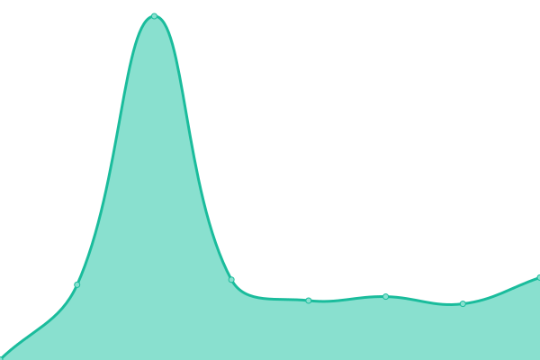 886ms
     
 | 

<a href="https://DELWP-DTV.github.io/santa/history/vic-data-vicmap-property-property-polygon-with-approved-primary-detail2">100.00%</a>
    

|  [vic-data_epa-victoria-licence-location-polygons](https://opendata.maps.vic.gov.au/geoserver/wms?service=wms&request=getmap&format=image%2Fpng8&transparent=true&layers=open-data-platform:epa_licence_polygon&width=512&height=512&crs=epsg%3A3857&bbox=16114148.554967716%2C-4456584.4971389165%2C16119040.524777967%2C-4451692.527328665) | 🟩 Up | [vic-data-epa-victoria-licence-location-polygons.yml](https://github.com/DELWP-DTV/santa/commits/HEAD/history/vic-data-epa-victoria-licence-location-polygons.yml) | 

 201ms
     
 | 

<a href="https://DELWP-DTV.github.io/santa/history/vic-data-epa-victoria-licence-location-polygons">100.00%</a>
    

|  [vic-data_major-residential-redevelopments-sites-20162](https://opendata.maps.vic.gov.au/geoserver/wms?service=wms&request=getmap&format=image%2Fpng8&transparent=true&layers=open-data-platform:mrs2016&width=512&height=512&crs=epsg%3A3857&bbox=16114148.554967716%2C-4456584.4971389165%2C16119040.524777967%2C-4451692.527328665) | 🟩 Up | [vic-data-major-residential-redevelopments-sites-20162.yml](https://github.com/DELWP-DTV/santa/commits/HEAD/history/vic-data-major-residential-redevelopments-sites-20162.yml) | 

 229ms
     
 | 

<a href="https://DELWP-DTV.github.io/santa/history/vic-data-major-residential-redevelopments-sites-20162">100.00%</a>
    

|  [vic-data_broadhectare-residential-land-20162](https://opendata.maps.vic.gov.au/geoserver/wms?service=wms&request=getmap&format=image%2Fpng8&transparent=true&layers=open-data-platform:bh2016&width=512&height=512&crs=epsg%3A3857&bbox=16114148.554967716%2C-4456584.4971389165%2C16119040.524777967%2C-4451692.527328665) | 🟩 Up | [vic-data-broadhectare-residential-land-20162.yml](https://github.com/DELWP-DTV/santa/commits/HEAD/history/vic-data-broadhectare-residential-land-20162.yml) | 

 220ms
     
 | 

<a href="https://DELWP-DTV.github.io/santa/history/vic-data-broadhectare-residential-land-20162">100.00%</a>
    

|  [vic-data_melbourne-metro-tunnel-project-station-entrances2](https://opendata.maps.vic.gov.au/geoserver/wms?service=wms&request=getmap&format=image%2Fpng8&transparent=true&layers=open-data-platform:mtp_ees_station_entrances&width=512&height=512&crs=epsg%3A3857&bbox=16114148.554967716%2C-4456584.4971389165%2C16119040.524777967%2C-4451692.527328665) | 🟩 Up | [vic-data-melbourne-metro-tunnel-project-station-entrances2.yml](https://github.com/DELWP-DTV/santa/commits/HEAD/history/vic-data-melbourne-metro-tunnel-project-station-entrances2.yml) | 

 208ms
     
 | 

<a href="https://DELWP-DTV.github.io/santa/history/vic-data-melbourne-metro-tunnel-project-station-entrances2">100.00%</a>
    

|  [vic-data_melbourne-metro-tunnel-project-future-station-entrances2](https://opendata.maps.vic.gov.au/geoserver/wms?service=wms&request=getmap&format=image%2Fpng8&transparent=true&layers=open-data-platform:mtp_ees_future_stn_entrances&width=512&height=512&crs=epsg%3A3857&bbox=16114148.554967716%2C-4456584.4971389165%2C16119040.524777967%2C-4451692.527328665) | 🟩 Up | [vic-data-melbourne-metro-tunnel-project-future-station-entrances2.yml](https://github.com/DELWP-DTV/santa/commits/HEAD/history/vic-data-melbourne-metro-tunnel-project-future-station-entrances2.yml) | 

 226ms
     
 | 

<a href="https://DELWP-DTV.github.io/santa/history/vic-data-melbourne-metro-tunnel-project-future-station-entrances2">100.00%</a>
    

|  [vic-data_interpreted-faults-latrobe-group-gippsland-basin1](https://opendata.maps.vic.gov.au/geoserver/wms?service=wms&request=getmap&format=image%2Fpng8&transparent=true&layers=open-data-platform:faults_latrobe_gp&width=512&height=512&crs=epsg%3A3857&bbox=16114148.554967716%2C-4456584.4971389165%2C16119040.524777967%2C-4451692.527328665) | 🟩 Up | [vic-data-interpreted-faults-latrobe-group-gippsland-basin1.yml](https://github.com/DELWP-DTV/santa/commits/HEAD/history/vic-data-interpreted-faults-latrobe-group-gippsland-basin1.yml) | 

 215ms
     
 | 

<a href="https://DELWP-DTV.github.io/santa/history/vic-data-interpreted-faults-latrobe-group-gippsland-basin1">100.00%</a>
    

|  [vic-data_interpreted-faults-top-strzelecki-group-gippsland-basin1](https://opendata.maps.vic.gov.au/geoserver/wms?service=wms&request=getmap&format=image%2Fpng8&transparent=true&layers=open-data-platform:faults_strzelecki_gp&width=512&height=512&crs=epsg%3A3857&bbox=16114148.554967716%2C-4456584.4971389165%2C16119040.524777967%2C-4451692.527328665) | 🟩 Up | [vic-data-interpreted-faults-top-strzelecki-group-gippsland-basin1.yml](https://github.com/DELWP-DTV/santa/commits/HEAD/history/vic-data-interpreted-faults-top-strzelecki-group-gippsland-basin1.yml) | 

 205ms
     
 | 

<a href="https://DELWP-DTV.github.io/santa/history/vic-data-interpreted-faults-top-strzelecki-group-gippsland-basin1">100.00%</a>
    

|  [vic-data_victorian-disused-and-historic-railway-corridors1](https://opendata.maps.vic.gov.au/geoserver/wms?service=wms&request=getmap&format=image%2Fpng8&transparent=true&layers=open-data-platform:vic_railway_disused&width=512&height=512&crs=epsg%3A3857&bbox=16114148.554967716%2C-4456584.4971389165%2C16119040.524777967%2C-4451692.527328665) | 🟩 Up | [vic-data-victorian-disused-and-historic-railway-corridors1.yml](https://github.com/DELWP-DTV/santa/commits/HEAD/history/vic-data-victorian-disused-and-historic-railway-corridors1.yml) | 

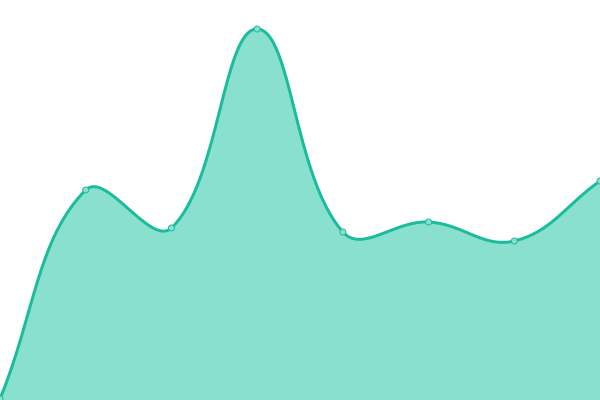 222ms
     
 | 

<a href="https://DELWP-DTV.github.io/santa/history/vic-data-victorian-disused-and-historic-railway-corridors1">100.00%</a>
    

|  [vic-data_designated-bushfire-prone-area-bpa-simplified1](https://opendata.maps.vic.gov.au/geoserver/wms?service=wms&request=getmap&format=image%2Fpng8&transparent=true&layers=open-data-platform:bushfire_prone_area_simplified&width=512&height=512&crs=epsg%3A3857&bbox=16114148.554967716%2C-4456584.4971389165%2C16119040.524777967%2C-4451692.527328665) | 🟩 Up | [vic-data-designated-bushfire-prone-area-bpa-simplified1.yml](https://github.com/DELWP-DTV/santa/commits/HEAD/history/vic-data-designated-bushfire-prone-area-bpa-simplified1.yml) | 

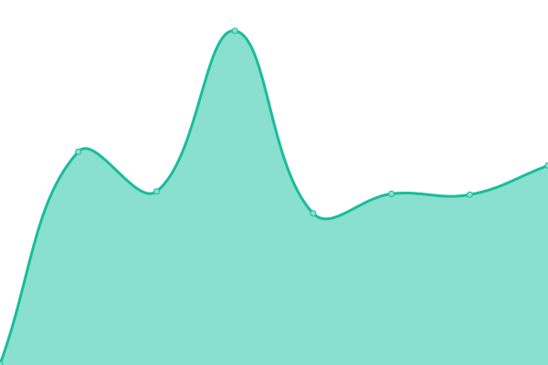 266ms
     
 | 

<a href="https://DELWP-DTV.github.io/santa/history/vic-data-designated-bushfire-prone-area-bpa-simplified1">100.00%</a>
    

|  [vic-data_sustainable-diversion-limit-sdl-catchment-baseflows1](https://opendata.maps.vic.gov.au/geoserver/wms?service=wms&request=getmap&format=image%2Fpng8&transparent=true&layers=open-data-platform:sdl_baseflows&width=512&height=512&crs=epsg%3A3857&bbox=16114148.554967716%2C-4456584.4971389165%2C16119040.524777967%2C-4451692.527328665) | 🟩 Up | [vic-data-sustainable-diversion-limit-sdl-catchment-baseflows1.yml](https://github.com/DELWP-DTV/santa/commits/HEAD/history/vic-data-sustainable-diversion-limit-sdl-catchment-baseflows1.yml) | 

 210ms
     
 | 

<a href="https://DELWP-DTV.github.io/santa/history/vic-data-sustainable-diversion-limit-sdl-catchment-baseflows1">100.00%</a>
    

|  [vic-data_victorian-land-use-information-system-2014-20152](https://opendata.maps.vic.gov.au/geoserver/wms?service=wms&request=getmap&format=image%2Fpng8&transparent=true&layers=open-data-platform:landuse_2014&width=512&height=512&crs=epsg%3A3857&bbox=16114148.554967716%2C-4456584.4971389165%2C16119040.524777967%2C-4451692.527328665) | 🟩 Up | [vic-data-victorian-land-use-information-system-2014-20152.yml](https://github.com/DELWP-DTV/santa/commits/HEAD/history/vic-data-victorian-land-use-information-system-2014-20152.yml) | 

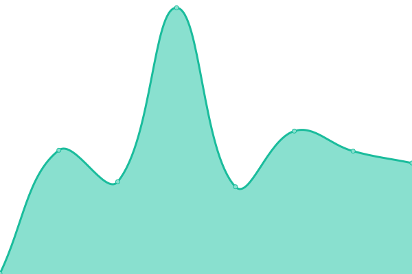 263ms
     
 | 

<a href="https://DELWP-DTV.github.io/santa/history/vic-data-victorian-land-use-information-system-2014-20152">100.00%</a>
    

|  [vic-data_coal-seam-and-haunted-hills-formation-floor1](https://opendata.maps.vic.gov.au/geoserver/wms?service=wms&request=getmap&format=image%2Fpng8&transparent=true&layers=open-data-platform:coal_floor&width=512&height=512&crs=epsg%3A3857&bbox=16114148.554967716%2C-4456584.4971389165%2C16119040.524777967%2C-4451692.527328665) | 🟩 Up | [vic-data-coal-seam-and-haunted-hills-formation-floor1.yml](https://github.com/DELWP-DTV/santa/commits/HEAD/history/vic-data-coal-seam-and-haunted-hills-formation-floor1.yml) | 

 215ms
     
 | 

<a href="https://DELWP-DTV.github.io/santa/history/vic-data-coal-seam-and-haunted-hills-formation-floor1">100.00%</a>
    

|  [vic-data_geophysical-miscellaneous-lines-1-250000-geophysical-interpretation-of-other-linear-geological-1](https://opendata.maps.vic.gov.au/geoserver/wms?service=wms&request=getmap&format=image%2Fpng8&transparent=true&layers=open-data-platform:gpmiscl250&width=512&height=512&crs=epsg%3A3857&bbox=16114148.554967716%2C-4456584.4971389165%2C16119040.524777967%2C-4451692.527328665) | 🟩 Up | [vic-data-geophysical-miscellaneous-lines-1-250000-geophysical-interpretation-of-other-linear-geological-1.yml](https://github.com/DELWP-DTV/santa/commits/HEAD/history/vic-data-geophysical-miscellaneous-lines-1-250000-geophysical-interpretation-of-other-linear-geological-1.yml) | 

 216ms
     
 | 

<a href="https://DELWP-DTV.github.io/santa/history/vic-data-geophysical-miscellaneous-lines-1-250000-geophysical-interpretation-of-other-linear-geological-1">100.00%</a>
    

|  [vic-data_regolith-regional-type-lines-1-1000002](https://opendata.maps.vic.gov.au/geoserver/wms?service=wms&request=getmap&format=image%2Fpng8&transparent=true&layers=open-data-platform:rrrego100_arc&width=512&height=512&crs=epsg%3A3857&bbox=16114148.554967716%2C-4456584.4971389165%2C16119040.524777967%2C-4451692.527328665) | 🟩 Up | [vic-data-regolith-regional-type-lines-1-1000002.yml](https://github.com/DELWP-DTV/santa/commits/HEAD/history/vic-data-regolith-regional-type-lines-1-1000002.yml) | 

 226ms
     
 | 

<a href="https://DELWP-DTV.github.io/santa/history/vic-data-regolith-regional-type-lines-1-1000002">100.00%</a>
    

|  [vic-data_geological-alterations-to-rock-1-1000004](https://opendata.maps.vic.gov.au/geoserver/wms?service=wms&request=getmap&format=image%2Fpng8&transparent=true&layers=open-data-platform:altern100_polygon&width=512&height=512&crs=epsg%3A3857&bbox=16114148.554967716%2C-4456584.4971389165%2C16119040.524777967%2C-4451692.527328665) | 🟩 Up | [vic-data-geological-alterations-to-rock-1-1000004.yml](https://github.com/DELWP-DTV/santa/commits/HEAD/history/vic-data-geological-alterations-to-rock-1-1000004.yml) | 

 220ms
     
 | 

<a href="https://DELWP-DTV.github.io/santa/history/vic-data-geological-alterations-to-rock-1-1000004">100.00%</a>
    

|  [vic-data_petroleum-graticule-points](https://opendata.maps.vic.gov.au/geoserver/wms?service=wms&request=getmap&format=image%2Fpng8&transparent=true&layers=open-data-platform:gratmin&width=512&height=512&crs=epsg%3A3857&bbox=16114148.554967716%2C-4456584.4971389165%2C16119040.524777967%2C-4451692.527328665) | 🟩 Up | [vic-data-petroleum-graticule-points.yml](https://github.com/DELWP-DTV/santa/commits/HEAD/history/vic-data-petroleum-graticule-points.yml) | 

 190ms
     
 | 

<a href="https://DELWP-DTV.github.io/santa/history/vic-data-petroleum-graticule-points">100.00%</a>
    

|  [vic-data_geological-lines-1-2500001](https://opendata.maps.vic.gov.au/geoserver/wms?service=wms&request=getmap&format=image%2Fpng8&transparent=true&layers=open-data-platform:geol250_arc&width=512&height=512&crs=epsg%3A3857&bbox=16114148.554967716%2C-4456584.4971389165%2C16119040.524777967%2C-4451692.527328665) | 🟩 Up | [vic-data-geological-lines-1-2500001.yml](https://github.com/DELWP-DTV/santa/commits/HEAD/history/vic-data-geological-lines-1-2500001.yml) | 

 234ms
     
 | 

<a href="https://DELWP-DTV.github.io/santa/history/vic-data-geological-lines-1-2500001">100.00%</a>
    

|  [vic-data_shear-zones-1-2500001](https://opendata.maps.vic.gov.au/geoserver/wms?service=wms&request=getmap&format=image%2Fpng8&transparent=true&layers=open-data-platform:sg_shear_zone_250k&width=512&height=512&crs=epsg%3A3857&bbox=16114148.554967716%2C-4456584.4971389165%2C16119040.524777967%2C-4451692.527328665) | 🟩 Up | [vic-data-shear-zones-1-2500001.yml](https://github.com/DELWP-DTV/santa/commits/HEAD/history/vic-data-shear-zones-1-2500001.yml) | 

 214ms
     
 | 

<a href="https://DELWP-DTV.github.io/santa/history/vic-data-shear-zones-1-2500001">100.00%</a>
    

|  [vic-data_coal-model-boundary2](https://opendata.maps.vic.gov.au/geoserver/wms?service=wms&request=getmap&format=image%2Fpng8&transparent=true&layers=open-data-platform:coal_bdy&width=512&height=512&crs=epsg%3A3857&bbox=16114148.554967716%2C-4456584.4971389165%2C16119040.524777967%2C-4451692.527328665) | 🟩 Up | [vic-data-coal-model-boundary2.yml](https://github.com/DELWP-DTV/santa/commits/HEAD/history/vic-data-coal-model-boundary2.yml) | 

 211ms
     
 | 

<a href="https://DELWP-DTV.github.io/santa/history/vic-data-coal-model-boundary2">100.00%</a>
    

|  [vic-data_ptv-train-station-bike-storage1](https://opendata.maps.vic.gov.au/geoserver/wms?service=wms&request=getmap&format=image%2Fpng8&transparent=true&layers=open-data-platform:ptv_train_station_bike_storage&width=512&height=512&crs=epsg%3A3857&bbox=16114148.554967716%2C-4456584.4971389165%2C16119040.524777967%2C-4451692.527328665) | 🟩 Up | [vic-data-ptv-train-station-bike-storage1.yml](https://github.com/DELWP-DTV/santa/commits/HEAD/history/vic-data-ptv-train-station-bike-storage1.yml) | 

 218ms
     
 | 

<a href="https://DELWP-DTV.github.io/santa/history/vic-data-ptv-train-station-bike-storage1">100.00%</a>
    

|  [vic-data_deepest-sediment-trendline-goulburn-murray-area2](https://opendata.maps.vic.gov.au/geoserver/wms?service=wms&request=getmap&format=image%2Fpng8&transparent=true&layers=open-data-platform:geol_sed_goulburn_murray&width=512&height=512&crs=epsg%3A3857&bbox=16114148.554967716%2C-4456584.4971389165%2C16119040.524777967%2C-4451692.527328665) | 🟩 Up | [vic-data-deepest-sediment-trendline-goulburn-murray-area2.yml](https://github.com/DELWP-DTV/santa/commits/HEAD/history/vic-data-deepest-sediment-trendline-goulburn-murray-area2.yml) | 

 238ms
     
 | 

<a href="https://DELWP-DTV.github.io/santa/history/vic-data-deepest-sediment-trendline-goulburn-murray-area2">100.00%</a>
    

|  [vic-data_forest-cover-changes-in-victoria-from-1972-to-19871](https://opendata.maps.vic.gov.au/geoserver/wms?service=wms&request=getmap&format=image%2Fpng8&transparent=true&layers=open-data-platform:fcov500_7287&width=512&height=512&crs=epsg%3A3857&bbox=16114148.554967716%2C-4456584.4971389165%2C16119040.524777967%2C-4451692.527328665) | 🟩 Up | [vic-data-forest-cover-changes-in-victoria-from-1972-to-19871.yml](https://github.com/DELWP-DTV/santa/commits/HEAD/history/vic-data-forest-cover-changes-in-victoria-from-1972-to-19871.yml) | 

 275ms
     
 | 

<a href="https://DELWP-DTV.github.io/santa/history/vic-data-forest-cover-changes-in-victoria-from-1972-to-19871">100.00%</a>
    

|  [vic-data_shallow-workings-polygons-lines-1-1000004](https://opendata.maps.vic.gov.au/geoserver/wms?service=wms&request=getmap&format=image%2Fpng8&transparent=true&layers=open-data-platform:shalwk100_arc&width=512&height=512&crs=epsg%3A3857&bbox=16114148.554967716%2C-4456584.4971389165%2C16119040.524777967%2C-4451692.527328665) | 🟩 Up | [vic-data-shallow-workings-polygons-lines-1-1000004.yml](https://github.com/DELWP-DTV/santa/commits/HEAD/history/vic-data-shallow-workings-polygons-lines-1-1000004.yml) | 

 216ms
     
 | 

<a href="https://DELWP-DTV.github.io/santa/history/vic-data-shallow-workings-polygons-lines-1-1000004">100.00%</a>
    

|  [vic-data_ptv-tram-track-centreline](https://opendata.maps.vic.gov.au/geoserver/wms?service=wms&request=getmap&format=image%2Fpng8&transparent=true&layers=open-data-platform:ptv_tram_track_centreline&width=512&height=512&crs=epsg%3A3857&bbox=16114148.554967716%2C-4456584.4971389165%2C16119040.524777967%2C-4451692.527328665) | 🟩 Up | [vic-data-ptv-tram-track-centreline.yml](https://github.com/DELWP-DTV/santa/commits/HEAD/history/vic-data-ptv-tram-track-centreline.yml) | 

 214ms
     
 | 

<a href="https://DELWP-DTV.github.io/santa/history/vic-data-ptv-tram-track-centreline">100.00%</a>
    

|  [vic-data_2010-index-of-stream-condition-vegetation-width-line-features8](https://opendata.maps.vic.gov.au/geoserver/wms?service=wms&request=getmap&format=image%2Fpng8&transparent=true&layers=open-data-platform:isc2010_vegetation_width&width=512&height=512&crs=epsg%3A3857&bbox=16114148.554967716%2C-4456584.4971389165%2C16119040.524777967%2C-4451692.527328665) | 🟩 Up | [vic-data-2010-index-of-stream-condition-vegetation-width-line-features8.yml](https://github.com/DELWP-DTV/santa/commits/HEAD/history/vic-data-2010-index-of-stream-condition-vegetation-width-line-features8.yml) | 

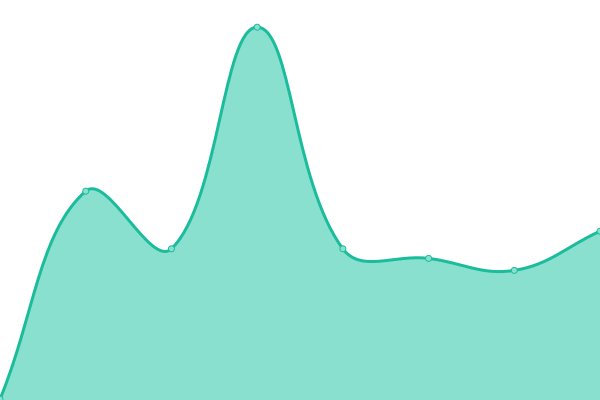 206ms
     
 | 

<a href="https://DELWP-DTV.github.io/santa/history/vic-data-2010-index-of-stream-condition-vegetation-width-line-features8">100.00%</a>
    

|  [vic-data_all-basement-bores2](https://opendata.maps.vic.gov.au/geoserver/wms?service=wms&request=getmap&format=image%2Fpng8&transparent=true&layers=open-data-platform:bores_bse_all&width=512&height=512&crs=epsg%3A3857&bbox=16114148.554967716%2C-4456584.4971389165%2C16119040.524777967%2C-4451692.527328665) | 🟩 Up | [vic-data-all-basement-bores2.yml](https://github.com/DELWP-DTV/santa/commits/HEAD/history/vic-data-all-basement-bores2.yml) | 

 216ms
     
 | 

<a href="https://DELWP-DTV.github.io/santa/history/vic-data-all-basement-bores2">100.00%</a>
    

|  [vic-data_epa-victoria-licence-location-points1](https://opendata.maps.vic.gov.au/geoserver/wms?service=wms&request=getmap&format=image%2Fpng8&transparent=true&layers=open-data-platform:epa_licence_point&width=512&height=512&crs=epsg%3A3857&bbox=16114148.554967716%2C-4456584.4971389165%2C16119040.524777967%2C-4451692.527328665) | 🟩 Up | [vic-data-epa-victoria-licence-location-points1.yml](https://github.com/DELWP-DTV/santa/commits/HEAD/history/vic-data-epa-victoria-licence-location-points1.yml) | 

 215ms
     
 | 

<a href="https://DELWP-DTV.github.io/santa/history/vic-data-epa-victoria-licence-location-points1">100.00%</a>
    

|  [vic-data_vicmap-lite-water-polygon-1-250000-to-1-50000001](https://opendata.maps.vic.gov.au/geoserver/wms?service=wms&request=getmap&format=image%2Fpng8&transparent=true&layers=open-data-platform:vmlite_hy_water_area&width=512&height=512&crs=epsg%3A3857&bbox=16114148.554967716%2C-4456584.4971389165%2C16119040.524777967%2C-4451692.527328665) | 🟩 Up | [vic-data-vicmap-lite-water-polygon-1-250000-to-1-50000001.yml](https://github.com/DELWP-DTV/santa/commits/HEAD/history/vic-data-vicmap-lite-water-polygon-1-250000-to-1-50000001.yml) | 

 206ms
     
 | 

<a href="https://DELWP-DTV.github.io/santa/history/vic-data-vicmap-lite-water-polygon-1-250000-to-1-50000001">100.00%</a>
    

|  [vic-data_geological-polygons-1-2500002](https://opendata.maps.vic.gov.au/geoserver/wms?service=wms&request=getmap&format=image%2Fpng8&transparent=true&layers=open-data-platform:geol250_polygon&width=512&height=512&crs=epsg%3A3857&bbox=16114148.554967716%2C-4456584.4971389165%2C16119040.524777967%2C-4451692.527328665) | 🟩 Up | [vic-data-geological-polygons-1-2500002.yml](https://github.com/DELWP-DTV/santa/commits/HEAD/history/vic-data-geological-polygons-1-2500002.yml) | 

 321ms
     
 | 

<a href="https://DELWP-DTV.github.io/santa/history/vic-data-geological-polygons-1-2500002">100.00%</a>
    

|  [vic-data_deep-leads-areas2](https://opendata.maps.vic.gov.au/geoserver/wms?service=wms&request=getmap&format=image%2Fpng8&transparent=true&layers=open-data-platform:dla&width=512&height=512&crs=epsg%3A3857&bbox=16114148.554967716%2C-4456584.4971389165%2C16119040.524777967%2C-4451692.527328665) | 🟩 Up | [vic-data-deep-leads-areas2.yml](https://github.com/DELWP-DTV/santa/commits/HEAD/history/vic-data-deep-leads-areas2.yml) | 

 216ms
     
 | 

<a href="https://DELWP-DTV.github.io/santa/history/vic-data-deep-leads-areas2">100.00%</a>
    

|  [vic-data_groundwater-management-areas2](https://opendata.maps.vic.gov.au/geoserver/wms?service=wms&request=getmap&format=image%2Fpng8&transparent=true&layers=open-data-platform:gma&width=512&height=512&crs=epsg%3A3857&bbox=16114148.554967716%2C-4456584.4971389165%2C16119040.524777967%2C-4451692.527328665) | 🟩 Up | [vic-data-groundwater-management-areas2.yml](https://github.com/DELWP-DTV/santa/commits/HEAD/history/vic-data-groundwater-management-areas2.yml) | 

 222ms
     
 | 

<a href="https://DELWP-DTV.github.io/santa/history/vic-data-groundwater-management-areas2">100.00%</a>
    

|  [vic-data_tailings-licences-expired2](https://opendata.maps.vic.gov.au/geoserver/wms?service=wms&request=getmap&format=image%2Fpng8&transparent=true&layers=open-data-platform:tlhst&width=512&height=512&crs=epsg%3A3857&bbox=16114148.554967716%2C-4456584.4971389165%2C16119040.524777967%2C-4451692.527328665) | 🟩 Up | [vic-data-tailings-licences-expired2.yml](https://github.com/DELWP-DTV/santa/commits/HEAD/history/vic-data-tailings-licences-expired2.yml) | 

 216ms
     
 | 

<a href="https://DELWP-DTV.github.io/santa/history/vic-data-tailings-licences-expired2">100.00%</a>
    

|  [vic-data_vicmap-index-vicmap-topographic-1-25000-mga-single-format-map-index7](https://opendata.maps.vic.gov.au/geoserver/wms?service=wms&request=getmap&format=image%2Fpng8&transparent=true&layers=open-data-platform:vicmap_mapindex_25s&width=512&height=512&crs=epsg%3A3857&bbox=16114148.554967716%2C-4456584.4971389165%2C16119040.524777967%2C-4451692.527328665) | 🟩 Up | [vic-data-vicmap-index-vicmap-topographic-1-25000-mga-single-format-map-index7.yml](https://github.com/DELWP-DTV/santa/commits/HEAD/history/vic-data-vicmap-index-vicmap-topographic-1-25000-mga-single-format-map-index7.yml) | 

 221ms
     
 | 

<a href="https://DELWP-DTV.github.io/santa/history/vic-data-vicmap-index-vicmap-topographic-1-25000-mga-single-format-map-index7">100.00%</a>
    

|  [vic-data_geological-structures-goulburn-murray-area2](https://opendata.maps.vic.gov.au/geoserver/wms?service=wms&request=getmap&format=image%2Fpng8&transparent=true&layers=open-data-platform:geol_struct_goulburn_murray&width=512&height=512&crs=epsg%3A3857&bbox=16114148.554967716%2C-4456584.4971389165%2C16119040.524777967%2C-4451692.527328665) | 🟩 Up | [vic-data-geological-structures-goulburn-murray-area2.yml](https://github.com/DELWP-DTV/santa/commits/HEAD/history/vic-data-geological-structures-goulburn-murray-area2.yml) | 

 200ms
     
 | 

<a href="https://DELWP-DTV.github.io/santa/history/vic-data-geological-structures-goulburn-murray-area2">100.00%</a>
    

|  [vic-data_beneficial-use-middle-tertiary2](https://opendata.maps.vic.gov.au/geoserver/wms?service=wms&request=getmap&format=image%2Fpng8&transparent=true&layers=open-data-platform:bu_mter&width=512&height=512&crs=epsg%3A3857&bbox=16114148.554967716%2C-4456584.4971389165%2C16119040.524777967%2C-4451692.527328665) | 🟩 Up | [vic-data-beneficial-use-middle-tertiary2.yml](https://github.com/DELWP-DTV/santa/commits/HEAD/history/vic-data-beneficial-use-middle-tertiary2.yml) | 

 234ms
     
 | 

<a href="https://DELWP-DTV.github.io/santa/history/vic-data-beneficial-use-middle-tertiary2">100.00%</a>
    

|  [vic-data_vicmap-lite-place-name-point-1-250000-to-1-500000010](https://opendata.maps.vic.gov.au/geoserver/wms?service=wms&request=getmap&format=image%2Fpng8&transparent=true&layers=open-data-platform:vmlite_locality&width=512&height=512&crs=epsg%3A3857&bbox=16114148.554967716%2C-4456584.4971389165%2C16119040.524777967%2C-4451692.527328665) | 🟩 Up | [vic-data-vicmap-lite-place-name-point-1-250000-to-1-500000010.yml](https://github.com/DELWP-DTV/santa/commits/HEAD/history/vic-data-vicmap-lite-place-name-point-1-250000-to-1-500000010.yml) | 

 215ms
     
 | 

<a href="https://DELWP-DTV.github.io/santa/history/vic-data-vicmap-lite-place-name-point-1-250000-to-1-500000010">100.00%</a>
    

|  [vic-data_victorian-tourist-heritage-railway-corridors4](https://opendata.maps.vic.gov.au/geoserver/wms?service=wms&request=getmap&format=image%2Fpng8&transparent=true&layers=open-data-platform:vic_tourist_rail_corridor&width=512&height=512&crs=epsg%3A3857&bbox=16114148.554967716%2C-4456584.4971389165%2C16119040.524777967%2C-4451692.527328665) | 🟩 Up | [vic-data-victorian-tourist-heritage-railway-corridors4.yml](https://github.com/DELWP-DTV/santa/commits/HEAD/history/vic-data-victorian-tourist-heritage-railway-corridors4.yml) | 

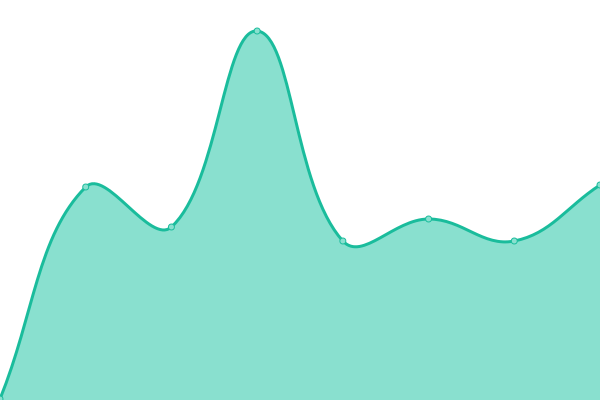 212ms
     
 | 

<a href="https://DELWP-DTV.github.io/santa/history/vic-data-victorian-tourist-heritage-railway-corridors4">100.00%</a>
    

|  [vic-data_vicmap-elevation-ground-surface-point1](https://opendata.maps.vic.gov.au/geoserver/wms?service=wms&request=getmap&format=image%2Fpng8&transparent=true&layers=open-data-platform:el_grnd_surface_point&width=512&height=512&crs=epsg%3A3857&bbox=16114148.554967716%2C-4456584.4971389165%2C16119040.524777967%2C-4451692.527328665) | 🟩 Up | [vic-data-vicmap-elevation-ground-surface-point1.yml](https://github.com/DELWP-DTV/santa/commits/HEAD/history/vic-data-vicmap-elevation-ground-surface-point1.yml) | 

 217ms
     
 | 

<a href="https://DELWP-DTV.github.io/santa/history/vic-data-vicmap-elevation-ground-surface-point1">100.00%</a>
    

|  [vic-data_melbourne-metro-tunnel-project-tunnel-entrances2](https://opendata.maps.vic.gov.au/geoserver/wms?service=wms&request=getmap&format=image%2Fpng8&transparent=true&layers=open-data-platform:mtp_ees_tunnel_entrances&width=512&height=512&crs=epsg%3A3857&bbox=16114148.554967716%2C-4456584.4971389165%2C16119040.524777967%2C-4451692.527328665) | 🟩 Up | [vic-data-melbourne-metro-tunnel-project-tunnel-entrances2.yml](https://github.com/DELWP-DTV/santa/commits/HEAD/history/vic-data-melbourne-metro-tunnel-project-tunnel-entrances2.yml) | 

 204ms
     
 | 

<a href="https://DELWP-DTV.github.io/santa/history/vic-data-melbourne-metro-tunnel-project-tunnel-entrances2">100.00%</a>
    

|  [vic-data_2010-index-of-stream-condition-channel-transect-line-features1](https://opendata.maps.vic.gov.au/geoserver/wms?service=wms&request=getmap&format=image%2Fpng8&transparent=true&layers=open-data-platform:isc2010_channel_transects&width=512&height=512&crs=epsg%3A3857&bbox=16114148.554967716%2C-4456584.4971389165%2C16119040.524777967%2C-4451692.527328665) | 🟩 Up | [vic-data-2010-index-of-stream-condition-channel-transect-line-features1.yml](https://github.com/DELWP-DTV/santa/commits/HEAD/history/vic-data-2010-index-of-stream-condition-channel-transect-line-features1.yml) | 

 215ms
     
 | 

<a href="https://DELWP-DTV.github.io/santa/history/vic-data-2010-index-of-stream-condition-channel-transect-line-features1">100.00%</a>
    

|  [vic-data_2010-index-of-stream-condition-bank-full-width-reach-polygon-features1](https://opendata.maps.vic.gov.au/geoserver/wms?service=wms&request=getmap&format=image%2Fpng8&transparent=true&layers=open-data-platform:isc2010_bankfull_width_r&width=512&height=512&crs=epsg%3A3857&bbox=16114148.554967716%2C-4456584.4971389165%2C16119040.524777967%2C-4451692.527328665) | 🟩 Up | [vic-data-2010-index-of-stream-condition-bank-full-width-reach-polygon-features1.yml](https://github.com/DELWP-DTV/santa/commits/HEAD/history/vic-data-2010-index-of-stream-condition-bank-full-width-reach-polygon-features1.yml) | 

 243ms
     
 | 

<a href="https://DELWP-DTV.github.io/santa/history/vic-data-2010-index-of-stream-condition-bank-full-width-reach-polygon-features1">100.00%</a>
    

|  [vic-data_2010-index-of-stream-condition-top-of-bank-line-features1](https://opendata.maps.vic.gov.au/geoserver/wms?service=wms&request=getmap&format=image%2Fpng8&transparent=true&layers=open-data-platform:isc2010_top_of_bank&width=512&height=512&crs=epsg%3A3857&bbox=16114148.554967716%2C-4456584.4971389165%2C16119040.524777967%2C-4451692.527328665) | 🟩 Up | [vic-data-2010-index-of-stream-condition-top-of-bank-line-features1.yml](https://github.com/DELWP-DTV/santa/commits/HEAD/history/vic-data-2010-index-of-stream-condition-top-of-bank-line-features1.yml) | 

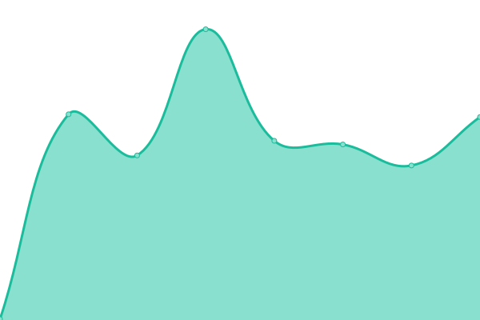 204ms
     
 | 

<a href="https://DELWP-DTV.github.io/santa/history/vic-data-2010-index-of-stream-condition-top-of-bank-line-features1">100.00%</a>
    

|  [vic-data_vicmap-lite-state-line-1-250000-to-1-20000001](https://opendata.maps.vic.gov.au/geoserver/wms?service=wms&request=getmap&format=image%2Fpng8&transparent=true&layers=open-data-platform:vmlite_victoria_line_su5&width=512&height=512&crs=epsg%3A3857&bbox=16114148.554967716%2C-4456584.4971389165%2C16119040.524777967%2C-4451692.527328665) | 🟩 Up | [vic-data-vicmap-lite-state-line-1-250000-to-1-20000001.yml](https://github.com/DELWP-DTV/santa/commits/HEAD/history/vic-data-vicmap-lite-state-line-1-250000-to-1-20000001.yml) | 

 226ms
     
 | 

<a href="https://DELWP-DTV.github.io/santa/history/vic-data-vicmap-lite-state-line-1-250000-to-1-20000001">100.00%</a>
    

|  [vic-data_vicmap-lite-railway-line-1-250000-to-1-50000001](https://opendata.maps.vic.gov.au/geoserver/wms?service=wms&request=getmap&format=image%2Fpng8&transparent=true&layers=open-data-platform:vmlite_tr_rail&width=512&height=512&crs=epsg%3A3857&bbox=16114148.554967716%2C-4456584.4971389165%2C16119040.524777967%2C-4451692.527328665) | 🟩 Up | [vic-data-vicmap-lite-railway-line-1-250000-to-1-50000001.yml](https://github.com/DELWP-DTV/santa/commits/HEAD/history/vic-data-vicmap-lite-railway-line-1-250000-to-1-50000001.yml) | 

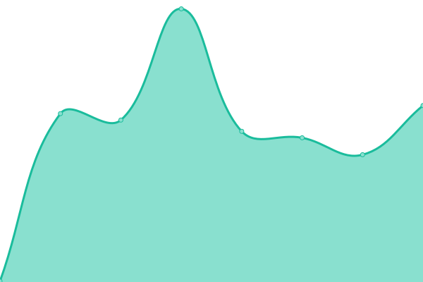 217ms
     
 | 

<a href="https://DELWP-DTV.github.io/santa/history/vic-data-vicmap-lite-railway-line-1-250000-to-1-50000001">100.00%</a>
    

|  [vic-data_exploration-graticules-with-100-km-intervals-agd66-expires-30th-june-20051](https://opendata.maps.vic.gov.au/geoserver/wms?service=wms&request=getmap&format=image%2Fpng8&transparent=true&layers=open-data-platform:grat100km&width=512&height=512&crs=epsg%3A3857&bbox=16114148.554967716%2C-4456584.4971389165%2C16119040.524777967%2C-4451692.527328665) | 🟩 Up | [vic-data-exploration-graticules-with-100-km-intervals-agd66-expires-30th-june-20051.yml](https://github.com/DELWP-DTV/santa/commits/HEAD/history/vic-data-exploration-graticules-with-100-km-intervals-agd66-expires-30th-june-20051.yml) | 

 204ms
     
 | 

<a href="https://DELWP-DTV.github.io/santa/history/vic-data-exploration-graticules-with-100-km-intervals-agd66-expires-30th-june-20051">100.00%</a>
    

|  [vic-data_vicmap-hydro-navigation-point1](https://opendata.maps.vic.gov.au/geoserver/wms?service=wms&request=getmap&format=image%2Fpng8&transparent=true&layers=open-data-platform:hy_navigation_point&width=512&height=512&crs=epsg%3A3857&bbox=16114148.554967716%2C-4456584.4971389165%2C16119040.524777967%2C-4451692.527328665) | 🟩 Up | [vic-data-vicmap-hydro-navigation-point1.yml](https://github.com/DELWP-DTV/santa/commits/HEAD/history/vic-data-vicmap-hydro-navigation-point1.yml) | 

 214ms
     
 | 

<a href="https://DELWP-DTV.github.io/santa/history/vic-data-vicmap-hydro-navigation-point1">100.00%</a>
    

|  [vic-data_lineaments-interpreted-from-gravity-data1](https://opendata.maps.vic.gov.au/geoserver/wms?service=wms&request=getmap&format=image%2Fpng8&transparent=true&layers=open-data-platform:lineaments_gravity&width=512&height=512&crs=epsg%3A3857&bbox=16114148.554967716%2C-4456584.4971389165%2C16119040.524777967%2C-4451692.527328665) | 🟩 Up | [vic-data-lineaments-interpreted-from-gravity-data1.yml](https://github.com/DELWP-DTV/santa/commits/HEAD/history/vic-data-lineaments-interpreted-from-gravity-data1.yml) | 

 213ms
     
 | 

<a href="https://DELWP-DTV.github.io/santa/history/vic-data-lineaments-interpreted-from-gravity-data1">100.00%</a>
    

|  [vic-data_seismic-3d-survey-areas-for-petroleum-industry-exploration2](https://opendata.maps.vic.gov.au/geoserver/wms?service=wms&request=getmap&format=image%2Fpng8&transparent=true&layers=open-data-platform:seismic3d&width=512&height=512&crs=epsg%3A3857&bbox=16114148.554967716%2C-4456584.4971389165%2C16119040.524777967%2C-4451692.527328665) | 🟩 Up | [vic-data-seismic-3d-survey-areas-for-petroleum-industry-exploration2.yml](https://github.com/DELWP-DTV/santa/commits/HEAD/history/vic-data-seismic-3d-survey-areas-for-petroleum-industry-exploration2.yml) | 

 198ms
     
 | 

<a href="https://DELWP-DTV.github.io/santa/history/vic-data-seismic-3d-survey-areas-for-petroleum-industry-exploration2">100.00%</a>
    

|  [vic-data_precinct-structure-plan-boundaries](https://services5.arcgis.com/DmRfik4clMVydXO3/arcgis/rest/services/PSP_Boundaries/FeatureServer/0/query?outFields=*&where=1%3D1) | 🟩 Up | [vic-data-precinct-structure-plan-boundaries.yml](https://github.com/DELWP-DTV/santa/commits/HEAD/history/vic-data-precinct-structure-plan-boundaries.yml) | 

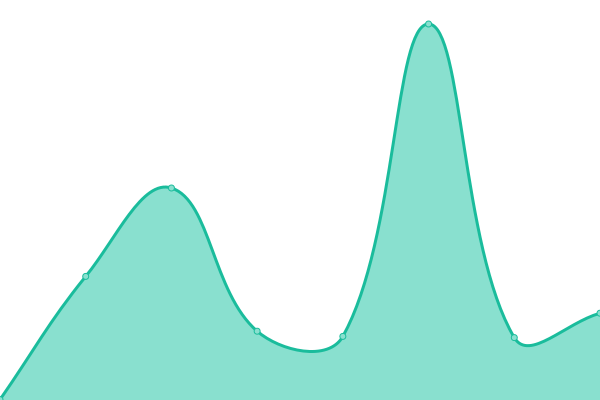 531ms
     
 | 

<a href="https://DELWP-DTV.github.io/santa/history/vic-data-precinct-structure-plan-boundaries">100.00%</a>
    

|  [vic-data_vicroads-declared-roads3](https://services2.arcgis.com/18ajPSI0b3ppsmMt/arcgis/rest/services/VicRoads_Declared_Roads/FeatureServer/0) | 🟩 Up | [vic-data-vicroads-declared-roads3.yml](https://github.com/DELWP-DTV/santa/commits/HEAD/history/vic-data-vicroads-declared-roads3.yml) | 

 312ms
     
 | 

<a href="https://DELWP-DTV.github.io/santa/history/vic-data-vicroads-declared-roads3">100.00%</a>
    

|  [vic-data_traffic-lights1](https://services2.arcgis.com/18ajPSI0b3ppsmMt/arcgis/rest/services/traffic_lights/FeatureServer/0) | 🟩 Up | [vic-data-traffic-lights1.yml](https://github.com/DELWP-DTV/santa/commits/HEAD/history/vic-data-traffic-lights1.yml) | 

 304ms
     
 | 

<a href="https://DELWP-DTV.github.io/santa/history/vic-data-traffic-lights1">100.00%</a>
    

|  [vic-data_traffic-volume](https://vicdata.vicroads.vic.gov.au/server/rest/services/Operations_Traffic/FeatureServer/0) | 🟩 Up | [vic-data-traffic-volume.yml](https://github.com/DELWP-DTV/santa/commits/HEAD/history/vic-data-traffic-volume.yml) | 

 1050ms
     
 | 

<a href="https://DELWP-DTV.github.io/santa/history/vic-data-traffic-volume">100.00%</a>
    

|  [vic-data_victorian-heritage-inventory1](https://opendata.maps.vic.gov.au/geoserver/wms?service=wms&request=getmap&format=image%2Fpng8&transparent=true&layers=open-data-platform:heritage_inventory&width=512&height=512&crs=epsg%3A3857&bbox=16114148.554967716%2C-4456584.4971389165%2C16119040.524777967%2C-4451692.527328665) | 🟩 Up | [vic-data-victorian-heritage-inventory1.yml](https://github.com/DELWP-DTV/santa/commits/HEAD/history/vic-data-victorian-heritage-inventory1.yml) | 

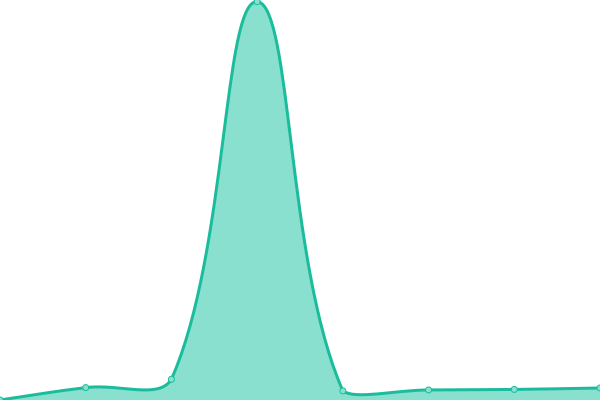 200ms
     
 | 

<a href="https://DELWP-DTV.github.io/santa/history/vic-data-victorian-heritage-inventory1">100.00%</a>
    

|  [vic-data_vicvoads-road-use-hierarchy](https://services2.arcgis.com/18ajPSI0b3ppsmMt/arcgis/rest/services/Road_Use_Hierarchy/FeatureServer/0/query?outFields=*&where=1%3D1) | 🟩 Up | [vic-data-vicvoads-road-use-hierarchy.yml](https://github.com/DELWP-DTV/santa/commits/HEAD/history/vic-data-vicvoads-road-use-hierarchy.yml) | 

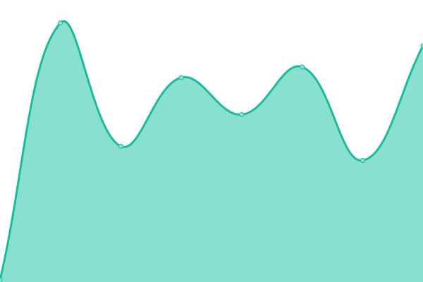 1222ms
     
 | 

<a href="https://DELWP-DTV.github.io/santa/history/vic-data-vicvoads-road-use-hierarchy">100.00%</a>
    

|  [vic-data_victorian-heritage-register](https://opendata.maps.vic.gov.au/geoserver/wms?service=wms&request=getmap&format=image%2Fpng8&transparent=true&layers=open-data-platform:heritage_register&width=512&height=512&crs=epsg%3A3857&bbox=16114148.554967716%2C-4456584.4971389165%2C16119040.524777967%2C-4451692.527328665) | 🟩 Up | [vic-data-victorian-heritage-register.yml](https://github.com/DELWP-DTV/santa/commits/HEAD/history/vic-data-victorian-heritage-register.yml) | 

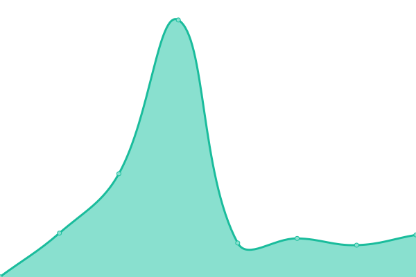 213ms
     
 | 

<a href="https://DELWP-DTV.github.io/santa/history/vic-data-victorian-heritage-register">100.00%</a>
    

|  [vic-data_vicmap-transport-rest-api](https://services6.arcgis.com/GB33F62SbDxJjwEL/arcgis/rest/services/Vicmap_Transport/FeatureServer) | 🟩 Up | [vic-data-vicmap-transport-rest-api.yml](https://github.com/DELWP-DTV/santa/commits/HEAD/history/vic-data-vicmap-transport-rest-api.yml) | 

 698ms
     
 | 

<a href="https://DELWP-DTV.github.io/santa/history/vic-data-vicmap-transport-rest-api">100.00%</a>
    

|  [vic-data_vicmap-transport-rest-api](https://enterprise.mapshare.vic.gov.au/server/rest/services/Vicmap_Transport/MapServer) | 🟩 Up | [vic-data-vicmap-transport-rest-api.yml](https://github.com/DELWP-DTV/santa/commits/HEAD/history/vic-data-vicmap-transport-rest-api.yml) | 

 698ms
     
 | 

<a href="https://DELWP-DTV.github.io/santa/history/vic-data-vicmap-transport-rest-api">100.00%</a>
    

|  [vic-data_vicmap-position-rest-api](https://services6.arcgis.com/GB33F62SbDxJjwEL/arcgis/rest/services/Vicmap_Position/FeatureServer) | 🟩 Up | [vic-data-vicmap-position-rest-api.yml](https://github.com/DELWP-DTV/santa/commits/HEAD/history/vic-data-vicmap-position-rest-api.yml) | 

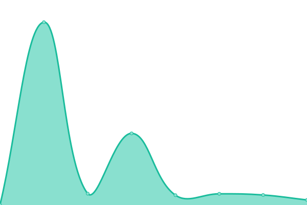 200ms
     
 | 

<a href="https://DELWP-DTV.github.io/santa/history/vic-data-vicmap-position-rest-api">100.00%</a>
    

|  [vic-data_vicmap-position-rest-api](https://enterprise.mapshare.vic.gov.au/server/rest/services/Vicmap_Position/MapServer) | 🟩 Up | [vic-data-vicmap-position-rest-api.yml](https://github.com/DELWP-DTV/santa/commits/HEAD/history/vic-data-vicmap-position-rest-api.yml) | 

 200ms
     
 | 

<a href="https://DELWP-DTV.github.io/santa/history/vic-data-vicmap-position-rest-api">100.00%</a>
    

|  [vic-data_vicmap-planning-api](https://services6.arcgis.com/GB33F62SbDxJjwEL/arcgis/rest/services/Vicmap_Planning/FeatureServer) | 🟩 Up | [vic-data-vicmap-planning-api.yml](https://github.com/DELWP-DTV/santa/commits/HEAD/history/vic-data-vicmap-planning-api.yml) | 

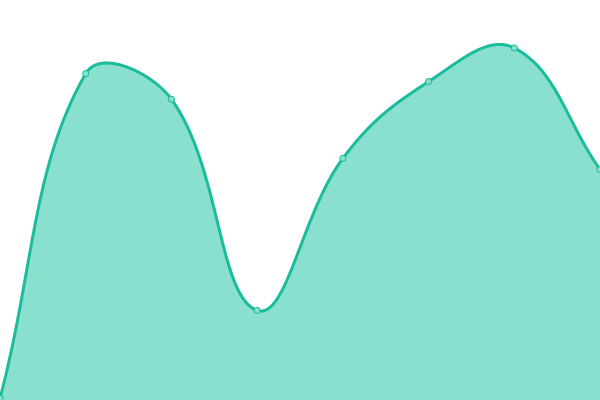 200ms
     
 | 

<a href="https://DELWP-DTV.github.io/santa/history/vic-data-vicmap-planning-api">100.00%</a>
    

|  [vic-data_vicmap-planning-api](https://enterprise.mapshare.vic.gov.au/server/rest/services/Vicmap_Planning/MapServer) | 🟩 Up | [vic-data-vicmap-planning-api.yml](https://github.com/DELWP-DTV/santa/commits/HEAD/history/vic-data-vicmap-planning-api.yml) | 

 200ms
     
 | 

<a href="https://DELWP-DTV.github.io/santa/history/vic-data-vicmap-planning-api">100.00%</a>
    

|  [vic-data_vicmap-lite-rest-api](https://services6.arcgis.com/GB33F62SbDxJjwEL/arcgis/rest/services/Vicmap_Lite/FeatureServer) | 🟩 Up | [vic-data-vicmap-lite-rest-api.yml](https://github.com/DELWP-DTV/santa/commits/HEAD/history/vic-data-vicmap-lite-rest-api.yml) | 

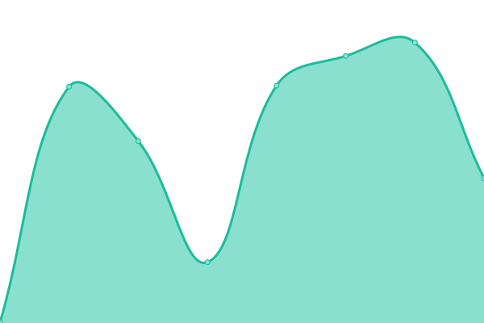 324ms
     
 | 

<a href="https://DELWP-DTV.github.io/santa/history/vic-data-vicmap-lite-rest-api">100.00%</a>
    

|  [vic-data_vicmap-lite-rest-api](https://enterprise.mapshare.vic.gov.au/server/rest/services/Vicmap_Lite/MapServer) | 🟩 Up | [vic-data-vicmap-lite-rest-api.yml](https://github.com/DELWP-DTV/santa/commits/HEAD/history/vic-data-vicmap-lite-rest-api.yml) | 

 324ms
     
 | 

<a href="https://DELWP-DTV.github.io/santa/history/vic-data-vicmap-lite-rest-api">100.00%</a>
    

|  [vic-data_vicmap-index-rest-api](https://services6.arcgis.com/GB33F62SbDxJjwEL/arcgis/rest/services/Vicmap_Index/FeatureServer) | 🟩 Up | [vic-data-vicmap-index-rest-api.yml](https://github.com/DELWP-DTV/santa/commits/HEAD/history/vic-data-vicmap-index-rest-api.yml) | 

 268ms
     
 | 

<a href="https://DELWP-DTV.github.io/santa/history/vic-data-vicmap-index-rest-api">100.00%</a>
    

|  [vic-data_vicmap-index-rest-api](https://enterprise.mapshare.vic.gov.au/server/rest/services/Vicmap_Index/MapServer) | 🟩 Up | [vic-data-vicmap-index-rest-api.yml](https://github.com/DELWP-DTV/santa/commits/HEAD/history/vic-data-vicmap-index-rest-api.yml) | 

 268ms
     
 | 

<a href="https://DELWP-DTV.github.io/santa/history/vic-data-vicmap-index-rest-api">100.00%</a>
    

|  [vic-data_vicmap-hydro-rest-api](https://services6.arcgis.com/GB33F62SbDxJjwEL/arcgis/rest/services/Vicmap_Hydro/FeatureServer) | 🟩 Up | [vic-data-vicmap-hydro-rest-api.yml](https://github.com/DELWP-DTV/santa/commits/HEAD/history/vic-data-vicmap-hydro-rest-api.yml) | 

 268ms
     
 | 

<a href="https://DELWP-DTV.github.io/santa/history/vic-data-vicmap-hydro-rest-api">100.00%</a>
    

|  [vic-data_vicmap-hydro-rest-api](https://enterprise.mapshare.vic.gov.au/server/rest/services/Vicmap_Hydro/MapServer) | 🟩 Up | [vic-data-vicmap-hydro-rest-api.yml](https://github.com/DELWP-DTV/santa/commits/HEAD/history/vic-data-vicmap-hydro-rest-api.yml) | 

 268ms
     
 | 

<a href="https://DELWP-DTV.github.io/santa/history/vic-data-vicmap-hydro-rest-api">100.00%</a>
    

|  [vic-data_vicmap-geomark-rest-api](https://services6.arcgis.com/GB33F62SbDxJjwEL/arcgis/rest/services/Vicmap_Geomark/FeatureServer) | 🟩 Up | [vic-data-vicmap-geomark-rest-api.yml](https://github.com/DELWP-DTV/santa/commits/HEAD/history/vic-data-vicmap-geomark-rest-api.yml) | 

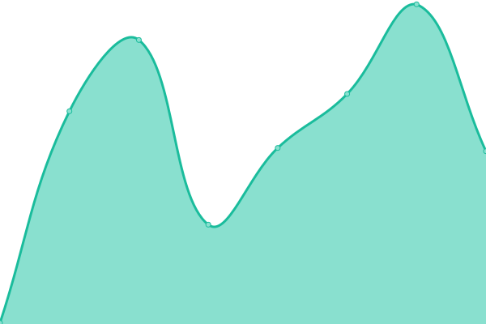 220ms
     
 | 

<a href="https://DELWP-DTV.github.io/santa/history/vic-data-vicmap-geomark-rest-api">100.00%</a>
    

|  [vic-data_vicmap-geomark-rest-api](https://enterprise.mapshare.vic.gov.au/server/rest/services/Vicmap_Geomark/MapServer) | 🟩 Up | [vic-data-vicmap-geomark-rest-api.yml](https://github.com/DELWP-DTV/santa/commits/HEAD/history/vic-data-vicmap-geomark-rest-api.yml) | 

 220ms
     
 | 

<a href="https://DELWP-DTV.github.io/santa/history/vic-data-vicmap-geomark-rest-api">100.00%</a>
    

|  [vic-data_vicmap-features-of-interest-rest-api](https://services6.arcgis.com/GB33F62SbDxJjwEL/arcgis/rest/services/Vicmap_Features_of_Interest/FeatureServer) | 🟩 Up | [vic-data-vicmap-features-of-interest-rest-api.yml](https://github.com/DELWP-DTV/santa/commits/HEAD/history/vic-data-vicmap-features-of-interest-rest-api.yml) | 

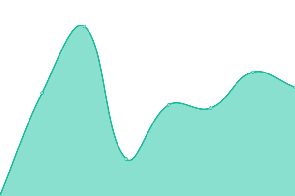 304ms
     
 | 

<a href="https://DELWP-DTV.github.io/santa/history/vic-data-vicmap-features-of-interest-rest-api">100.00%</a>
    

|  [vic-data_vicmap-features-of-interest-rest-api](https://enterprise.mapshare.vic.gov.au/server/rest/services/Vicmap_Features_of_Interest/MapServer) | 🟩 Up | [vic-data-vicmap-features-of-interest-rest-api.yml](https://github.com/DELWP-DTV/santa/commits/HEAD/history/vic-data-vicmap-features-of-interest-rest-api.yml) | 

 304ms
     
 | 

<a href="https://DELWP-DTV.github.io/santa/history/vic-data-vicmap-features-of-interest-rest-api">100.00%</a>
    

|  [vic-data_vicmap-elevation-rest-api](https://services6.arcgis.com/GB33F62SbDxJjwEL/arcgis/rest/services/Vicmap_Elevation_METRO_1_to_5_metre/FeatureServer) | 🟩 Up | [vic-data-vicmap-elevation-rest-api.yml](https://github.com/DELWP-DTV/santa/commits/HEAD/history/vic-data-vicmap-elevation-rest-api.yml) | 

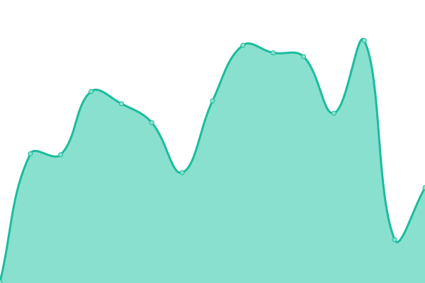 239ms
     
 | 

<a href="https://DELWP-DTV.github.io/santa/history/vic-data-vicmap-elevation-rest-api">100.00%</a>
    

|  [vic-data_vicmap-elevation-rest-api](https://services6.arcgis.com/GB33F62SbDxJjwEL/arcgis/rest/services/Vicmap_Elevation_STATEWIDE_10_to_20_metre/FeatureServer) | 🟩 Up | [vic-data-vicmap-elevation-rest-api.yml](https://github.com/DELWP-DTV/santa/commits/HEAD/history/vic-data-vicmap-elevation-rest-api.yml) | 

 239ms
     
 | 

<a href="https://DELWP-DTV.github.io/santa/history/vic-data-vicmap-elevation-rest-api">100.00%</a>
    

|  [vic-data_vicmap-elevation-rest-api](https://enterprise.mapshare.vic.gov.au/server/rest/services/Vicmap_Elevation_STATEWIDE_10_to_20_metre/MapServer) | 🟩 Up | [vic-data-vicmap-elevation-rest-api.yml](https://github.com/DELWP-DTV/santa/commits/HEAD/history/vic-data-vicmap-elevation-rest-api.yml) | 

 239ms
     
 | 

<a href="https://DELWP-DTV.github.io/santa/history/vic-data-vicmap-elevation-rest-api">100.00%</a>
    

|  [vic-data_vicmap-elevation-rest-api](https://enterprise.mapshare.vic.gov.au/server/rest/services/Vicmap_Elevation_METRO_1_to_5_metre/MapServer) | 🟩 Up | [vic-data-vicmap-elevation-rest-api.yml](https://github.com/DELWP-DTV/santa/commits/HEAD/history/vic-data-vicmap-elevation-rest-api.yml) | 

 239ms
     
 | 

<a href="https://DELWP-DTV.github.io/santa/history/vic-data-vicmap-elevation-rest-api">100.00%</a>
    

|  [vic-data_vicmap-crown-land-tenure-rest-api](https://services6.arcgis.com/GB33F62SbDxJjwEL/arcgis/rest/services/Vicmap_Crown_Land_Tenure/FeatureServer) | 🟩 Up | [vic-data-vicmap-crown-land-tenure-rest-api.yml](https://github.com/DELWP-DTV/santa/commits/HEAD/history/vic-data-vicmap-crown-land-tenure-rest-api.yml) | 

 214ms
     
 | 

<a href="https://DELWP-DTV.github.io/santa/history/vic-data-vicmap-crown-land-tenure-rest-api">100.00%</a>
    

|  [vic-data_vicmap-crown-land-tenure-rest-api](https://enterprise.mapshare.vic.gov.au/server/rest/services/Vicmap_Crown_Land_Tenure/MapServer) | 🟩 Up | [vic-data-vicmap-crown-land-tenure-rest-api.yml](https://github.com/DELWP-DTV/santa/commits/HEAD/history/vic-data-vicmap-crown-land-tenure-rest-api.yml) | 

 214ms
     
 | 

<a href="https://DELWP-DTV.github.io/santa/history/vic-data-vicmap-crown-land-tenure-rest-api">100.00%</a>
    

|  [vic-data_vicmap-admin-rest-api](https://services6.arcgis.com/GB33F62SbDxJjwEL/arcgis/rest/services/Vicmap_Admin/FeatureServer) | 🟩 Up | [vic-data-vicmap-admin-rest-api.yml](https://github.com/DELWP-DTV/santa/commits/HEAD/history/vic-data-vicmap-admin-rest-api.yml) | 

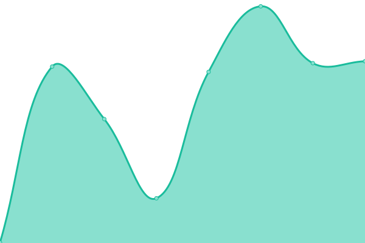 294ms
     
 | 

<a href="https://DELWP-DTV.github.io/santa/history/vic-data-vicmap-admin-rest-api">100.00%</a>
    

|  [vic-data_vicmap-admin-rest-api](https://enterprise.mapshare.vic.gov.au/server/rest/services/Vicmap_Admin/MapServer) | 🟩 Up | [vic-data-vicmap-admin-rest-api.yml](https://github.com/DELWP-DTV/santa/commits/HEAD/history/vic-data-vicmap-admin-rest-api.yml) | 

 294ms
     
 | 

<a href="https://DELWP-DTV.github.io/santa/history/vic-data-vicmap-admin-rest-api">100.00%</a>
    

|  [vic-data_vicmap-address-rest-api](https://services6.arcgis.com/GB33F62SbDxJjwEL/arcgis/rest/services/Vicmap_Address/FeatureServer) | 🟩 Up | [vic-data-vicmap-address-rest-api.yml](https://github.com/DELWP-DTV/santa/commits/HEAD/history/vic-data-vicmap-address-rest-api.yml) | 

 213ms
     
 | 

<a href="https://DELWP-DTV.github.io/santa/history/vic-data-vicmap-address-rest-api">100.00%</a>
    

|  [vic-data_vicmap-address-rest-api](https://enterprise.mapshare.vic.gov.au/server/rest/services/Vicmap_Address/MapServer) | 🟩 Up | [vic-data-vicmap-address-rest-api.yml](https://github.com/DELWP-DTV/santa/commits/HEAD/history/vic-data-vicmap-address-rest-api.yml) | 

 213ms
     
 | 

<a href="https://DELWP-DTV.github.io/santa/history/vic-data-vicmap-address-rest-api">100.00%</a>
    

|  [vic-data_structure-height-clearance](https://maps.nhvr.gov.au/agsm1/rest/services/vicroads/HVR_AGOL_OpenData/MapServer/46) | 🟩 Up | [vic-data-structure-height-clearance.yml](https://github.com/DELWP-DTV/santa/commits/HEAD/history/vic-data-structure-height-clearance.yml) | 

 950ms
     
 | 

<a href="https://DELWP-DTV.github.io/santa/history/vic-data-structure-height-clearance">100.00%</a>
    

|  [vic-data_public-open-space-400m-walkable-catchment](https://services5.arcgis.com/DmRfik4clMVydXO3/arcgis/rest/services/OS_WalkableCatchment_400m_SP/FeatureServer/0/query?outFields=*&where=1%3D1) | 🟩 Up | [vic-data-public-open-space-400m-walkable-catchment.yml](https://github.com/DELWP-DTV/santa/commits/HEAD/history/vic-data-public-open-space-400m-walkable-catchment.yml) | 

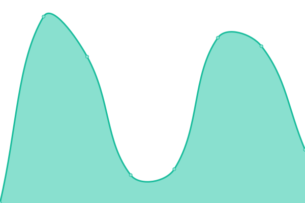 478ms
     
 | 

<a href="https://DELWP-DTV.github.io/santa/history/vic-data-public-open-space-400m-walkable-catchment">100.00%</a>
    

|  [vic-data_open-space](https://services5.arcgis.com/DmRfik4clMVydXO3/arcgis/rest/services/VPA_Draft_Open_Space_Data/FeatureServer/0/query?outFields=*&where=1%3D1) | 🟩 Up | [vic-data-open-space.yml](https://github.com/DELWP-DTV/santa/commits/HEAD/history/vic-data-open-space.yml) | 

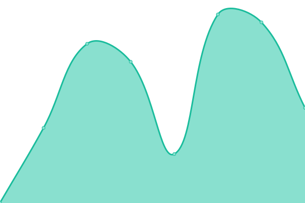 446ms
     
 | 

<a href="https://DELWP-DTV.github.io/santa/history/vic-data-open-space">100.00%</a>
    

|  [vic-data_hvr-b-double-network](https://maps.nhvr.gov.au/agsm1/rest/services/vicroads/HVR_AGOL_OpenData/MapServer/9) | 🟩 Up | [vic-data-hvr-b-double-network.yml](https://github.com/DELWP-DTV/santa/commits/HEAD/history/vic-data-hvr-b-double-network.yml) | 

 185ms
     
 | 

<a href="https://DELWP-DTV.github.io/santa/history/vic-data-hvr-b-double-network">100.00%</a>
    

|  [vic-data_fus-land-use](https://services5.arcgis.com/DmRfik4clMVydXO3/arcgis/rest/services/FUS_LandUse_ArcGISUpload/FeatureServer/0/query?outFields=*&where=1%3D1) | 🟩 Up | [vic-data-fus-land-use.yml](https://github.com/DELWP-DTV/santa/commits/HEAD/history/vic-data-fus-land-use.yml) | 

 327ms
     
 | 

<a href="https://DELWP-DTV.github.io/santa/history/vic-data-fus-land-use">100.00%</a>
    

|  [vic-data_dhhs-service-areas](https://services.arcgis.com/B7qHofahIc9hrOqB/arcgis/rest/services/DHHS_ServiceAreas/FeatureServer/0/query?outFields=*&where=1%3D1) | 🟩 Up | [vic-data-dhhs-service-areas.yml](https://github.com/DELWP-DTV/santa/commits/HEAD/history/vic-data-dhhs-service-areas.yml) | 

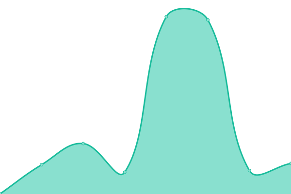 696ms
     
 | 

<a href="https://DELWP-DTV.github.io/santa/history/vic-data-dhhs-service-areas">100.00%</a>
    

|  [vic-data_bridge-structures2](https://services2.arcgis.com/18ajPSI0b3ppsmMt/arcgis/rest/services/Bridge_Structures/FeatureServer/0) | 🟩 Up | [vic-data-bridge-structures2.yml](https://github.com/DELWP-DTV/santa/commits/HEAD/history/vic-data-bridge-structures2.yml) | 

 263ms
     
 | 

<a href="https://DELWP-DTV.github.io/santa/history/vic-data-bridge-structures2">100.00%</a>
    

|  [vic-data_b-double-restricted-structures](https://maps.nhvr.gov.au/agsm1/rest/services/vicroads/HVR_AGOL_OpenData/MapServer/36) | 🟩 Up | [vic-data-b-double-restricted-structures.yml](https://github.com/DELWP-DTV/santa/commits/HEAD/history/vic-data-b-double-restricted-structures.yml) | 

 185ms
     
 | 

<a href="https://DELWP-DTV.github.io/santa/history/vic-data-b-double-restricted-structures">100.00%</a>
    

|  [vic-data_epa-victoria-priority-sites-register-psr-location-polygons-2](https://opendata.maps.vic.gov.au/geoserver/wms?service=wms&request=getmap&format=image%2Fpng8&transparent=true&layers=open-data-platform:psr_polygon&width=512&height=512&crs=epsg%3A3857&bbox=16114148.554967716%2C-4456584.4971389165%2C16119040.524777967%2C-4451692.527328665) | 🟩 Up | [vic-data-epa-victoria-priority-sites-register-psr-location-polygons-2.yml](https://github.com/DELWP-DTV/santa/commits/HEAD/history/vic-data-epa-victoria-priority-sites-register-psr-location-polygons-2.yml) | 

 837ms
     
 | 

<a href="https://DELWP-DTV.github.io/santa/history/vic-data-epa-victoria-priority-sites-register-psr-location-polygons-2">100.00%</a>
    

|  [vic-data_epa-victoria-priority-sites-register-psr-location-polygons2](https://opendata.maps.vic.gov.au/geoserver/wms?service=wms&request=getmap&format=image%2Fpng8&transparent=true&layers=open-data-platform:psr_polygon&width=512&height=512&crs=epsg%3A3857&bbox=16114148.554967716%2C-4456584.4971389165%2C16119040.524777967%2C-4451692.527328665) | 🟩 Up | [vic-data-epa-victoria-priority-sites-register-psr-location-polygons2.yml](https://github.com/DELWP-DTV/santa/commits/HEAD/history/vic-data-epa-victoria-priority-sites-register-psr-location-polygons2.yml) | 

 220ms
     
 | 

<a href="https://DELWP-DTV.github.io/santa/history/vic-data-epa-victoria-priority-sites-register-psr-location-polygons2">100.00%</a>
    

|  [vic-data_recreation-signage1](https://opendata.maps.vic.gov.au/geoserver/wms?service=wms&request=getmap&format=image%2Fpng8&transparent=true&layers=open-data-platform:recweb_sign&width=512&height=512&crs=epsg%3A3857&bbox=16114148.554967716%2C-4456584.4971389165%2C16119040.524777967%2C-4451692.527328665) | 🟩 Up | [vic-data-recreation-signage1.yml](https://github.com/DELWP-DTV/santa/commits/HEAD/history/vic-data-recreation-signage1.yml) | 

 238ms
     
 | 

<a href="https://DELWP-DTV.github.io/santa/history/vic-data-recreation-signage1">100.00%</a>
    

|  [vic-data_vicmap-admin-ward-polygon-20161](https://opendata.maps.vic.gov.au/geoserver/wms?service=wms&request=getmap&format=image%2Fpng8&transparent=true&layers=open-data-platform:ward_2016&width=512&height=512&crs=epsg%3A3857&bbox=16114148.554967716%2C-4456584.4971389165%2C16119040.524777967%2C-4451692.527328665) | 🟩 Up | [vic-data-vicmap-admin-ward-polygon-20161.yml](https://github.com/DELWP-DTV/santa/commits/HEAD/history/vic-data-vicmap-admin-ward-polygon-20161.yml) | 

 229ms
     
 | 

<a href="https://DELWP-DTV.github.io/santa/history/vic-data-vicmap-admin-ward-polygon-20161">100.00%</a>
    

|  [vic-data_epa-victoria-victorian-landfill-register-vlr-location-points_2](https://opendata.maps.vic.gov.au/geoserver/wms?service=wms&request=getmap&format=image%2Fpng8&transparent=true&layers=open-data-platform:vlr_point&width=512&height=512&crs=epsg%3A3857&bbox=16114148.554967716%2C-4456584.4971389165%2C16119040.524777967%2C-4451692.527328665) | 🟩 Up | [vic-data-epa-victoria-victorian-landfill-register-vlr-location-points-2.yml](https://github.com/DELWP-DTV/santa/commits/HEAD/history/vic-data-epa-victoria-victorian-landfill-register-vlr-location-points-2.yml) | 

 210ms
     
 | 

<a href="https://DELWP-DTV.github.io/santa/history/vic-data-epa-victoria-victorian-landfill-register-vlr-location-points-2">100.00%</a>
    

|  [vic-data_epa-victoria-groundwater-quality-restriction-use-zones-gqruz-location-polygons_2](https://opendata.maps.vic.gov.au/geoserver/wms?service=wms&request=getmap&format=image%2Fpng8&transparent=true&layers=open-data-platform:gqruz_polygon&width=512&height=512&crs=epsg%3A3857&bbox=16114148.554967716%2C-4456584.4971389165%2C16119040.524777967%2C-4451692.527328665) | 🟩 Up | [vic-data-epa-victoria-groundwater-quality-restriction-use-zones-gqruz-location-polygons-2.yml](https://github.com/DELWP-DTV/santa/commits/HEAD/history/vic-data-epa-victoria-groundwater-quality-restriction-use-zones-gqruz-location-polygons-2.yml) | 

 200ms
     
 | 

<a href="https://DELWP-DTV.github.io/santa/history/vic-data-epa-victoria-groundwater-quality-restriction-use-zones-gqruz-location-polygons-2">100.00%</a>
    

|  [vic-data_epa-victoria-groundwater-quality-restriction-use-zones-gqruz-location-points-2](https://opendata.maps.vic.gov.au/geoserver/wms?service=wms&request=getmap&format=image%2Fpng8&transparent=true&layers=open-data-platform:gqruz_point&width=512&height=512&crs=epsg%3A3857&bbox=16114148.554967716%2C-4456584.4971389165%2C16119040.524777967%2C-4451692.527328665) | 🟩 Up | [vic-data-epa-victoria-groundwater-quality-restriction-use-zones-gqruz-location-points-2.yml](https://github.com/DELWP-DTV/santa/commits/HEAD/history/vic-data-epa-victoria-groundwater-quality-restriction-use-zones-gqruz-location-points-2.yml) | 

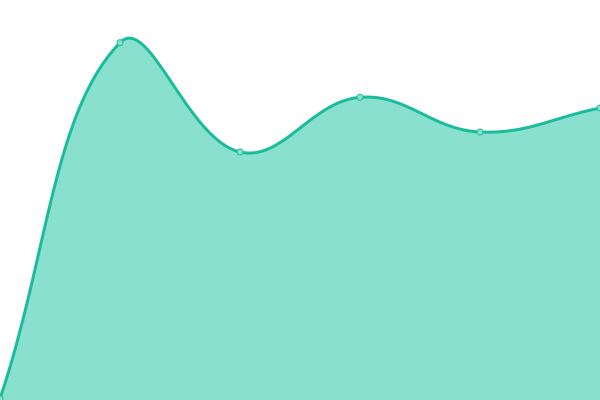 216ms
     
 | 

<a href="https://DELWP-DTV.github.io/santa/history/vic-data-epa-victoria-groundwater-quality-restriction-use-zones-gqruz-location-points-2">100.00%</a>
    

|  [vic-data_vicmap-hydro-watercourse-line2](https://opendata.maps.vic.gov.au/geoserver/wms?service=wms&request=getmap&format=image%2Fpng8&transparent=true&layers=open-data-platform:hy_watercourse&width=512&height=512&crs=epsg%3A3857&bbox=16114148.554967716%2C-4456584.4971389165%2C16119040.524777967%2C-4451692.527328665) | 🟩 Up | [vic-data-vicmap-hydro-watercourse-line2.yml](https://github.com/DELWP-DTV/santa/commits/HEAD/history/vic-data-vicmap-hydro-watercourse-line2.yml) | 

 423ms
     
 | 

<a href="https://DELWP-DTV.github.io/santa/history/vic-data-vicmap-hydro-watercourse-line2">100.00%</a>
    

|  [vic-data_epa-victoria-groundwater-quality-restriction-use-zones-gqruz-location-polygons](https://opendata.maps.vic.gov.au/geoserver/wms?service=wms&request=getmap&format=image%2Fpng8&transparent=true&layers=open-data-platform:gqruz_polygon&width=512&height=512&crs=epsg%3A3857&bbox=16114148.554967716%2C-4456584.4971389165%2C16119040.524777967%2C-4451692.527328665) | 🟩 Up | [vic-data-epa-victoria-groundwater-quality-restriction-use-zones-gqruz-location-polygons.yml](https://github.com/DELWP-DTV/santa/commits/HEAD/history/vic-data-epa-victoria-groundwater-quality-restriction-use-zones-gqruz-location-polygons.yml) | 

 203ms
     
 | 

<a href="https://DELWP-DTV.github.io/santa/history/vic-data-epa-victoria-groundwater-quality-restriction-use-zones-gqruz-location-polygons">100.00%</a>
    

|  [vic-data_epa-victoria-victorian-landfill-register-vlr-location-points2](https://opendata.maps.vic.gov.au/geoserver/wms?service=wms&request=getmap&format=image%2Fpng8&transparent=true&layers=open-data-platform:vlr_point&width=512&height=512&crs=epsg%3A3857&bbox=16114148.554967716%2C-4456584.4971389165%2C16119040.524777967%2C-4451692.527328665) | 🟩 Up | [vic-data-epa-victoria-victorian-landfill-register-vlr-location-points2.yml](https://github.com/DELWP-DTV/santa/commits/HEAD/history/vic-data-epa-victoria-victorian-landfill-register-vlr-location-points2.yml) | 

 211ms
     
 | 

<a href="https://DELWP-DTV.github.io/santa/history/vic-data-epa-victoria-victorian-landfill-register-vlr-location-points2">100.00%</a>
    

|  [vic-data_current-mineral-exploration-licences2](https://opendata.maps.vic.gov.au/geoserver/wms?service=wms&request=getmap&format=image%2Fpng8&transparent=true&layers=open-data-platform:el&width=512&height=512&crs=epsg%3A3857&bbox=16114148.554967716%2C-4456584.4971389165%2C16119040.524777967%2C-4451692.527328665) | 🟩 Up | [vic-data-current-mineral-exploration-licences2.yml](https://github.com/DELWP-DTV/santa/commits/HEAD/history/vic-data-current-mineral-exploration-licences2.yml) | 

 239ms
     
 | 

<a href="https://DELWP-DTV.github.io/santa/history/vic-data-current-mineral-exploration-licences2">100.00%</a>
    

|  [vic-data_epa-victoria-groundwater-quality-restriction-use-zones-gqruz-location-points1](https://opendata.maps.vic.gov.au/geoserver/wms?service=wms&request=getmap&format=image%2Fpng8&transparent=true&layers=open-data-platform:gqruz_point&width=512&height=512&crs=epsg%3A3857&bbox=16114148.554967716%2C-4456584.4971389165%2C16119040.524777967%2C-4451692.527328665) | 🟩 Up | [vic-data-epa-victoria-groundwater-quality-restriction-use-zones-gqruz-location-points1.yml](https://github.com/DELWP-DTV/santa/commits/HEAD/history/vic-data-epa-victoria-groundwater-quality-restriction-use-zones-gqruz-location-points1.yml) | 

 239ms
     
 | 

<a href="https://DELWP-DTV.github.io/santa/history/vic-data-epa-victoria-groundwater-quality-restriction-use-zones-gqruz-location-points1">100.00%</a>
    

|  [vic-data_vicmap-property-property-polygon-with-approved-base-detail3](https://opendata.maps.vic.gov.au/geoserver/wms?service=wms&request=getmap&format=image%2Fpng8&transparent=true&layers=open-data-platform:v_s_property_base_approved&width=512&height=512&crs=epsg%3A3857&bbox=16114148.554967716%2C-4456584.4971389165%2C16119040.524777967%2C-4451692.527328665) | 🟩 Up | [vic-data-vicmap-property-property-polygon-with-approved-base-detail3.yml](https://github.com/DELWP-DTV/santa/commits/HEAD/history/vic-data-vicmap-property-property-polygon-with-approved-base-detail3.yml) | 

 418ms
     
 | 

<a href="https://DELWP-DTV.github.io/santa/history/vic-data-vicmap-property-property-polygon-with-approved-base-detail3">100.00%</a>
    

|  [vic-data_modified-rivers2](https://opendata.maps.vic.gov.au/geoserver/wms?service=wms&request=getmap&format=image%2Fpng8&transparent=true&layers=open-data-platform:modified_rivers&width=512&height=512&crs=epsg%3A3857&bbox=16114148.554967716%2C-4456584.4971389165%2C16119040.524777967%2C-4451692.527328665) | 🟩 Up | [vic-data-modified-rivers2.yml](https://github.com/DELWP-DTV/santa/commits/HEAD/history/vic-data-modified-rivers2.yml) | 

 216ms
     
 | 

<a href="https://DELWP-DTV.github.io/santa/history/vic-data-modified-rivers2">100.00%</a>
    

|  [vic-data_vicmap-admin-fire-rescue-victoria-frv-legislated-boundary-polygon2](https://opendata.maps.vic.gov.au/geoserver/wms?service=wms&request=getmap&format=image%2Fpng8&transparent=true&layers=open-data-platform:frv_legislated_boundary&width=512&height=512&crs=epsg%3A3857&bbox=16114148.554967716%2C-4456584.4971389165%2C16119040.524777967%2C-4451692.527328665) | 🟩 Up | [vic-data-vicmap-admin-fire-rescue-victoria-frv-legislated-boundary-polygon2.yml](https://github.com/DELWP-DTV/santa/commits/HEAD/history/vic-data-vicmap-admin-fire-rescue-victoria-frv-legislated-boundary-polygon2.yml) | 

 222ms
     
 | 

<a href="https://DELWP-DTV.github.io/santa/history/vic-data-vicmap-admin-fire-rescue-victoria-frv-legislated-boundary-polygon2">100.00%</a>
    

|  [vic-data_historical-business-listings-from-sands-mcdougall-directories2](https://opendata.maps.vic.gov.au/geoserver/wms?service=wms&request=getmap&format=image%2Fpng8&transparent=true&layers=open-data-platform:sands_mcdougall_public&width=512&height=512&crs=epsg%3A3857&bbox=16114148.554967716%2C-4456584.4971389165%2C16119040.524777967%2C-4451692.527328665) | 🟩 Up | [vic-data-historical-business-listings-from-sands-mcdougall-directories2.yml](https://github.com/DELWP-DTV/santa/commits/HEAD/history/vic-data-historical-business-listings-from-sands-mcdougall-directories2.yml) | 

 238ms
     
 | 

<a href="https://DELWP-DTV.github.io/santa/history/vic-data-historical-business-listings-from-sands-mcdougall-directories2">100.00%</a>
    

|  [vic-data_vicmap-vegetation-tree-density-polygon1](https://opendata.maps.vic.gov.au/geoserver/wms?service=wms&request=getmap&format=image%2Fpng8&transparent=true&layers=open-data-platform:tree_density&width=512&height=512&crs=epsg%3A3857&bbox=16114148.554967716%2C-4456584.4971389165%2C16119040.524777967%2C-4451692.527328665) | 🟩 Up | [vic-data-vicmap-vegetation-tree-density-polygon1.yml](https://github.com/DELWP-DTV/santa/commits/HEAD/history/vic-data-vicmap-vegetation-tree-density-polygon1.yml) | 

 389ms
     
 | 

<a href="https://DELWP-DTV.github.io/santa/history/vic-data-vicmap-vegetation-tree-density-polygon1">100.00%</a>
    

|  [vic-data_vicmap-vegetation-tree-urban-point1](https://opendata.maps.vic.gov.au/geoserver/wms?service=wms&request=getmap&format=image%2Fpng8&transparent=true&layers=open-data-platform:tree_urban&width=512&height=512&crs=epsg%3A3857&bbox=16114148.554967716%2C-4456584.4971389165%2C16119040.524777967%2C-4451692.527328665) | 🟩 Up | [vic-data-vicmap-vegetation-tree-urban-point1.yml](https://github.com/DELWP-DTV/santa/commits/HEAD/history/vic-data-vicmap-vegetation-tree-urban-point1.yml) | 

 212ms
     
 | 

<a href="https://DELWP-DTV.github.io/santa/history/vic-data-vicmap-vegetation-tree-urban-point1">94.08%</a>
    

|  [vic-data_vicmap-index-framework-polygon2](https://opendata.maps.vic.gov.au/geoserver/wms?service=wms&request=getmap&format=image%2Fpng8&transparent=true&layers=open-data-platform:fr_framework_area_polygon&width=512&height=512&crs=epsg%3A3857&bbox=16114148.554967716%2C-4456584.4971389165%2C16119040.524777967%2C-4451692.527328665) | 🟩 Up | [vic-data-vicmap-index-framework-polygon2.yml](https://github.com/DELWP-DTV/santa/commits/HEAD/history/vic-data-vicmap-index-framework-polygon2.yml) | 

 684ms
     
 | 

<a href="https://DELWP-DTV.github.io/santa/history/vic-data-vicmap-index-framework-polygon2">100.00%</a>
    

|  [vic-data_agricultural-zones-ag-zones](https://maps.nhvr.gov.au/agsm1/rest/services/vicroads/HVR_AGOL_OpenData/MapServer/1) | 🟩 Up | [vic-data-agricultural-zones-ag-zones.yml](https://github.com/DELWP-DTV/santa/commits/HEAD/history/vic-data-agricultural-zones-ag-zones.yml) | 

 248ms
     
 | 

<a href="https://DELWP-DTV.github.io/santa/history/vic-data-agricultural-zones-ag-zones">100.00%</a>
    

|  [vic-data_fatal-crashes-lives-lost-last-5-years-to-date](https://vicdata.vicroads.vic.gov.au/server/rest/services/SMOP/SMOP_Open_Data_040521/FeatureServer/0) | 🟩 Up | [vic-data-fatal-crashes-lives-lost-last-5-years-to-date.yml](https://github.com/DELWP-DTV/santa/commits/HEAD/history/vic-data-fatal-crashes-lives-lost-last-5-years-to-date.yml) | 

 871ms
     
 | 

<a href="https://DELWP-DTV.github.io/santa/history/vic-data-fatal-crashes-lives-lost-last-5-years-to-date">100.00%</a>
    

|  [vic-data_restricted-conditionally-approved-structures-a-doubles-5-22](https://maps.nhvr.gov.au/agsm1/rest/services/vicroads/HVR_AGOL_OpenData/MapServer/33) | 🟩 Up | [vic-data-restricted-conditionally-approved-structures-a-doubles-5-22.yml](https://github.com/DELWP-DTV/santa/commits/HEAD/history/vic-data-restricted-conditionally-approved-structures-a-doubles-5-22.yml) | 

 183ms
     
 | 

<a href="https://DELWP-DTV.github.io/santa/history/vic-data-restricted-conditionally-approved-structures-a-doubles-5-22">100.00%</a>
    

|  [vic-data_oversize-overmass-osom-spv-zones](https://maps.nhvr.gov.au/agsm1/rest/services/vicroads/HVR_AGOL_OpenData/MapServer/31) | 🟩 Up | [vic-data-oversize-overmass-osom-spv-zones.yml](https://github.com/DELWP-DTV/santa/commits/HEAD/history/vic-data-oversize-overmass-osom-spv-zones.yml) | 

 182ms
     
 | 

<a href="https://DELWP-DTV.github.io/santa/history/vic-data-oversize-overmass-osom-spv-zones">100.00%</a>
    

|  [vic-data_road-use-hierarchy](https://services2.arcgis.com/18ajPSI0b3ppsmMt/arcgis/rest/services/Road_Use_Hierarchy/FeatureServer/0) | 🟩 Up | [vic-data-road-use-hierarchy.yml](https://github.com/DELWP-DTV/santa/commits/HEAD/history/vic-data-road-use-hierarchy.yml) | 

 139ms
     
 | 

<a href="https://DELWP-DTV.github.io/santa/history/vic-data-road-use-hierarchy">100.00%</a>
    

|  [vic-data_hvr-high-productivity-freight-vehicle-hpfv-a-doubles-5-2](https://maps.nhvr.gov.au/agsm1/rest/services/vicroads/HVR_AGOL_OpenData/MapServer/16) | 🟩 Up | [vic-data-hvr-high-productivity-freight-vehicle-hpfv-a-doubles-5-2.yml](https://github.com/DELWP-DTV/santa/commits/HEAD/history/vic-data-hvr-high-productivity-freight-vehicle-hpfv-a-doubles-5-2.yml) | 

 185ms
     
 | 

<a href="https://DELWP-DTV.github.io/santa/history/vic-data-hvr-high-productivity-freight-vehicle-hpfv-a-doubles-5-2">100.00%</a>
    

|  [vic-data_hvr-special-purpose-vehicle-spv-2-axle](https://maps.nhvr.gov.au/agsm1/rest/services/vicroads/HVR_AGOL_OpenData/MapServer/27) | 🟩 Up | [vic-data-hvr-special-purpose-vehicle-spv-2-axle.yml](https://github.com/DELWP-DTV/santa/commits/HEAD/history/vic-data-hvr-special-purpose-vehicle-spv-2-axle.yml) | 

 182ms
     
 | 

<a href="https://DELWP-DTV.github.io/santa/history/vic-data-hvr-special-purpose-vehicle-spv-2-axle">100.00%</a>
    

|  [vic-data_restricted-conditionally-approved-structures-pbs2b-r](https://maps.nhvr.gov.au/agsm1/rest/services/vicroads/HVR_AGOL_OpenData/MapServer/39) | 🟩 Up | [vic-data-restricted-conditionally-approved-structures-pbs2b-r.yml](https://github.com/DELWP-DTV/santa/commits/HEAD/history/vic-data-restricted-conditionally-approved-structures-pbs2b-r.yml) | 

 183ms
     
 | 

<a href="https://DELWP-DTV.github.io/santa/history/vic-data-restricted-conditionally-approved-structures-pbs2b-r">100.00%</a>
    

|  [vic-data_hvr-melbourne-container](https://maps.nhvr.gov.au/agsm1/rest/services/vicroads/HVR_AGOL_OpenData/MapServer/20) | 🟩 Up | [vic-data-hvr-melbourne-container.yml](https://github.com/DELWP-DTV/santa/commits/HEAD/history/vic-data-hvr-melbourne-container.yml) | 

 184ms
     
 | 

<a href="https://DELWP-DTV.github.io/santa/history/vic-data-hvr-melbourne-container">100.00%</a>
    

|  [vic-data_hvr-road-train-drought-relief-services](https://maps.nhvr.gov.au/agsm1/rest/services/vicroads/HVR_AGOL_OpenData/MapServer/54) | 🟩 Up | [vic-data-hvr-road-train-drought-relief-services.yml](https://github.com/DELWP-DTV/santa/commits/HEAD/history/vic-data-hvr-road-train-drought-relief-services.yml) | 

 183ms
     
 | 

<a href="https://DELWP-DTV.github.io/santa/history/vic-data-hvr-road-train-drought-relief-services">100.00%</a>
    

|  [vic-data_road-train-conditionally-approved-structures](https://maps.nhvr.gov.au/agsm1/rest/services/vicroads/HVR_AGOL_OpenData/MapServer/55) | 🟩 Up | [vic-data-road-train-conditionally-approved-structures.yml](https://github.com/DELWP-DTV/santa/commits/HEAD/history/vic-data-road-train-conditionally-approved-structures.yml) | 

 184ms
     
 | 

<a href="https://DELWP-DTV.github.io/santa/history/vic-data-road-train-conditionally-approved-structures">100.00%</a>
    

|  [vic-data_vicroads-office-locations](https://services2.arcgis.com/18ajPSI0b3ppsmMt/arcgis/rest/services/VicRoads_Office_Locations/FeatureServer/0) | 🟩 Up | [vic-data-vicroads-office-locations.yml](https://github.com/DELWP-DTV/santa/commits/HEAD/history/vic-data-vicroads-office-locations.yml) | 

 311ms
     
 | 

<a href="https://DELWP-DTV.github.io/santa/history/vic-data-vicroads-office-locations">100.00%</a>
    

|  [vic-data_hvr-road-train](https://maps.nhvr.gov.au/agsm1/rest/services/vicroads/HVR_AGOL_OpenData/MapServer/26) | 🟩 Up | [vic-data-hvr-road-train.yml](https://github.com/DELWP-DTV/santa/commits/HEAD/history/vic-data-hvr-road-train.yml) | 

 183ms
     
 | 

<a href="https://DELWP-DTV.github.io/santa/history/vic-data-hvr-road-train">100.00%</a>
    

|  [vic-data_restricted-structure-45axle-crane-r](https://maps.nhvr.gov.au/agsm1/rest/services/vicroads/HVR_AGOL_OpenData/MapServer/41) | 🟩 Up | [vic-data-restricted-structure-45axle-crane-r.yml](https://github.com/DELWP-DTV/santa/commits/HEAD/history/vic-data-restricted-structure-45axle-crane-r.yml) | 

 185ms
     
 | 

<a href="https://DELWP-DTV.github.io/santa/history/vic-data-restricted-structure-45axle-crane-r">100.00%</a>
    

|  [vic-data_rest-area](https://services2.arcgis.com/18ajPSI0b3ppsmMt/arcgis/rest/services/Rest_Area/FeatureServer/0) | 🟩 Up | [vic-data-rest-area.yml](https://github.com/DELWP-DTV/santa/commits/HEAD/history/vic-data-rest-area.yml) | 

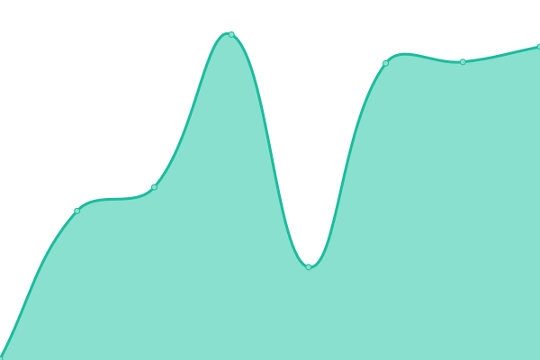 401ms
     
 | 

<a href="https://DELWP-DTV.github.io/santa/history/vic-data-rest-area">100.00%</a>
    

|  [vic-data_hvr-high-productivity-freight-vehicle-hpfv-a-double-36-5m-reference-vehicle-1](https://maps.nhvr.gov.au/agsm1/rest/services/vicroads/HVR_AGOL_OpenData/MapServer/47) | 🟩 Up | [vic-data-hvr-high-productivity-freight-vehicle-hpfv-a-double-36-5m-reference-vehicle-1.yml](https://github.com/DELWP-DTV/santa/commits/HEAD/history/vic-data-hvr-high-productivity-freight-vehicle-hpfv-a-double-36-5m-reference-vehicle-1.yml) | 

 182ms
     
 | 

<a href="https://DELWP-DTV.github.io/santa/history/vic-data-hvr-high-productivity-freight-vehicle-hpfv-a-double-36-5m-reference-vehicle-1">100.00%</a>
    

|  [vic-data_restricted-conditionally-approved-structures-pbs2a-r](https://maps.nhvr.gov.au/agsm1/rest/services/vicroads/HVR_AGOL_OpenData/MapServer/38) | 🟩 Up | [vic-data-restricted-conditionally-approved-structures-pbs2a-r.yml](https://github.com/DELWP-DTV/santa/commits/HEAD/history/vic-data-restricted-conditionally-approved-structures-pbs2a-r.yml) | 

 184ms
     
 | 

<a href="https://DELWP-DTV.github.io/santa/history/vic-data-restricted-conditionally-approved-structures-pbs2a-r">100.00%</a>
    

|  [vic-data_pavement-condition-data](https://services2.arcgis.com/18ajPSI0b3ppsmMt/arcgis/rest/services/Pavement_Condition_Data/FeatureServer/0) | 🟩 Up | [vic-data-pavement-condition-data.yml](https://github.com/DELWP-DTV/santa/commits/HEAD/history/vic-data-pavement-condition-data.yml) | 

 296ms
     
 | 

<a href="https://DELWP-DTV.github.io/santa/history/vic-data-pavement-condition-data">100.00%</a>
    

|  [vic-data_traffic-count-locations](https://vicdata.vicroads.vic.gov.au/server/rest/services/Operations_Traffic/FeatureServer/2) | 🟩 Up | [vic-data-traffic-count-locations.yml](https://github.com/DELWP-DTV/santa/commits/HEAD/history/vic-data-traffic-count-locations.yml) | 

 210ms
     
 | 

<a href="https://DELWP-DTV.github.io/santa/history/vic-data-traffic-count-locations">100.00%</a>
    

|  [vic-data_performance-based-standards-pbs2b-level-crossings](https://maps.nhvr.gov.au/agsm1/rest/services/vicroads/HVR_AGOL_OpenData/MapServer/32) | 🟩 Up | [vic-data-performance-based-standards-pbs2b-level-crossings.yml](https://github.com/DELWP-DTV/santa/commits/HEAD/history/vic-data-performance-based-standards-pbs2b-level-crossings.yml) | 

 184ms
     
 | 

<a href="https://DELWP-DTV.github.io/santa/history/vic-data-performance-based-standards-pbs2b-level-crossings">100.00%</a>
    

|  [vic-data_heavy-vehicle-curfews](https://maps.nhvr.gov.au/agsm1/rest/services/vicroads/HVR_AGOL_OpenData/MapServer/53) | 🟩 Up | [vic-data-heavy-vehicle-curfews.yml](https://github.com/DELWP-DTV/santa/commits/HEAD/history/vic-data-heavy-vehicle-curfews.yml) | 

 183ms
     
 | 

<a href="https://DELWP-DTV.github.io/santa/history/vic-data-heavy-vehicle-curfews">100.00%</a>
    

|  [vic-data_road-width-and-number-of-lanes](https://services2.arcgis.com/18ajPSI0b3ppsmMt/arcgis/rest/services/Road_Width_and_Number_of_Lanes/FeatureServer/0) | 🟩 Up | [vic-data-road-width-and-number-of-lanes.yml](https://github.com/DELWP-DTV/santa/commits/HEAD/history/vic-data-road-width-and-number-of-lanes.yml) | 

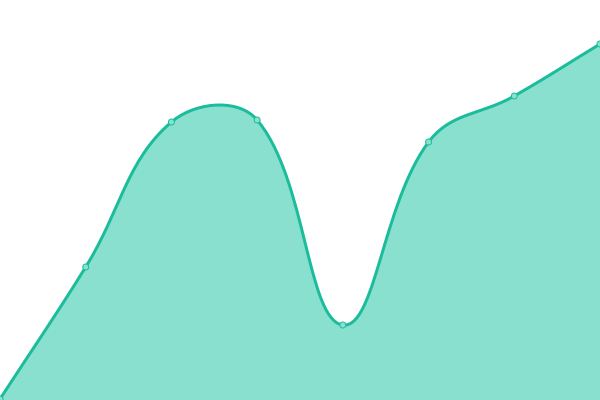 324ms
     
 | 

<a href="https://DELWP-DTV.github.io/santa/history/vic-data-road-width-and-number-of-lanes">100.00%</a>
    

|  [vic-data_hvr-high-productivity-freight-vehicle-hpfv-a-double-36-5m-reference-vehicle-2](https://maps.nhvr.gov.au/agsm1/rest/services/vicroads/HVR_AGOL_OpenData/MapServer/48) | 🟩 Up | [vic-data-hvr-high-productivity-freight-vehicle-hpfv-a-double-36-5m-reference-vehicle-2.yml](https://github.com/DELWP-DTV/santa/commits/HEAD/history/vic-data-hvr-high-productivity-freight-vehicle-hpfv-a-double-36-5m-reference-vehicle-2.yml) | 

 183ms
     
 | 

<a href="https://DELWP-DTV.github.io/santa/history/vic-data-hvr-high-productivity-freight-vehicle-hpfv-a-double-36-5m-reference-vehicle-2">100.00%</a>
    

|  [vic-data_hvr-high-productivity-freight-vehicle-hpfv-a-doubles-6-3](https://maps.nhvr.gov.au/agsm1/rest/services/vicroads/HVR_AGOL_OpenData/MapServer/18) | 🟩 Up | [vic-data-hvr-high-productivity-freight-vehicle-hpfv-a-doubles-6-3.yml](https://github.com/DELWP-DTV/santa/commits/HEAD/history/vic-data-hvr-high-productivity-freight-vehicle-hpfv-a-doubles-6-3.yml) | 

 183ms
     
 | 

<a href="https://DELWP-DTV.github.io/santa/history/vic-data-hvr-high-productivity-freight-vehicle-hpfv-a-doubles-6-3">100.00%</a>
    

|  [vic-data_hvr-special-purpose-vehicle-spv-40t](https://maps.nhvr.gov.au/agsm1/rest/services/vicroads/HVR_AGOL_OpenData/MapServer/28) | 🟩 Up | [vic-data-hvr-special-purpose-vehicle-spv-40t.yml](https://github.com/DELWP-DTV/santa/commits/HEAD/history/vic-data-hvr-special-purpose-vehicle-spv-40t.yml) | 

 184ms
     
 | 

<a href="https://DELWP-DTV.github.io/santa/history/vic-data-hvr-special-purpose-vehicle-spv-40t">100.00%</a>
    

|  [vic-data_restricted-performance-based-standards-pbs1-bridges](https://maps.nhvr.gov.au/agsm1/rest/services/vicroads/HVR_AGOL_OpenData/MapServer/40) | 🟩 Up | [vic-data-restricted-performance-based-standards-pbs1-bridges.yml](https://github.com/DELWP-DTV/santa/commits/HEAD/history/vic-data-restricted-performance-based-standards-pbs1-bridges.yml) | 

 183ms
     
 | 

<a href="https://DELWP-DTV.github.io/santa/history/vic-data-restricted-performance-based-standards-pbs1-bridges">100.00%</a>
    

|  [vic-data_hvr-port-low-loader-scheme](https://maps.nhvr.gov.au/agsm1/rest/services/vicroads/HVR_AGOL_OpenData/MapServer/63) | 🟩 Up | [vic-data-hvr-port-low-loader-scheme.yml](https://github.com/DELWP-DTV/santa/commits/HEAD/history/vic-data-hvr-port-low-loader-scheme.yml) | 

 182ms
     
 | 

<a href="https://DELWP-DTV.github.io/santa/history/vic-data-hvr-port-low-loader-scheme">100.00%</a>
    

|  [vic-data_oversize-overmass-osom-restricted-bridges](https://maps.nhvr.gov.au/agsm1/rest/services/vicroads/HVR_AGOL_OpenData/MapServer/30) | 🟩 Up | [vic-data-oversize-overmass-osom-restricted-bridges.yml](https://github.com/DELWP-DTV/santa/commits/HEAD/history/vic-data-oversize-overmass-osom-restricted-bridges.yml) | 

 184ms
     
 | 

<a href="https://DELWP-DTV.github.io/santa/history/vic-data-oversize-overmass-osom-restricted-bridges">100.00%</a>
    

|  [vic-data_restricted-conditionally-approved-structures-hml](https://maps.nhvr.gov.au/agsm1/rest/services/vicroads/HVR_AGOL_OpenData/MapServer/37) | 🟩 Up | [vic-data-restricted-conditionally-approved-structures-hml.yml](https://github.com/DELWP-DTV/santa/commits/HEAD/history/vic-data-restricted-conditionally-approved-structures-hml.yml) | 

 183ms
     
 | 

<a href="https://DELWP-DTV.github.io/santa/history/vic-data-restricted-conditionally-approved-structures-hml">100.00%</a>
    

|  [vic-data_hvr-platform-trailer-networks](https://maps.nhvr.gov.au/agsm1/rest/services/vicroads/HVR_AGOL_OpenData/MapServer/56) | 🟥 Down | [vic-data-hvr-platform-trailer-networks.yml](https://github.com/DELWP-DTV/santa/commits/HEAD/history/vic-data-hvr-platform-trailer-networks.yml) | 

 178ms
     
 | 

<a href="https://DELWP-DTV.github.io/santa/history/vic-data-hvr-platform-trailer-networks">0.00%</a>
    

|  [vic-data_hvr-high-productivity-freight-vehicle-hpfv-a-double-36-5m-reference-vehicle-3](https://maps.nhvr.gov.au/agsm1/rest/services/vicroads/HVR_AGOL_OpenData/MapServer/57) | 🟩 Up | [vic-data-hvr-high-productivity-freight-vehicle-hpfv-a-double-36-5m-reference-vehicle-3.yml](https://github.com/DELWP-DTV/santa/commits/HEAD/history/vic-data-hvr-high-productivity-freight-vehicle-hpfv-a-double-36-5m-reference-vehicle-3.yml) | 

 183ms
     
 | 

<a href="https://DELWP-DTV.github.io/santa/history/vic-data-hvr-high-productivity-freight-vehicle-hpfv-a-double-36-5m-reference-vehicle-3">100.00%</a>
    

|  [vic-data_hvr-high-productivity-freight-vehicle-hpfv-a-double-36-5m-reference-vehicle-4](https://maps.nhvr.gov.au/agsm1/rest/services/vicroads/HVR_AGOL_OpenData/MapServer/58) | 🟩 Up | [vic-data-hvr-high-productivity-freight-vehicle-hpfv-a-double-36-5m-reference-vehicle-4.yml](https://github.com/DELWP-DTV/santa/commits/HEAD/history/vic-data-hvr-high-productivity-freight-vehicle-hpfv-a-double-36-5m-reference-vehicle-4.yml) | 

 183ms
     
 | 

<a href="https://DELWP-DTV.github.io/santa/history/vic-data-hvr-high-productivity-freight-vehicle-hpfv-a-double-36-5m-reference-vehicle-4">100.00%</a>
    

|  [vic-data_hvr-high-productivity-freight-vehicle-hpfv-a-doubles-6-0](https://maps.nhvr.gov.au/agsm1/rest/services/vicroads/HVR_AGOL_OpenData/MapServer/17) | 🟩 Up | [vic-data-hvr-high-productivity-freight-vehicle-hpfv-a-doubles-6-0.yml](https://github.com/DELWP-DTV/santa/commits/HEAD/history/vic-data-hvr-high-productivity-freight-vehicle-hpfv-a-doubles-6-0.yml) | 

 185ms
     
 | 

<a href="https://DELWP-DTV.github.io/santa/history/vic-data-hvr-high-productivity-freight-vehicle-hpfv-a-doubles-6-0">100.00%</a>
    

|  [vic-data_hvr-high-productivity-freight-vehicle-hpfv-a-double-quad-semi-trailer](https://maps.nhvr.gov.au/agsm1/rest/services/vicroads/HVR_AGOL_OpenData/MapServer/59) | 🟩 Up | [vic-data-hvr-high-productivity-freight-vehicle-hpfv-a-double-quad-semi-trailer.yml](https://github.com/DELWP-DTV/santa/commits/HEAD/history/vic-data-hvr-high-productivity-freight-vehicle-hpfv-a-double-quad-semi-trailer.yml) | 

 183ms
     
 | 

<a href="https://DELWP-DTV.github.io/santa/history/vic-data-hvr-high-productivity-freight-vehicle-hpfv-a-double-quad-semi-trailer">100.00%</a>
    

|  [vic-data_principal-bicycle-network-pbn](https://vicdata.vicroads.vic.gov.au/server/rest/services/Hosted/Principal_Bicycle_Network/FeatureServer/0) | 🟩 Up | [vic-data-principal-bicycle-network-pbn.yml](https://github.com/DELWP-DTV/santa/commits/HEAD/history/vic-data-principal-bicycle-network-pbn.yml) | 

 428ms
     
 | 

<a href="https://DELWP-DTV.github.io/santa/history/vic-data-principal-bicycle-network-pbn">100.00%</a>
    

|  [vic-data_hvr-45-axle-crane-permit](https://data.vicroads.vic.gov.au/arcgis/rest/services/AGOL_Opendata/HVR_AGOL_OpenData/MapServer/7) | 🟩 Up | [vic-data-hvr-45-axle-crane-permit.yml](https://github.com/DELWP-DTV/santa/commits/HEAD/history/vic-data-hvr-45-axle-crane-permit.yml) | 

 2192ms
     
 | 

<a href="https://DELWP-DTV.github.io/santa/history/vic-data-hvr-45-axle-crane-permit">100.00%</a>
    

|  [vic-data_hvr-performance-base-standards-pbs-level-2a](https://maps.nhvr.gov.au/agsm1/rest/services/vicroads/HVR_AGOL_OpenData/MapServer/24) | 🟩 Up | [vic-data-hvr-performance-base-standards-pbs-level-2a.yml](https://github.com/DELWP-DTV/santa/commits/HEAD/history/vic-data-hvr-performance-base-standards-pbs-level-2a.yml) | 

 184ms
     
 | 

<a href="https://DELWP-DTV.github.io/santa/history/vic-data-hvr-performance-base-standards-pbs-level-2a">100.00%</a>
    

|  [vic-data_hvr-higher-mass-limit](https://maps.nhvr.gov.au/agsm1/rest/services/vicroads/HVR_AGOL_OpenData/MapServer/15) | 🟩 Up | [vic-data-hvr-higher-mass-limit.yml](https://github.com/DELWP-DTV/santa/commits/HEAD/history/vic-data-hvr-higher-mass-limit.yml) | 

 185ms
     
 | 

<a href="https://DELWP-DTV.github.io/santa/history/vic-data-hvr-higher-mass-limit">100.00%</a>
    

|  [vic-data_hvr-performance-base-standards-pbs-level-2b](https://maps.nhvr.gov.au/agsm1/rest/services/vicroads/HVR_AGOL_OpenData/MapServer/25) | 🟩 Up | [vic-data-hvr-performance-base-standards-pbs-level-2b.yml](https://github.com/DELWP-DTV/santa/commits/HEAD/history/vic-data-hvr-performance-base-standards-pbs-level-2b.yml) | 

 182ms
     
 | 

<a href="https://DELWP-DTV.github.io/santa/history/vic-data-hvr-performance-base-standards-pbs-level-2b">100.00%</a>
    

|  [vic-data_hpfv-a-double-36-5-metre-reference-vehicle-4-structures](https://data.vicroads.vic.gov.au/arcgis/rest/services/AGOL_Opendata/HVR_AGOL_OpenData/FeatureServer/61) | 🟩 Up | [vic-data-hpfv-a-double-36-5-metre-reference-vehicle-4-structures.yml](https://github.com/DELWP-DTV/santa/commits/HEAD/history/vic-data-hpfv-a-double-36-5-metre-reference-vehicle-4-structures.yml) | 

 2380ms
     
 | 

<a href="https://DELWP-DTV.github.io/santa/history/vic-data-hpfv-a-double-36-5-metre-reference-vehicle-4-structures">100.00%</a>
    

|  [vic-data_hpfv-swept-path](https://maps.nhvr.gov.au/agsm1/rest/services/vicroads/HVR_AGOL_OpenData/MapServer/49) | 🟩 Up | [vic-data-hpfv-swept-path.yml](https://github.com/DELWP-DTV/santa/commits/HEAD/history/vic-data-hpfv-swept-path.yml) | 

 183ms
     
 | 

<a href="https://DELWP-DTV.github.io/santa/history/vic-data-hpfv-swept-path">100.00%</a>
    

|  [vic-data_hpfv-a-double-quad-semi-trailer-structures](https://maps.nhvr.gov.au/agsm1/rest/services/vicroads/HVR_AGOL_OpenData/MapServer/62) | 🟩 Up | [vic-data-hpfv-a-double-quad-semi-trailer-structures.yml](https://github.com/DELWP-DTV/santa/commits/HEAD/history/vic-data-hpfv-a-double-quad-semi-trailer-structures.yml) | 

 182ms
     
 | 

<a href="https://DELWP-DTV.github.io/santa/history/vic-data-hpfv-a-double-quad-semi-trailer-structures">100.00%</a>
    

|  [vic-data_hpfv-a-double-36-5-metre-reference-vehicle-3-structures](https://data.vicroads.vic.gov.au/arcgis/rest/services/AGOL_Opendata/HVR_AGOL_OpenData/FeatureServer/60) | 🟩 Up | [vic-data-hpfv-a-double-36-5-metre-reference-vehicle-3-structures.yml](https://github.com/DELWP-DTV/santa/commits/HEAD/history/vic-data-hpfv-a-double-36-5-metre-reference-vehicle-3-structures.yml) | 

 1373ms
     
 | 

<a href="https://DELWP-DTV.github.io/santa/history/vic-data-hpfv-a-double-36-5-metre-reference-vehicle-3-structures">100.00%</a>
    

|  [vic-data_hpfv-a-double-36-5-metre-reference-vehicle-2-structures](https://maps.nhvr.gov.au/agsm1/rest/services/vicroads/HVR_AGOL_OpenData/MapServer/52) | 🟩 Up | [vic-data-hpfv-a-double-36-5-metre-reference-vehicle-2-structures.yml](https://github.com/DELWP-DTV/santa/commits/HEAD/history/vic-data-hpfv-a-double-36-5-metre-reference-vehicle-2-structures.yml) | 

 183ms
     
 | 

<a href="https://DELWP-DTV.github.io/santa/history/vic-data-hpfv-a-double-36-5-metre-reference-vehicle-2-structures">100.00%</a>
    

|  [vic-data_kilometre-posts1](https://services2.arcgis.com/18ajPSI0b3ppsmMt/arcgis/rest/services/Kilometre_Posts/FeatureServer/0) | 🟩 Up | [vic-data-kilometre-posts1.yml](https://github.com/DELWP-DTV/santa/commits/HEAD/history/vic-data-kilometre-posts1.yml) | 

 261ms
     
 | 

<a href="https://DELWP-DTV.github.io/santa/history/vic-data-kilometre-posts1">100.00%</a>
    

|  [vic-data_restricted-conditionally-approved-structures-a-doubles-6-3](https://maps.nhvr.gov.au/agsm1/rest/services/vicroads/HVR_AGOL_OpenData/MapServer/35) | 🟩 Up | [vic-data-restricted-conditionally-approved-structures-a-doubles-6-3.yml](https://github.com/DELWP-DTV/santa/commits/HEAD/history/vic-data-restricted-conditionally-approved-structures-a-doubles-6-3.yml) | 

 184ms
     
 | 

<a href="https://DELWP-DTV.github.io/santa/history/vic-data-restricted-conditionally-approved-structures-a-doubles-6-3">100.00%</a>
    

|  [vic-data_conditionally-approved-45axle-crane-slow-r2](https://maps.nhvr.gov.au/agsm1/rest/services/vicroads/HVR_AGOL_OpenData/MapServer/3) | 🟩 Up | [vic-data-conditionally-approved-45axle-crane-slow-r2.yml](https://github.com/DELWP-DTV/santa/commits/HEAD/history/vic-data-conditionally-approved-45axle-crane-slow-r2.yml) | 

 183ms
     
 | 

<a href="https://DELWP-DTV.github.io/santa/history/vic-data-conditionally-approved-45axle-crane-slow-r2">100.00%</a>
    

|  [vic-data_vicroads-country-street-directory-grids1](https://services2.arcgis.com/18ajPSI0b3ppsmMt/arcgis/rest/services/VicRoads_Country_Street_Directory_Grids/FeatureServer/0) | 🟩 Up | [vic-data-vicroads-country-street-directory-grids1.yml](https://github.com/DELWP-DTV/santa/commits/HEAD/history/vic-data-vicroads-country-street-directory-grids1.yml) | 

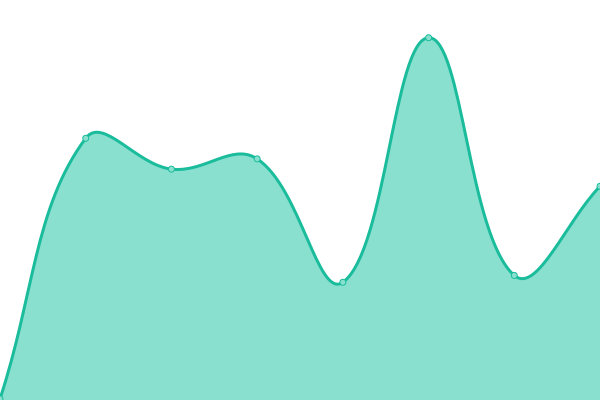 257ms
     
 | 

<a href="https://DELWP-DTV.github.io/santa/history/vic-data-vicroads-country-street-directory-grids1">100.00%</a>
    

|  [vic-data_hvr-4-5-axle-all-terrain-mobile-cranes2](https://maps.nhvr.gov.au/agsm1/rest/services/vicroads/HVR_AGOL_OpenData/MapServer/7) | 🟩 Up | [vic-data-hvr-4-5-axle-all-terrain-mobile-cranes2.yml](https://github.com/DELWP-DTV/santa/commits/HEAD/history/vic-data-hvr-4-5-axle-all-terrain-mobile-cranes2.yml) | 

 183ms
     
 | 

<a href="https://DELWP-DTV.github.io/santa/history/vic-data-hvr-4-5-axle-all-terrain-mobile-cranes2">100.00%</a>
    

|  [vic-data_vicroadsroadprojects](https://services2.arcgis.com/18ajPSI0b3ppsmMt/arcgis/rest/services/VicRoadsRoadProjects/FeatureServer/0) | 🟩 Up | [vic-data-vicroadsroadprojects.yml](https://github.com/DELWP-DTV/santa/commits/HEAD/history/vic-data-vicroadsroadprojects.yml) | 

 410ms
     
 | 

<a href="https://DELWP-DTV.github.io/santa/history/vic-data-vicroadsroadprojects">100.00%</a>
    

|  [vic-data_hvr-oversize-agricultural-vehicle-class-o-network](https://maps.nhvr.gov.au/agsm1/rest/services/vicroads/HVR_AGOL_OpenData/MapServer/22) | 🟩 Up | [vic-data-hvr-oversize-agricultural-vehicle-class-o-network.yml](https://github.com/DELWP-DTV/santa/commits/HEAD/history/vic-data-hvr-oversize-agricultural-vehicle-class-o-network.yml) | 

 182ms
     
 | 

<a href="https://DELWP-DTV.github.io/santa/history/vic-data-hvr-oversize-agricultural-vehicle-class-o-network">100.00%</a>
    

|  [vic-data_conditionally-approved-45axle-crane-lane-restriction-r2](https://maps.nhvr.gov.au/agsm1/rest/services/vicroads/HVR_AGOL_OpenData/MapServer/2) | 🟩 Up | [vic-data-conditionally-approved-45axle-crane-lane-restriction-r2.yml](https://github.com/DELWP-DTV/santa/commits/HEAD/history/vic-data-conditionally-approved-45axle-crane-lane-restriction-r2.yml) | 

 183ms
     
 | 

<a href="https://DELWP-DTV.github.io/santa/history/vic-data-conditionally-approved-45axle-crane-lane-restriction-r2">100.00%</a>
    

|  [vic-data_hvr-oversize-overmass-osom](https://maps.nhvr.gov.au/agsm1/rest/services/vicroads/HVR_AGOL_OpenData/MapServer/21) | 🟩 Up | [vic-data-hvr-oversize-overmass-osom.yml](https://github.com/DELWP-DTV/santa/commits/HEAD/history/vic-data-hvr-oversize-overmass-osom.yml) | 

 187ms
     
 | 

<a href="https://DELWP-DTV.github.io/santa/history/vic-data-hvr-oversize-overmass-osom">100.00%</a>
    

|  [vic-data_truck-rest-areas](https://maps.nhvr.gov.au/agsm1/rest/services/vicroads/HVR_AGOL_OpenData/MapServer/50) | 🟩 Up | [vic-data-truck-rest-areas.yml](https://github.com/DELWP-DTV/santa/commits/HEAD/history/vic-data-truck-rest-areas.yml) | 

 182ms
     
 | 

<a href="https://DELWP-DTV.github.io/santa/history/vic-data-truck-rest-areas">100.00%</a>
    

|  [vic-data_hvr-high-productivity-freight-vehicle-hpfv-mass2](https://maps.nhvr.gov.au/agsm1/rest/services/vicroads/HVR_AGOL_OpenData/MapServer/19) | 🟩 Up | [vic-data-hvr-high-productivity-freight-vehicle-hpfv-mass2.yml](https://github.com/DELWP-DTV/santa/commits/HEAD/history/vic-data-hvr-high-productivity-freight-vehicle-hpfv-mass2.yml) | 

 184ms
     
 | 

<a href="https://DELWP-DTV.github.io/santa/history/vic-data-hvr-high-productivity-freight-vehicle-hpfv-mass2">100.00%</a>
    

|  [vic-data_clearways](https://vicdata.vicroads.vic.gov.au/server/rest/services/Hosted/Clearways/FeatureServer/0) | 🟩 Up | [vic-data-clearways.yml](https://github.com/DELWP-DTV/santa/commits/HEAD/history/vic-data-clearways.yml) | 

 365ms
     
 | 

<a href="https://DELWP-DTV.github.io/santa/history/vic-data-clearways">100.00%</a>
    

|  [vic-data_hvr-performance-base-standards-pbs-level-1](https://maps.nhvr.gov.au/agsm1/rest/services/vicroads/HVR_AGOL_OpenData/MapServer/23) | 🟩 Up | [vic-data-hvr-performance-base-standards-pbs-level-1.yml](https://github.com/DELWP-DTV/santa/commits/HEAD/history/vic-data-hvr-performance-base-standards-pbs-level-1.yml) | 

 183ms
     
 | 

<a href="https://DELWP-DTV.github.io/santa/history/vic-data-hvr-performance-base-standards-pbs-level-1">100.00%</a>
    

|  [vic-data_hvr-oversize-and-overmass-class-1-agricultural-vehicles](https://maps.nhvr.gov.au/agsm1/rest/services/vicroads/HVR_AGOL_OpenData/MapServer/8) | 🟩 Up | [vic-data-hvr-oversize-and-overmass-class-1-agricultural-vehicles.yml](https://github.com/DELWP-DTV/santa/commits/HEAD/history/vic-data-hvr-oversize-and-overmass-class-1-agricultural-vehicles.yml) | 

 183ms
     
 | 

<a href="https://DELWP-DTV.github.io/santa/history/vic-data-hvr-oversize-and-overmass-class-1-agricultural-vehicles">100.00%</a>
    

|  [vic-data_hpfv-a-double-36-5-metre-reference-vehicle-1-structures](https://maps.nhvr.gov.au/agsm1/rest/services/vicroads/HVR_AGOL_OpenData/MapServer/51) | 🟩 Up | [vic-data-hpfv-a-double-36-5-metre-reference-vehicle-1-structures.yml](https://github.com/DELWP-DTV/santa/commits/HEAD/history/vic-data-hpfv-a-double-36-5-metre-reference-vehicle-1-structures.yml) | 

 183ms
     
 | 

<a href="https://DELWP-DTV.github.io/santa/history/vic-data-hpfv-a-double-36-5-metre-reference-vehicle-1-structures">100.00%</a>
    

|  [vic-data_conditionally-approved-45axle-crane-slow-centreline-r](https://maps.nhvr.gov.au/agsm1/rest/services/vicroads/HVR_AGOL_OpenData/MapServer/3) | 🟩 Up | [vic-data-conditionally-approved-45axle-crane-slow-centreline-r.yml](https://github.com/DELWP-DTV/santa/commits/HEAD/history/vic-data-conditionally-approved-45axle-crane-slow-centreline-r.yml) | 

 182ms
     
 | 

<a href="https://DELWP-DTV.github.io/santa/history/vic-data-conditionally-approved-45axle-crane-slow-centreline-r">100.00%</a>
    

|  [vic-data_restricted-conditionally-approved-structures-a-doubles-6-02](https://maps.nhvr.gov.au/agsm1/rest/services/vicroads/HVR_AGOL_OpenData/MapServer/34) | 🟩 Up | [vic-data-restricted-conditionally-approved-structures-a-doubles-6-02.yml](https://github.com/DELWP-DTV/santa/commits/HEAD/history/vic-data-restricted-conditionally-approved-structures-a-doubles-6-02.yml) | 

 183ms
     
 | 

<a href="https://DELWP-DTV.github.io/santa/history/vic-data-restricted-conditionally-approved-structures-a-doubles-6-02">100.00%</a>
    

|  [vic-data_statewide-route-numbering-scheme1](https://services2.arcgis.com/18ajPSI0b3ppsmMt/arcgis/rest/services/Statewide_Route_Numbering_Scheme/FeatureServer/0) | 🟩 Up | [vic-data-statewide-route-numbering-scheme1.yml](https://github.com/DELWP-DTV/santa/commits/HEAD/history/vic-data-statewide-route-numbering-scheme1.yml) | 

 314ms
     
 | 

<a href="https://DELWP-DTV.github.io/santa/history/vic-data-statewide-route-numbering-scheme1">100.00%</a>
    

|  [vic-data_hvr-over-dimensional-od-route1](https://maps.nhvr.gov.au/agsm1/rest/services/vicroads/HVR_AGOL_OpenData/MapServer/29) | 🟩 Up | [vic-data-hvr-over-dimensional-od-route1.yml](https://github.com/DELWP-DTV/santa/commits/HEAD/history/vic-data-hvr-over-dimensional-od-route1.yml) | 

 182ms
     
 | 

<a href="https://DELWP-DTV.github.io/santa/history/vic-data-hvr-over-dimensional-od-route1">100.00%</a>
    

<!--end: status pages-->

## 📄 License

- Powered by: [Upptime](https://github.com/upptime/upptime)
- Code: [MIT](./LICENSE) © [alex-vic-geo](https://demo.upptime.js.org)
- Data in the `./history` directory: [Open Database License](https://opendatacommons.org/licenses/odbl/1-0/)
