# DTV Santa

This repository contains the open-source uptime monitor and status page for DELWP_DTV.

[**Visit our status website →**](https://delwp-dtv.github.io/santa/)

With [Upptime](https://upptime.js.org), you can get your own unlimited and free uptime monitor and status page, powered entirely by a GitHub repository. We use [Issues](https://github.com/alex-vic-geo/santa/issues) as incident reports, [Actions](https://github.com/alex-vic-geo/santa/actions) as uptime monitors, and [Pages](https://demo.upptime.js.org) for the status page.

<!--start: status pages-->
<!-- This summary is generated by Upptime (https://github.com/upptime/upptime) -->
<!-- Do not edit this manually, your changes will be overwritten -->
<!-- prettier-ignore -->
| URL | Status | History | Response Time | Uptime |
| --- | ------ | ------- | ------------- | ------ |
|  [Vicmap Property Easements and Road Casements (aggregated)](https://enterprise.mapshare.vic.gov.au/server/rest/services/Vicmap_Property_Easements_and_Road_Casements/MapServer) | 🟩 Up | [vicmap-property-easements-and-road-casements-aggregated.yml](https://github.com/DELWP-DTV/santa/commits/HEAD/history/vicmap-property-easements-and-road-casements-aggregated.yml) | 

 1199ms
     
 | 

<a href="https://DELWP-DTV.github.io/santa/history/vicmap-property-easements-and-road-casements-aggregated">100.00%</a>
    

|  [Vicmap Property Easements and Road Casements](https://enterprise.mapshare.vic.gov.au/server/rest/services/Vicmap_Property_Easements_and_Road_Casements/MapServer) | 🟩 Up | [vicmap-property-easements-and-road-casements.yml](https://github.com/DELWP-DTV/santa/commits/HEAD/history/vicmap-property-easements-and-road-casements.yml) | 

 272ms
     
 | 

<a href="https://DELWP-DTV.github.io/santa/history/vicmap-property-easements-and-road-casements">100.00%</a>
    

|  [Sunshine Activity Centre](https://services7.arcgis.com/fVJQ0uhT9L4zp35f/arcgis/rest/services/ActivityArea_gdb/FeatureServer/0) | 🟥 Down | [sunshine-activity-centre.yml](https://github.com/DELWP-DTV/santa/commits/HEAD/history/sunshine-activity-centre.yml) | 

 241ms
     
 | 

<a href="https://DELWP-DTV.github.io/santa/history/sunshine-activity-centre">0.00%</a>
    

|  [Geelong - Weather Station Sensors ](https://www.geelongdataexchange.com.au) | 🟥 Down | [geelong-weather-station-sensors.yml](https://github.com/DELWP-DTV/santa/commits/HEAD/history/geelong-weather-station-sensors.yml) | 

 755ms
     
 | 

<a href="https://DELWP-DTV.github.io/santa/history/geelong-weather-station-sensors">0.00%</a>
    

|  [Australian Private Hospitals August 2020](https://services5.arcgis.com/OvOcYIrJnM97ABBA/arcgis/rest/services/Australian_Private_Hospitals_August_2019_WFL1/FeatureServer/0) | 🟥 Down | [australian-private-hospitals-august-2020.yml](https://github.com/DELWP-DTV/santa/commits/HEAD/history/australian-private-hospitals-august-2020.yml) | 

 202ms
     
 | 

<a href="https://DELWP-DTV.github.io/santa/history/australian-private-hospitals-august-2020">0.00%</a>
    

|  [DataVic Open Data Portal](https://discover.data.vic.gov.au/) | 🟥 Down | [data-vic-open-data-portal.yml](https://github.com/DELWP-DTV/santa/commits/HEAD/history/data-vic-open-data-portal.yml) | 

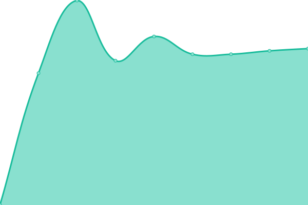 1528ms
     
 | 

<a href="https://DELWP-DTV.github.io/santa/history/data-vic-open-data-portal">0.00%</a>
    

|  [PTV Train Track Centreline - WMS](https://discover.data.vic.gov.au) | 🟥 Down | [ptv-train-track-centreline-wms.yml](https://github.com/DELWP-DTV/santa/commits/HEAD/history/ptv-train-track-centreline-wms.yml) | 

 682ms
     
 | 

<a href="https://DELWP-DTV.github.io/santa/history/ptv-train-track-centreline-wms">0.00%</a>
    

|  [Vicmap Vegetation - Tree Extent](https://tiles.arcgis.com/tiles/GB33F62SbDxJjwEL/arcgis/rest/services/Vicmap_Vegetation_Tree_Extent/MapServer?view=wmtsview&cacheKey=95615180464c4085) | 🟩 Up | [vicmap-vegetation-tree-extent.yml](https://github.com/DELWP-DTV/santa/commits/HEAD/history/vicmap-vegetation-tree-extent.yml) | 

 278ms
     
 | 

<a href="https://DELWP-DTV.github.io/santa/history/vicmap-vegetation-tree-extent">100.00%</a>
    

|  [Watercourse Levels](http://www.bom.gov.au/waterdata/services) | 🟥 Down | [watercourse-levels.yml](https://github.com/DELWP-DTV/santa/commits/HEAD/history/watercourse-levels.yml) | 

 162ms
     
 | 

<a href="https://DELWP-DTV.github.io/santa/history/watercourse-levels">0.00%</a>
    

|  [Ballarat Council - Air quality ](https://data.ballarat.vic.gov.au) | 🟥 Down | [ballarat-council-air-quality.yml](https://github.com/DELWP-DTV/santa/commits/HEAD/history/ballarat-council-air-quality.yml) | 

 755ms
     
 | 

<a href="https://DELWP-DTV.github.io/santa/history/ballarat-council-air-quality">0.00%</a>
    

|  [PTV Regional Train Stations - WMS](https://discover.data.vic.gov.au) | 🟥 Down | [ptv-regional-train-stations-wms.yml](https://github.com/DELWP-DTV/santa/commits/HEAD/history/ptv-regional-train-stations-wms.yml) | 

 696ms
     
 | 

<a href="https://DELWP-DTV.github.io/santa/history/ptv-regional-train-stations-wms">0.00%</a>
    

|  [PTV SkyBus Stops - WMS](https://discover.data.vic.gov.au) | 🟥 Down | [ptv-sky-bus-stops-wms.yml](https://github.com/DELWP-DTV/santa/commits/HEAD/history/ptv-sky-bus-stops-wms.yml) | 

 684ms
     
 | 

<a href="https://DELWP-DTV.github.io/santa/history/ptv-sky-bus-stops-wms">0.00%</a>
    

|  [Vicmap Vegetation - Tree Density](https://tiles.arcgis.com/tiles/GB33F62SbDxJjwEL/arcgis/rest/services/Vicmap_Vegetation_Tree_Density_Tile/MapServer?view=wmtsview&cacheKey=9326ef767e6c9d9c) | 🟩 Up | [vicmap-vegetation-tree-density.yml](https://github.com/DELWP-DTV/santa/commits/HEAD/history/vicmap-vegetation-tree-density.yml) | 

 57ms
     
 | 

<a href="https://DELWP-DTV.github.io/santa/history/vicmap-vegetation-tree-density">100.00%</a>
    

|  [Ballarat Council - Temperature Level ](https://data.ballarat.vic.gov.au) | 🟥 Down | [ballarat-council-temperature-level.yml](https://github.com/DELWP-DTV/santa/commits/HEAD/history/ballarat-council-temperature-level.yml) | 

 204ms
     
 | 

<a href="https://DELWP-DTV.github.io/santa/history/ballarat-council-temperature-level">0.00%</a>
    

|  [Vicmap Crown Land Tenure (aggregated)](https://enterprise.mapshare.vic.gov.au/server/rest/services/Vicmap_Crown_Land_Tenure/MapServer) | 🟩 Up | [vicmap-crown-land-tenure-aggregated.yml](https://github.com/DELWP-DTV/santa/commits/HEAD/history/vicmap-crown-land-tenure-aggregated.yml) | 

 948ms
     
 | 

<a href="https://DELWP-DTV.github.io/santa/history/vicmap-crown-land-tenure-aggregated">100.00%</a>
    

|  [Vicmap Crown Land Tenure](https://enterprise.mapshare.vic.gov.au/server/rest/services/Vicmap_Crown_Land_Tenure/MapServer) | 🟩 Up | [vicmap-crown-land-tenure.yml](https://github.com/DELWP-DTV/santa/commits/HEAD/history/vicmap-crown-land-tenure.yml) | 

 275ms
     
 | 

<a href="https://DELWP-DTV.github.io/santa/history/vicmap-crown-land-tenure">100.00%</a>
    

|  [Southern Grampians Council - Parking sensors ](https://www.connectgh.com.au) | 🟥 Down | [southern-grampians-council-parking-sensors.yml](https://github.com/DELWP-DTV/santa/commits/HEAD/history/southern-grampians-council-parking-sensors.yml) | 

 759ms
     
 | 

<a href="https://DELWP-DTV.github.io/santa/history/southern-grampians-council-parking-sensors">0.00%</a>
    

|  [ABS.Stat (Beta)](https://api.data.abs.gov.au) | 🟥 Down | [abs-stat-beta.yml](https://github.com/DELWP-DTV/santa/commits/HEAD/history/abs-stat-beta.yml) | 

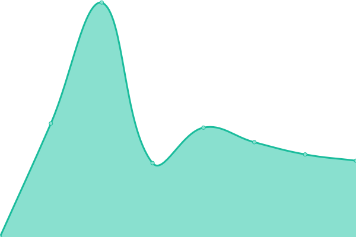 93ms
     
 | 

<a href="https://DELWP-DTV.github.io/santa/history/abs-stat-beta">0.00%</a>
    

|  [Vicmap Features of Interest (aggregated)](https://enterprise.mapshare.vic.gov.au/server/rest/services/Vicmap_Features_of_Interest/MapServer) | 🟩 Up | [vicmap-features-of-interest-aggregated.yml](https://github.com/DELWP-DTV/santa/commits/HEAD/history/vicmap-features-of-interest-aggregated.yml) | 

 336ms
     
 | 

<a href="https://DELWP-DTV.github.io/santa/history/vicmap-features-of-interest-aggregated">100.00%</a>
    

|  [Vicmap Features of Interest](https://enterprise.mapshare.vic.gov.au/server/rest/services/Vicmap_Features_of_Interest/MapServer) | 🟩 Up | [vicmap-features-of-interest.yml](https://github.com/DELWP-DTV/santa/commits/HEAD/history/vicmap-features-of-interest.yml) | 

 269ms
     
 | 

<a href="https://DELWP-DTV.github.io/santa/history/vicmap-features-of-interest">100.00%</a>
    

|  [Planning scheme zones - Vicmap Planning - WMS](https://discover.data.vic.gov.au) | 🟥 Down | [planning-scheme-zones-vicmap-planning-wms.yml](https://github.com/DELWP-DTV/santa/commits/HEAD/history/planning-scheme-zones-vicmap-planning-wms.yml) | 

 1294ms
     
 | 

<a href="https://DELWP-DTV.github.io/santa/history/planning-scheme-zones-vicmap-planning-wms">0.00%</a>
    

|  [ABS SEIFA IEO by SA1 2016](https://map.aurin.org.au/geoserver/ows) | 🟩 Up | [abs-seifa-ieo-by-sa-1-2016.yml](https://github.com/DELWP-DTV/santa/commits/HEAD/history/abs-seifa-ieo-by-sa-1-2016.yml) | 

 5438ms
     
 | 

<a href="https://DELWP-DTV.github.io/santa/history/abs-seifa-ieo-by-sa-1-2016">100.00%</a>
    

|  [Vicmap Position (aggregated)](https://enterprise.mapshare.vic.gov.au/server/rest/services/Vicmap_Position/MapServer) | 🟩 Up | [vicmap-position-aggregated.yml](https://github.com/DELWP-DTV/santa/commits/HEAD/history/vicmap-position-aggregated.yml) | 

 422ms
     
 | 

<a href="https://DELWP-DTV.github.io/santa/history/vicmap-position-aggregated">100.00%</a>
    

|  [Vicmap Position](https://enterprise.mapshare.vic.gov.au/server/rest/services/Vicmap_Position/MapServer) | 🟩 Up | [vicmap-position.yml](https://github.com/DELWP-DTV/santa/commits/HEAD/history/vicmap-position.yml) | 

 269ms
     
 | 

<a href="https://DELWP-DTV.github.io/santa/history/vicmap-position">100.00%</a>
    

|  [2020 NBN Connections by Technology Type](https://programs.communications.gov.au/geoserver/national-broadband-network/wms) | 🟩 Up | [2020-nbn-connections-by-technology-type.yml](https://github.com/DELWP-DTV/santa/commits/HEAD/history/2020-nbn-connections-by-technology-type.yml) | 

 1649ms
     
 | 

<a href="https://DELWP-DTV.github.io/santa/history/2020-nbn-connections-by-technology-type">100.00%</a>
    

|  [PTV Train Corridor Centreline - WMS](https://discover.data.vic.gov.au) | 🟥 Down | [ptv-train-corridor-centreline-wms.yml](https://github.com/DELWP-DTV/santa/commits/HEAD/history/ptv-train-corridor-centreline-wms.yml) | 

 934ms
     
 | 

<a href="https://DELWP-DTV.github.io/santa/history/ptv-train-corridor-centreline-wms">0.00%</a>
    

|  [Victorian Land Use Information System 2016-2017](https://enterprise.mapshare.vic.gov.au/server/rest/services/DTV/DJPR_Unrestricted/MapServer) | 🟩 Up | [victorian-land-use-information-system-2016-2017.yml](https://github.com/DELWP-DTV/santa/commits/HEAD/history/victorian-land-use-information-system-2016-2017.yml) | 

 426ms
     
 | 

<a href="https://DELWP-DTV.github.io/santa/history/victorian-land-use-information-system-2016-2017">100.00%</a>
    

|  [ABS SEIFA IER by SA1 2016](https://map.aurin.org.au/geoserver/ows) | 🟩 Up | [abs-seifa-ier-by-sa-1-2016.yml](https://github.com/DELWP-DTV/santa/commits/HEAD/history/abs-seifa-ier-by-sa-1-2016.yml) | 

 643ms
     
 | 

<a href="https://DELWP-DTV.github.io/santa/history/abs-seifa-ier-by-sa-1-2016">100.00%</a>
    

|  [PTV Regional Coach Routes (V/Line) - WMS](https://discover.data.vic.gov.au) | 🟥 Down | [ptv-regional-coach-routes-v-line-wms.yml](https://github.com/DELWP-DTV/santa/commits/HEAD/history/ptv-regional-coach-routes-v-line-wms.yml) | 

 660ms
     
 | 

<a href="https://DELWP-DTV.github.io/santa/history/ptv-regional-coach-routes-v-line-wms">0.00%</a>
    

|  [Portals](https://terria-catalogs-public.storage.googleapis.com/common/aus-gov-open-data/vic/prod.json) | 🟥 Down | [portals.yml](https://github.com/DELWP-DTV/santa/commits/HEAD/history/portals.yml) | 

 1325ms
     
 | 

<a href="https://DELWP-DTV.github.io/santa/history/portals">0.00%</a>
    

|  [PTV Metro Bus Routes - WMS](https://discover.data.vic.gov.au) | 🟥 Down | [ptv-metro-bus-routes-wms.yml](https://github.com/DELWP-DTV/santa/commits/HEAD/history/ptv-metro-bus-routes-wms.yml) | 

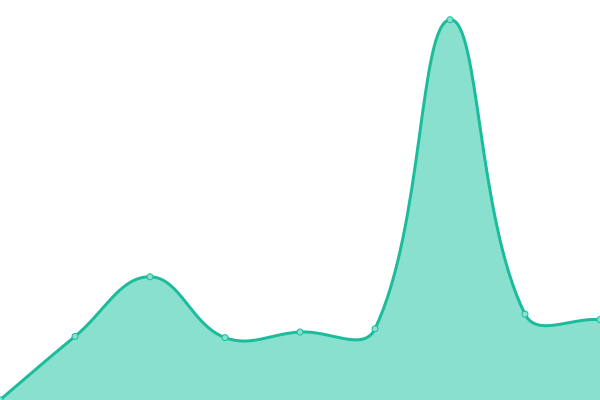 1109ms
     
 | 

<a href="https://DELWP-DTV.github.io/santa/history/ptv-metro-bus-routes-wms">0.00%</a>
    

|  [PTV SkyBus Routes (Airport Service) - WMS](https://discover.data.vic.gov.au) | 🟥 Down | [ptv-sky-bus-routes-airport-service-wms.yml](https://github.com/DELWP-DTV/santa/commits/HEAD/history/ptv-sky-bus-routes-airport-service-wms.yml) | 

 687ms
     
 | 

<a href="https://DELWP-DTV.github.io/santa/history/ptv-sky-bus-routes-airport-service-wms">0.00%</a>
    

|  [PTV Tram Track Centreline - WMS](https://discover.data.vic.gov.au) | 🟥 Down | [ptv-tram-track-centreline-wms.yml](https://github.com/DELWP-DTV/santa/commits/HEAD/history/ptv-tram-track-centreline-wms.yml) | 

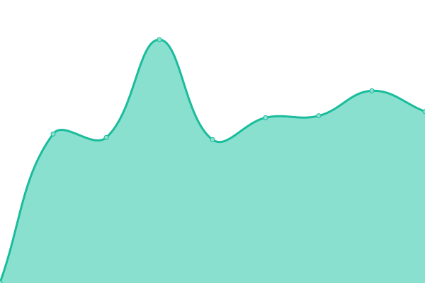 716ms
     
 | 

<a href="https://DELWP-DTV.github.io/santa/history/ptv-tram-track-centreline-wms">0.00%</a>
    

|  [Vicmap Planning (aggregated)](https://enterprise.mapshare.vic.gov.au/server/rest/services/Vicmap_Planning/MapServer) | 🟩 Up | [vicmap-planning-aggregated.yml](https://github.com/DELWP-DTV/santa/commits/HEAD/history/vicmap-planning-aggregated.yml) | 

 899ms
     
 | 

<a href="https://DELWP-DTV.github.io/santa/history/vicmap-planning-aggregated">100.00%</a>
    

|  [Vicmap Planning](https://enterprise.mapshare.vic.gov.au/server/rest/services/Vicmap_Planning/MapServer) | 🟩 Up | [vicmap-planning.yml](https://github.com/DELWP-DTV/santa/commits/HEAD/history/vicmap-planning.yml) | 

 240ms
     
 | 

<a href="https://DELWP-DTV.github.io/santa/history/vicmap-planning">100.00%</a>
    

|  [Public Land Management (PLM25) - WMS](https://discover.data.vic.gov.au) | 🟥 Down | [public-land-management-plm-25-wms.yml](https://github.com/DELWP-DTV/santa/commits/HEAD/history/public-land-management-plm-25-wms.yml) | 

 700ms
     
 | 

<a href="https://DELWP-DTV.github.io/santa/history/public-land-management-plm-25-wms">0.00%</a>
    

|  [Vicmap Admin (aggregated)](https://enterprise.mapshare.vic.gov.au/server/rest/services/Vicmap_Admin/MapServer) | 🟩 Up | [vicmap-admin-aggregated.yml](https://github.com/DELWP-DTV/santa/commits/HEAD/history/vicmap-admin-aggregated.yml) | 

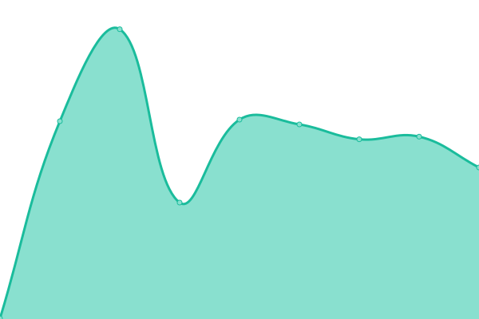 442ms
     
 | 

<a href="https://DELWP-DTV.github.io/santa/history/vicmap-admin-aggregated">100.00%</a>
    

|  [Vicmap Admin](https://enterprise.mapshare.vic.gov.au/server/rest/services/Vicmap_Admin/MapServer) | 🟩 Up | [vicmap-admin.yml](https://github.com/DELWP-DTV/santa/commits/HEAD/history/vicmap-admin.yml) | 

 329ms
     
 | 

<a href="https://DELWP-DTV.github.io/santa/history/vicmap-admin">100.00%</a>
    

|  [Parks and Conservation Reserves (PARKRES) - WMS](https://discover.data.vic.gov.au) | 🟥 Down | [parks-and-conservation-reserves-parkres-wms.yml](https://github.com/DELWP-DTV/santa/commits/HEAD/history/parks-and-conservation-reserves-parkres-wms.yml) | 

 687ms
     
 | 

<a href="https://DELWP-DTV.github.io/santa/history/parks-and-conservation-reserves-parkres-wms">0.00%</a>
    

|  [Ballarat Council - Humidity Level ](https://data.ballarat.vic.gov.au) | 🟥 Down | [ballarat-council-humidity-level.yml](https://github.com/DELWP-DTV/santa/commits/HEAD/history/ballarat-council-humidity-level.yml) | 

 593ms
     
 | 

<a href="https://DELWP-DTV.github.io/santa/history/ballarat-council-humidity-level">0.00%</a>
    

|  [PTV Metro Train Stations - WMS](https://discover.data.vic.gov.au) | 🟥 Down | [ptv-metro-train-stations-wms.yml](https://github.com/DELWP-DTV/santa/commits/HEAD/history/ptv-metro-train-stations-wms.yml) | 

 690ms
     
 | 

<a href="https://DELWP-DTV.github.io/santa/history/ptv-metro-train-stations-wms">0.00%</a>
    

|  [Watercourse Discharge](http://www.bom.gov.au/waterdata/services) | 🟥 Down | [watercourse-discharge.yml](https://github.com/DELWP-DTV/santa/commits/HEAD/history/watercourse-discharge.yml) | 

 173ms
     
 | 

<a href="https://DELWP-DTV.github.io/santa/history/watercourse-discharge">0.00%</a>
    

|  [ABS.Stat (Beta)](https://api.data.abs.gov.au) | 🟥 Down | [abs-stat-beta.yml](https://github.com/DELWP-DTV/santa/commits/HEAD/history/abs-stat-beta.yml) | 

 93ms
     
 | 

<a href="https://DELWP-DTV.github.io/santa/history/abs-stat-beta">0.00%</a>
    

|  [Geelong - Parking sensors](https://www.geelongdataexchange.com.au) | 🟥 Down | [geelong-parking-sensors.yml](https://github.com/DELWP-DTV/santa/commits/HEAD/history/geelong-parking-sensors.yml) | 

 606ms
     
 | 

<a href="https://DELWP-DTV.github.io/santa/history/geelong-parking-sensors">0.00%</a>
    

|  [Vicmap Transport (aggregated)](https://enterprise.mapshare.vic.gov.au/server/rest/services/Vicmap_Transport/MapServer) | 🟩 Up | [vicmap-transport-aggregated.yml](https://github.com/DELWP-DTV/santa/commits/HEAD/history/vicmap-transport-aggregated.yml) | 

 905ms
     
 | 

<a href="https://DELWP-DTV.github.io/santa/history/vicmap-transport-aggregated">100.00%</a>
    

|  [Vicmap Transport](https://enterprise.mapshare.vic.gov.au/server/rest/services/Vicmap_Transport/MapServer) | 🟩 Up | [vicmap-transport.yml](https://github.com/DELWP-DTV/santa/commits/HEAD/history/vicmap-transport.yml) | 

 230ms
     
 | 

<a href="https://DELWP-DTV.github.io/santa/history/vicmap-transport">100.00%</a>
    

|  [Planning scheme zones - Vicmap Planning (PLAN_ZONE)](https://enterprise.mapshare.vic.gov.au/server/rest/services/Vicmap_Planning/MapServer/3) | 🟩 Up | [planning-scheme-zones-vicmap-planning-plan-zone.yml](https://github.com/DELWP-DTV/santa/commits/HEAD/history/planning-scheme-zones-vicmap-planning-plan-zone.yml) | 

 828ms
     
 | 

<a href="https://DELWP-DTV.github.io/santa/history/planning-scheme-zones-vicmap-planning-plan-zone">100.00%</a>
    

|  [Southern Grampians Council - weather-station-status  ](https://www.connectgh.com.au) | 🟥 Down | [southern-grampians-council-weather-station-status.yml](https://github.com/DELWP-DTV/santa/commits/HEAD/history/southern-grampians-council-weather-station-status.yml) | 

 597ms
     
 | 

<a href="https://DELWP-DTV.github.io/santa/history/southern-grampians-council-weather-station-status">0.00%</a>
    

|  [Police Station (VMFEAT.GEOMARK_POINT) - WMS](https://discover.data.vic.gov.au) | 🟥 Down | [police-station-vmfeat-geomark-point-wms.yml](https://github.com/DELWP-DTV/santa/commits/HEAD/history/police-station-vmfeat-geomark-point-wms.yml) | 

 1330ms
     
 | 

<a href="https://DELWP-DTV.github.io/santa/history/police-station-vmfeat-geomark-point-wms">0.00%</a>
    

|  [Moreland Tree Ledger](https://treeledger.com.au/load_polygon_current) | 🟥 Down | [moreland-tree-ledger.yml](https://github.com/DELWP-DTV/santa/commits/HEAD/history/moreland-tree-ledger.yml) | 

 675ms
     
 | 

<a href="https://DELWP-DTV.github.io/santa/history/moreland-tree-ledger">0.00%</a>
    

|  [Vicmap Parcel (aggregated)](https://enterprise.mapshare.vic.gov.au/server/rest/services/Vicmap_Parcel/MapServer) | 🟩 Up | [vicmap-parcel-aggregated.yml](https://github.com/DELWP-DTV/santa/commits/HEAD/history/vicmap-parcel-aggregated.yml) | 

 1009ms
     
 | 

<a href="https://DELWP-DTV.github.io/santa/history/vicmap-parcel-aggregated">100.00%</a>
    

|  [Vicmap Parcel](https://enterprise.mapshare.vic.gov.au/server/rest/services/Vicmap_Parcel/MapServer) | 🟩 Up | [vicmap-parcel.yml](https://github.com/DELWP-DTV/santa/commits/HEAD/history/vicmap-parcel.yml) | 

 250ms
     
 | 

<a href="https://DELWP-DTV.github.io/santa/history/vicmap-parcel">100.00%</a>
    

|  [Road Crashes for five Years - Victoria - GeoJSON](https://discover.data.vic.gov.au) | 🟥 Down | [road-crashes-for-five-years-victoria-geo-json.yml](https://github.com/DELWP-DTV/santa/commits/HEAD/history/road-crashes-for-five-years-victoria-geo-json.yml) | 

 663ms
     
 | 

<a href="https://DELWP-DTV.github.io/santa/history/road-crashes-for-five-years-victoria-geo-json">0.00%</a>
    

|  [DTV Terrain Version 2 – December 2022](https://storage.googleapis.com/vic-datasets-public/85b71982-f5fe-4093-b4e4-fd2e50198fba/v2) | 🟥 Down | [dtv-terrain-version-2-a-december-2022.yml](https://github.com/DELWP-DTV/santa/commits/HEAD/history/dtv-terrain-version-2-a-december-2022.yml) | 

 1323ms
     
 | 

<a href="https://DELWP-DTV.github.io/santa/history/dtv-terrain-version-2-a-december-2022">0.00%</a>
    

|  [Watercourse Discharge](http://www.bom.gov.au/waterdata/services) | 🟥 Down | [watercourse-discharge.yml](https://github.com/DELWP-DTV/santa/commits/HEAD/history/watercourse-discharge.yml) | 

 173ms
     
 | 

<a href="https://DELWP-DTV.github.io/santa/history/watercourse-discharge">0.00%</a>
    

|  [VicFreeWiFi Access Point locations](https://discover.data.vic.gov.au/dataset/2f2b954a-ee69-493e-8071-0754d01fd11f/resource/1922597e-c989-4ebd-bec9-afcc284e5b2c/download/vicfreewifi20ap20map20data2020170724.csv) | 🟥 Down | [vic-free-wi-fi-access-point-locations.yml](https://github.com/DELWP-DTV/santa/commits/HEAD/history/vic-free-wi-fi-access-point-locations.yml) | 

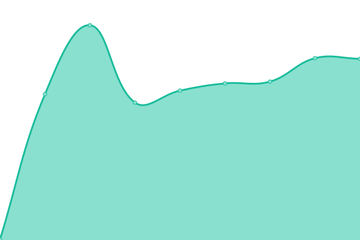 257ms
     
 | 

<a href="https://DELWP-DTV.github.io/santa/history/vic-free-wi-fi-access-point-locations">0.00%</a>
    

|  [Watercourse Levels](http://www.bom.gov.au/waterdata/services) | 🟥 Down | [watercourse-levels.yml](https://github.com/DELWP-DTV/santa/commits/HEAD/history/watercourse-levels.yml) | 

 162ms
     
 | 

<a href="https://DELWP-DTV.github.io/santa/history/watercourse-levels">0.00%</a>
    

|  [PTV Night Bus Stops - WMS](https://discover.data.vic.gov.au) | 🟥 Down | [ptv-night-bus-stops-wms.yml](https://github.com/DELWP-DTV/santa/commits/HEAD/history/ptv-night-bus-stops-wms.yml) | 

 689ms
     
 | 

<a href="https://DELWP-DTV.github.io/santa/history/ptv-night-bus-stops-wms">0.00%</a>
    

|  [Vicmap Property (aggregated)](https://enterprise.mapshare.vic.gov.au/server/rest/services/Vicmap_Property/MapServer) | 🟩 Up | [vicmap-property-aggregated.yml](https://github.com/DELWP-DTV/santa/commits/HEAD/history/vicmap-property-aggregated.yml) | 

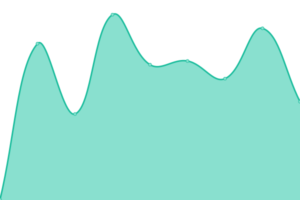 363ms
     
 | 

<a href="https://DELWP-DTV.github.io/santa/history/vicmap-property-aggregated">100.00%</a>
    

|  [Vicmap Property](https://enterprise.mapshare.vic.gov.au/server/rest/services/Vicmap_Property/MapServer) | 🟩 Up | [vicmap-property.yml](https://github.com/DELWP-DTV/santa/commits/HEAD/history/vicmap-property.yml) | 

 256ms
     
 | 

<a href="https://DELWP-DTV.github.io/santa/history/vicmap-property">100.00%</a>
    

|  [PTV Metro Bus Stops - WMS](https://discover.data.vic.gov.au) | 🟥 Down | [ptv-metro-bus-stops-wms.yml](https://github.com/DELWP-DTV/santa/commits/HEAD/history/ptv-metro-bus-stops-wms.yml) | 

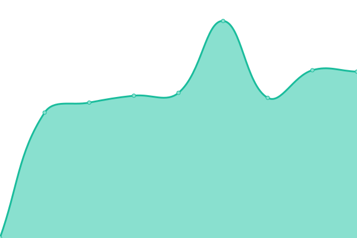 664ms
     
 | 

<a href="https://DELWP-DTV.github.io/santa/history/ptv-metro-bus-stops-wms">0.00%</a>
    

|  [AURIN](https://map.aurin.org.au/geoserver/ows) | 🟩 Up | [aurin.yml](https://github.com/DELWP-DTV/santa/commits/HEAD/history/aurin.yml) | 

 1192ms
     
 | 

<a href="https://DELWP-DTV.github.io/santa/history/aurin">100.00%</a>
    

|  [SHWEP Activity Centre](https://services7.arcgis.com/fVJQ0uhT9L4zp35f/arcgis/rest/services/ActivityArea_gdb/FeatureServer/2) | 🟥 Down | [shwep-activity-centre.yml](https://github.com/DELWP-DTV/santa/commits/HEAD/history/shwep-activity-centre.yml) | 

 171ms
     
 | 

<a href="https://DELWP-DTV.github.io/santa/history/shwep-activity-centre">0.00%</a>
    

|  [ABS SEIFA IRSD by SA1 2016](https://map.aurin.org.au/geoserver/ows) | 🟩 Up | [abs-seifa-irsd-by-sa-1-2016.yml](https://github.com/DELWP-DTV/santa/commits/HEAD/history/abs-seifa-irsd-by-sa-1-2016.yml) | 

 267ms
     
 | 

<a href="https://DELWP-DTV.github.io/santa/history/abs-seifa-irsd-by-sa-1-2016">100.00%</a>
    

|  [PTV Night Bus Routes - WMS](https://discover.data.vic.gov.au) | 🟥 Down | [ptv-night-bus-routes-wms.yml](https://github.com/DELWP-DTV/santa/commits/HEAD/history/ptv-night-bus-routes-wms.yml) | 

 667ms
     
 | 

<a href="https://DELWP-DTV.github.io/santa/history/ptv-night-bus-routes-wms">0.00%</a>
    

|  [Southern Grampians Council - Water Levels](https://www.connectgh.com.au) | 🟥 Down | [southern-grampians-council-water-levels.yml](https://github.com/DELWP-DTV/santa/commits/HEAD/history/southern-grampians-council-water-levels.yml) | 

 664ms
     
 | 

<a href="https://DELWP-DTV.github.io/santa/history/southern-grampians-council-water-levels">0.00%</a>
    

|  [Vicmap Address (aggregated)](https://enterprise.mapshare.vic.gov.au/server/rest/services/Vicmap_Address/MapServer) | 🟩 Up | [vicmap-address-aggregated.yml](https://github.com/DELWP-DTV/santa/commits/HEAD/history/vicmap-address-aggregated.yml) | 

 1054ms
     
 | 

<a href="https://DELWP-DTV.github.io/santa/history/vicmap-address-aggregated">100.00%</a>
    

|  [Vicmap Address](https://enterprise.mapshare.vic.gov.au/server/rest/services/Vicmap_Address/MapServer) | 🟩 Up | [vicmap-address.yml](https://github.com/DELWP-DTV/santa/commits/HEAD/history/vicmap-address.yml) | 

 263ms
     
 | 

<a href="https://DELWP-DTV.github.io/santa/history/vicmap-address">100.00%</a>
    

|  [Ballarat Council - Noise Observations ](https://data.ballarat.vic.gov.au) | 🟥 Down | [ballarat-council-noise-observations.yml](https://github.com/DELWP-DTV/santa/commits/HEAD/history/ballarat-council-noise-observations.yml) | 

 636ms
     
 | 

<a href="https://DELWP-DTV.github.io/santa/history/ballarat-council-noise-observations">0.00%</a>
    

|  [Vicmap Vegetation - Tree Urban](https://enterprise.mapshare.vic.gov.au/server/rest/services/Vicmap_Vegetation_Tree_Urban/MapServer) | 🟩 Up | [vicmap-vegetation-tree-urban.yml](https://github.com/DELWP-DTV/santa/commits/HEAD/history/vicmap-vegetation-tree-urban.yml) | 

 365ms
     
 | 

<a href="https://DELWP-DTV.github.io/santa/history/vicmap-vegetation-tree-urban">100.00%</a>
    

|  [Vicmap Geomark (aggregated)](https://enterprise.mapshare.vic.gov.au/server/rest/services/Vicmap_Geomark/MapServer) | 🟩 Up | [vicmap-geomark-aggregated.yml](https://github.com/DELWP-DTV/santa/commits/HEAD/history/vicmap-geomark-aggregated.yml) | 

 357ms
     
 | 

<a href="https://DELWP-DTV.github.io/santa/history/vicmap-geomark-aggregated">100.00%</a>
    

|  [Vicmap Geomark](https://enterprise.mapshare.vic.gov.au/server/rest/services/Vicmap_Geomark/MapServer) | 🟩 Up | [vicmap-geomark.yml](https://github.com/DELWP-DTV/santa/commits/HEAD/history/vicmap-geomark.yml) | 

 259ms
     
 | 

<a href="https://DELWP-DTV.github.io/santa/history/vicmap-geomark">100.00%</a>
    

|  [ABS SEIFA IRSAD by SA1 2016](https://map.aurin.org.au/geoserver/ows) | 🟩 Up | [abs-seifa-irsad-by-sa-1-2016.yml](https://github.com/DELWP-DTV/santa/commits/HEAD/history/abs-seifa-irsad-by-sa-1-2016.yml) | 

 3301ms
     
 | 

<a href="https://DELWP-DTV.github.io/santa/history/abs-seifa-irsad-by-sa-1-2016">100.00%</a>
    

|  [Victoria Flood Database - Defined and Declared Floodways - WMS](https://discover.data.vic.gov.au) | 🟥 Down | [victoria-flood-database-defined-and-declared-floodways-wms.yml](https://github.com/DELWP-DTV/santa/commits/HEAD/history/victoria-flood-database-defined-and-declared-floodways-wms.yml) | 

 1283ms
     
 | 

<a href="https://DELWP-DTV.github.io/santa/history/victoria-flood-database-defined-and-declared-floodways-wms">100.00%</a>
    

|  [Ballarat Council - Noise Sensors](https://data.ballarat.vic.gov.au) | 🟥 Down | [ballarat-council-noise-sensors.yml](https://github.com/DELWP-DTV/santa/commits/HEAD/history/ballarat-council-noise-sensors.yml) | 

 590ms
     
 | 

<a href="https://DELWP-DTV.github.io/santa/history/ballarat-council-noise-sensors">0.00%</a>
    

|  [Vicmap Elevation - Statewide (10m to 20m) (aggregated)](https://enterprise.mapshare.vic.gov.au/server/rest/services/Vicmap_Elevation_STATEWIDE_10_to_20_metre/MapServer) | 🟩 Up | [vicmap-elevation-statewide-10m-to-20m-aggregated.yml](https://github.com/DELWP-DTV/santa/commits/HEAD/history/vicmap-elevation-statewide-10m-to-20m-aggregated.yml) | 

 963ms
     
 | 

<a href="https://DELWP-DTV.github.io/santa/history/vicmap-elevation-statewide-10m-to-20m-aggregated">100.00%</a>
    

|  [Vicmap Elevation - Statewide (10m to 20m)](https://enterprise.mapshare.vic.gov.au/server/rest/services/Vicmap_Elevation_STATEWIDE_10_to_20_metre/MapServer) | 🟩 Up | [vicmap-elevation-statewide-10m-to-20m.yml](https://github.com/DELWP-DTV/santa/commits/HEAD/history/vicmap-elevation-statewide-10m-to-20m.yml) | 

 271ms
     
 | 

<a href="https://DELWP-DTV.github.io/santa/history/vicmap-elevation-statewide-10m-to-20m">100.00%</a>
    

|  [PTV Regional Bus Routes - WMS](https://discover.data.vic.gov.au) | 🟥 Down | [ptv-regional-bus-routes-wms.yml](https://github.com/DELWP-DTV/santa/commits/HEAD/history/ptv-regional-bus-routes-wms.yml) | 

 683ms
     
 | 

<a href="https://DELWP-DTV.github.io/santa/history/ptv-regional-bus-routes-wms">0.00%</a>
    

|  [Vicmap Lite (aggregated)](https://enterprise.mapshare.vic.gov.au/server/rest/services/Vicmap_Lite/MapServer) | 🟩 Up | [vicmap-lite-aggregated.yml](https://github.com/DELWP-DTV/santa/commits/HEAD/history/vicmap-lite-aggregated.yml) | 

 331ms
     
 | 

<a href="https://DELWP-DTV.github.io/santa/history/vicmap-lite-aggregated">100.00%</a>
    

|  [Vicmap Lite](https://enterprise.mapshare.vic.gov.au/server/rest/services/Vicmap_Lite/MapServer) | 🟩 Up | [vicmap-lite.yml](https://github.com/DELWP-DTV/santa/commits/HEAD/history/vicmap-lite.yml) | 

 281ms
     
 | 

<a href="https://DELWP-DTV.github.io/santa/history/vicmap-lite">100.00%</a>
    

|  [PTV Metro Tram Stops - WMS](https://discover.data.vic.gov.au) | 🟥 Down | [ptv-metro-tram-stops-wms.yml](https://github.com/DELWP-DTV/santa/commits/HEAD/history/ptv-metro-tram-stops-wms.yml) | 

 672ms
     
 | 

<a href="https://DELWP-DTV.github.io/santa/history/ptv-metro-tram-stops-wms">0.00%</a>
    

|  [Vicmap Elevation - Metro (1m to 5m) (aggregated)](https://enterprise.mapshare.vic.gov.au/server/rest/services/Vicmap_Elevation_METRO_1_to_5_metre/MapServer) | 🟩 Up | [vicmap-elevation-metro-1m-to-5m-aggregated.yml](https://github.com/DELWP-DTV/santa/commits/HEAD/history/vicmap-elevation-metro-1m-to-5m-aggregated.yml) | 

 737ms
     
 | 

<a href="https://DELWP-DTV.github.io/santa/history/vicmap-elevation-metro-1m-to-5m-aggregated">100.00%</a>
    

|  [Vicmap Elevation - Metro (1m to 5m)](https://enterprise.mapshare.vic.gov.au/server/rest/services/Vicmap_Elevation_METRO_1_to_5_metre/MapServer) | 🟩 Up | [vicmap-elevation-metro-1m-to-5m.yml](https://github.com/DELWP-DTV/santa/commits/HEAD/history/vicmap-elevation-metro-1m-to-5m.yml) | 

 620ms
     
 | 

<a href="https://DELWP-DTV.github.io/santa/history/vicmap-elevation-metro-1m-to-5m">100.00%</a>
    

|  [PTV Metro Tram Routes - WMS](https://discover.data.vic.gov.au) | 🟥 Down | [ptv-metro-tram-routes-wms.yml](https://github.com/DELWP-DTV/santa/commits/HEAD/history/ptv-metro-tram-routes-wms.yml) | 

 672ms
     
 | 

<a href="https://DELWP-DTV.github.io/santa/history/ptv-metro-tram-routes-wms">0.00%</a>
    

|  [Significant Planning Register](https://services7.arcgis.com/fVJQ0uhT9L4zp35f/arcgis/rest/services/SunshineActivityPlanningRegister_250722_gdb/FeatureServer/3) | 🟥 Down | [significant-planning-register.yml](https://github.com/DELWP-DTV/santa/commits/HEAD/history/significant-planning-register.yml) | 

 109ms
     
 | 

<a href="https://DELWP-DTV.github.io/santa/history/significant-planning-register">0.00%</a>
    

|  [Ballarat Council - Water Level ](https://data.ballarat.vic.gov.au) | 🟥 Down | [ballarat-council-water-level.yml](https://github.com/DELWP-DTV/santa/commits/HEAD/history/ballarat-council-water-level.yml) | 

 613ms
     
 | 

<a href="https://DELWP-DTV.github.io/santa/history/ballarat-council-water-level">0.00%</a>
    

|  [ACCC Mobile Infrastructure Report 2021](https://enterprise.mapshare.vic.gov.au/server/rest/services/DTV/ACCC_Mobile_Infrastructure_Report/MapServer) | 🟩 Up | [accc-mobile-infrastructure-report-2021.yml](https://github.com/DELWP-DTV/santa/commits/HEAD/history/accc-mobile-infrastructure-report-2021.yml) | 

 1019ms
     
 | 

<a href="https://DELWP-DTV.github.io/santa/history/accc-mobile-infrastructure-report-2021">100.00%</a>
    

|  [Australian Public Hospitals 2018-2019](https://services5.arcgis.com/OvOcYIrJnM97ABBA/arcgis/rest/services/Australian_Public_Hospitals_WFL1/FeatureServer/0) | 🟥 Down | [australian-public-hospitals-2018-2019.yml](https://github.com/DELWP-DTV/santa/commits/HEAD/history/australian-public-hospitals-2018-2019.yml) | 

 226ms
     
 | 

<a href="https://DELWP-DTV.github.io/santa/history/australian-public-hospitals-2018-2019">0.00%</a>
    

|  [Moreland Tree Ledger - Losses](https://treeledger.com.au/load_polygon_loss) | 🟥 Down | [moreland-tree-ledger-losses.yml](https://github.com/DELWP-DTV/santa/commits/HEAD/history/moreland-tree-ledger-losses.yml) | 

 378ms
     
 | 

<a href="https://DELWP-DTV.github.io/santa/history/moreland-tree-ledger-losses">0.00%</a>
    

|  [Vicmap Index (aggregated)](https://enterprise.mapshare.vic.gov.au/server/rest/services/Vicmap_Index/MapServer) | 🟩 Up | [vicmap-index-aggregated.yml](https://github.com/DELWP-DTV/santa/commits/HEAD/history/vicmap-index-aggregated.yml) | 

 370ms
     
 | 

<a href="https://DELWP-DTV.github.io/santa/history/vicmap-index-aggregated">100.00%</a>
    

|  [Vicmap Index](https://enterprise.mapshare.vic.gov.au/server/rest/services/Vicmap_Index/MapServer) | 🟩 Up | [vicmap-index.yml](https://github.com/DELWP-DTV/santa/commits/HEAD/history/vicmap-index.yml) | 

 262ms
     
 | 

<a href="https://DELWP-DTV.github.io/santa/history/vicmap-index">100.00%</a>
    

|  [Metro Trains](https://data-exchange-api.vicroads.vic.gov.au/opendata/v1/gtfsr/metrotrain-vehicleposition-updates) | 🟥 Down | [metro-trains.yml](https://github.com/DELWP-DTV/santa/commits/HEAD/history/metro-trains.yml) | 

 484ms
     
 | 

<a href="https://DELWP-DTV.github.io/santa/history/metro-trains">0.00%</a>
    

|  [Address - Vicmap Address - WMS](https://discover.data.vic.gov.au) | 🟥 Down | [address-vicmap-address-wms.yml](https://github.com/DELWP-DTV/santa/commits/HEAD/history/address-vicmap-address-wms.yml) | 

 1302ms
     
 | 

<a href="https://DELWP-DTV.github.io/santa/history/address-vicmap-address-wms">0.00%</a>
    

|  [PTV Regional Coach Stops - WMS](https://discover.data.vic.gov.au) | 🟥 Down | [ptv-regional-coach-stops-wms.yml](https://github.com/DELWP-DTV/santa/commits/HEAD/history/ptv-regional-coach-stops-wms.yml) | 

 645ms
     
 | 

<a href="https://DELWP-DTV.github.io/santa/history/ptv-regional-coach-stops-wms">0.00%</a>
    

|  [Local Government Area Boundaries (Property) 1:25,000 - Vicmap Admin - WMS](https://discover.data.vic.gov.au) | 🟥 Down | [local-government-area-boundaries-property-1-25-000-vicmap-admin-wms.yml](https://github.com/DELWP-DTV/santa/commits/HEAD/history/local-government-area-boundaries-property-1-25-000-vicmap-admin-wms.yml) | 

 648ms
     
 | 

<a href="https://DELWP-DTV.github.io/santa/history/local-government-area-boundaries-property-1-25-000-vicmap-admin-wms">100.00%</a>
    

|  [St Albans Activity Centre](https://services7.arcgis.com/fVJQ0uhT9L4zp35f/arcgis/rest/services/ActivityArea_gdb/FeatureServer/1) | 🟥 Down | [st-albans-activity-centre.yml](https://github.com/DELWP-DTV/santa/commits/HEAD/history/st-albans-activity-centre.yml) | 

 105ms
     
 | 

<a href="https://DELWP-DTV.github.io/santa/history/st-albans-activity-centre">0.00%</a>
    

|  [Local Government Area Boundaries (Road) (polygon) - Vicmap Admin - WMS](https://discover.data.vic.gov.au) | 🟥 Down | [local-government-area-boundaries-road-polygon-vicmap-admin-wms.yml](https://github.com/DELWP-DTV/santa/commits/HEAD/history/local-government-area-boundaries-road-polygon-vicmap-admin-wms.yml) | 

 641ms
     
 | 

<a href="https://DELWP-DTV.github.io/santa/history/local-government-area-boundaries-road-polygon-vicmap-admin-wms">100.00%</a>
    

|  [Vicmap Hydro (aggregated)](https://enterprise.mapshare.vic.gov.au/server/rest/services/Vicmap_Hydro/MapServer) | 🟩 Up | [vicmap-hydro-aggregated.yml](https://github.com/DELWP-DTV/santa/commits/HEAD/history/vicmap-hydro-aggregated.yml) | 

 1062ms
     
 | 

<a href="https://DELWP-DTV.github.io/santa/history/vicmap-hydro-aggregated">100.00%</a>
    

|  [Vicmap Hydro](https://enterprise.mapshare.vic.gov.au/server/rest/services/Vicmap_Hydro/MapServer) | 🟩 Up | [vicmap-hydro.yml](https://github.com/DELWP-DTV/santa/commits/HEAD/history/vicmap-hydro.yml) | 

 265ms
     
 | 

<a href="https://DELWP-DTV.github.io/santa/history/vicmap-hydro">100.00%</a>
    

|  [Planning scheme overlay - Vicmap Planning (PLAN_OVERLAY)](https://enterprise.mapshare.vic.gov.au/server/rest/services/Vicmap_Planning/MapServer/2) | 🟩 Up | [planning-scheme-overlay-vicmap-planning-plan-overlay.yml](https://github.com/DELWP-DTV/santa/commits/HEAD/history/planning-scheme-overlay-vicmap-planning-plan-overlay.yml) | 

 252ms
     
 | 

<a href="https://DELWP-DTV.github.io/santa/history/planning-scheme-overlay-vicmap-planning-plan-overlay">100.00%</a>
    

|  [local-government-datasets](https://terria-catalogs-public.storage.googleapis.com/common/aus-gov-open-data/vic/prod.json) | 🟥 Down | [local-government-datasets.yml](https://github.com/DELWP-DTV/santa/commits/HEAD/history/local-government-datasets.yml) | 

 1403ms
     
 | 

<a href="https://DELWP-DTV.github.io/santa/history/local-government-datasets">0.00%</a>
    

|  [Moreland Tree Ledger GeoJson](https://treeledger.com.au/open_leaf/current) | 🟥 Down | [moreland-tree-ledger-geo-json.yml](https://github.com/DELWP-DTV/santa/commits/HEAD/history/moreland-tree-ledger-geo-json.yml) | 

 631ms
     
 | 

<a href="https://DELWP-DTV.github.io/santa/history/moreland-tree-ledger-geo-json">0.00%</a>
    

|  [Moreland Tree Ledger - Losses](https://treeledger.com.au/open_leaf/current_loss) | 🟥 Down | [moreland-tree-ledger-losses.yml](https://github.com/DELWP-DTV/santa/commits/HEAD/history/moreland-tree-ledger-losses.yml) | 

 378ms
     
 | 

<a href="https://DELWP-DTV.github.io/santa/history/moreland-tree-ledger-losses">0.00%</a>
    

|  [national-datasets](https://terria-catalogs-public.storage.googleapis.com/nationalmap/prod.json) | 🟥 Down | [national-datasets.yml](https://github.com/DELWP-DTV/santa/commits/HEAD/history/national-datasets.yml) | 

 196ms
     
 | 

<a href="https://DELWP-DTV.github.io/santa/history/national-datasets">0.00%</a>
    

|  [Tree Density](https://tiles.arcgis.com/tiles/GB33F62SbDxJjwEL/arcgis/rest/services/Vicmap_Vegetation_Tree_Density/VectorTileServer/tile/{z}/{y}/{x}.pbf) | 🟩 Up | [tree-density.yml](https://github.com/DELWP-DTV/santa/commits/HEAD/history/tree-density.yml) | 

 152ms
     
 | 

<a href="https://DELWP-DTV.github.io/santa/history/tree-density">100.00%</a>
    

|  [Tree Extent](https://tiles.arcgis.com/tiles/GB33F62SbDxJjwEL/arcgis/rest/services/Vicmap_Vegetation_Tree_Extent/MapServer) | 🟩 Up | [tree-extent.yml](https://github.com/DELWP-DTV/santa/commits/HEAD/history/tree-extent.yml) | 

 98ms
     
 | 

<a href="https://DELWP-DTV.github.io/santa/history/tree-extent">100.00%</a>
    

|  [precinct-structure-plan-boundaries](https://services5.arcgis.com/DmRfik4clMVydXO3/arcgis/rest/services/PSP_Boundaries/FeatureServer/0/query?outFields=*&where=1%3D1) | 🟥 Down | [precinct-structure-plan-boundaries.yml](https://github.com/DELWP-DTV/santa/commits/HEAD/history/precinct-structure-plan-boundaries.yml) | 

 81ms
     
 | 

<a href="https://DELWP-DTV.github.io/santa/history/precinct-structure-plan-boundaries">0.00%</a>
    

|  [vicroads-declared-roads3](https://services2.arcgis.com/18ajPSI0b3ppsmMt/arcgis/rest/services/VicRoads_Declared_Roads/FeatureServer/0) | 🟥 Down | [vicroads-declared-roads3.yml](https://github.com/DELWP-DTV/santa/commits/HEAD/history/vicroads-declared-roads3.yml) | 

 172ms
     
 | 

<a href="https://DELWP-DTV.github.io/santa/history/vicroads-declared-roads3">0.00%</a>
    

|  [traffic-lights1](https://services2.arcgis.com/18ajPSI0b3ppsmMt/arcgis/rest/services/traffic_lights/FeatureServer/0) | 🟥 Down | [traffic-lights1.yml](https://github.com/DELWP-DTV/santa/commits/HEAD/history/traffic-lights1.yml) | 

 131ms
     
 | 

<a href="https://DELWP-DTV.github.io/santa/history/traffic-lights1">0.00%</a>
    

|  [traffic-volume](https://vicdata.vicroads.vic.gov.au/server/rest/services/Operations_Traffic/FeatureServer/0) | 🟥 Down | [traffic-volume.yml](https://github.com/DELWP-DTV/santa/commits/HEAD/history/traffic-volume.yml) | 

 888ms
     
 | 

<a href="https://DELWP-DTV.github.io/santa/history/traffic-volume">0.00%</a>
    

|  [vicvoads-road-use-hierarchy](https://services2.arcgis.com/18ajPSI0b3ppsmMt/arcgis/rest/services/Road_Use_Hierarchy/FeatureServer/0/query?outFields=*&where=1%3D1) | 🟥 Down | [vicvoads-road-use-hierarchy.yml](https://github.com/DELWP-DTV/santa/commits/HEAD/history/vicvoads-road-use-hierarchy.yml) | 

 117ms
     
 | 

<a href="https://DELWP-DTV.github.io/santa/history/vicvoads-road-use-hierarchy">0.00%</a>
    

|  [vicmap-transport-rest-api](https://services6.arcgis.com/GB33F62SbDxJjwEL/arcgis/rest/services/Vicmap_Transport/FeatureServer) | 🟩 Up | [vicmap-transport-rest-api.yml](https://github.com/DELWP-DTV/santa/commits/HEAD/history/vicmap-transport-rest-api.yml) | 

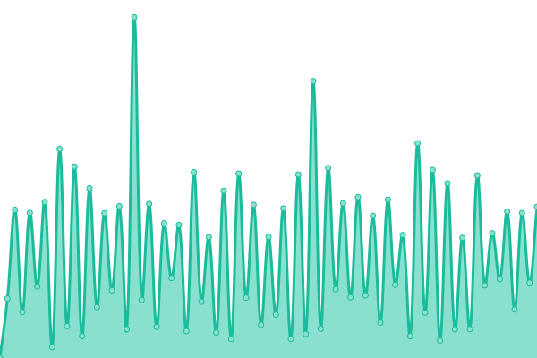 531ms
     
 | 

<a href="https://DELWP-DTV.github.io/santa/history/vicmap-transport-rest-api">99.97%</a>
    

|  [vicmap-transport-rest-api](https://enterprise.mapshare.vic.gov.au/server/rest/services/Vicmap_Transport/MapServer) | 🟩 Up | [vicmap-transport-rest-api.yml](https://github.com/DELWP-DTV/santa/commits/HEAD/history/vicmap-transport-rest-api.yml) | 

 531ms
     
 | 

<a href="https://DELWP-DTV.github.io/santa/history/vicmap-transport-rest-api">99.97%</a>
    

|  [vicmap-position-rest-api](https://services6.arcgis.com/GB33F62SbDxJjwEL/arcgis/rest/services/Vicmap_Position/FeatureServer) | 🟩 Up | [vicmap-position-rest-api.yml](https://github.com/DELWP-DTV/santa/commits/HEAD/history/vicmap-position-rest-api.yml) | 

 161ms
     
 | 

<a href="https://DELWP-DTV.github.io/santa/history/vicmap-position-rest-api">99.98%</a>
    

|  [vicmap-position-rest-api](https://enterprise.mapshare.vic.gov.au/server/rest/services/Vicmap_Position/MapServer) | 🟩 Up | [vicmap-position-rest-api.yml](https://github.com/DELWP-DTV/santa/commits/HEAD/history/vicmap-position-rest-api.yml) | 

 161ms
     
 | 

<a href="https://DELWP-DTV.github.io/santa/history/vicmap-position-rest-api">99.98%</a>
    

|  [vicmap-planning-api](https://services6.arcgis.com/GB33F62SbDxJjwEL/arcgis/rest/services/Vicmap_Planning/FeatureServer) | 🟩 Up | [vicmap-planning-api.yml](https://github.com/DELWP-DTV/santa/commits/HEAD/history/vicmap-planning-api.yml) | 

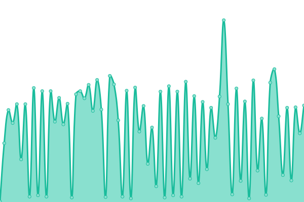 166ms
     
 | 

<a href="https://DELWP-DTV.github.io/santa/history/vicmap-planning-api">99.98%</a>
    

|  [vicmap-planning-api](https://enterprise.mapshare.vic.gov.au/server/rest/services/Vicmap_Planning/MapServer) | 🟩 Up | [vicmap-planning-api.yml](https://github.com/DELWP-DTV/santa/commits/HEAD/history/vicmap-planning-api.yml) | 

 166ms
     
 | 

<a href="https://DELWP-DTV.github.io/santa/history/vicmap-planning-api">99.98%</a>
    

|  [vicmap-lite-rest-api](https://services6.arcgis.com/GB33F62SbDxJjwEL/arcgis/rest/services/Vicmap_Lite/FeatureServer) | 🟩 Up | [vicmap-lite-rest-api.yml](https://github.com/DELWP-DTV/santa/commits/HEAD/history/vicmap-lite-rest-api.yml) | 

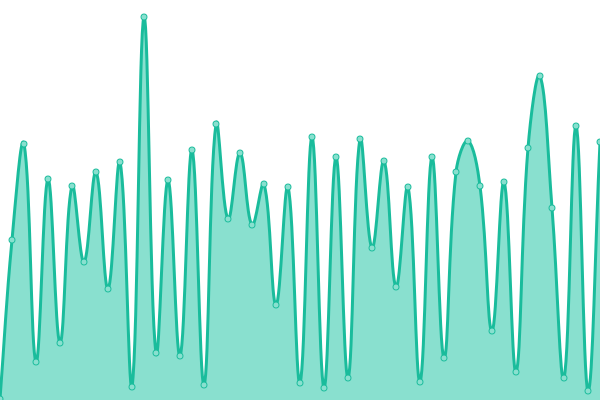 161ms
     
 | 

<a href="https://DELWP-DTV.github.io/santa/history/vicmap-lite-rest-api">99.98%</a>
    

|  [vicmap-lite-rest-api](https://enterprise.mapshare.vic.gov.au/server/rest/services/Vicmap_Lite/MapServer) | 🟩 Up | [vicmap-lite-rest-api.yml](https://github.com/DELWP-DTV/santa/commits/HEAD/history/vicmap-lite-rest-api.yml) | 

 161ms
     
 | 

<a href="https://DELWP-DTV.github.io/santa/history/vicmap-lite-rest-api">99.98%</a>
    

|  [vicmap-index-rest-api](https://services6.arcgis.com/GB33F62SbDxJjwEL/arcgis/rest/services/Vicmap_Index/FeatureServer) | 🟩 Up | [vicmap-index-rest-api.yml](https://github.com/DELWP-DTV/santa/commits/HEAD/history/vicmap-index-rest-api.yml) | 

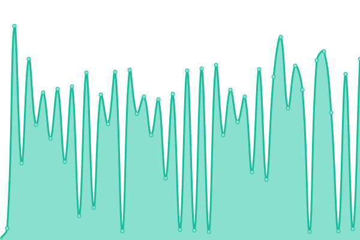 165ms
     
 | 

<a href="https://DELWP-DTV.github.io/santa/history/vicmap-index-rest-api">99.98%</a>
    

|  [vicmap-index-rest-api](https://enterprise.mapshare.vic.gov.au/server/rest/services/Vicmap_Index/MapServer) | 🟩 Up | [vicmap-index-rest-api.yml](https://github.com/DELWP-DTV/santa/commits/HEAD/history/vicmap-index-rest-api.yml) | 

 165ms
     
 | 

<a href="https://DELWP-DTV.github.io/santa/history/vicmap-index-rest-api">99.98%</a>
    

|  [vicmap-hydro-rest-api](https://services6.arcgis.com/GB33F62SbDxJjwEL/arcgis/rest/services/Vicmap_Hydro/FeatureServer) | 🟩 Up | [vicmap-hydro-rest-api.yml](https://github.com/DELWP-DTV/santa/commits/HEAD/history/vicmap-hydro-rest-api.yml) | 

 163ms
     
 | 

<a href="https://DELWP-DTV.github.io/santa/history/vicmap-hydro-rest-api">99.98%</a>
    

|  [vicmap-hydro-rest-api](https://enterprise.mapshare.vic.gov.au/server/rest/services/Vicmap_Hydro/MapServer) | 🟩 Up | [vicmap-hydro-rest-api.yml](https://github.com/DELWP-DTV/santa/commits/HEAD/history/vicmap-hydro-rest-api.yml) | 

 163ms
     
 | 

<a href="https://DELWP-DTV.github.io/santa/history/vicmap-hydro-rest-api">99.98%</a>
    

|  [vicmap-geomark-rest-api](https://services6.arcgis.com/GB33F62SbDxJjwEL/arcgis/rest/services/Vicmap_Geomark/FeatureServer) | 🟩 Up | [vicmap-geomark-rest-api.yml](https://github.com/DELWP-DTV/santa/commits/HEAD/history/vicmap-geomark-rest-api.yml) | 

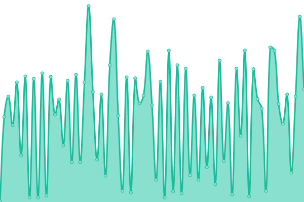 167ms
     
 | 

<a href="https://DELWP-DTV.github.io/santa/history/vicmap-geomark-rest-api">99.98%</a>
    

|  [vicmap-geomark-rest-api](https://enterprise.mapshare.vic.gov.au/server/rest/services/Vicmap_Geomark/MapServer) | 🟩 Up | [vicmap-geomark-rest-api.yml](https://github.com/DELWP-DTV/santa/commits/HEAD/history/vicmap-geomark-rest-api.yml) | 

 167ms
     
 | 

<a href="https://DELWP-DTV.github.io/santa/history/vicmap-geomark-rest-api">99.98%</a>
    

|  [vicmap-features-of-interest-rest-api](https://services6.arcgis.com/GB33F62SbDxJjwEL/arcgis/rest/services/Vicmap_Features_of_Interest/FeatureServer) | 🟩 Up | [vicmap-features-of-interest-rest-api.yml](https://github.com/DELWP-DTV/santa/commits/HEAD/history/vicmap-features-of-interest-rest-api.yml) | 

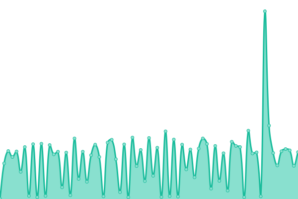 158ms
     
 | 

<a href="https://DELWP-DTV.github.io/santa/history/vicmap-features-of-interest-rest-api">99.98%</a>
    

|  [vicmap-features-of-interest-rest-api](https://enterprise.mapshare.vic.gov.au/server/rest/services/Vicmap_Features_of_Interest/MapServer) | 🟩 Up | [vicmap-features-of-interest-rest-api.yml](https://github.com/DELWP-DTV/santa/commits/HEAD/history/vicmap-features-of-interest-rest-api.yml) | 

 158ms
     
 | 

<a href="https://DELWP-DTV.github.io/santa/history/vicmap-features-of-interest-rest-api">99.98%</a>
    

|  [vicmap-elevation-rest-api](https://services6.arcgis.com/GB33F62SbDxJjwEL/arcgis/rest/services/Vicmap_Elevation_METRO_1_to_5_metre/FeatureServer) | 🟩 Up | [vicmap-elevation-rest-api.yml](https://github.com/DELWP-DTV/santa/commits/HEAD/history/vicmap-elevation-rest-api.yml) | 

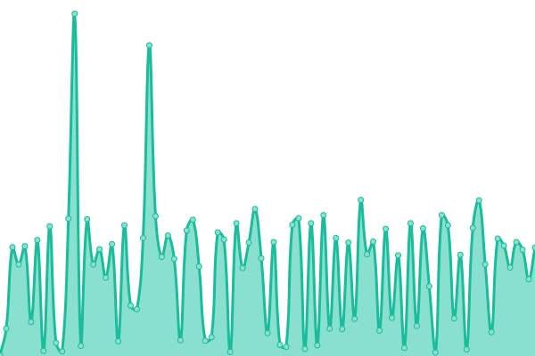 212ms
     
 | 

<a href="https://DELWP-DTV.github.io/santa/history/vicmap-elevation-rest-api">99.98%</a>
    

|  [vicmap-elevation-rest-api](https://services6.arcgis.com/GB33F62SbDxJjwEL/arcgis/rest/services/Vicmap_Elevation_STATEWIDE_10_to_20_metre/FeatureServer) | 🟩 Up | [vicmap-elevation-rest-api.yml](https://github.com/DELWP-DTV/santa/commits/HEAD/history/vicmap-elevation-rest-api.yml) | 

 212ms
     
 | 

<a href="https://DELWP-DTV.github.io/santa/history/vicmap-elevation-rest-api">99.98%</a>
    

|  [vicmap-elevation-rest-api](https://enterprise.mapshare.vic.gov.au/server/rest/services/Vicmap_Elevation_STATEWIDE_10_to_20_metre/MapServer) | 🟩 Up | [vicmap-elevation-rest-api.yml](https://github.com/DELWP-DTV/santa/commits/HEAD/history/vicmap-elevation-rest-api.yml) | 

 212ms
     
 | 

<a href="https://DELWP-DTV.github.io/santa/history/vicmap-elevation-rest-api">99.98%</a>
    

|  [vicmap-elevation-rest-api](https://enterprise.mapshare.vic.gov.au/server/rest/services/Vicmap_Elevation_METRO_1_to_5_metre/MapServer) | 🟩 Up | [vicmap-elevation-rest-api.yml](https://github.com/DELWP-DTV/santa/commits/HEAD/history/vicmap-elevation-rest-api.yml) | 

 212ms
     
 | 

<a href="https://DELWP-DTV.github.io/santa/history/vicmap-elevation-rest-api">99.98%</a>
    

|  [vicmap-crown-land-tenure-rest-api](https://services6.arcgis.com/GB33F62SbDxJjwEL/arcgis/rest/services/Vicmap_Crown_Land_Tenure/FeatureServer) | 🟩 Up | [vicmap-crown-land-tenure-rest-api.yml](https://github.com/DELWP-DTV/santa/commits/HEAD/history/vicmap-crown-land-tenure-rest-api.yml) | 

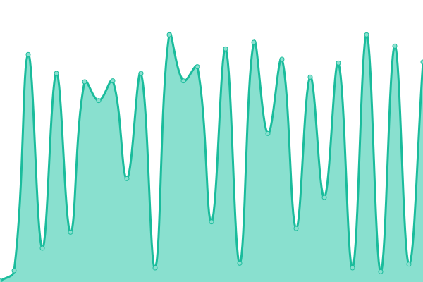 158ms
     
 | 

<a href="https://DELWP-DTV.github.io/santa/history/vicmap-crown-land-tenure-rest-api">99.98%</a>
    

|  [vicmap-crown-land-tenure-rest-api](https://enterprise.mapshare.vic.gov.au/server/rest/services/Vicmap_Crown_Land_Tenure/MapServer) | 🟩 Up | [vicmap-crown-land-tenure-rest-api.yml](https://github.com/DELWP-DTV/santa/commits/HEAD/history/vicmap-crown-land-tenure-rest-api.yml) | 

 158ms
     
 | 

<a href="https://DELWP-DTV.github.io/santa/history/vicmap-crown-land-tenure-rest-api">99.98%</a>
    

|  [vicmap-admin-rest-api](https://services6.arcgis.com/GB33F62SbDxJjwEL/arcgis/rest/services/Vicmap_Admin/FeatureServer) | 🟩 Up | [vicmap-admin-rest-api.yml](https://github.com/DELWP-DTV/santa/commits/HEAD/history/vicmap-admin-rest-api.yml) | 

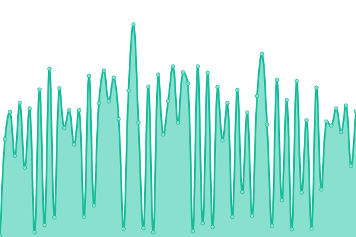 158ms
     
 | 

<a href="https://DELWP-DTV.github.io/santa/history/vicmap-admin-rest-api">99.99%</a>
    

|  [vicmap-admin-rest-api](https://enterprise.mapshare.vic.gov.au/server/rest/services/Vicmap_Admin/MapServer) | 🟩 Up | [vicmap-admin-rest-api.yml](https://github.com/DELWP-DTV/santa/commits/HEAD/history/vicmap-admin-rest-api.yml) | 

 158ms
     
 | 

<a href="https://DELWP-DTV.github.io/santa/history/vicmap-admin-rest-api">99.99%</a>
    

|  [vicmap-address-rest-api](https://services6.arcgis.com/GB33F62SbDxJjwEL/arcgis/rest/services/Vicmap_Address/FeatureServer) | 🟩 Up | [vicmap-address-rest-api.yml](https://github.com/DELWP-DTV/santa/commits/HEAD/history/vicmap-address-rest-api.yml) | 

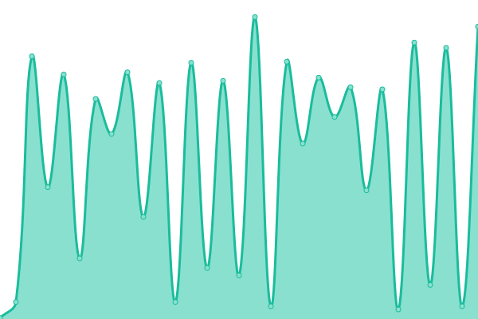 156ms
     
 | 

<a href="https://DELWP-DTV.github.io/santa/history/vicmap-address-rest-api">99.99%</a>
    

|  [vicmap-address-rest-api](https://enterprise.mapshare.vic.gov.au/server/rest/services/Vicmap_Address/MapServer) | 🟩 Up | [vicmap-address-rest-api.yml](https://github.com/DELWP-DTV/santa/commits/HEAD/history/vicmap-address-rest-api.yml) | 

 156ms
     
 | 

<a href="https://DELWP-DTV.github.io/santa/history/vicmap-address-rest-api">99.99%</a>
    

|  [structure-height-clearance](https://maps.nhvr.gov.au/agsm1/rest/services/vicroads/HVR_AGOL_OpenData/MapServer/46) | 🟩 Up | [structure-height-clearance.yml](https://github.com/DELWP-DTV/santa/commits/HEAD/history/structure-height-clearance.yml) | 

 1083ms
     
 | 

<a href="https://DELWP-DTV.github.io/santa/history/structure-height-clearance">100.00%</a>
    

|  [public-open-space-400m-walkable-catchment](https://services5.arcgis.com/DmRfik4clMVydXO3/arcgis/rest/services/OS_WalkableCatchment_400m_SP/FeatureServer/0/query?outFields=*&where=1%3D1) | 🟥 Down | [public-open-space-400m-walkable-catchment.yml](https://github.com/DELWP-DTV/santa/commits/HEAD/history/public-open-space-400m-walkable-catchment.yml) | 

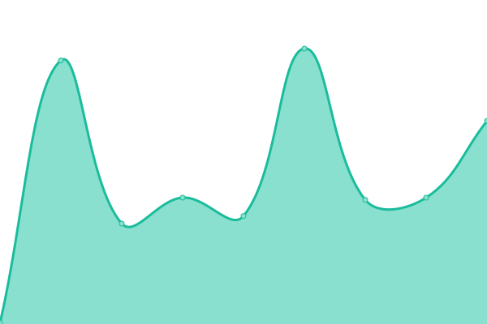 162ms
     
 | 

<a href="https://DELWP-DTV.github.io/santa/history/public-open-space-400m-walkable-catchment">0.00%</a>
    

|  [open-space](https://services5.arcgis.com/DmRfik4clMVydXO3/arcgis/rest/services/VPA_Draft_Open_Space_Data/FeatureServer/0/query?outFields=*&where=1%3D1) | 🟥 Down | [open-space.yml](https://github.com/DELWP-DTV/santa/commits/HEAD/history/open-space.yml) | 

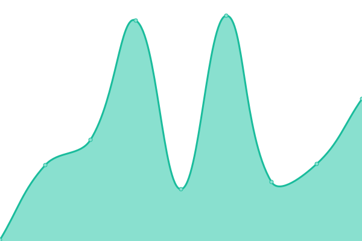 112ms
     
 | 

<a href="https://DELWP-DTV.github.io/santa/history/open-space">0.00%</a>
    

<!--end: status pages-->

## 📄 License

- Powered by: [Upptime](https://github.com/upptime/upptime)
- Code: [MIT](./LICENSE) © [alex-vic-geo](https://demo.upptime.js.org)
- Data in the `./history` directory: [Open Database License](https://opendatacommons.org/licenses/odbl/1-0/)
