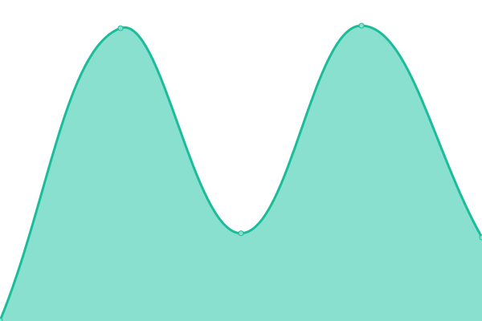

# DTV Santa

This repository contains the open-source uptime monitor and status page for DELWP_DTV.

[**Visit our status website →**](https://delwp-dtv.github.io/santa/)

With [Upptime](https://upptime.js.org), you can get your own unlimited and free uptime monitor and status page, powered entirely by a GitHub repository. We use [Issues](https://github.com/alex-vic-geo/santa/issues) as incident reports, [Actions](https://github.com/alex-vic-geo/santa/actions) as uptime monitors, and [Pages](https://demo.upptime.js.org) for the status page.

<!--start: status pages-->
<!-- This summary is generated by Upptime (https://github.com/upptime/upptime) -->
<!-- Do not edit this manually, your changes will be overwritten -->
<!-- prettier-ignore -->
| URL | Status | History | Response Time | Uptime |
| --- | ------ | ------- | ------------- | ------ |
|  [Vicmap Property Easements and Road Casements](https://enterprise.mapshare.vic.gov.au/server/rest/services/Vicmap_Property_Easements_and_Road_Casements/MapServer) | 🟩 Up | [vicmap-property-easements-and-road-casements.yml](https://github.com/DELWP-DTV/santa/commits/HEAD/history/vicmap-property-easements-and-road-casements.yml) | 

 1100ms
     
 | 

<a href="https://DELWP-DTV.github.io/santa/history/vicmap-property-easements-and-road-casements">100.00%</a>
    

|  [Sunshine Activity Centre](https://services7.arcgis.com/fVJQ0uhT9L4zp35f/arcgis/rest/services/ActivityArea_gdb/FeatureServer/0) | 🟩 Up | [sunshine-activity-centre.yml](https://github.com/DELWP-DTV/santa/commits/HEAD/history/sunshine-activity-centre.yml) | 

 516ms
     
 | 

<a href="https://DELWP-DTV.github.io/santa/history/sunshine-activity-centre">100.00%</a>
    

|  [Geelong - Weather Station Sensors ](https://www.geelongdataexchange.com.au) | 🟩 Up | [geelong-weather-station-sensors.yml](https://github.com/DELWP-DTV/santa/commits/HEAD/history/geelong-weather-station-sensors.yml) | 

 1294ms
     
 | 

<a href="https://DELWP-DTV.github.io/santa/history/geelong-weather-station-sensors">100.00%</a>
    

|  [Australian Private Hospitals August 2020](https://services5.arcgis.com/OvOcYIrJnM97ABBA/arcgis/rest/services/Australian_Private_Hospitals_August_2019_WFL1/FeatureServer/0) | 🟩 Up | [australian-private-hospitals-august-2020.yml](https://github.com/DELWP-DTV/santa/commits/HEAD/history/australian-private-hospitals-august-2020.yml) | 

 512ms
     
 | 

<a href="https://DELWP-DTV.github.io/santa/history/australian-private-hospitals-august-2020">100.00%</a>
    

|  [Vicmap Vegetation - Tree Extent](https://tiles.arcgis.com/tiles/GB33F62SbDxJjwEL/arcgis/rest/services/Vicmap_Vegetation_Tree_Extent/MapServer?view=wmtsview&cacheKey=95615180464c4085) | 🟩 Up | [vicmap-vegetation-tree-extent.yml](https://github.com/DELWP-DTV/santa/commits/HEAD/history/vicmap-vegetation-tree-extent.yml) | 

 369ms
     
 | 

<a href="https://DELWP-DTV.github.io/santa/history/vicmap-vegetation-tree-extent">100.00%</a>
    

|  [Watercourse Levels](http://www.bom.gov.au/waterdata/services) | 🟩 Up | [watercourse-levels.yml](https://github.com/DELWP-DTV/santa/commits/HEAD/history/watercourse-levels.yml) | 

 454ms
     
 | 

<a href="https://DELWP-DTV.github.io/santa/history/watercourse-levels">100.00%</a>
    

|  [Ballarat Council - Air quality ](https://data.ballarat.vic.gov.au) | 🟩 Up | [ballarat-council-air-quality.yml](https://github.com/DELWP-DTV/santa/commits/HEAD/history/ballarat-council-air-quality.yml) | 

 1213ms
     
 | 

<a href="https://DELWP-DTV.github.io/santa/history/ballarat-council-air-quality">100.00%</a>
    

|  [Vicmap Vegetation - Tree Density](https://tiles.arcgis.com/tiles/GB33F62SbDxJjwEL/arcgis/rest/services/Vicmap_Vegetation_Tree_Density_Tile/MapServer?view=wmtsview&cacheKey=9326ef767e6c9d9c) | 🟩 Up | [vicmap-vegetation-tree-density.yml](https://github.com/DELWP-DTV/santa/commits/HEAD/history/vicmap-vegetation-tree-density.yml) | 

 73ms
     
 | 

<a href="https://DELWP-DTV.github.io/santa/history/vicmap-vegetation-tree-density">100.00%</a>
    

|  [Ballarat Council - Temperature Level ](https://data.ballarat.vic.gov.au) | 🟩 Up | [ballarat-council-temperature-level.yml](https://github.com/DELWP-DTV/santa/commits/HEAD/history/ballarat-council-temperature-level.yml) | 

 649ms
     
 | 

<a href="https://DELWP-DTV.github.io/santa/history/ballarat-council-temperature-level">100.00%</a>
    

|  [Vicmap Crown Land Tenure](https://enterprise.mapshare.vic.gov.au/server/rest/services/Vicmap_Crown_Land_Tenure/MapServer) | 🟩 Up | [vicmap-crown-land-tenure.yml](https://github.com/DELWP-DTV/santa/commits/HEAD/history/vicmap-crown-land-tenure.yml) | 

 921ms
     
 | 

<a href="https://DELWP-DTV.github.io/santa/history/vicmap-crown-land-tenure">100.00%</a>
    

|  [Southern Grampians Council - Parking sensors ](https://www.connectgh.com.au) | 🟩 Up | [southern-grampians-council-parking-sensors.yml](https://github.com/DELWP-DTV/santa/commits/HEAD/history/southern-grampians-council-parking-sensors.yml) | 

 1124ms
     
 | 

<a href="https://DELWP-DTV.github.io/santa/history/southern-grampians-council-parking-sensors">100.00%</a>
    

|  [Vicmap Features of Interest](https://enterprise.mapshare.vic.gov.au/server/rest/services/Vicmap_Features_of_Interest/MapServer) | 🟩 Up | [vicmap-features-of-interest.yml](https://github.com/DELWP-DTV/santa/commits/HEAD/history/vicmap-features-of-interest.yml) | 

 443ms
     
 | 

<a href="https://DELWP-DTV.github.io/santa/history/vicmap-features-of-interest">100.00%</a>
    

|  [ABS SEIFA IEO by SA1 2016](https://map.aurin.org.au/geoserver/ows) | 🟩 Up | [abs-seifa-ieo-by-sa-1-2016.yml](https://github.com/DELWP-DTV/santa/commits/HEAD/history/abs-seifa-ieo-by-sa-1-2016.yml) | 

 3662ms
     
 | 

<a href="https://DELWP-DTV.github.io/santa/history/abs-seifa-ieo-by-sa-1-2016">100.00%</a>
    

|  [Vicmap Position](https://enterprise.mapshare.vic.gov.au/server/rest/services/Vicmap_Position/MapServer) | 🟩 Up | [vicmap-position.yml](https://github.com/DELWP-DTV/santa/commits/HEAD/history/vicmap-position.yml) | 

 1193ms
     
 | 

<a href="https://DELWP-DTV.github.io/santa/history/vicmap-position">100.00%</a>
    

|  [2020 NBN Connections by Technology Type](https://programs.communications.gov.au/geoserver/national-broadband-network/wms) | 🟩 Up | [2020-nbn-connections-by-technology-type.yml](https://github.com/DELWP-DTV/santa/commits/HEAD/history/2020-nbn-connections-by-technology-type.yml) | 

 1671ms
     
 | 

<a href="https://DELWP-DTV.github.io/santa/history/2020-nbn-connections-by-technology-type">100.00%</a>
    

|  [Victorian Land Use Information System 2016-2017](https://enterprise.mapshare.vic.gov.au/server/rest/services/DTV/DJPR_Unrestricted/MapServer) | 🟩 Up | [victorian-land-use-information-system-2016-2017.yml](https://github.com/DELWP-DTV/santa/commits/HEAD/history/victorian-land-use-information-system-2016-2017.yml) | 

 330ms
     
 | 

<a href="https://DELWP-DTV.github.io/santa/history/victorian-land-use-information-system-2016-2017">100.00%</a>
    

|  [ABS SEIFA IER by SA1 2016](https://map.aurin.org.au/geoserver/ows) | 🟩 Up | [abs-seifa-ier-by-sa-1-2016.yml](https://github.com/DELWP-DTV/santa/commits/HEAD/history/abs-seifa-ier-by-sa-1-2016.yml) | 

 272ms
     
 | 

<a href="https://DELWP-DTV.github.io/santa/history/abs-seifa-ier-by-sa-1-2016">100.00%</a>
    

|  [Portals](https://terria-catalogs-public.storage.googleapis.com/common/aus-gov-open-data/vic/prod.json) | 🟩 Up | [portals.yml](https://github.com/DELWP-DTV/santa/commits/HEAD/history/portals.yml) | 

 1258ms
     
 | 

<a href="https://DELWP-DTV.github.io/santa/history/portals">100.00%</a>
    

|  [Education Facilities](https://services.ga.gov.au/gis/rest/services/Foundation_Facilities_Points/MapServer/0) | 🟩 Up | [education-facilities.yml](https://github.com/DELWP-DTV/santa/commits/HEAD/history/education-facilities.yml) | 

 1456ms
     
 | 

<a href="https://DELWP-DTV.github.io/santa/history/education-facilities">100.00%</a>
    

|  [Vicmap Planning](https://enterprise.mapshare.vic.gov.au/server/rest/services/Vicmap_Planning/MapServer) | 🟩 Up | [vicmap-planning.yml](https://github.com/DELWP-DTV/santa/commits/HEAD/history/vicmap-planning.yml) | 

 1011ms
     
 | 

<a href="https://DELWP-DTV.github.io/santa/history/vicmap-planning">100.00%</a>
    

|  [Vicmap Admin](https://enterprise.mapshare.vic.gov.au/server/rest/services/Vicmap_Admin/MapServer) | 🟩 Up | [vicmap-admin.yml](https://github.com/DELWP-DTV/santa/commits/HEAD/history/vicmap-admin.yml) | 

 276ms
     
 | 

<a href="https://DELWP-DTV.github.io/santa/history/vicmap-admin">100.00%</a>
    

|  [Ballarat Council - Humidity Level ](https://data.ballarat.vic.gov.au) | 🟩 Up | [ballarat-council-humidity-level.yml](https://github.com/DELWP-DTV/santa/commits/HEAD/history/ballarat-council-humidity-level.yml) | 

 1098ms
     
 | 

<a href="https://DELWP-DTV.github.io/santa/history/ballarat-council-humidity-level">100.00%</a>
    

|  [Watercourse Discharge](http://www.bom.gov.au/waterdata/services) | 🟩 Up | [watercourse-discharge.yml](https://github.com/DELWP-DTV/santa/commits/HEAD/history/watercourse-discharge.yml) | 

 250ms
     
 | 

<a href="https://DELWP-DTV.github.io/santa/history/watercourse-discharge">100.00%</a>
    

|  [Geelong - Parking sensors](https://www.geelongdataexchange.com.au) | 🟩 Up | [geelong-parking-sensors.yml](https://github.com/DELWP-DTV/santa/commits/HEAD/history/geelong-parking-sensors.yml) | 

 1102ms
     
 | 

<a href="https://DELWP-DTV.github.io/santa/history/geelong-parking-sensors">100.00%</a>
    

|  [Vicmap Transport](https://enterprise.mapshare.vic.gov.au/server/rest/services/Vicmap_Transport/MapServer) | 🟩 Up | [vicmap-transport.yml](https://github.com/DELWP-DTV/santa/commits/HEAD/history/vicmap-transport.yml) | 

 298ms
     
 | 

<a href="https://DELWP-DTV.github.io/santa/history/vicmap-transport">100.00%</a>
    

|  [Electricity Transmission Lines](https://services.ga.gov.au/gis/rest/services/Foundation_Electricity_Infrastructure/MapServer) | 🟩 Up | [electricity-transmission-lines.yml](https://github.com/DELWP-DTV/santa/commits/HEAD/history/electricity-transmission-lines.yml) | 

 732ms
     
 | 

<a href="https://DELWP-DTV.github.io/santa/history/electricity-transmission-lines">100.00%</a>
    

|  [Planning scheme zones - Vicmap Planning (PLAN_ZONE)](https://enterprise.mapshare.vic.gov.au/server/rest/services/Vicmap_Planning/MapServer/3) | 🟩 Up | [planning-scheme-zones-vicmap-planning-plan-zone.yml](https://github.com/DELWP-DTV/santa/commits/HEAD/history/planning-scheme-zones-vicmap-planning-plan-zone.yml) | 

 536ms
     
 | 

<a href="https://DELWP-DTV.github.io/santa/history/planning-scheme-zones-vicmap-planning-plan-zone">100.00%</a>
    

|  [Southern Grampians Council - weather-station-status  ](https://www.connectgh.com.au) | 🟩 Up | [southern-grampians-council-weather-station-status.yml](https://github.com/DELWP-DTV/santa/commits/HEAD/history/southern-grampians-council-weather-station-status.yml) | 

 952ms
     
 | 

<a href="https://DELWP-DTV.github.io/santa/history/southern-grampians-council-weather-station-status">100.00%</a>
    

|  [Moreland Tree Ledger](https://treeledger.com.au/load_polygon_current) | 🟩 Up | [moreland-tree-ledger.yml](https://github.com/DELWP-DTV/santa/commits/HEAD/history/moreland-tree-ledger.yml) | 

 636ms
     
 | 

<a href="https://DELWP-DTV.github.io/santa/history/moreland-tree-ledger">100.00%</a>
    

|  [City of Melbourne Pedestrian Traffic Counter](https://data.melbourne.vic.gov.au/api/records/1.0/search/?rows=2000&order=DESC&dataset=pedestrian-counting-system-past-hour-counts-per-minute&timezone=Australia%2FSydney&lang=en) | 🟩 Up | [city-of-melbourne-pedestrian-traffic-counter.yml](https://github.com/DELWP-DTV/santa/commits/HEAD/history/city-of-melbourne-pedestrian-traffic-counter.yml) | 

 2327ms
     
 | 

<a href="https://DELWP-DTV.github.io/santa/history/city-of-melbourne-pedestrian-traffic-counter">100.00%</a>
    

|  [Vicmap Parcel](https://enterprise.mapshare.vic.gov.au/server/rest/services/Vicmap_Parcel/MapServer) | 🟩 Up | [vicmap-parcel.yml](https://github.com/DELWP-DTV/santa/commits/HEAD/history/vicmap-parcel.yml) | 

 369ms
     
 | 

<a href="https://DELWP-DTV.github.io/santa/history/vicmap-parcel">100.00%</a>
    

|  [Watercourse Discharge](http://www.bom.gov.au/waterdata/services) | 🟩 Up | [watercourse-discharge.yml](https://github.com/DELWP-DTV/santa/commits/HEAD/history/watercourse-discharge.yml) | 

 250ms
     
 | 

<a href="https://DELWP-DTV.github.io/santa/history/watercourse-discharge">100.00%</a>
    

|  [Watercourse Levels](http://www.bom.gov.au/waterdata/services) | 🟩 Up | [watercourse-levels.yml](https://github.com/DELWP-DTV/santa/commits/HEAD/history/watercourse-levels.yml) | 

 454ms
     
 | 

<a href="https://DELWP-DTV.github.io/santa/history/watercourse-levels">100.00%</a>
    

|  [Vicmap Property](https://enterprise.mapshare.vic.gov.au/server/rest/services/Vicmap_Property/MapServer) | 🟩 Up | [vicmap-property.yml](https://github.com/DELWP-DTV/santa/commits/HEAD/history/vicmap-property.yml) | 

 279ms
     
 | 

<a href="https://DELWP-DTV.github.io/santa/history/vicmap-property">100.00%</a>
    

|  [AURIN](https://map.aurin.org.au/geoserver/ows) | 🟩 Up | [aurin.yml](https://github.com/DELWP-DTV/santa/commits/HEAD/history/aurin.yml) | 

 690ms
     
 | 

<a href="https://DELWP-DTV.github.io/santa/history/aurin">100.00%</a>
    

|  [SHWEP Activity Centre](https://services7.arcgis.com/fVJQ0uhT9L4zp35f/arcgis/rest/services/ActivityArea_gdb/FeatureServer/2) | 🟩 Up | [shwep-activity-centre.yml](https://github.com/DELWP-DTV/santa/commits/HEAD/history/shwep-activity-centre.yml) | 

 240ms
     
 | 

<a href="https://DELWP-DTV.github.io/santa/history/shwep-activity-centre">100.00%</a>
    

|  [ABS SEIFA IRSD by SA1 2016](https://map.aurin.org.au/geoserver/ows) | 🟩 Up | [abs-seifa-irsd-by-sa-1-2016.yml](https://github.com/DELWP-DTV/santa/commits/HEAD/history/abs-seifa-irsd-by-sa-1-2016.yml) | 

 205ms
     
 | 

<a href="https://DELWP-DTV.github.io/santa/history/abs-seifa-irsd-by-sa-1-2016">100.00%</a>
    

|  [Southern Grampians Council - Water Levels](https://www.connectgh.com.au) | 🟩 Up | [southern-grampians-council-water-levels.yml](https://github.com/DELWP-DTV/santa/commits/HEAD/history/southern-grampians-council-water-levels.yml) | 

 922ms
     
 | 

<a href="https://DELWP-DTV.github.io/santa/history/southern-grampians-council-water-levels">100.00%</a>
    

|  [Vicmap Address](https://enterprise.mapshare.vic.gov.au/server/rest/services/Vicmap_Address/MapServer) | 🟩 Up | [vicmap-address.yml](https://github.com/DELWP-DTV/santa/commits/HEAD/history/vicmap-address.yml) | 

 368ms
     
 | 

<a href="https://DELWP-DTV.github.io/santa/history/vicmap-address">100.00%</a>
    

|  [Ballarat Council - Noise Observations ](https://data.ballarat.vic.gov.au) | 🟩 Up | [ballarat-council-noise-observations.yml](https://github.com/DELWP-DTV/santa/commits/HEAD/history/ballarat-council-noise-observations.yml) | 

 1104ms
     
 | 

<a href="https://DELWP-DTV.github.io/santa/history/ballarat-council-noise-observations">100.00%</a>
    

|  [Vicmap Vegetation - Tree Urban](https://enterprise.mapshare.vic.gov.au/server/rest/services/Vicmap_Vegetation_Tree_Urban/MapServer) | 🟩 Up | [vicmap-vegetation-tree-urban.yml](https://github.com/DELWP-DTV/santa/commits/HEAD/history/vicmap-vegetation-tree-urban.yml) | 

 372ms
     
 | 

<a href="https://DELWP-DTV.github.io/santa/history/vicmap-vegetation-tree-urban">100.00%</a>
    

|  [Vicmap Geomark](https://enterprise.mapshare.vic.gov.au/server/rest/services/Vicmap_Geomark/MapServer) | 🟩 Up | [vicmap-geomark.yml](https://github.com/DELWP-DTV/santa/commits/HEAD/history/vicmap-geomark.yml) | 

 352ms
     
 | 

<a href="https://DELWP-DTV.github.io/santa/history/vicmap-geomark">100.00%</a>
    

|  [ABS SEIFA IRSAD by SA1 2016](https://map.aurin.org.au/geoserver/ows) | 🟩 Up | [abs-seifa-irsad-by-sa-1-2016.yml](https://github.com/DELWP-DTV/santa/commits/HEAD/history/abs-seifa-irsad-by-sa-1-2016.yml) | 

 465ms
     
 | 

<a href="https://DELWP-DTV.github.io/santa/history/abs-seifa-irsad-by-sa-1-2016">100.00%</a>
    

|  [Ballarat Council - Noise Sensors](https://data.ballarat.vic.gov.au) | 🟩 Up | [ballarat-council-noise-sensors.yml](https://github.com/DELWP-DTV/santa/commits/HEAD/history/ballarat-council-noise-sensors.yml) | 

 743ms
     
 | 

<a href="https://DELWP-DTV.github.io/santa/history/ballarat-council-noise-sensors">100.00%</a>
    

|  [Vicmap Elevation - Statewide (10m to 20m)](https://enterprise.mapshare.vic.gov.au/server/rest/services/Vicmap_Elevation_STATEWIDE_10_to_20_metre/MapServer) | 🟩 Up | [vicmap-elevation-statewide-10m-to-20m.yml](https://github.com/DELWP-DTV/santa/commits/HEAD/history/vicmap-elevation-statewide-10m-to-20m.yml) | 

 365ms
     
 | 

<a href="https://DELWP-DTV.github.io/santa/history/vicmap-elevation-statewide-10m-to-20m">100.00%</a>
    

|  [Vicmap Lite](https://enterprise.mapshare.vic.gov.au/server/rest/services/Vicmap_Lite/MapServer) | 🟩 Up | [vicmap-lite.yml](https://github.com/DELWP-DTV/santa/commits/HEAD/history/vicmap-lite.yml) | 

 306ms
     
 | 

<a href="https://DELWP-DTV.github.io/santa/history/vicmap-lite">100.00%</a>
    

|  [Vicmap Elevation - Metro (1m to 5m)](https://enterprise.mapshare.vic.gov.au/server/rest/services/Vicmap_Elevation_METRO_1_to_5_metre/MapServer) | 🟩 Up | [vicmap-elevation-metro-1m-to-5m.yml](https://github.com/DELWP-DTV/santa/commits/HEAD/history/vicmap-elevation-metro-1m-to-5m.yml) | 

 339ms
     
 | 

<a href="https://DELWP-DTV.github.io/santa/history/vicmap-elevation-metro-1m-to-5m">100.00%</a>
    

|  [Significant Planning Register](https://services7.arcgis.com/fVJQ0uhT9L4zp35f/arcgis/rest/services/SunshineActivityPlanningRegister_250722_gdb/FeatureServer/3) | 🟩 Up | [significant-planning-register.yml](https://github.com/DELWP-DTV/santa/commits/HEAD/history/significant-planning-register.yml) | 

 311ms
     
 | 

<a href="https://DELWP-DTV.github.io/santa/history/significant-planning-register">100.00%</a>
    

|  [Ballarat Council - Water Level ](https://data.ballarat.vic.gov.au) | 🟩 Up | [ballarat-council-water-level.yml](https://github.com/DELWP-DTV/santa/commits/HEAD/history/ballarat-council-water-level.yml) | 

 742ms
     
 | 

<a href="https://DELWP-DTV.github.io/santa/history/ballarat-council-water-level">100.00%</a>
    

|  [ACCC Mobile Infrastructure Report 2021](https://enterprise.mapshare.vic.gov.au/server/rest/services/DTV/ACCC_Mobile_Infrastructure_Report/MapServer) | 🟩 Up | [accc-mobile-infrastructure-report-2021.yml](https://github.com/DELWP-DTV/santa/commits/HEAD/history/accc-mobile-infrastructure-report-2021.yml) | 

 333ms
     
 | 

<a href="https://DELWP-DTV.github.io/santa/history/accc-mobile-infrastructure-report-2021">100.00%</a>
    

|  [Australian Public Hospitals 2018-2019](https://services5.arcgis.com/OvOcYIrJnM97ABBA/arcgis/rest/services/Australian_Public_Hospitals_WFL1/FeatureServer/0) | 🟩 Up | [australian-public-hospitals-2018-2019.yml](https://github.com/DELWP-DTV/santa/commits/HEAD/history/australian-public-hospitals-2018-2019.yml) | 

 286ms
     
 | 

<a href="https://DELWP-DTV.github.io/santa/history/australian-public-hospitals-2018-2019">100.00%</a>
    

|  [Moreland Tree Ledger - Losses](https://treeledger.com.au/load_polygon_loss) | 🟩 Up | [moreland-tree-ledger-losses.yml](https://github.com/DELWP-DTV/santa/commits/HEAD/history/moreland-tree-ledger-losses.yml) | 

 353ms
     
 | 

<a href="https://DELWP-DTV.github.io/santa/history/moreland-tree-ledger-losses">100.00%</a>
    

|  [Vicmap Index](https://enterprise.mapshare.vic.gov.au/server/rest/services/Vicmap_Index/MapServer) | 🟩 Up | [vicmap-index.yml](https://github.com/DELWP-DTV/santa/commits/HEAD/history/vicmap-index.yml) | 

 389ms
     
 | 

<a href="https://DELWP-DTV.github.io/santa/history/vicmap-index">100.00%</a>
    

|  [St Albans Activity Centre](https://services7.arcgis.com/fVJQ0uhT9L4zp35f/arcgis/rest/services/ActivityArea_gdb/FeatureServer/1) | 🟩 Up | [st-albans-activity-centre.yml](https://github.com/DELWP-DTV/santa/commits/HEAD/history/st-albans-activity-centre.yml) | 

 171ms
     
 | 

<a href="https://DELWP-DTV.github.io/santa/history/st-albans-activity-centre">100.00%</a>
    

|  [Vicmap Hydro](https://enterprise.mapshare.vic.gov.au/server/rest/services/Vicmap_Hydro/MapServer) | 🟩 Up | [vicmap-hydro.yml](https://github.com/DELWP-DTV/santa/commits/HEAD/history/vicmap-hydro.yml) | 

 353ms
     
 | 

<a href="https://DELWP-DTV.github.io/santa/history/vicmap-hydro">100.00%</a>
    

|  [Planning scheme overlay - Vicmap Planning (PLAN_OVERLAY)](https://enterprise.mapshare.vic.gov.au/server/rest/services/Vicmap_Planning/MapServer/2) | 🟩 Up | [planning-scheme-overlay-vicmap-planning-plan-overlay.yml](https://github.com/DELWP-DTV/santa/commits/HEAD/history/planning-scheme-overlay-vicmap-planning-plan-overlay.yml) | 

 241ms
     
 | 

<a href="https://DELWP-DTV.github.io/santa/history/planning-scheme-overlay-vicmap-planning-plan-overlay">100.00%</a>
    

|  [local-government-datasets](https://terria-catalogs-public.storage.googleapis.com/common/aus-gov-open-data/vic/prod.json) | 🟩 Up | [local-government-datasets.yml](https://github.com/DELWP-DTV/santa/commits/HEAD/history/local-government-datasets.yml) | 

 488ms
     
 | 

<a href="https://DELWP-DTV.github.io/santa/history/local-government-datasets">100.00%</a>
    

|  [Moreland Tree Ledger GeoJson](https://treeledger.com.au/open_leaf/current) | 🟩 Up | [moreland-tree-ledger-geo-json.yml](https://github.com/DELWP-DTV/santa/commits/HEAD/history/moreland-tree-ledger-geo-json.yml) | 

 175ms
     
 | 

<a href="https://DELWP-DTV.github.io/santa/history/moreland-tree-ledger-geo-json">100.00%</a>
    

|  [Moreland Tree Ledger - Losses](https://treeledger.com.au/open_leaf/current_loss) | 🟩 Up | [moreland-tree-ledger-losses.yml](https://github.com/DELWP-DTV/santa/commits/HEAD/history/moreland-tree-ledger-losses.yml) | 

 353ms
     
 | 

<a href="https://DELWP-DTV.github.io/santa/history/moreland-tree-ledger-losses">100.00%</a>
    

|  [national-datasets](https://terria-catalogs-public.storage.googleapis.com/nationalmap/prod.json) | 🟩 Up | [national-datasets.yml](https://github.com/DELWP-DTV/santa/commits/HEAD/history/national-datasets.yml) | 

 285ms
     
 | 

<a href="https://DELWP-DTV.github.io/santa/history/national-datasets">100.00%</a>
    

|  [Tree Density](https://tiles.arcgis.com/tiles/GB33F62SbDxJjwEL/arcgis/rest/services/Vicmap_Vegetation_Tree_Density/VectorTileServer/tile/{z}/{y}/{x}.pbf) | 🟩 Up | [tree-density.yml](https://github.com/DELWP-DTV/santa/commits/HEAD/history/tree-density.yml) | 

 78ms
     
 | 

<a href="https://DELWP-DTV.github.io/santa/history/tree-density">100.00%</a>
    

|  [Tree Extent](https://tiles.arcgis.com/tiles/GB33F62SbDxJjwEL/arcgis/rest/services/Vicmap_Vegetation_Tree_Extent/MapServer) | 🟩 Up | [tree-extent.yml](https://github.com/DELWP-DTV/santa/commits/HEAD/history/tree-extent.yml) | 

 121ms
     
 | 

<a href="https://DELWP-DTV.github.io/santa/history/tree-extent">100.00%</a>
    

<!--end: status pages-->

## 📄 License

- Powered by: [Upptime](https://github.com/upptime/upptime)
- Code: [MIT](./LICENSE) © [alex-vic-geo](https://demo.upptime.js.org)
- Data in the `./history` directory: [Open Database License](https://opendatacommons.org/licenses/odbl/1-0/)
